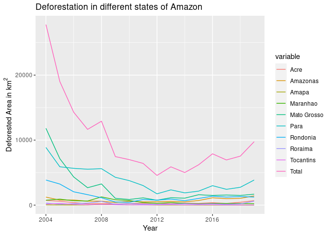
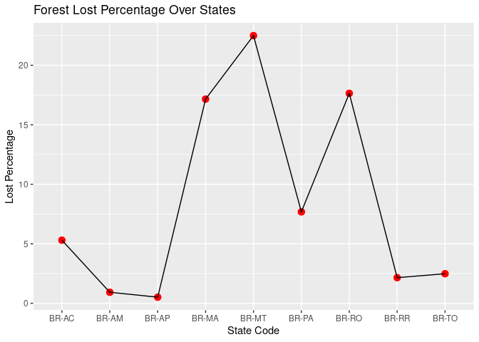
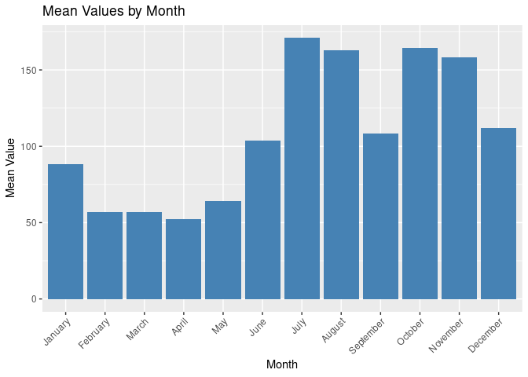

Current and Future Deforestation in Amazon Forest
================
Jiawen Tang, Xiangrong (Mark) Sun

The three additional skills we used from the second bulleted list of the
rubric: 1. Expansion of ggplot functions (to include more than default
characteristics) 2. Use of spatial vector data (sf package) and
visualization of spatial data 3. Writing / working with custom R
functions (and dplyr verbs / functions)

Amazon Forest is the world’s largest tropical rain forest located in the
south america. Known as the lung of earth, it is the largest single
carbon storage system and the largest terrestrial oxygen producer.
However, this huge rain forest is facing large scale deforestation and
degradation due to human activities. In this project, we will focus on
Brazil’s part of deforestation, finding the historical data to
understand deforestation status and projecting the future.

We will be using several data sources, and replicate data from research
paper to show the historical and current status of deforestation. We
will also explore future forest conditions under different scenarios.
The main paper we aim to replicate is
<https://www.science.org/doi/10.1126/science.abp8622>, we will start
with its current estimate and end with this as well. Apart from it, we
will use other data sources such as fire to establish connections with
deforestation.

Starting with the study, we will use several functions to create graphs,
maps, reform and visualize the data. We get in touch with multiple use
of dplyr, ggplot, sf, tmap, tidyverse, and we bring in new packages and
functions such as rnaturalearth. Before we start, we will install and
read all the packages we need for the study:

``` r
#install tmap to upgrade it each time when reopen the file
suppressMessages({
  install.packages(c('tmap','rnaturalearth','rnaturalearthhires'))
  library(fs)
  library(terra)
  library(tidyverse)
  library(tmap)
  library(rnaturalearth)
  library(sp)
  library(sf)
  library(reshape2)
  library(dplyr)
  library(ggplot2)
})
```

## Historical Deforestation

We will begin with reproducing Figure 2 of our main paper, the 2001-2018
spatial distribution of four major drivers of Amazonian forest
degradation, excluding deforestation and savanna areas. We start with
reading the tif file to raster and using the r-data ‘World’ as well as
“tmap” to create maps. The four major drivers are fire burning, extreme
drought occurrence, area within a forest edge, and timber extraction.

``` r
#read in the tif and World
fire <- rast("fire.tif")
drought <- rast("drought.tif")
edge <- rast("edge.tif")
logging <- rast("logging.tif")
data("World")

#Create maps by changing making sure all data are visualizable. 
fire[fire == 0] <- NA
drought[drought == 0] <- NA
edge[edge == 0] <- NA
logging[logging == 0] <- NA
tm_shape(World,bbox = stars::st_as_stars(fire))+tm_polygons() +
  tm_shape(fire)+tm_raster()
```

<!-- -->

``` r
tm_shape(World,bbox = stars::st_as_stars(drought))+tm_polygons() +
  tm_shape(drought)+tm_raster()
```

<!-- -->

``` r
tm_shape(World,bbox = stars::st_as_stars(edge))+tm_polygons() +
  tm_shape(edge)+tm_raster()
```

<!-- -->

``` r
tm_shape(World,bbox = stars::st_as_stars(logging))+tm_polygons() +
  tm_shape(logging)+tm_raster()
```

<!-- -->

## Brazil Deforestation in Amazon Forest

To get a direst, overall sense of the geographical distribution of
deforestation, we will use state data from INPE (National Institute for
Space Research in Brazil National Penitentiary Institute of Peru) of
Brazil to visualize forest loss of different states. First we read theis
Brazilian deforestation data file, which contains deforested area within
9 states, as well as a total forest lost, from 2004 to 2019.

``` r
deforest <- read.csv("def_area_2004_2019.csv")
colnames(deforest)= c("Year","Acre","Amazonas","Amapa","Maranhao","Mato Grosso","Para","Rondonia","Roraima","Tocantins","Total")
names(deforest)
```

    ##  [1] "Year"        "Acre"        "Amazonas"    "Amapa"       "Maranhao"   
    ##  [6] "Mato Grosso" "Para"        "Rondonia"    "Roraima"     "Tocantins"  
    ## [11] "Total"

We want to plot out each states’ lost of forest throughout these years,
so we can decide how to visualize forest lost on map. For now, we
present the data with a line plot:

``` r
deforested <- melt(deforest,id="Year")
deforest_show <- ggplot(deforested,aes(x=Year,y=value,colour=variable,group=variable)) + geom_line()
deforest_show + labs(title = "Deforestation in different states of Amazon") + labs(x = "Year") + labs(y = "Deforested Area in"~km^2)
```

<!-- -->

At this point, we want to see the percentage lost and the total lost of
each state over these years, so we can create maps for them. We will
calculate the sum of deforested area for each state, and read in a new
data from world bank. We also create a list of area code for future
reference.

``` r
Statename = c("Acre","Amazonas","Amapá","Maranhão","Mato Grosso","Pará","Rondônia","Roraima", "Tocantins")
Sumofdef <- c(sum(deforest$Acre),sum(deforest$Amazonas),sum(deforest$Amapa),sum(deforest$Maranhao),sum(deforest$`Mato Grosso`),sum(deforest$Para),sum(deforest$Rondonia),sum(deforest$Roraima),sum(deforest$Tocantins))
areacode <- c("BR-AC","BR-AM","BR-AP","BR-MA","BR-MT","BR-PA","BR-RO","BR-RR","BR-TO") 
forest <- read.csv("2020Forest.csv")
forest
```

    ##   iso_3166_2 CurrentArea
    ## 1      BR-AC      107943
    ## 2      BR-AM     1343020
    ## 3      BR-AP      120438
    ## 4      BR-MA       48483
    ## 5      BR-MT      191466
    ## 6      BR-PA      817458
    ## 7      BR-RO      126285
    ## 8      BR-RR      180762
    ## 9      BR-TO       49955

Now, we will create a table that contains all information together.
Since when we create them they are in correct order, we will just frame
them together, merge in the deforestation data and mutate the lost
percentage.

``` r
total_deforest <- data.frame(state = Statename, iso_3166_2 = areacode,
                   Area = Sumofdef)
total_deforest <- merge(total_deforest, forest, by = "iso_3166_2", all.x = TRUE)
total_deforest  <- total_deforest %>%
  mutate(lost_percentage = (Area / CurrentArea) * 100)
total_deforest
```

    ##   iso_3166_2       state  Area CurrentArea lost_percentage
    ## 1      BR-AC        Acre  5722      107943       5.3009459
    ## 2      BR-AM    Amazonas 12425     1343020       0.9251538
    ## 3      BR-AP       Amapá   616      120438       0.5114665
    ## 4      BR-MA    Maranhão  8318       48483      17.1565291
    ## 5      BR-MT Mato Grosso 43065      191466      22.4922441
    ## 6      BR-PA        Pará 62778      817458       7.6796606
    ## 7      BR-RO    Rondônia 22279      126285      17.6418419
    ## 8      BR-RR     Roraima  3891      180762       2.1525542
    ## 9      BR-TO   Tocantins  1241       49955       2.4842358

We will visualize the table by graph, one bar-chart for the
deforestation area, and another dot-chart for the deforestation
percentage:

``` r
ggplot(total_deforest, aes(x = state, y = Area)) +
  geom_bar(stat = "identity", fill = "brown") +
  labs(title = "Total deforested areas in Brazil", x = "States", y = "Area (km^2)")+
  theme(axis.text.x = element_text(angle = 45, hjust = 1))
```

<!-- -->

``` r
ggplot(total_deforest, aes(x = iso_3166_2, y = lost_percentage, group = 1)) +
  geom_point(color = "red", size = 3) +
  geom_line() +
  labs(title = "Forest Lost Percentage Over States", x = "State Code", y = "Lost Percentage")
```

<!-- -->

From the above two charts, we can clearly see that the area and ratio of
deforestation are different. However, since these names cannot be
expressed concretively for most non-locals, we will plot them on the map
of Brazil. We will use the new function, rnaturalearth to find out the
area we want. This function is useful but need to re-install every time
refreshing the code. Please note this could causing issue when run
without internet and without response to the console. Since the function
will have a very long result (more than 2000 lines), we will just
present the states code and the area to check if its correct.

``` r
#response '1' and '1' for both install question if needed.
states <- ne_states(country = "Brazil")
```

    ## Warning: The `returnclass` argument of `ne_download()` sp as of rnaturalearth 1.0.0.
    ## ℹ Please use `sf` objects with {rnaturalearth}, support for Spatial objects
    ##   (sp) will be removed in a future release of the package.
    ## This warning is displayed once every 8 hours.
    ## Call `lifecycle::last_lifecycle_warnings()` to see where this warning was
    ## generated.

``` r
states <- st_as_sf(states)
final <- inner_join(states,total_deforest,by = "iso_3166_2" )
```

Now we can start drawing the map. We have the base map and the data, and
we plot it using tmap. From the graph we cansee that Para is the main
forest-loss state, but due to its large area, the ratio is not very
high. In contrast, the neighboring marginal provinces experienced forest
losses of more than 10 per cent because they had less forest themselves.
Because of the data issue, we only can use the forest area of 2020,
which will increase the percentage since 2000 will have a larger forest
area for most of the states.

``` r
tm_shape(final) + tm_polygons("Area") + tm_symbols + tm_layout(legend.outside=TRUE) + tm_text("state", size = 0.5) 
```

<!-- -->

``` r
tm_shape(final) + tm_polygons("lost_percentage") + tm_symbols + tm_layout(legend.outside=TRUE) + tm_text("state", size = 0.5)
```

<!-- -->

## Fire frequency in Brazil

Fire is also a major driver of forest lost in Amazon. In recent years,
destructive wildfire has increased both frequency and intensity due to
climate change and other human disturbances, resulting in massive forest
loss. In this section, we use a fire data from Kaggle to visualize the
frequency of fire occurrences in different states of Brazil over the
years, and conclude geo-spatial trends.

First, we read this fire data, which we made some of our own edition.

``` r
firedata <- read.csv("amazon.csv")
names(firedata)
```

    ## [1] "year"       "state"      "month"      "number"     "date"      
    ## [6] "iso_3166_2"

We first group the fire data by “year”, and calculate the mean number of
fires per year in Brazil from 1998 to 2017.After that, we plot the trend
using line plot. From the plot, it seems that the mean number of fire
events in Brazil has been rising through time, despite having some
fluctuations.

``` r
MeanBrazil <- firedata %>%
  group_by(year) %>%
  summarize(mean_value = mean(number))
ggplot(MeanBrazil, aes(x = year, y = mean_value)) +
  geom_line() +
  labs(title = "Mean fire occurences in Brazil", x = "year", y = "mean fire occurences")     
```

<!-- -->

Now we are interested in how does fire frequency varies between
different states in Brazil. We group by “state” column and show the
result as bar-chart. There are big geo-spatial variations of fire
frequency in Brazil, which we will visualize as map in later steps.

``` r
MeanState <- firedata %>%
  group_by(state) %>%
  summarize(meanfire = mean(number))
MeanState$state <- str_replace(MeanState$state, "\t", "")
ggplot(MeanState, aes(x = state, y = meanfire)) +
  geom_bar(stat = "identity", fill = "steelblue") +
  labs(title = "Mean Fire by State", x = "State", y = "Mean Value") +
  theme(axis.text.x = element_text(angle = 45, hjust = 1))
```

<!-- -->

We also want to see the monthly variations in fire occurrences of all
states and time, so we group the data set by “month” column and
summarize the mean. Since the original data set has month names in
Portuguese, and order Alphabetically by default instead of from Jan to
Dec, we made some adjustments. From the final bar-chart, it’s obvious
that the second half of the year (from July to December) has
significantly more fire events on average than the first half.

``` r
MeanMonth <- firedata %>%
  group_by(month) %>%
  summarize(mean_value = mean(number))
MeanMonth$month = c("April","August","December","Feburary","January","July","June","May","March","November","October","September")
MeanMonth
```

    ## # A tibble: 12 × 2
    ##    month     mean_value
    ##    <chr>          <dbl>
    ##  1 April           52.2
    ##  2 August         163. 
    ##  3 December       112. 
    ##  4 Feburary        57.1
    ##  5 January         88.3
    ##  6 July           171. 
    ##  7 June           104. 
    ##  8 May             64.3
    ##  9 March           56.9
    ## 10 November       158. 
    ## 11 October        164. 
    ## 12 September      108.

``` r
MMdf_new <- data.frame(
  Month= month.name,
  Mean = c(88.25849,57.12602,56.88408,52.20143,64.31734,103.72347,170.97428, 163.05636,108.47834,164.22515,158.34825,112.15493)
)
MMdf_new$Month <-factor(MMdf_new$Month, levels = c("January", "February", "March", "April",
                                        "May", "June", "July", "August",
                                        "September", "October", "November", "December"))
MMdf_new
```

    ##        Month      Mean
    ## 1    January  88.25849
    ## 2   February  57.12602
    ## 3      March  56.88408
    ## 4      April  52.20143
    ## 5        May  64.31734
    ## 6       June 103.72347
    ## 7       July 170.97428
    ## 8     August 163.05636
    ## 9  September 108.47834
    ## 10   October 164.22515
    ## 11  November 158.34825
    ## 12  December 112.15493

``` r
ggplot(MMdf_new, aes(x = Month, y = Mean)) +
  geom_bar(stat = "identity", fill = "steelblue") +
  labs(title = "Mean Values by Month", x = "Month", y = "Mean Value") +
  theme(axis.text.x = element_text(angle = 45, hjust = 1))
```

<!-- -->

Here, we join our fire data with state-code information, and visualize
the geo-spatial distribution of fire events within Brazil using tmap.
The most frequent fire events happen in BR-MT (Mato Grosso) and BR-SP
(São Paulo).It’s highly likely that all states will experience more fire
events in the future, showing a redder map by then.

``` r
mapfire <- firedata |> group_by(iso_3166_2) |>
  summarize(meanfire = mean(number))
mapfire$iso_3166_2 <- str_replace(mapfire$iso_3166_2, "^\\t", "")
firemap <- inner_join(states,mapfire,by = "iso_3166_2" )
tm_shape(firemap) + tm_polygons("meanfire") + tm_symbols + tm_layout(legend.outside=TRUE) + tm_text("iso_3166_2", size = 0.5) +tmap_options(check.and.fix = TRUE)
```

    ## Warning: The shape firemap is invalid. See sf::st_is_valid

<!-- -->

## Drivers of forest-loss in Brazil amazon forest

On a broader scale, we are concerned about the effects of multiple
drivers of forest loss in Brazil amazon. We are able to do that using
data collected by Tyukavina et al. (2017). We read and pivot the data
file, and visualize it using geom_area(). Overall, there is a decreasing
trend of forest loss over time, and pasture has always been the
predominant cause of forest loss.

``` r
driver <- read.csv("drivers-forest-loss-brazil-amazon.csv")
driver <- driver %>% select(-Entity)
driver <- driver %>% select(-Code)
driver_year <- driver |> pivot_longer(-Year)
driver_year
```

    ## # A tibble: 143 × 3
    ##     Year name                              value
    ##    <int> <chr>                             <int>
    ##  1  2001 flooding_due_to_dams                  0
    ##  2  2001 natural_disturbances                  0
    ##  3  2001 fire                              26000
    ##  4  2001 selective_logging                 96000
    ##  5  2001 other_infrastructure               9000
    ##  6  2001 roads                             13000
    ##  7  2001 mining                             9000
    ##  8  2001 small.scale_clearing             249000
    ##  9  2001 tree_plantations_including_palm   44000
    ## 10  2001 pasture                         1520000
    ## # ℹ 133 more rows

``` r
ggplot(driver_year,aes(x=Year,y=value,fill=name)) + geom_area()+ labs(x = "Year", y = "forest loss in hectare")
```

<!-- -->

## Future Deforestation

Let’s go back to the future mentioned in the original paper. We show
that fire frequency is expected to increase in response to human
activity and climate change, along with continuing logging, under the
“Business-as-usual” scenario.These activities will exacerbate the
ecological crisis in Amazon, worsening the ecosystem health and
integrity.

``` r
baulogg <-rast("bau_logg_final.tif") 
baufire <-rast("bau_fire_final.tif")
baulogg[baulogg < 0] <- NA
baufire[baufire < 0] <- NA
tm_shape(World, bbox = stars::st_as_stars(baulogg), raster.downsample = list(width = 1140, height = 877)) +
    tm_polygons() +
    tm_shape(baulogg) + tm_raster()
```

    ## stars object downsampled to 1140 by 877 cells. See tm_shape manual (argument raster.downsample)

<!-- -->

``` r
tm_shape(World, bbox = stars::st_as_stars(baufire), raster.downsample = list(width = 1140, height = 877)) +
    tm_polygons() +
    tm_shape(baufire) + tm_raster()
```

    ## stars object downsampled to 1140 by 877 cells. See tm_shape manual (argument raster.downsample)

<!-- -->

## Conclusion

In this project, we were able to analyzed data and create figures to
interpret the ecological crisis on Amazon forest in Brazil. We recreated
maps showing the spatial distribution of major drivers of Amazonian
forest degradation. We show the geo-spatial and temporal trends in
deforestation of Amazon forest in Brazil. We then delved into a major
driver of forest-loss: fire, and summarized its trend for various places
and times. Lastly, we recreated maps showing future projection of
logging and fire events in Brazil, which are expected to accelerate
forest loss.

With all the data and maps, we clearly see that forest-loss has been
increasing in scale through years, along with some major drivers like
fire. Understanding their pattern is crucial for humans to make
reasonable conservation decisions to reverse the current dire trend.

## Reference

Tyukavina et al. (2017). Types and rates of forest disturbance in
Brazilian Legal Amazon, 2000–2013. Science

<https://www.kaggle.com/datasets/mbogernetto/brazilian-amazon-rainforest-degradation/data>

<https://www.kaggle.com/code/instalok/brazil-forest-fire/input>

<https://data.worldbank.org/indicator/AG.LND.FRST.ZS?locations=BR>
