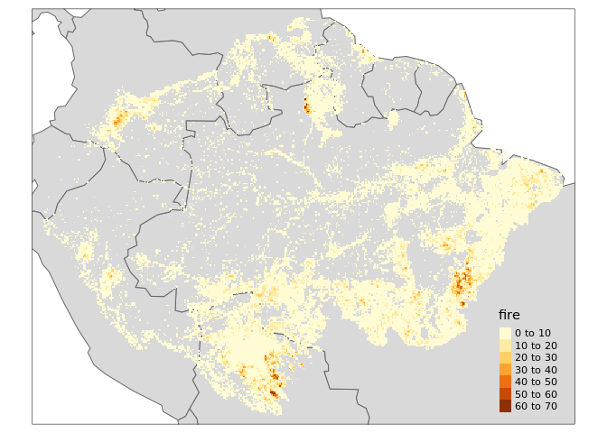
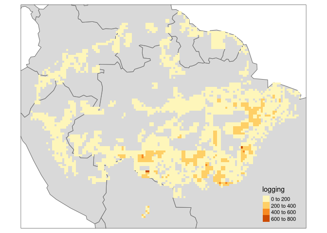
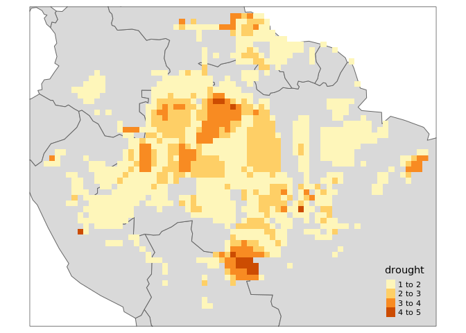
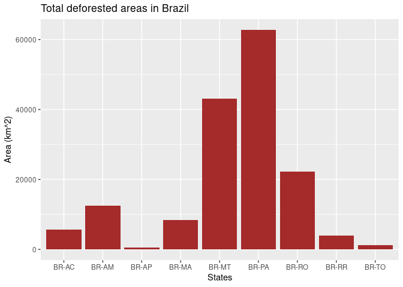
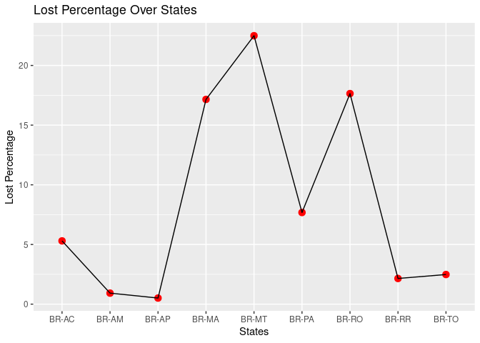
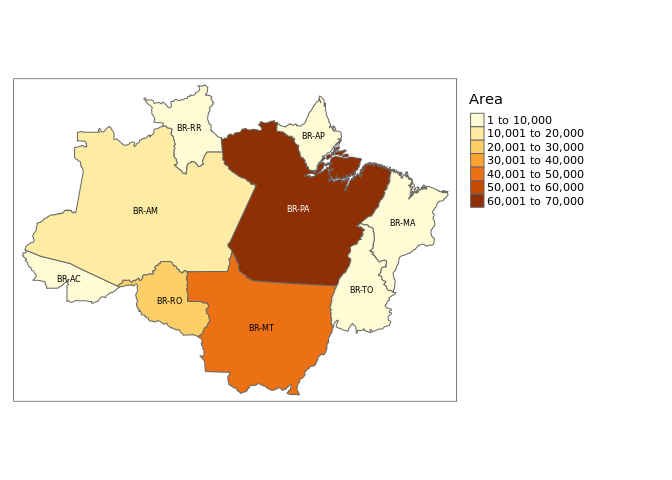
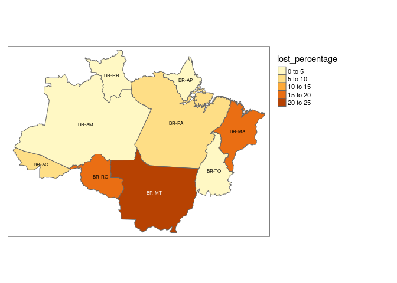

Current and Future Deforestation in Amazon Forest
================
Jiawen Tang, Mark Sun

``` r
#install tmap to upgrade it each time when reopen the file
install.packages(c('tmap','rnaturalearth','rnaturalearthhires'))
```

    ## Installing packages into '/usr/local/lib/R/site-library'
    ## (as 'lib' is unspecified)

``` r
suppressMessages({
  library(fs)
  library(terra)
  library(tidyverse)
  library(tmap)
  library(rnaturalearth)
  library(sp)
  library(sf)
  library(reshape2)
  library(dplyr)
  library(ggplot2)
})
```

``` r
baulogg <-rast("bau_logg_final.tif") 
baufire <-rast("bau_fire_final.tif")
fire <- rast("fire.tif")
drought <- rast("drought.tif")
edge <- rast("edge.tif")
logging <- rast("logging.tif")
```

``` r
data("World")
baulogg[baulogg < 0] <- NA
baufire[baufire < 0] <- NA
tm_shape(World,bbox = stars::st_as_stars(baulogg))+tm_polygons() +
  tm_shape(baulogg)+tm_raster()
```

    ## stars object downsampled to 1140 by 877 cells. See tm_shape manual (argument raster.downsample)

<!-- -->

``` r
tm_shape(World,bbox = stars::st_as_stars(baufire))+tm_polygons() +
  tm_shape(baufire)+tm_raster()
```

    ## stars object downsampled to 1140 by 877 cells. See tm_shape manual (argument raster.downsample)

<!-- -->

``` r
fire[fire == 0] <- NA
drought[drought == 0] <- NA
edge[edge == 0] <- NA
logging[logging == 0] <- NA
tm_shape(World,bbox = stars::st_as_stars(fire))+tm_polygons() +
  tm_shape(fire)+tm_raster()
```

<!-- -->

``` r
tm_shape(World,bbox = stars::st_as_stars(drought))+tm_polygons() +
  tm_shape(drought)+tm_raster()
```

<!-- -->

``` r
tm_shape(World,bbox = stars::st_as_stars(edge))+tm_polygons() +
  tm_shape(edge)+tm_raster()
```

<!-- -->

``` r
tm_shape(World,bbox = stars::st_as_stars(logging))+tm_polygons() +
  tm_shape(logging)+tm_raster()
```

<!-- -->

``` r
deforest <- read.csv("def_area_2004_2019.csv")
colnames(deforest)= c("Year","Acre","Amazonas","Amapa","Maranhao","Mato Grosso","Para","Rondonia","Roraima","Tocantins","Total")
names(deforest)
```

    ##  [1] "Year"        "Acre"        "Amazonas"    "Amapa"       "Maranhao"   
    ##  [6] "Mato Grosso" "Para"        "Rondonia"    "Roraima"     "Tocantins"  
    ## [11] "Total"

``` r
#ggplot(forest,aes(x= Year,y=AC)) + geom_line()
deforested <- melt(deforest,id="Year")
deforest_show <- ggplot(deforested,aes(x=Year,y=value,colour=variable,group=variable)) + geom_line()
deforest_show + labs(title = "Deforestation in different states of Amazon") + labs(x = "Year") + labs(y = "Deforested Area in"~km^2)
```

<!-- -->

``` r
a = c("Acre","Amazonas","Amapá","Maranhão","Mato Grosso","Pará","Rondônia","Roraima", "Tocantins")
b <- c(sum(deforest$Acre),sum(deforest$Amazonas),sum(deforest$Amapa),sum(deforest$Maranhao),sum(deforest$`Mato Grosso`),sum(deforest$Para),sum(deforest$Rondonia),sum(deforest$Roraima),sum(deforest$Tocantins))
b
```

    ## [1]  5722 12425   616  8318 43065 62778 22279  3891  1241

``` r
forest <- read.csv("2020Forest.csv")
forest
```

    ##   iso_3166_2 CurrentArea
    ## 1      BR-AC      107943
    ## 2      BR-AM     1343020
    ## 3      BR-AP      120438
    ## 4      BR-MA       48483
    ## 5      BR-MT      191466
    ## 6      BR-PA      817458
    ## 7      BR-RO      126285
    ## 8      BR-RR      180762
    ## 9      BR-TO       49955

``` r
code <- c("BR-AC","BR-AM","BR-AP","BR-MA","BR-MT","BR-PA","BR-RO","BR-RR","BR-TO") 
total_deforest <- data.frame(iso_3166_2 = code,
                   Area = b)
total_deforest <- merge(total_deforest, forest, by = "iso_3166_2", all.x = TRUE)
total_deforest  <- total_deforest %>%
  mutate(lost_percentage = (Area / CurrentArea) * 100)
total_deforest
```

    ##   iso_3166_2  Area CurrentArea lost_percentage
    ## 1      BR-AC  5722      107943       5.3009459
    ## 2      BR-AM 12425     1343020       0.9251538
    ## 3      BR-AP   616      120438       0.5114665
    ## 4      BR-MA  8318       48483      17.1565291
    ## 5      BR-MT 43065      191466      22.4922441
    ## 6      BR-PA 62778      817458       7.6796606
    ## 7      BR-RO 22279      126285      17.6418419
    ## 8      BR-RR  3891      180762       2.1525542
    ## 9      BR-TO  1241       49955       2.4842358

``` r
ggplot(total_deforest, aes(x = iso_3166_2, y = Area)) +
  geom_bar(stat = "identity", fill = "brown") +
  labs(title = "Total deforested areas in Brazil", x = "States", y = "Area (km^2)")
```

<!-- -->

``` r
ggplot(total_deforest, aes(x = iso_3166_2, y = lost_percentage, group = 1)) +
  geom_point(color = "red", size = 3) +
  geom_line() +
  labs(title = "Lost Percentage Over States", x = "States", y = "Lost Percentage")
```

<!-- -->

``` r
#sp::plot(ne_countries(country = "Brazil", scale = "large"))
states <- ne_states(country = "Brazil")
```

    ## Warning: The `returnclass` argument of `ne_download()` sp as of rnaturalearth 1.0.0.
    ## ℹ Please use `sf` objects with {rnaturalearth}, support for Spatial objects
    ##   (sp) will be removed in a future release of the package.
    ## This warning is displayed once every 8 hours.
    ## Call `lifecycle::last_lifecycle_warnings()` to see where this warning was
    ## generated.

    ## The rnaturalearthhires package needs to be installed.

    ## Installing the rnaturalearthhires package.

    ## Using github PAT from envvar GITHUB_PAT

    ## Downloading GitHub repo ropensci/rnaturalearthhires@HEAD

    ## 
    ## * checking for file ‘/tmp/Rtmp1bE9xk/remotes481264c40a41e/ropensci-rnaturalearthhires-c3785a8/DESCRIPTION’ ... OK
    ## * preparing ‘rnaturalearthhires’:
    ## * checking DESCRIPTION meta-information ... OK
    ## * checking for LF line-endings in source and make files and shell scripts
    ## * checking for empty or unneeded directories
    ## * building ‘rnaturalearthhires_0.2.1.tar.gz’

    ## Installing package into '/usr/local/lib/R/site-library'
    ## (as 'lib' is unspecified)

``` r
states <- st_as_sf(states)
states$iso_3166_2
```

    ##  [1] "BR-RS" "BR-RR" "BR-PA" "BR-AC" "BR-AP" "BR-MS" "BR-PR" "BR-SC" "BR-AM"
    ## [10] "BR-RO" "BR-MT" "BR-MA" "BR-PI" "BR-CE" "BR-RN" "BR-PB" "BR-PE" "BR-AL"
    ## [19] "BR-SE" "BR-BA" "BR-ES" "BR-RJ" "BR-SP" "BR-GO" "BR-DF" "BR-MG" "BR-TO"

``` r
final <- inner_join(states,total_deforest,by = "iso_3166_2" )
final$Area
```

    ## [1]  3891 62778  5722   616 12425 22279 43065  8318  1241

``` r
tm_shape(final) + tm_polygons("Area") + tm_symbols + tm_layout(legend.outside=TRUE) + tm_text("iso_3166_2", size = 0.5) 
```

<!-- -->

``` r
tm_shape(final) + tm_polygons("lost_percentage") + tm_symbols + tm_layout(legend.outside=TRUE) + tm_text("iso_3166_2", size = 0.5)
```

<!-- -->

``` r
firedata <- read.csv("amazon.csv")
names(firedata)
```

    ## [1] "year"   "state"  "month"  "number" "date"

``` r
grouped_data <- firedata %>%
  group_by(year) %>%
  summarize(mean_value = mean(number))
grouped_data
```

    ## # A tibble: 20 × 2
    ##     year mean_value
    ##    <int>      <dbl>
    ##  1  1998       61.8
    ##  2  1999       83.0
    ##  3  2000       84.4
    ##  4  2001       89.7
    ##  5  2002      115. 
    ##  6  2003      132. 
    ##  7  2004      119. 
    ##  8  2005      108. 
    ##  9  2006      104. 
    ## 10  2007      102. 
    ## 11  2008       90.7
    ## 12  2009      121. 
    ## 13  2010      114. 
    ## 14  2011      107. 
    ## 15  2012      124. 
    ## 16  2013      108. 
    ## 17  2014      122. 
    ## 18  2015      127. 
    ## 19  2016      130. 
    ## 20  2017      123.

``` r
ggplot(grouped_data, aes(x = year, y = mean_value)) +
  geom_line() +
  labs(title = "Mean fire occurences in Brazil", x = "year", y = "mean fire occurences")     
```

<!-- -->

``` r
grouped_data2 <- firedata %>%
  group_by(state) %>%
  summarize(mean_value = mean(number))
grouped_data2
```

    ## # A tibble: 23 × 2
    ##    state            mean_value
    ##    <chr>                 <dbl>
    ##  1 Acre                   77.3
    ##  2 Alagoas                19.4
    ##  3 Amapa                  91.3
    ##  4 Amazonas              128. 
    ##  5 Bahia                 187. 
    ##  6 Ceara                 127. 
    ##  7 Distrito Federal       14.9
    ##  8 Espirito Santo         27.4
    ##  9 Goias                 158. 
    ## 10 Maranhao              105. 
    ## # ℹ 13 more rows

``` r
ggplot(grouped_data2, aes(x = state, y = mean_value)) +
  geom_bar(stat = "identity", fill = "steelblue") +
  labs(title = "Mean Values by State", x = "State", y = "Mean Value") +
  theme(axis.text.x = element_text(angle = 45, hjust = 1))
```

<!-- -->

``` r
grouped_data3 <- firedata %>%
  group_by(month) %>%
  summarize(mean_value = mean(number))
grouped_data3
```

    ## # A tibble: 12 × 2
    ##    month     mean_value
    ##    <chr>          <dbl>
    ##  1 Abril           52.2
    ##  2 Agosto         163. 
    ##  3 Dezembro       112. 
    ##  4 Fevereiro       57.1
    ##  5 Janeiro         88.3
    ##  6 Julho          171. 
    ##  7 Junho          104. 
    ##  8 Maio            64.3
    ##  9 Março           56.9
    ## 10 Novembro       158. 
    ## 11 Outubro        164. 
    ## 12 Setembro       108.

``` r
ggplot(grouped_data3, aes(x = month, y = mean_value)) +
  geom_bar(stat = "identity", fill = "steelblue") +
  labs(title = "Mean Values by Month", x = "Month", y = "Mean Value") +
  theme(axis.text.x = element_text(angle = 45, hjust = 1))
```

<!-- -->
