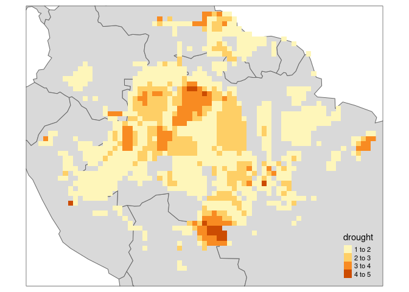
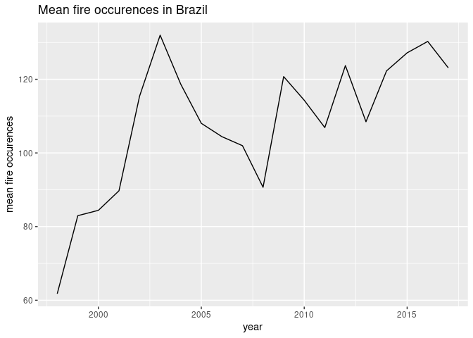
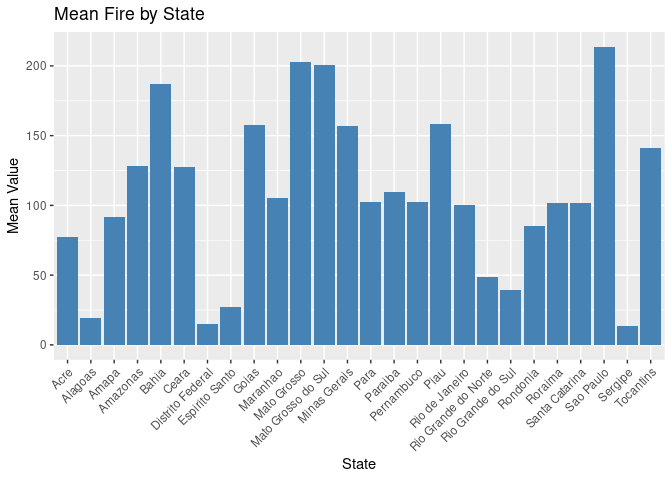

Current and Future Deforestation in Amazon Forest
================
Jiawen Tang, Mark Sun

Amazon Forest is the world’s largest tropical rain forest located in the
south america. Known as the lung of earth, it is the largest single
carbon storage system and the largest terrestrial oxygen producer.
However, this huge rain forest is facing deforestation and degradation.
This study will focusing on Brazil’s part of deforestation, finding the
historical data and project the future.

We will be using several data sources, replicate from some papers and to
show the current status of deforestation and what is the future
prediction. The main paper we are replicate is
<https://www.science.org/doi/10.1126/science.abp8622>, we will start
with its current estimate and end with this as well. In between, we will
use other sources that will reference at the end.

Starting with the study, we will use several functions to create graphs,
maps, reform and visualize the data. We get in touch with multiple use
of dplyr, ggplot, sf, tmap, tidyverse, and we bring in new functions
such as rnaturalearth. Before we start, we will install and read all the
function we need for the study:

``` r
#install tmap to upgrade it each time when reopen the file
install.packages(c('tmap','rnaturalearth','rnaturalearthhires'))
```

    ## Installing packages into '/usr/local/lib/R/site-library'
    ## (as 'lib' is unspecified)

``` r
suppressMessages({
  library(fs)
  library(terra)
  library(tidyverse)
  library(tmap)
  library(rnaturalearth)
  library(sp)
  library(sf)
  library(reshape2)
  library(dplyr)
  library(ggplot2)
})
```

## Historical Deforestation

We will begin with reproduce the 2001-2018 spatial distribution of four
major drivers of Amazonian forest degradation, excluding deforestation
and savanna areas. We will start with reading the tif file to raster and
using the r-data ‘World’ to create maps. The four major drivers are fire
burning, extreme drought occurrence, area within a forest edge, and
timber extraction.

``` r
#read in the tif and World
fire <- rast("fire.tif")
drought <- rast("drought.tif")
edge <- rast("edge.tif")
logging <- rast("logging.tif")
data("World")

#Create maps by changing making sure all data are visualizable. 
fire[fire == 0] <- NA
drought[drought == 0] <- NA
edge[edge == 0] <- NA
logging[logging == 0] <- NA
tm_shape(World,bbox = stars::st_as_stars(fire))+tm_polygons() +
  tm_shape(fire)+tm_raster()
```

<!-- -->

``` r
tm_shape(World,bbox = stars::st_as_stars(drought))+tm_polygons() +
  tm_shape(drought)+tm_raster()
```

<!-- -->

``` r
tm_shape(World,bbox = stars::st_as_stars(edge))+tm_polygons() +
  tm_shape(edge)+tm_raster()
```

<!-- -->

``` r
tm_shape(World,bbox = stars::st_as_stars(logging))+tm_polygons() +
  tm_shape(logging)+tm_raster()
```

<!-- -->

## Brazil Deforestation in Amazon Forest

Because of the different grades between each factor, we cannot
intuitively feel the geographical distribution of deforestation. We will
use state data within Brazil to visualize specific forest loss. First we
read the Brazilian deforestation data from 2004 to 2019. These contains
10 States within the forest area, and a total forest lost.

``` r
deforest <- read.csv("def_area_2004_2019.csv")
colnames(deforest)= c("Year","Acre","Amazonas","Amapa","Maranhao","Mato Grosso","Para","Rondonia","Roraima","Tocantins","Total")
names(deforest)
```

    ##  [1] "Year"        "Acre"        "Amazonas"    "Amapa"       "Maranhao"   
    ##  [6] "Mato Grosso" "Para"        "Rondonia"    "Roraima"     "Tocantins"  
    ## [11] "Total"

We want to plot out each states’ lost of forest so we can decide how to
visualize forest lost on map. For now, simply just present the data with
a line plot:

``` r
deforested <- melt(deforest,id="Year")
deforest_show <- ggplot(deforested,aes(x=Year,y=value,colour=variable,group=variable)) + geom_line()
deforest_show + labs(title = "Deforestation in different states of Amazon") + labs(x = "Year") + labs(y = "Deforested Area in"~km^2)
```

<!-- -->

At this point, we want to see the percentage lost as well as the total
lost of each state, so we can ready to create maps for them. We will sum
by year and read in a new data from world bank. We also create a list of
area code for future reference.

``` r
Statename = c("Acre","Amazonas","Amapá","Maranhão","Mato Grosso","Pará","Rondônia","Roraima", "Tocantins")
Sumofdef <- c(sum(deforest$Acre),sum(deforest$Amazonas),sum(deforest$Amapa),sum(deforest$Maranhao),sum(deforest$`Mato Grosso`),sum(deforest$Para),sum(deforest$Rondonia),sum(deforest$Roraima),sum(deforest$Tocantins))
areacode <- c("BR-AC","BR-AM","BR-AP","BR-MA","BR-MT","BR-PA","BR-RO","BR-RR","BR-TO") 
forest <- read.csv("2020Forest.csv")
forest
```

    ##   iso_3166_2 CurrentArea
    ## 1      BR-AC      107943
    ## 2      BR-AM     1343020
    ## 3      BR-AP      120438
    ## 4      BR-MA       48483
    ## 5      BR-MT      191466
    ## 6      BR-PA      817458
    ## 7      BR-RO      126285
    ## 8      BR-RR      180762
    ## 9      BR-TO       49955

Now, we will create a table that contains all information together.
Since when we create them they are in correct order, we will just frame
them together, merge in the deforestation data and mutate the lost
percentage.

``` r
total_deforest <- data.frame(state = Statename, iso_3166_2 = areacode,
                   Area = Sumofdef)
total_deforest <- merge(total_deforest, forest, by = "iso_3166_2", all.x = TRUE)
total_deforest  <- total_deforest %>%
  mutate(lost_percentage = (Area / CurrentArea) * 100)
total_deforest
```

    ##   iso_3166_2       state  Area CurrentArea lost_percentage
    ## 1      BR-AC        Acre  5722      107943       5.3009459
    ## 2      BR-AM    Amazonas 12425     1343020       0.9251538
    ## 3      BR-AP       Amapá   616      120438       0.5114665
    ## 4      BR-MA    Maranhão  8318       48483      17.1565291
    ## 5      BR-MT Mato Grosso 43065      191466      22.4922441
    ## 6      BR-PA        Pará 62778      817458       7.6796606
    ## 7      BR-RO    Rondônia 22279      126285      17.6418419
    ## 8      BR-RR     Roraima  3891      180762       2.1525542
    ## 9      BR-TO   Tocantins  1241       49955       2.4842358

We will visualize the table by graph, one for the deforestation area,
and another for the deforestation percentage:

``` r
ggplot(total_deforest, aes(x = state, y = Area)) +
  geom_bar(stat = "identity", fill = "brown") +
  labs(title = "Total deforested areas in Brazil", x = "States", y = "Area (km^2)")+
  theme(axis.text.x = element_text(angle = 45, hjust = 1))
```

<!-- -->

``` r
ggplot(total_deforest, aes(x = iso_3166_2, y = lost_percentage, group = 1)) +
  geom_point(color = "red", size = 3) +
  geom_line() +
  labs(title = "Forest Lost Percentage Over States", x = "State Code", y = "Lost Percentage")
```

<!-- -->

From the above two charts, we can clearly see that the area and ratio of
deforestation are different. However, since these names cannot be
expressed concretively for most non-locals, we will plot them on the map
of Brazil. We will use the new function, rnaturalearth to find out the
area we want. This function is useful but need to re-install every time
refreshing the code. Please note this could causing issue when run
without internet and without response to the console. Since the function
will have a very long result (more than 2000 lines), we will just
present the states code and the area to check if its correct.

``` r
#response '1' and '1' for both install question if needed.
states <- ne_states(country = "Brazil")
```

    ## Warning: The `returnclass` argument of `ne_download()` sp as of rnaturalearth 1.0.0.
    ## ℹ Please use `sf` objects with {rnaturalearth}, support for Spatial objects
    ##   (sp) will be removed in a future release of the package.
    ## This warning is displayed once every 8 hours.
    ## Call `lifecycle::last_lifecycle_warnings()` to see where this warning was
    ## generated.

``` r
states <- st_as_sf(states)
states$iso_3166_2
```

    ##  [1] "BR-RS" "BR-RR" "BR-PA" "BR-AC" "BR-AP" "BR-MS" "BR-PR" "BR-SC" "BR-AM"
    ## [10] "BR-RO" "BR-MT" "BR-MA" "BR-PI" "BR-CE" "BR-RN" "BR-PB" "BR-PE" "BR-AL"
    ## [19] "BR-SE" "BR-BA" "BR-ES" "BR-RJ" "BR-SP" "BR-GO" "BR-DF" "BR-MG" "BR-TO"

``` r
final <- inner_join(states,total_deforest,by = "iso_3166_2" )
final$Area
```

    ## [1]  3891 62778  5722   616 12425 22279 43065  8318  1241

Now we can start drawing the map. We have the base map and the data, and
we plot it using tmap. It can be seen that Para is the main loss area,
but due to its large forest area, the ratio is not higher. In contrast,
the neighbouring marginal provinces experienced forest losses of more
than 10 per cent because they had less forest themselves. Because of the
data issue, we only can use the forest area of 2020, which will increase
the percentage since 2000 will have a larger forest area for most of the
states.

``` r
tm_shape(final) + tm_polygons("Area") + tm_symbols + tm_layout(legend.outside=TRUE) + tm_text("state", size = 0.5) 
```

<!-- -->

``` r
tm_shape(final) + tm_polygons("lost_percentage") + tm_symbols + tm_layout(legend.outside=TRUE) + tm_text("state", size = 0.5)
```

<!-- -->

## Fire in Brazil

``` r
firedata <- read.csv("amazon.csv")
names(firedata)
```

    ## [1] "year"   "state"  "month"  "number" "date"

``` r
grouped_data <- firedata %>%
  group_by(year) %>%
  summarize(mean_value = mean(number))
grouped_data
```

    ## # A tibble: 20 × 2
    ##     year mean_value
    ##    <int>      <dbl>
    ##  1  1998       61.8
    ##  2  1999       83.0
    ##  3  2000       84.4
    ##  4  2001       89.7
    ##  5  2002      115. 
    ##  6  2003      132. 
    ##  7  2004      119. 
    ##  8  2005      108. 
    ##  9  2006      104. 
    ## 10  2007      102. 
    ## 11  2008       90.7
    ## 12  2009      121. 
    ## 13  2010      114. 
    ## 14  2011      107. 
    ## 15  2012      124. 
    ## 16  2013      108. 
    ## 17  2014      122. 
    ## 18  2015      127. 
    ## 19  2016      130. 
    ## 20  2017      123.

``` r
ggplot(grouped_data, aes(x = year, y = mean_value)) +
  geom_line() +
  labs(title = "Mean fire occurences in Brazil", x = "year", y = "mean fire occurences")     
```

<!-- -->

``` r
grouped_data2 <- firedata %>%
  group_by(state) %>%
  summarize(mean_value = mean(number))
grouped_data2
```

    ## # A tibble: 23 × 2
    ##    state            mean_value
    ##    <chr>                 <dbl>
    ##  1 Acre                   77.3
    ##  2 Alagoas                19.4
    ##  3 Amapa                  91.3
    ##  4 Amazonas              128. 
    ##  5 Bahia                 187. 
    ##  6 Ceara                 127. 
    ##  7 Distrito Federal       14.9
    ##  8 Espirito Santo         27.4
    ##  9 Goias                 158. 
    ## 10 Maranhao              105. 
    ## # ℹ 13 more rows

``` r
ggplot(grouped_data2, aes(x = state, y = mean_value)) +
  geom_bar(stat = "identity", fill = "steelblue") +
  labs(title = "Mean Values by State", x = "State", y = "Mean Value") +
  theme(axis.text.x = element_text(angle = 45, hjust = 1))
```

<!-- -->

``` r
grouped_data3 <- firedata %>%
  group_by(month) %>%
  summarize(mean_value = mean(number))
grouped_data3
```

    ## # A tibble: 12 × 2
    ##    month     mean_value
    ##    <chr>          <dbl>
    ##  1 Abril           52.2
    ##  2 Agosto         163. 
    ##  3 Dezembro       112. 
    ##  4 Fevereiro       57.1
    ##  5 Janeiro         88.3
    ##  6 Julho          171. 
    ##  7 Junho          104. 
    ##  8 Maio            64.3
    ##  9 Março           56.9
    ## 10 Novembro       158. 
    ## 11 Outubro        164. 
    ## 12 Setembro       108.

``` r
ggplot(grouped_data3, aes(x = month, y = mean_value)) +
  geom_bar(stat = "identity", fill = "steelblue") +
  labs(title = "Mean Values by Month", x = "Month", y = "Mean Value") +
  theme(axis.text.x = element_text(angle = 45, hjust = 1))
```

<!-- -->

``` r
new1<-read.csv("drivers-forest-loss-brazil-amazon.csv")
new2 <- new1 %>% select(-Entity)
new3 <- new2 %>% select(-Code)
new4 <- new3 |> pivot_longer(-Year)
new4
```

    ## # A tibble: 143 × 3
    ##     Year name                              value
    ##    <int> <chr>                             <int>
    ##  1  2001 flooding_due_to_dams                  0
    ##  2  2001 natural_disturbances                  0
    ##  3  2001 fire                              26000
    ##  4  2001 selective_logging                 96000
    ##  5  2001 other_infrastructure               9000
    ##  6  2001 roads                             13000
    ##  7  2001 mining                             9000
    ##  8  2001 small.scale_clearing             249000
    ##  9  2001 tree_plantations_including_palm   44000
    ## 10  2001 pasture                         1520000
    ## # ℹ 133 more rows

``` r
ggplot(new4,aes(x=Year,y=value,fill=name)) + geom_area()
```

<!-- -->

``` r
baulogg <-rast("bau_logg_final.tif") 
baufire <-rast("bau_fire_final.tif")
baulogg[baulogg < 0] <- NA
baufire[baufire < 0] <- NA
tm_shape(World, bbox = stars::st_as_stars(baulogg), raster.downsample = list(width = 1140, height = 877)) +
    tm_polygons() +
    tm_shape(baulogg) + tm_raster()
```

    ## stars object downsampled to 1140 by 877 cells. See tm_shape manual (argument raster.downsample)

<!-- -->

``` r
tm_shape(World, bbox = stars::st_as_stars(baufire), raster.downsample = list(width = 1140, height = 877)) +
    tm_polygons() +
    tm_shape(baufire) + tm_raster()
```

    ## stars object downsampled to 1140 by 877 cells. See tm_shape manual (argument raster.downsample)

<!-- -->
