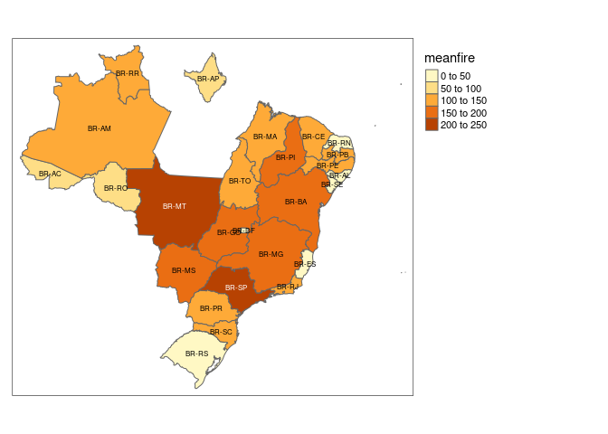

Current and Future Deforestation in Amazon Forest
================
Jiawen Tang, Mark Sun

``` r
#install tmap to upgrade it each time when reopen the file
#install.packages('tmap')
suppressMessages({
  library(fs)
  library(terra)
  library(tidyverse)
  library(tmap)
})
```

``` r
baulogg <-rast("bau_logg_final.tif") 
baufire <-rast("bau_fire_final.tif")
fire <- rast("fire.tif")
drought <- rast("drought.tif")
edge <- rast("edge.tif")
logging <- rast("logging.tif")
```

``` r
#tm_shape(baulogg)+tm_raster()+tm_basemap()
data("World")
baulogg[baulogg < 0] <- NA
logmap <- tm_shape(World,bbox = stars::st_as_stars(baulogg))+tm_polygons() +
  tm_shape(baulogg)+tm_raster()
print(logmap)
```

    ## stars object downsampled to 1140 by 877 cells. See tm_shape manual (argument raster.downsample)

<!-- -->

``` r
baufire[baufire < 0] <- NA
tm_shape(World,bbox = stars::st_as_stars(baufire))+tm_polygons() +
  tm_shape(baufire)+tm_raster()
```

    ## stars object downsampled to 1140 by 877 cells. See tm_shape manual (argument raster.downsample)

<!-- -->

``` r
fire[fire == 0] <- NA
tm_shape(World,bbox = stars::st_as_stars(fire))+tm_polygons() +
  tm_shape(fire)+tm_raster(n=6)
```

<!-- -->

``` r
drought[drought == 0] <- NA
tm_shape(World,bbox = stars::st_as_stars(drought))+tm_polygons() +
  tm_shape(drought)+tm_raster(n=4)
```

<!-- -->

``` r
edge[edge == 0] <- NA
tm_shape(World,bbox = stars::st_as_stars(edge))+tm_polygons() +
  tm_shape(edge)+tm_raster(n=4)
```

<!-- -->

``` r
logging[logging == 0] <- NA
tm_shape(World,bbox = stars::st_as_stars(logging))+tm_polygons() +
  tm_shape(logging)+tm_raster(n=4)
```

<!-- -->

``` r
forest <- read.csv("def_area_2004_2019.csv")
colnames(forest)= c("Year","Acre","Amazonas","Amapa","Maranhao","Mato Grosso","Para","Rondonia","Roraima","Tocantins","Total")
forest
```

    ##    Year Acre Amazonas Amapa Maranhao Mato Grosso Para Rondonia Roraima
    ## 1  2004  728     1232    46      755       11814 8870     3858     311
    ## 2  2005  592      775    33      922        7145 5899     3244     133
    ## 3  2006  398      788    30      674        4333 5659     2049     231
    ## 4  2007  184      610    39      631        2678 5526     1611     309
    ## 5  2008  254      604   100     1271        3258 5607     1136     574
    ## 6  2009  167      405    70      828        1049 4281      482     121
    ## 7  2010  259      595    53      712         871 3770      435     256
    ## 8  2011  280      502    66      396        1120 3008      865     141
    ## 9  2012  305      523    27      269         757 1741      773     124
    ## 10 2013  221      583    23      403        1139 2346      932     170
    ## 11 2014  309      500    31      257        1075 1887      684     219
    ## 12 2015  264      712    25      209        1601 2153     1030     156
    ## 13 2016  372     1129    17      258        1489 2992     1376     202
    ## 14 2017  257     1001    24      265        1561 2433     1243     132
    ## 15 2018  444     1045    24      253        1490 2744     1316     195
    ## 16 2019  688     1421     8      215        1685 3862     1245     617
    ##    Tocantins Total
    ## 1        158 27772
    ## 2        271 19014
    ## 3        124 14286
    ## 4         63 11651
    ## 5        107 12911
    ## 6         61  7464
    ## 7         49  7000
    ## 8         40  6418
    ## 9         52  4571
    ## 10        74  5891
    ## 11        50  5012
    ## 12        57  6207
    ## 13        58  7893
    ## 14        31  6947
    ## 15        25  7536
    ## 16        21  9762

``` r
#read.csv("amazon.csv")
```

``` r
#ggplot(forest,aes(x= Year,y=AC)) + geom_line()
library(reshape2)
```

    ## 
    ## Attaching package: 'reshape2'

    ## The following object is masked from 'package:tidyr':
    ## 
    ##     smiths

``` r
deforest <- melt(forest,id="Year")
deforest_show <- ggplot(deforest,aes(x=Year,y=value,colour=variable,group=variable)) + geom_line()
deforest_show + labs(title = "Deforestation in different states of Amazon") + labs(x = "Year") + labs(y = "Deforested Area in"~km^2)
```

<!-- -->

``` r
a = c("Acre","Amazonas","Amapá","Maranhão","Mato Grosso","Pará","Rondônia","Roraima", "Tocantins")
b <- c(sum(forest$Acre),sum(forest$Amazonas),sum(forest$Amapa),sum(forest$Maranhao),sum(forest$`Mato Grosso`),sum(forest$Para),sum(forest$Rondonia),sum(forest$Roraima),sum(forest$Tocantins))
b
```

    ## [1]  5722 12425   616  8318 43065 62778 22279  3891  1241

``` r
code <- c("AC","AM","AP","MA","MT","PA","RO","RR","TO") 
total_deforest <- data.frame(State = code,
                   Area = b)
total_deforest
```

    ##   State  Area
    ## 1    AC  5722
    ## 2    AM 12425
    ## 3    AP   616
    ## 4    MA  8318
    ## 5    MT 43065
    ## 6    PA 62778
    ## 7    RO 22279
    ## 8    RR  3891
    ## 9    TO  1241

``` r
install.packages("plotly")
```

    ## Installing package into '/usr/local/lib/R/site-library'
    ## (as 'lib' is unspecified)

``` r
library(plotly)
```

    ## 
    ## Attaching package: 'plotly'

    ## The following object is masked from 'package:ggplot2':
    ## 
    ##     last_plot

    ## The following object is masked from 'package:stats':
    ## 
    ##     filter

    ## The following object is masked from 'package:graphics':
    ## 
    ##     layout

``` r
# Create choropleth map

new_map <- plot_ly(
  total_deforest,
  type = "choropleth",
  locations = ~State,
  locationmode = "ISO-3",  # Set location mode to "country names" for city-level data
  z = ~Area,
  colorscale = "Viridis",
  colorbar = list(title = "Area")
) %>%
  layout(
    geo = list(
      center = list(lat = -14.235, lon = -51.925),  # Center of Brazil
      projection = list(type = 'mercator'),  # Specify the projection type
      scope = 'south america',  # Zoom in on South America
      showland = TRUE
    )
  )

# Display the map
new_map
```

<!-- -->
