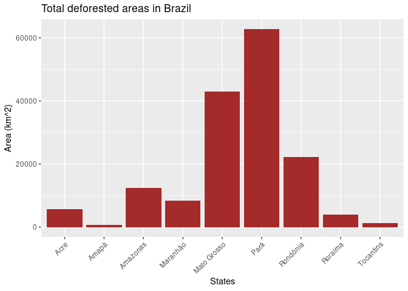

Current and Future Deforestation in Amazon Forest
================
Jiawen Tang, Mark Sun

``` r
#install tmap to upgrade it each time when reopen the file
#install.packages('tmap')
suppressMessages({
  library(fs)
  library(terra)
  library(tidyverse)
  library(tmap)
})
```

``` r
baulogg <-rast("bau_logg_final.tif") 
baufire <-rast("bau_fire_final.tif")
fire <- rast("fire.tif")
drought <- rast("drought.tif")
edge <- rast("edge.tif")
logging <- rast("logging.tif")
```

``` r
#tm_shape(baulogg)+tm_raster()+tm_basemap()
data("World")
baulogg[baulogg < 0] <- NA
logmap <- tm_shape(World,bbox = stars::st_as_stars(baulogg))+tm_polygons() +
  tm_shape(baulogg)+tm_raster()
print(logmap)
```

    ## stars object downsampled to 1140 by 877 cells. See tm_shape manual (argument raster.downsample)

<!-- -->

``` r
baufire[baufire < 0] <- NA
tm_shape(World,bbox = stars::st_as_stars(baufire))+tm_polygons() +
  tm_shape(baufire)+tm_raster()
```

    ## stars object downsampled to 1140 by 877 cells. See tm_shape manual (argument raster.downsample)

<!-- -->

``` r
fire[fire == 0] <- NA
tm_shape(World,bbox = stars::st_as_stars(fire))+tm_polygons() +
  tm_shape(fire)+tm_raster(n=6)
```

<!-- -->

``` r
drought[drought == 0] <- NA
tm_shape(World,bbox = stars::st_as_stars(drought))+tm_polygons() +
  tm_shape(drought)+tm_raster(n=4)
```

<!-- -->

``` r
edge[edge == 0] <- NA
tm_shape(World,bbox = stars::st_as_stars(edge))+tm_polygons() +
  tm_shape(edge)+tm_raster(n=4)
```

<!-- -->

``` r
logging[logging == 0] <- NA
tm_shape(World,bbox = stars::st_as_stars(logging))+tm_polygons() +
  tm_shape(logging)+tm_raster(n=4)
```

<!-- -->
