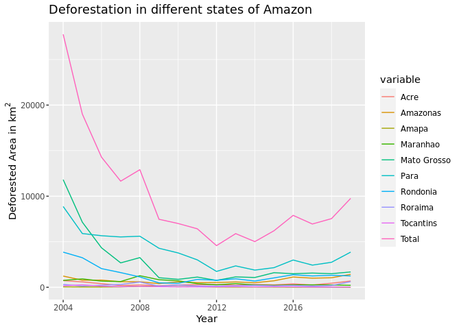
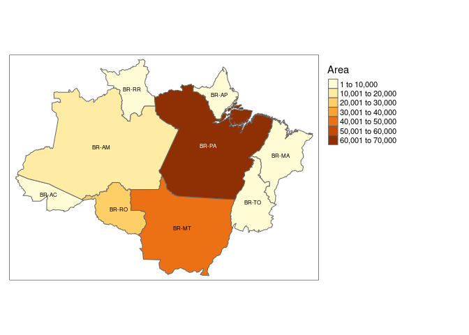

Current and Future Deforestation in Amazon Forest
================
Jiawen Tang, Mark Sun

``` r
#install tmap to upgrade it each time when reopen the file
install.packages(c('tmap','rnaturalearth','rnaturalearthhires'))
```

    ## Installing packages into '/srv/r'
    ## (as 'lib' is unspecified)

``` r
suppressMessages({
  library(fs)
  library(terra)
  library(tidyverse)
  library(tmap)
  library(rnaturalearth)
  library(sp)
  library(sf)
  library(reshape2)
})
```

``` r
baulogg <-rast("bau_logg_final.tif") 
baufire <-rast("bau_fire_final.tif")
fire <- rast("fire.tif")
drought <- rast("drought.tif")
edge <- rast("edge.tif")
logging <- rast("logging.tif")
```

``` r
data("World")
baulogg[baulogg < 0] <- NA
logmap <- tm_shape(World,bbox = stars::st_as_stars(baulogg))+tm_polygons() +
  tm_shape(baulogg)+tm_raster()
print(logmap)
```

    ## stars object downsampled to 1140 by 877 cells. See tm_shape manual (argument raster.downsample)

<!-- -->

``` r
baufire[baufire < 0] <- NA
tm_shape(World,bbox = stars::st_as_stars(baufire))+tm_polygons() +
  tm_shape(baufire)+tm_raster()
```

    ## stars object downsampled to 1140 by 877 cells. See tm_shape manual (argument raster.downsample)

<!-- -->

``` r
fire[fire == 0] <- NA
tm_shape(World,bbox = stars::st_as_stars(fire))+tm_polygons() +
  tm_shape(fire)+tm_raster(n=6)
```

<!-- -->

``` r
drought[drought == 0] <- NA
tm_shape(World,bbox = stars::st_as_stars(drought))+tm_polygons() +
  tm_shape(drought)+tm_raster(n=4)
```

<!-- -->

``` r
edge[edge == 0] <- NA
tm_shape(World,bbox = stars::st_as_stars(edge))+tm_polygons() +
  tm_shape(edge)+tm_raster(n=4)
```

<!-- -->

``` r
logging[logging == 0] <- NA
tm_shape(World,bbox = stars::st_as_stars(logging))+tm_polygons() +
  tm_shape(logging)+tm_raster(n=4)
```

<!-- -->

``` r
forest <- read.csv("def_area_2004_2019.csv")
colnames(forest)= c("Year","Acre","Amazonas","Amapa","Maranhao","Mato Grosso","Para","Rondonia","Roraima","Tocantins","Total")
forest
```

    ##    Year Acre Amazonas Amapa Maranhao Mato Grosso Para Rondonia Roraima
    ## 1  2004  728     1232    46      755       11814 8870     3858     311
    ## 2  2005  592      775    33      922        7145 5899     3244     133
    ## 3  2006  398      788    30      674        4333 5659     2049     231
    ## 4  2007  184      610    39      631        2678 5526     1611     309
    ## 5  2008  254      604   100     1271        3258 5607     1136     574
    ## 6  2009  167      405    70      828        1049 4281      482     121
    ## 7  2010  259      595    53      712         871 3770      435     256
    ## 8  2011  280      502    66      396        1120 3008      865     141
    ## 9  2012  305      523    27      269         757 1741      773     124
    ## 10 2013  221      583    23      403        1139 2346      932     170
    ## 11 2014  309      500    31      257        1075 1887      684     219
    ## 12 2015  264      712    25      209        1601 2153     1030     156
    ## 13 2016  372     1129    17      258        1489 2992     1376     202
    ## 14 2017  257     1001    24      265        1561 2433     1243     132
    ## 15 2018  444     1045    24      253        1490 2744     1316     195
    ## 16 2019  688     1421     8      215        1685 3862     1245     617
    ##    Tocantins Total
    ## 1        158 27772
    ## 2        271 19014
    ## 3        124 14286
    ## 4         63 11651
    ## 5        107 12911
    ## 6         61  7464
    ## 7         49  7000
    ## 8         40  6418
    ## 9         52  4571
    ## 10        74  5891
    ## 11        50  5012
    ## 12        57  6207
    ## 13        58  7893
    ## 14        31  6947
    ## 15        25  7536
    ## 16        21  9762

``` r
#ggplot(forest,aes(x= Year,y=AC)) + geom_line()
deforest <- melt(forest,id="Year")
deforest_show <- ggplot(deforest,aes(x=Year,y=value,colour=variable,group=variable)) + geom_line()
deforest_show + labs(title = "Deforestation in different states of Amazon") + labs(x = "Year") + labs(y = "Deforested Area in"~km^2)
```

<!-- -->

``` r
a = c("Acre","Amazonas","Amapá","Maranhão","Mato Grosso","Pará","Rondônia","Roraima", "Tocantins")
b <- c(sum(forest$Acre),sum(forest$Amazonas),sum(forest$Amapa),sum(forest$Maranhao),sum(forest$`Mato Grosso`),sum(forest$Para),sum(forest$Rondonia),sum(forest$Roraima),sum(forest$Tocantins))
b
```

    ## [1]  5722 12425   616  8318 43065 62778 22279  3891  1241

``` r
code <- c("BR-AC","BR-AM","BR-AP","BR-MA","BR-MT","BR-PA","BR-RO","BR-RR","BR-TO") 
total_deforest <- data.frame(iso_3166_2 = code,
                   Area = b)
total_deforest
```

    ##   iso_3166_2  Area
    ## 1      BR-AC  5722
    ## 2      BR-AM 12425
    ## 3      BR-AP   616
    ## 4      BR-MA  8318
    ## 5      BR-MT 43065
    ## 6      BR-PA 62778
    ## 7      BR-RO 22279
    ## 8      BR-RR  3891
    ## 9      BR-TO  1241

``` r
ggplot(total_deforest, aes(x = iso_3166_2, y = Area)) +
  geom_bar(stat = "identity", fill = "skyblue") +
  labs(title = "Total deforested areas in Brazil", x = "States", y = "Area (km^2)")
```

<!-- -->

``` r
#sp::plot(ne_countries(country = "Brazil", scale = "large"))
states <- ne_states(country = "Brazil")
```

    ## Warning: The `returnclass` argument of `ne_download()` sp as of rnaturalearth 1.0.0.
    ## ℹ Please use `sf` objects with {rnaturalearth}, support for Spatial objects
    ##   (sp) will be removed in a future release of the package.
    ## This warning is displayed once every 8 hours.
    ## Call `lifecycle::last_lifecycle_warnings()` to see where this warning was
    ## generated.

``` r
states <- st_as_sf(states)
states
```

    ## Simple feature collection with 27 features and 121 fields
    ## Geometry type: MULTIPOLYGON
    ## Dimension:     XY
    ## Bounding box:  xmin: -74.01847 ymin: -33.74228 xmax: -28.87706 ymax: 5.267225
    ## Geodetic CRS:  WGS 84
    ## First 10 features:
    ##                          featurecla scalerank adm1_code diss_me iso_3166_2
    ## 104  Admin-1 states provinces lakes         2   BRA-612     612      BR-RS
    ## 265  Admin-1 states provinces lakes         2   BRA-670     670      BR-RR
    ## 268  Admin-1 states provinces lakes         2   BRA-594     594      BR-PA
    ## 272  Admin-1 states provinces lakes         2   BRA-576     576      BR-AC
    ## 462  Admin-1 states provinces lakes         2   BRA-681     681      BR-AP
    ## 753  Admin-1 states provinces lakes         2   BRA-600     600      BR-MS
    ## 758  Admin-1 states provinces lakes         2   BRA-613     613      BR-PR
    ## 759  Admin-1 states provinces lakes         2   BRA-614     614      BR-SC
    ## 1295 Admin-1 states provinces lakes         2   BRA-592     592      BR-AM
    ## 1314 Admin-1 states provinces lakes         2   BRA-595     595      BR-RO
    ##      wikipedia iso_a2 adm0_sr               name        name_alt name_local
    ## 104       <NA>     BR       1  Rio Grande do Sul            <NA>       <NA>
    ## 265       <NA>     BR       1            Roraima      Rio Branco       <NA>
    ## 268       <NA>     BR       5               Pará            <NA>       <NA>
    ## 272       <NA>     BR       1               Acre            <NA>       <NA>
    ## 462       <NA>     BR       5              Amapá            <NA>       <NA>
    ## 753       <NA>     BR       1 Mato Grosso do Sul            <NA>       <NA>
    ## 758       <NA>     BR       1             Paraná            <NA>       <NA>
    ## 759       <NA>     BR       1     Santa Catarina Santa Catharina       <NA>
    ## 1295      <NA>     BR       1           Amazonas         Amazone       <NA>
    ## 1314      <NA>     BR       1           Rondônia         Guaporé       <NA>
    ##        type type_en code_local code_hasc note    hasc_maybe region region_cod
    ## 104  Estado   State       <NA>     BR.RS <NA>          <NA>   <NA>       <NA>
    ## 265  Estado   State       <NA>     BR.RR <NA>          <NA>   <NA>       <NA>
    ## 268  Estado   State       <NA>     BR.PA <NA>          <NA>   <NA>       <NA>
    ## 272  Estado   State       <NA>     BR.AC <NA> BR.AC|BRA-ACR   <NA>       <NA>
    ## 462  Estado   State       <NA>     BR.AP <NA>          <NA>   <NA>       <NA>
    ## 753  Estado   State       <NA>     BR.MS <NA>          <NA>   <NA>       <NA>
    ## 758  Estado   State       <NA>     BR.PR <NA>          <NA>   <NA>       <NA>
    ## 759  Estado   State       <NA>     BR.SC <NA>          <NA>   <NA>       <NA>
    ## 1295 Estado   State       <NA>     BR.AM <NA>          <NA>   <NA>       <NA>
    ## 1314 Estado   State       <NA>     BR.RO <NA> BR.RO|BRA-RND   <NA>       <NA>
    ##      provnum_ne gadm_level check_me datarank abbrev postal area_sqkm sameascity
    ## 104          12          1       20        1    Rio     RS         0        -99
    ## 265          26          1       20        1  Rora.     RR         0        -99
    ## 268           7          1       20        1 M.Ger.     PA         0        -99
    ## 272          24          1       20        1   Acre     AC         0        -99
    ## 462           9          1       20        1  Amapá     AP         0        -99
    ## 753          20          1       20        1 M.Gro.     MS         0        -99
    ## 758          13          1       20        1 Paraná     PR         0        -99
    ## 759           5          1       20        1   S.C.     SC         0        -99
    ## 1295         25          1       20        6  Amaz.     AM         0        -99
    ## 1314         24          1       20        1  Rond.     RO         0        -99
    ##      labelrank name_len mapcolor9 mapcolor13 fips fips_alt  woe_id
    ## 104          2       17         5          7 BR23     <NA> 2344864
    ## 265          2        7         5          7 BR25     <NA> 2344866
    ## 268          2        4         5          7 BR16     <NA> 2344857
    ## 272          2        4         5          7 BR01     <NA> 2344844
    ## 462          2        5         5          7 BR03     <NA> 2344846
    ## 753          2       18         5          7 BR11     <NA> 2344853
    ## 758          2        6         5          7 BR18     <NA> 2344859
    ## 759          2       14         5          7 BR26     <NA> 2344867
    ## 1295         2        8         5          7 BR04     <NA> 2344847
    ## 1314         2        8         5          7 BR24     <NA> 2344865
    ##                           woe_label           woe_name  latitude longitude
    ## 104   Rio Grande do Sul, BR, Brazil  Rio Grande do Sul -29.72770  -53.6560
    ## 265             Roraima, BR, Brazil            Roraima   1.93803  -61.3325
    ## 268                Para, BR, Brazil               Pará  -4.44313  -52.6491
    ## 272                Acre, BR, Brazil               Acre  -8.92850  -70.2976
    ## 462               Amapa, BR, Brazil              Amapá   1.41157  -51.6842
    ## 753  Mato Grosso do Sul, BR, Brazil Mato Grosso do Sul -20.67560  -54.5502
    ## 758              Parana, BR, Brazil             Paraná -24.66180  -51.3228
    ## 759      Santa Catarina, BR, Brazil     Santa Catarina -27.03920  -51.1586
    ## 1295           Amazonas, BR, Brazil           Amazonas  -4.21774  -63.7853
    ## 1314           Rondonia, BR, Brazil           Rondônia -10.97120  -63.1439
    ##      sov_a3 adm0_a3 adm0_label  admin geonunit gu_a3   gn_id
    ## 104     BRA     BRA          2 Brazil   Brazil   BRA 3451133
    ## 265     BRA     BRA          2 Brazil   Brazil   BRA 3662560
    ## 268     BRA     BRA          2 Brazil   Brazil   BRA 3393129
    ## 272     BRA     BRA          2 Brazil   Brazil   BRA 3665474
    ## 462     BRA     BRA          2 Brazil   Brazil   BRA 3407762
    ## 753     BRA     BRA          2 Brazil   Brazil   BRA 3457415
    ## 758     BRA     BRA          2 Brazil   Brazil   BRA 3455077
    ## 759     BRA     BRA          2 Brazil   Brazil   BRA 3450387
    ## 1295    BRA     BRA          2 Brazil   Brazil   BRA 3665361
    ## 1314    BRA     BRA          2 Brazil   Brazil   BRA 3924825
    ##                           gn_name  gns_id                      gns_name
    ## 104   Estado do Rio Grande do Sul -666687  Rio Grande do Sul, Estado do
    ## 265             Estado de Roraima -667043            Roraima, Estado de
    ## 268                Estado do Para -659233               Para, Estado do
    ## 272                Estado do Acre -623025               Acre, Estado do
    ## 462               Estado do Amapa -624535              Amapa, Estado do
    ## 753  Estado de Mato Grosso do Sul -654593 Mato Grosso do Sul, Estado de
    ## 758              Estado do Parana -659430             Parana, Estado do
    ## 759      Estado de Santa Catarina -668106     Santa Catarina, Estado de
    ## 1295           Estado do Amazonas -624593           Amazonas, Estado do
    ## 1314           Estado de Rondonia -667025           Rondonia, Estado de
    ##      gn_level gn_region gn_a1_code region_sub sub_code gns_level gns_lang
    ## 104         1      <NA>      BR.23       <NA>     <NA>         1      kor
    ## 265         1      <NA>      BR.25       <NA>     <NA>         1      kor
    ## 268         1      <NA>      BR.16       <NA>     <NA>         1      por
    ## 272         1      <NA>      BR.01       <NA>     <NA>         1      por
    ## 462         1      <NA>      BR.03       <NA>     <NA>         1      por
    ## 753         1      <NA>      BR.11       <NA>     <NA>         1      por
    ## 758         1      <NA>      BR.18       <NA>     <NA>         1      por
    ## 759         1      <NA>      BR.26       <NA>     <NA>         1      kor
    ## 1295        1      <NA>      BR.04       <NA>     <NA>         1      por
    ## 1314        1      <NA>      BR.24    Guaporé     <NA>         1      kor
    ##      gns_adm1 gns_region min_label max_label min_zoom wikidataid
    ## 104      BR23       <NA>       3.7       8.5        3     Q40030
    ## 265      BR25       <NA>       3.7       8.5        3     Q42508
    ## 268      BR16       <NA>       3.7       8.5        3     Q39517
    ## 272      BR01       <NA>       3.7       8.5        3     Q40780
    ## 462      BR03       <NA>       3.7       8.5        3     Q40130
    ## 753      BR11       <NA>       3.7       8.5        3     Q43319
    ## 758      BR18       <NA>       3.7       8.5        3     Q15499
    ## 759      BR26       <NA>       3.7       8.5        3     Q41115
    ## 1295     BR04       <NA>       3.7       8.5        3     Q40040
    ## 1314     BR24       <NA>       3.7       8.5        3     Q43235
    ##                name_ar          name_bn            name_de            name_en
    ## 104  ريو غراندي دو سول রিও গ্রান্ডে দু সোল  Rio Grande do Sul  Rio Grande do Sul
    ## 265            رورايما    রোরাইমা প্রদেশ            Roraima            Roraima
    ## 268               بارا           প্যাারা               Pará               Pará
    ## 272               أكري              একর               Acre               Acre
    ## 462              أمابا            আমাপা              Amapá              Amapá
    ## 753  ماتو غروسو دو سول মাতো গ্রোস দো সৌল Mato Grosso do Sul Mato Grosso do Sul
    ## 758             بارانا           পারানা             Paraná             Paraná
    ## 759     سانتا كاتارينا স্যান্টা ক্যাটারিনা     Santa Catarina     Santa Catarina
    ## 1295          الأمازون         আমাজোনাস           Amazonas           Amazonas
    ## 1314          روندونيا         রন্ডোনিয়া           Rondônia           Rondônia
    ##                 name_es            name_fr              name_el
    ## 104  Río Grande del Sur  Rio Grande do Sul Ρίο Γκράντε ντο Σουλ
    ## 265             Roraima            Roraima              Ροράιμα
    ## 268                Pará               Pará                 Παρά
    ## 272      Estado de Acre               Acre                 Άκρε
    ## 462               Amapá              Amapá                Αμαπά
    ## 753  Mato Grosso do Sul Mato Grosso do Sul Μάτο Γκρόσο ντο Σουλ
    ## 758              Paraná             Paraná               Παρανά
    ## 759      Santa Catarina     Santa Catarina       Σάντα Καταρίνα
    ## 1295           Amazonas           Amazonas             Αμαζόνας
    ## 1314           Rondônia           Rondônia             Ροντόνια
    ##               name_hi            name_hu            name_id            name_it
    ## 104   रियो ग्रांडे दो सुल Río Grande del Sur  Rio Grande do Sul  Rio Grande do Sul
    ## 265             रोरैमा            Roraima            Roraima            Roraima
    ## 268              पारा               Pará               Pará               Pará
    ## 272              आक्री               Acre               Acre               Acre
    ## 462             अमापा              Amapá              Amapá              Amapá
    ## 753  मातो ग्रोसो दो सुल Mato Grosso do Sul Mato Grosso do Sul Mato Grosso do Sul
    ## 758            पाराना             Paraná             Paraná             Paraná
    ## 759     सांता कातारीना     Santa Catarina     Santa Catarina     Santa Catarina
    ## 1295          आमेज़ोनास           Amazonas           Amazonas           Amazonas
    ## 1314        रोन्डोनिया           Rondônia           Rondônia           Rondônia
    ##                         name_ja        name_ko            name_nl
    ## 104    リオグランデ・ド・スル州 히우그란지두술  Rio Grande do Sul
    ## 265                  ロライマ州       호라이마            Roraima
    ## 268                    パラー州           파라               Pará
    ## 272                    アクレ州         아크리               Acre
    ## 462                  アマパー州         아마파              Amapá
    ## 753  マットグロッソ・ド・スル州 마투그로수두술 Mato Grosso do Sul
    ## 758                    パラナ州         파라나             Paraná
    ## 759          サンタカタリーナ州   산타카타리나     Santa Catarina
    ## 1295               アマゾナス州     아마조나스           Amazonas
    ## 1314               ロンドニア州       혼도니아           Rondônia
    ##                 name_pl            name_pt           name_ru            name_sv
    ## 104   Rio Grande do Sul  Rio Grande do Sul Риу-Гранди-ду-Сул  Rio Grande do Sul
    ## 265             Roraima            Roraima           Рорайма            Roraima
    ## 268                Pará               Pará              Пара               Pará
    ## 272                Acre               Acre              Акри               Acre
    ## 462               Amapá              Amapá             Амапа              Amapá
    ## 753  Mato Grosso do Sul Mato Grosso do Sul Мату-Гросу-ду-Сул Mato Grosso do Sul
    ## 758              Parana             Paraná            Парана             Paraná
    ## 759      Santa Catarina     Santa Catarina    Санта-Катарина     Santa Catarina
    ## 1295           Amazonas           Amazonas          Амазонас           Amazonas
    ## 1314           Rondônia           Rondônia          Рондония           Rondônia
    ##                 name_tr            name_vi        name_zh      ne_id
    ## 104   Rio Grande do Sul  Rio Grande do Sul 南里奥格兰德州 1159307911
    ## 265             Roraima            Roraima       罗赖马州 1159308883
    ## 268                Pará               Pará           帕拉 1159307941
    ## 272                Acre               Acre       阿克里州 1159310053
    ## 462               Amapá              Amapá         阿马帕 1159308867
    ## 753  Mato Grosso do Sul Mato Grosso do Sul 南马托格罗索州 1159307905
    ## 758              Paraná             Paraná       巴拉那州 1159307913
    ## 759      Santa Catarina     Santa Catarina   圣卡塔琳娜州 1159307915
    ## 1295           Amazonas           Amazonas       亚马孙州 1159307981
    ## 1314           Rondônia           Rondônia     朗多尼亚州 1159307983
    ##                name_he           name_uk          name_ur           name_fa
    ## 104  ריו גראנדה דו סול Ріу-Гранді-ду-Сул جنوبی ریو گرانڈی ریو گرانده دو سول
    ## 265            רוריימה           Рорайма         رورائیما           رورایما
    ## 268               פארה              Пара             پارا              پارا
    ## 272               אקרי              Акрі             اکری              اکری
    ## 462              אמאפה             Амапа            اماپا             آماپا
    ## 753  מאטו גרוסו דו סול Мату-Гросу-ду-Сул جنوبی ماتو گروسو   ماتوگروسو جنوبی
    ## 758               פרנה            Парана           پارانا     پارانا، برزیل
    ## 759        סנטה קטרינה    Санта-Катаріна   سانتا کاتارینا    سانتا کاتارینا
    ## 1295           אמזונאס          Амазонас        ایمازوناس          آمازوناس
    ## 1314          רונדוניה          Рондонія         روندونیا          روندونیا
    ##            name_zht FCLASS_ISO FCLASS_US FCLASS_FR FCLASS_RU FCLASS_ES
    ## 104        南大河州       <NA>      <NA>      <NA>      <NA>      <NA>
    ## 265        羅賴馬州       <NA>      <NA>      <NA>      <NA>      <NA>
    ## 268            帕拉       <NA>      <NA>      <NA>      <NA>      <NA>
    ## 272        阿克里州       <NA>      <NA>      <NA>      <NA>      <NA>
    ## 462          阿马帕       <NA>      <NA>      <NA>      <NA>      <NA>
    ## 753  南马托格罗索州       <NA>      <NA>      <NA>      <NA>      <NA>
    ## 758          巴拉那       <NA>      <NA>      <NA>      <NA>      <NA>
    ## 759    聖塔卡塔林那       <NA>      <NA>      <NA>      <NA>      <NA>
    ## 1295       亚马孙州       <NA>      <NA>      <NA>      <NA>      <NA>
    ## 1314     朗多尼亚州       <NA>      <NA>      <NA>      <NA>      <NA>
    ##      FCLASS_CN FCLASS_TW FCLASS_IN FCLASS_NP FCLASS_PK FCLASS_DE FCLASS_GB
    ## 104       <NA>      <NA>      <NA>      <NA>      <NA>      <NA>      <NA>
    ## 265       <NA>      <NA>      <NA>      <NA>      <NA>      <NA>      <NA>
    ## 268       <NA>      <NA>      <NA>      <NA>      <NA>      <NA>      <NA>
    ## 272       <NA>      <NA>      <NA>      <NA>      <NA>      <NA>      <NA>
    ## 462       <NA>      <NA>      <NA>      <NA>      <NA>      <NA>      <NA>
    ## 753       <NA>      <NA>      <NA>      <NA>      <NA>      <NA>      <NA>
    ## 758       <NA>      <NA>      <NA>      <NA>      <NA>      <NA>      <NA>
    ## 759       <NA>      <NA>      <NA>      <NA>      <NA>      <NA>      <NA>
    ## 1295      <NA>      <NA>      <NA>      <NA>      <NA>      <NA>      <NA>
    ## 1314      <NA>      <NA>      <NA>      <NA>      <NA>      <NA>      <NA>
    ##      FCLASS_BR FCLASS_IL FCLASS_PS FCLASS_SA FCLASS_EG FCLASS_MA FCLASS_PT
    ## 104       <NA>      <NA>      <NA>      <NA>      <NA>      <NA>      <NA>
    ## 265       <NA>      <NA>      <NA>      <NA>      <NA>      <NA>      <NA>
    ## 268       <NA>      <NA>      <NA>      <NA>      <NA>      <NA>      <NA>
    ## 272       <NA>      <NA>      <NA>      <NA>      <NA>      <NA>      <NA>
    ## 462       <NA>      <NA>      <NA>      <NA>      <NA>      <NA>      <NA>
    ## 753       <NA>      <NA>      <NA>      <NA>      <NA>      <NA>      <NA>
    ## 758       <NA>      <NA>      <NA>      <NA>      <NA>      <NA>      <NA>
    ## 759       <NA>      <NA>      <NA>      <NA>      <NA>      <NA>      <NA>
    ## 1295      <NA>      <NA>      <NA>      <NA>      <NA>      <NA>      <NA>
    ## 1314      <NA>      <NA>      <NA>      <NA>      <NA>      <NA>      <NA>
    ##      FCLASS_AR FCLASS_JP FCLASS_KO FCLASS_VN FCLASS_TR FCLASS_ID FCLASS_PL
    ## 104       <NA>      <NA>      <NA>      <NA>      <NA>      <NA>      <NA>
    ## 265       <NA>      <NA>      <NA>      <NA>      <NA>      <NA>      <NA>
    ## 268       <NA>      <NA>      <NA>      <NA>      <NA>      <NA>      <NA>
    ## 272       <NA>      <NA>      <NA>      <NA>      <NA>      <NA>      <NA>
    ## 462       <NA>      <NA>      <NA>      <NA>      <NA>      <NA>      <NA>
    ## 753       <NA>      <NA>      <NA>      <NA>      <NA>      <NA>      <NA>
    ## 758       <NA>      <NA>      <NA>      <NA>      <NA>      <NA>      <NA>
    ## 759       <NA>      <NA>      <NA>      <NA>      <NA>      <NA>      <NA>
    ## 1295      <NA>      <NA>      <NA>      <NA>      <NA>      <NA>      <NA>
    ## 1314      <NA>      <NA>      <NA>      <NA>      <NA>      <NA>      <NA>
    ##      FCLASS_GR FCLASS_IT FCLASS_NL FCLASS_SE FCLASS_BD FCLASS_UA FCLASS_TLC
    ## 104       <NA>      <NA>      <NA>      <NA>      <NA>      <NA>       <NA>
    ## 265       <NA>      <NA>      <NA>      <NA>      <NA>      <NA>       <NA>
    ## 268       <NA>      <NA>      <NA>      <NA>      <NA>      <NA>       <NA>
    ## 272       <NA>      <NA>      <NA>      <NA>      <NA>      <NA>       <NA>
    ## 462       <NA>      <NA>      <NA>      <NA>      <NA>      <NA>       <NA>
    ## 753       <NA>      <NA>      <NA>      <NA>      <NA>      <NA>       <NA>
    ## 758       <NA>      <NA>      <NA>      <NA>      <NA>      <NA>       <NA>
    ## 759       <NA>      <NA>      <NA>      <NA>      <NA>      <NA>       <NA>
    ## 1295      <NA>      <NA>      <NA>      <NA>      <NA>      <NA>       <NA>
    ## 1314      <NA>      <NA>      <NA>      <NA>      <NA>      <NA>       <NA>
    ##                            geometry
    ## 104  MULTIPOLYGON (((-57.51098 -...
    ## 265  MULTIPOLYGON (((-60.73985 5...
    ## 268  MULTIPOLYGON (((-58.50175 1...
    ## 272  MULTIPOLYGON (((-69.57763 -...
    ## 462  MULTIPOLYGON (((-54.77549 2...
    ## 753  MULTIPOLYGON (((-58.1588 -2...
    ## 758  MULTIPOLYGON (((-54.35843 -...
    ## 759  MULTIPOLYGON (((-53.84201 -...
    ## 1295 MULTIPOLYGON (((-67.43973 2...
    ## 1314 MULTIPOLYGON (((-65.39465 -...

``` r
states$iso_3166_2
```

    ##  [1] "BR-RS" "BR-RR" "BR-PA" "BR-AC" "BR-AP" "BR-MS" "BR-PR" "BR-SC" "BR-AM"
    ## [10] "BR-RO" "BR-MT" "BR-MA" "BR-PI" "BR-CE" "BR-RN" "BR-PB" "BR-PE" "BR-AL"
    ## [19] "BR-SE" "BR-BA" "BR-ES" "BR-RJ" "BR-SP" "BR-GO" "BR-DF" "BR-MG" "BR-TO"

``` r
final <- inner_join(states,total_deforest,by = "iso_3166_2" )
final$Area
```

    ## [1]  3891 62778  5722   616 12425 22279 43065  8318  1241

``` r
tm_shape(final) + tm_polygons("Area")+tm_symbols
```

<!-- -->

``` r
firedata <- read.csv("amazon.csv")
firedata
```

    ##      year            state     month  number       date
    ## 1    1998             Acre   Janeiro   0.000 1998-01-01
    ## 2    1999             Acre   Janeiro   0.000 1999-01-01
    ## 3    2000             Acre   Janeiro   0.000 2000-01-01
    ## 4    2001             Acre   Janeiro   0.000 2001-01-01
    ## 5    2002             Acre   Janeiro   0.000 2002-01-01
    ## 6    2003             Acre   Janeiro  10.000 2003-01-01
    ## 7    2004             Acre   Janeiro   0.000 2004-01-01
    ## 8    2005             Acre   Janeiro  12.000 2005-01-01
    ## 9    2006             Acre   Janeiro   4.000 2006-01-01
    ## 10   2007             Acre   Janeiro   0.000 2007-01-01
    ## 11   2008             Acre   Janeiro   0.000 2008-01-01
    ## 12   2009             Acre   Janeiro   0.000 2009-01-01
    ## 13   2010             Acre   Janeiro   1.000 2010-01-01
    ## 14   2011             Acre   Janeiro   0.000 2011-01-01
    ## 15   2012             Acre   Janeiro   0.000 2012-01-01
    ## 16   2013             Acre   Janeiro   0.000 2013-01-01
    ## 17   2014             Acre   Janeiro   0.000 2014-01-01
    ## 18   2015             Acre   Janeiro   1.000 2015-01-01
    ## 19   2016             Acre   Janeiro  12.000 2016-01-01
    ## 20   2017             Acre   Janeiro   0.000 2017-01-01
    ## 21   1998             Acre Fevereiro   0.000 1998-01-01
    ## 22   1999             Acre Fevereiro   0.000 1999-01-01
    ## 23   2000             Acre Fevereiro   0.000 2000-01-01
    ## 24   2001             Acre Fevereiro   0.000 2001-01-01
    ## 25   2002             Acre Fevereiro   1.000 2002-01-01
    ## 26   2003             Acre Fevereiro   0.000 2003-01-01
    ## 27   2004             Acre Fevereiro   3.000 2004-01-01
    ## 28   2005             Acre Fevereiro   0.000 2005-01-01
    ## 29   2006             Acre Fevereiro   0.000 2006-01-01
    ## 30   2007             Acre Fevereiro   5.000 2007-01-01
    ## 31   2008             Acre Fevereiro   0.000 2008-01-01
    ## 32   2009             Acre Fevereiro   2.000 2009-01-01
    ## 33   2010             Acre Fevereiro   0.000 2010-01-01
    ## 34   2011             Acre Fevereiro   0.000 2011-01-01
    ## 35   2012             Acre Fevereiro   0.000 2012-01-01
    ## 36   2013             Acre Fevereiro   0.000 2013-01-01
    ## 37   2014             Acre Fevereiro   0.000 2014-01-01
    ## 38   2015             Acre Fevereiro   2.000 2015-01-01
    ## 39   2016             Acre Fevereiro   5.000 2016-01-01
    ## 40   2017             Acre Fevereiro   1.000 2017-01-01
    ## 41   1998             Acre  Mar\xe7o   0.000 1998-01-01
    ## 42   1999             Acre  Mar\xe7o   0.000 1999-01-01
    ## 43   2000             Acre  Mar\xe7o  11.000 2000-01-01
    ## 44   2001             Acre  Mar\xe7o   0.000 2001-01-01
    ## 45   2002             Acre  Mar\xe7o   0.000 2002-01-01
    ## 46   2003             Acre  Mar\xe7o   0.000 2003-01-01
    ## 47   2004             Acre  Mar\xe7o   0.000 2004-01-01
    ## 48   2005             Acre  Mar\xe7o   3.000 2005-01-01
    ## 49   2006             Acre  Mar\xe7o   0.000 2006-01-01
    ## 50   2007             Acre  Mar\xe7o   2.000 2007-01-01
    ## 51   2008             Acre  Mar\xe7o   0.000 2008-01-01
    ## 52   2009             Acre  Mar\xe7o   1.000 2009-01-01
    ## 53   2010             Acre  Mar\xe7o   0.000 2010-01-01
    ## 54   2011             Acre  Mar\xe7o   0.000 2011-01-01
    ## 55   2012             Acre  Mar\xe7o   1.000 2012-01-01
    ## 56   2013             Acre  Mar\xe7o   2.000 2013-01-01
    ## 57   2014             Acre  Mar\xe7o   1.000 2014-01-01
    ## 58   2015             Acre  Mar\xe7o   2.000 2015-01-01
    ## 59   2016             Acre  Mar\xe7o   0.000 2016-01-01
    ## 60   2017             Acre  Mar\xe7o   0.000 2017-01-01
    ## 61   1998             Acre     Abril   0.000 1998-01-01
    ## 62   1999             Acre     Abril   0.000 1999-01-01
    ## 63   2000             Acre     Abril   1.000 2000-01-01
    ## 64   2001             Acre     Abril   0.000 2001-01-01
    ## 65   2002             Acre     Abril   0.000 2002-01-01
    ## 66   2003             Acre     Abril   1.000 2003-01-01
    ## 67   2004             Acre     Abril   2.000 2004-01-01
    ## 68   2005             Acre     Abril   1.000 2005-01-01
    ## 69   2006             Acre     Abril   0.000 2006-01-01
    ## 70   2007             Acre     Abril   0.000 2007-01-01
    ## 71   2008             Acre     Abril   0.000 2008-01-01
    ## 72   2009             Acre     Abril   0.000 2009-01-01
    ## 73   2010             Acre     Abril   3.000 2010-01-01
    ## 74   2011             Acre     Abril   2.000 2011-01-01
    ## 75   2012             Acre     Abril   1.000 2012-01-01
    ## 76   2013             Acre     Abril  19.000 2013-01-01
    ## 77   2014             Acre     Abril   7.000 2014-01-01
    ## 78   2015             Acre     Abril   3.000 2015-01-01
    ## 79   2016             Acre     Abril   0.000 2016-01-01
    ## 80   2017             Acre     Abril   1.000 2017-01-01
    ## 81   1998             Acre      Maio   0.000 1998-01-01
    ## 82   1999             Acre      Maio   0.000 1999-01-01
    ## 83   2000             Acre      Maio   1.000 2000-01-01
    ## 84   2001             Acre      Maio   0.000 2001-01-01
    ## 85   2002             Acre      Maio   0.000 2002-01-01
    ## 86   2003             Acre      Maio   6.000 2003-01-01
    ## 87   2004             Acre      Maio   7.000 2004-01-01
    ## 88   2005             Acre      Maio   2.000 2005-01-01
    ## 89   2006             Acre      Maio   8.000 2006-01-01
    ## 90   2007             Acre      Maio   1.000 2007-01-01
    ## 91   2008             Acre      Maio   0.000 2008-01-01
    ## 92   2009             Acre      Maio   3.000 2009-01-01
    ## 93   2010             Acre      Maio   9.000 2010-01-01
    ## 94   2011             Acre      Maio   3.000 2011-01-01
    ## 95   2012             Acre      Maio   3.000 2012-01-01
    ## 96   2013             Acre      Maio   4.000 2013-01-01
    ## 97   2014             Acre      Maio   1.000 2014-01-01
    ## 98   2015             Acre      Maio   2.000 2015-01-01
    ## 99   2016             Acre      Maio  21.000 2016-01-01
    ## 100  2017             Acre      Maio  10.000 2017-01-01
    ## 101  1998             Acre     Junho   3.000 1998-01-01
    ## 102  1999             Acre     Junho   0.000 1999-01-01
    ## 103  2000             Acre     Junho   1.000 2000-01-01
    ## 104  2001             Acre     Junho   1.000 2001-01-01
    ## 105  2002             Acre     Junho   0.000 2002-01-01
    ## 106  2003             Acre     Junho   0.000 2003-01-01
    ## 107  2004             Acre     Junho   5.000 2004-01-01
    ## 108  2005             Acre     Junho  27.000 2005-01-01
    ## 109  2006             Acre     Junho   1.000 2006-01-01
    ## 110  2007             Acre     Junho   4.000 2007-01-01
    ## 111  2008             Acre     Junho   0.000 2008-01-01
    ## 112  2009             Acre     Junho   0.000 2009-01-01
    ## 113  2010             Acre     Junho   1.000 2010-01-01
    ## 114  2011             Acre     Junho  10.000 2011-01-01
    ## 115  2012             Acre     Junho   7.000 2012-01-01
    ## 116  2013             Acre     Junho   8.000 2013-01-01
    ## 117  2014             Acre     Junho  17.000 2014-01-01
    ## 118  2015             Acre     Junho  40.000 2015-01-01
    ## 119  2016             Acre     Junho  87.000 2016-01-01
    ## 120  2017             Acre     Junho  45.000 2017-01-01
    ## 121  1998             Acre     Julho  37.000 1998-01-01
    ## 122  1999             Acre     Julho   1.000 1999-01-01
    ## 123  2000             Acre     Julho   1.000 2000-01-01
    ## 124  2001             Acre     Julho   3.000 2001-01-01
    ## 125  2002             Acre     Julho  39.000 2002-01-01
    ## 126  2003             Acre     Julho 168.000 2003-01-01
    ## 127  2004             Acre     Julho  42.000 2004-01-01
    ## 128  2005             Acre     Julho 368.000 2005-01-01
    ## 129  2006             Acre     Julho  33.000 2006-01-01
    ## 130  2007             Acre     Julho  29.000 2007-01-01
    ## 131  2008             Acre     Julho  41.000 2008-01-01
    ## 132  2009             Acre     Julho  31.000 2009-01-01
    ## 133  2010             Acre     Julho 126.000 2010-01-01
    ## 134  2011             Acre     Julho  93.000 2011-01-01
    ## 135  2012             Acre     Julho  71.000 2012-01-01
    ## 136  2013             Acre     Julho  54.000 2013-01-01
    ## 137  2014             Acre     Julho  60.000 2014-01-01
    ## 138  2015             Acre     Julho 109.000 2015-01-01
    ## 139  2016             Acre     Julho 533.000 2016-01-01
    ## 140  2017             Acre     Julho 457.000 2017-01-01
    ## 141  1998             Acre    Agosto 130.000 1998-01-01
    ## 142  1999             Acre    Agosto  63.000 1999-01-01
    ## 143  2000             Acre    Agosto 136.000 2000-01-01
    ## 144  2001             Acre    Agosto 396.000 2001-01-01
    ## 145  2002             Acre    Agosto 728.000 2002-01-01
    ## 146  2003             Acre    Agosto   1.976 2003-01-01
    ## 147  2004             Acre    Agosto 645.000 2004-01-01
    ## 148  2005             Acre    Agosto   4.198 2005-01-01
    ## 149  2006             Acre    Agosto 839.000 2006-01-01
    ## 150  2007             Acre    Agosto 960.000 2007-01-01
    ## 151  2008             Acre    Agosto 445.000 2008-01-01
    ## 152  2009             Acre    Agosto 194.000 2009-01-01
    ## 153  2010             Acre    Agosto   1.682 2010-01-01
    ## 154  2011             Acre    Agosto 425.000 2011-01-01
    ## 155  2012             Acre    Agosto 739.000 2012-01-01
    ## 156  2013             Acre    Agosto 679.000 2013-01-01
    ## 157  2014             Acre    Agosto   1.100 2014-01-01
    ## 158  2015             Acre    Agosto   1.397 2015-01-01
    ## 159  2016             Acre    Agosto   2.188 2016-01-01
    ## 160  2017             Acre    Agosto   1.493 2017-01-01
    ## 161  1998             Acre  Setembro 509.000 1998-01-01
    ## 162  1999             Acre  Setembro 209.000 1999-01-01
    ## 163  2000             Acre  Setembro 265.000 2000-01-01
    ## 164  2001             Acre  Setembro 290.000 2001-01-01
    ## 165  2002             Acre  Setembro   1.949 2002-01-01
    ## 166  2003             Acre  Setembro   3.942 2003-01-01
    ## 167  2004             Acre  Setembro   1.978 2004-01-01
    ## 168  2005             Acre  Setembro   4.253 2005-01-01
    ## 169  2006             Acre  Setembro   2.370 2006-01-01
    ## 170  2007             Acre  Setembro   2.080 2007-01-01
    ## 171  2008             Acre  Setembro   1.666 2008-01-01
    ## 172  2009             Acre  Setembro   1.265 2009-01-01
    ## 173  2010             Acre  Setembro   2.531 2010-01-01
    ## 174  2011             Acre  Setembro   1.204 2011-01-01
    ## 175  2012             Acre  Setembro   1.996 2012-01-01
    ## 176  2013             Acre  Setembro   2.136 2013-01-01
    ## 177  2014             Acre  Setembro   2.175 2014-01-01
    ## 178  2015             Acre  Setembro   2.928 2015-01-01
    ## 179  2016             Acre  Setembro   3.586 2016-01-01
    ## 180  2017             Acre  Setembro   3.429 2017-01-01
    ## 181  1998             Acre   Outubro  44.000 1998-01-01
    ## 182  1999             Acre   Outubro  60.000 1999-01-01
    ## 183  2000             Acre   Outubro  18.000 2000-01-01
    ## 184  2001             Acre   Outubro 137.000 2001-01-01
    ## 185  2002             Acre   Outubro 687.000 2002-01-01
    ## 186  2003             Acre   Outubro 740.000 2003-01-01
    ## 187  2004             Acre   Outubro 461.000 2004-01-01
    ## 188  2005             Acre   Outubro 547.000 2005-01-01
    ## 189  2006             Acre   Outubro 316.000 2006-01-01
    ## 190  2007             Acre   Outubro 203.000 2007-01-01
    ## 191  2008             Acre   Outubro 652.000 2008-01-01
    ## 192  2009             Acre   Outubro 565.000 2009-01-01
    ## 193  2010             Acre   Outubro 292.000 2010-01-01
    ## 194  2011             Acre   Outubro  97.000 2011-01-01
    ## 195  2012             Acre   Outubro 348.000 2012-01-01
    ## 196  2013             Acre   Outubro 258.000 2013-01-01
    ## 197  2014             Acre   Outubro 406.000 2014-01-01
    ## 198  2015             Acre   Outubro 905.000 2015-01-01
    ## 199  2016             Acre   Outubro 509.000 2016-01-01
    ## 200  2017             Acre   Outubro   1.508 2017-01-01
    ## 201  1998             Acre  Novembro   0.000 1998-01-01
    ## 202  1999             Acre  Novembro   0.000 1999-01-01
    ## 203  2000             Acre  Novembro   0.000 2000-01-01
    ## 204  2001             Acre  Novembro   1.000 2001-01-01
    ## 205  2002             Acre  Novembro  86.000 2002-01-01
    ## 206  2003             Acre  Novembro  15.000 2003-01-01
    ## 207  2004             Acre  Novembro  10.000 2004-01-01
    ## 208  2005             Acre  Novembro  14.000 2005-01-01
    ## 209  2006             Acre  Novembro  18.000 2006-01-01
    ## 210  2007             Acre  Novembro   7.000 2007-01-01
    ## 211  2008             Acre  Novembro   4.000 2008-01-01
    ## 212  2009             Acre  Novembro  33.000 2009-01-01
    ## 213  2010             Acre  Novembro  39.000 2010-01-01
    ## 214  2011             Acre  Novembro  74.000 2011-01-01
    ## 215  2012             Acre  Novembro  13.000 2012-01-01
    ## 216  2013             Acre  Novembro  79.000 2013-01-01
    ## 217  2014             Acre  Novembro  56.000 2014-01-01
    ## 218  2015             Acre  Novembro 115.000 2015-01-01
    ## 219  2016             Acre  Novembro  46.000 2016-01-01
    ## 220  2017             Acre  Novembro  98.000 2017-01-01
    ## 221  1998             Acre  Dezembro   7.000 1998-01-01
    ## 222  1999             Acre  Dezembro   0.000 1999-01-01
    ## 223  2000             Acre  Dezembro   0.000 2000-01-01
    ## 224  2001             Acre  Dezembro   0.000 2001-01-01
    ## 225  2002             Acre  Dezembro   1.000 2002-01-01
    ## 226  2003             Acre  Dezembro   1.000 2003-01-01
    ## 227  2004             Acre  Dezembro   7.000 2004-01-01
    ## 228  2005             Acre  Dezembro   2.000 2005-01-01
    ## 229  2006             Acre  Dezembro   0.000 2006-01-01
    ## 230  2007             Acre  Dezembro   0.000 2007-01-01
    ## 231  2008             Acre  Dezembro   0.000 2008-01-01
    ## 232  2009             Acre  Dezembro   1.000 2009-01-01
    ## 233  2010             Acre  Dezembro   0.000 2010-01-01
    ## 234  2011             Acre  Dezembro   4.000 2011-01-01
    ## 235  2012             Acre  Dezembro   1.000 2012-01-01
    ## 236  2013             Acre  Dezembro   3.000 2013-01-01
    ## 237  2014             Acre  Dezembro   6.000 2014-01-01
    ## 238  2015             Acre  Dezembro   8.000 2015-01-01
    ## 239  2016             Acre  Dezembro   6.000 2016-01-01
    ## 240  1998          Alagoas   Janeiro   0.000 1998-01-01
    ## 241  1999          Alagoas   Janeiro  58.000 1999-01-01
    ## 242  2000          Alagoas   Janeiro  11.000 2000-01-01
    ## 243  2001          Alagoas   Janeiro   5.000 2001-01-01
    ## 244  2002          Alagoas   Janeiro  12.000 2002-01-01
    ## 245  2003          Alagoas   Janeiro 150.000 2003-01-01
    ## 246  2004          Alagoas   Janeiro   9.000 2004-01-01
    ## 247  2005          Alagoas   Janeiro  83.000 2005-01-01
    ## 248  2006          Alagoas   Janeiro  29.000 2006-01-01
    ## 249  2007          Alagoas   Janeiro  33.000 2007-01-01
    ## 250  2008          Alagoas   Janeiro  55.000 2008-01-01
    ## 251  2009          Alagoas   Janeiro 104.000 2009-01-01
    ## 252  2010          Alagoas   Janeiro  23.000 2010-01-01
    ## 253  2011          Alagoas   Janeiro  41.000 2011-01-01
    ## 254  2012          Alagoas   Janeiro  36.000 2012-01-01
    ## 255  2013          Alagoas   Janeiro  49.000 2013-01-01
    ## 256  2014          Alagoas   Janeiro  54.000 2014-01-01
    ## 257  2015          Alagoas   Janeiro  81.000 2015-01-01
    ## 258  2016          Alagoas   Janeiro  24.000 2016-01-01
    ## 259  2017          Alagoas   Janeiro  38.000 2017-01-01
    ## 260  2017          Alagoas   Janeiro  38.000 2017-01-01
    ## 261  1998          Alagoas Fevereiro   0.000 1998-01-01
    ## 262  1999          Alagoas Fevereiro  20.000 1999-01-01
    ## 263  2000          Alagoas Fevereiro  16.000 2000-01-01
    ## 264  2001          Alagoas Fevereiro   4.000 2001-01-01
    ## 265  2002          Alagoas Fevereiro  15.000 2002-01-01
    ## 266  2003          Alagoas Fevereiro  33.000 2003-01-01
    ## 267  2004          Alagoas Fevereiro   7.000 2004-01-01
    ## 268  2005          Alagoas Fevereiro  31.000 2005-01-01
    ## 269  2006          Alagoas Fevereiro  14.000 2006-01-01
    ## 270  2007          Alagoas Fevereiro  28.000 2007-01-01
    ## 271  2008          Alagoas Fevereiro  74.000 2008-01-01
    ## 272  2009          Alagoas Fevereiro  32.000 2009-01-01
    ## 273  2010          Alagoas Fevereiro  26.000 2010-01-01
    ## 274  2011          Alagoas Fevereiro  33.000 2011-01-01
    ## 275  2012          Alagoas Fevereiro  41.000 2012-01-01
    ## 276  2013          Alagoas Fevereiro  19.000 2013-01-01
    ## 277  2014          Alagoas Fevereiro  29.000 2014-01-01
    ## 278  2015          Alagoas Fevereiro  46.000 2015-01-01
    ## 279  2016          Alagoas Fevereiro  14.000 2016-01-01
    ## 280  2017          Alagoas Fevereiro  21.000 2017-01-01
    ## 281  1998          Alagoas  Mar\xe7o   0.000 1998-01-01
    ## 282  1999          Alagoas  Mar\xe7o  52.000 1999-01-01
    ## 283  2000          Alagoas  Mar\xe7o  32.000 2000-01-01
    ## 284  2001          Alagoas  Mar\xe7o   0.000 2001-01-01
    ## 285  2002          Alagoas  Mar\xe7o  27.000 2002-01-01
    ## 286  2003          Alagoas  Mar\xe7o  15.000 2003-01-01
    ## 287  2004          Alagoas  Mar\xe7o  16.000 2004-01-01
    ## 288  2005          Alagoas  Mar\xe7o  35.000 2005-01-01
    ## 289  2006          Alagoas  Mar\xe7o  37.000 2006-01-01
    ## 290  2007          Alagoas  Mar\xe7o   7.000 2007-01-01
    ## 291  2008          Alagoas  Mar\xe7o  31.000 2008-01-01
    ## 292  2009          Alagoas  Mar\xe7o  31.000 2009-01-01
    ## 293  2010          Alagoas  Mar\xe7o  70.000 2010-01-01
    ## 294  2011          Alagoas  Mar\xe7o  34.000 2011-01-01
    ## 295  2012          Alagoas  Mar\xe7o  44.000 2012-01-01
    ## 296  2013          Alagoas  Mar\xe7o  31.000 2013-01-01
    ## 297  2014          Alagoas  Mar\xe7o  28.000 2014-01-01
    ## 298  2015          Alagoas  Mar\xe7o  32.000 2015-01-01
    ## 299  2016          Alagoas  Mar\xe7o   9.000 2016-01-01
    ## 300  2017          Alagoas  Mar\xe7o  23.000 2017-01-01
    ## 301  1998          Alagoas     Abril   0.000 1998-01-01
    ## 302  1999          Alagoas     Abril   4.000 1999-01-01
    ## 303  2000          Alagoas     Abril  20.000 2000-01-01
    ## 304  2001          Alagoas     Abril   0.000 2001-01-01
    ## 305  2002          Alagoas     Abril   6.000 2002-01-01
    ## 306  2003          Alagoas     Abril  20.000 2003-01-01
    ## 307  2004          Alagoas     Abril   6.000 2004-01-01
    ## 308  2005          Alagoas     Abril   1.000 2005-01-01
    ## 309  2006          Alagoas     Abril   2.000 2006-01-01
    ## 310  2007          Alagoas     Abril   1.000 2007-01-01
    ## 311  2008          Alagoas     Abril  18.000 2008-01-01
    ## 312  2009          Alagoas     Abril   5.000 2009-01-01
    ## 313  2010          Alagoas     Abril   3.000 2010-01-01
    ## 314  2011          Alagoas     Abril  17.000 2011-01-01
    ## 315  2012          Alagoas     Abril  18.000 2012-01-01
    ## 316  2013          Alagoas     Abril  25.000 2013-01-01
    ## 317  2014          Alagoas     Abril  16.000 2014-01-01
    ## 318  2015          Alagoas     Abril  63.000 2015-01-01
    ## 319  2016          Alagoas     Abril  13.000 2016-01-01
    ## 320  2017          Alagoas     Abril   7.000 2017-01-01
    ## 321  1998          Alagoas      Maio   0.000 1998-01-01
    ## 322  1999          Alagoas      Maio   1.000 1999-01-01
    ## 323  2000          Alagoas      Maio   1.000 2000-01-01
    ## 324  2001          Alagoas      Maio   2.000 2001-01-01
    ## 325  2002          Alagoas      Maio   1.000 2002-01-01
    ## 326  2003          Alagoas      Maio   1.000 2003-01-01
    ## 327  2004          Alagoas      Maio   3.000 2004-01-01
    ## 328  2005          Alagoas      Maio   0.000 2005-01-01
    ## 329  2006          Alagoas      Maio   0.000 2006-01-01
    ## 330  2007          Alagoas      Maio   0.000 2007-01-01
    ## 331  2008          Alagoas      Maio   0.000 2008-01-01
    ## 332  2009          Alagoas      Maio   0.000 2009-01-01
    ## 333  2010          Alagoas      Maio   0.000 2010-01-01
    ## 334  2011          Alagoas      Maio   0.000 2011-01-01
    ## 335  2012          Alagoas      Maio  21.000 2012-01-01
    ## 336  2013          Alagoas      Maio   2.000 2013-01-01
    ## 337  2014          Alagoas      Maio   1.000 2014-01-01
    ## 338  2015          Alagoas      Maio  18.000 2015-01-01
    ## 339  2016          Alagoas      Maio   4.000 2016-01-01
    ## 340  2017          Alagoas      Maio   1.000 2017-01-01
    ## 341  1998          Alagoas     Junho   0.000 1998-01-01
    ## 342  1999          Alagoas     Junho   0.000 1999-01-01
    ## 343  2000          Alagoas     Junho   0.000 2000-01-01
    ## 344  2001          Alagoas     Junho   2.000 2001-01-01
    ## 345  2002          Alagoas     Junho   0.000 2002-01-01
    ## 346  2003          Alagoas     Junho   0.000 2003-01-01
    ## 347  2004          Alagoas     Junho   0.000 2004-01-01
    ## 348  2005          Alagoas     Junho   0.000 2005-01-01
    ## 349  2006          Alagoas     Junho   0.000 2006-01-01
    ## 350  2007          Alagoas     Junho   0.000 2007-01-01
    ## 351  2008          Alagoas     Junho   0.000 2008-01-01
    ## 352  2009          Alagoas     Junho   0.000 2009-01-01
    ## 353  2010          Alagoas     Junho   0.000 2010-01-01
    ## 354  2011          Alagoas     Junho   2.000 2011-01-01
    ## 355  2012          Alagoas     Junho   4.000 2012-01-01
    ## 356  2013          Alagoas     Junho   1.000 2013-01-01
    ## 357  2014          Alagoas     Junho   2.000 2014-01-01
    ## 358  2015          Alagoas     Junho   2.000 2015-01-01
    ## 359  2016          Alagoas     Junho   5.000 2016-01-01
    ## 360  2017          Alagoas     Junho   2.000 2017-01-01
    ## 361  1998          Alagoas     Julho   0.000 1998-01-01
    ## 362  1999          Alagoas     Julho   0.000 1999-01-01
    ## 363  2000          Alagoas     Julho   0.000 2000-01-01
    ## 364  2001          Alagoas     Julho   0.000 2001-01-01
    ## 365  2002          Alagoas     Julho   5.000 2002-01-01
    ## 366  2003          Alagoas     Julho   0.000 2003-01-01
    ## 367  2004          Alagoas     Julho   0.000 2004-01-01
    ## 368  2005          Alagoas     Julho   0.000 2005-01-01
    ## 369  2006          Alagoas     Julho   0.000 2006-01-01
    ## 370  2007          Alagoas     Julho   0.000 2007-01-01
    ## 371  2008          Alagoas     Julho   0.000 2008-01-01
    ## 372  2009          Alagoas     Julho   0.000 2009-01-01
    ## 373  2010          Alagoas     Julho   2.000 2010-01-01
    ## 374  2011          Alagoas     Julho   0.000 2011-01-01
    ## 375  2012          Alagoas     Julho   0.000 2012-01-01
    ## 376  2013          Alagoas     Julho   0.000 2013-01-01
    ## 377  2014          Alagoas     Julho   1.000 2014-01-01
    ## 378  2015          Alagoas     Julho   0.000 2015-01-01
    ## 379  2016          Alagoas     Julho   3.000 2016-01-01
    ## 380  2017          Alagoas     Julho   0.000 2017-01-01
    ## 381  1998          Alagoas    Agosto   1.000 1998-01-01
    ## 382  1999          Alagoas    Agosto   3.000 1999-01-01
    ## 383  2000          Alagoas    Agosto   4.000 2000-01-01
    ## 384  2001          Alagoas    Agosto   1.000 2001-01-01
    ## 385  2002          Alagoas    Agosto   3.000 2002-01-01
    ## 386  2003          Alagoas    Agosto   2.000 2003-01-01
    ## 387  2004          Alagoas    Agosto   2.000 2004-01-01
    ## 388  2005          Alagoas    Agosto   2.000 2005-01-01
    ## 389  2006          Alagoas    Agosto   1.000 2006-01-01
    ## 390  2007          Alagoas    Agosto   3.000 2007-01-01
    ## 391  2008          Alagoas    Agosto   1.000 2008-01-01
    ## 392  2009          Alagoas    Agosto   0.000 2009-01-01
    ## 393  2010          Alagoas    Agosto   1.000 2010-01-01
    ## 394  2011          Alagoas    Agosto   4.000 2011-01-01
    ## 395  2012          Alagoas    Agosto   0.000 2012-01-01
    ## 396  2013          Alagoas    Agosto   0.000 2013-01-01
    ## 397  2014          Alagoas    Agosto   3.000 2014-01-01
    ## 398  2015          Alagoas    Agosto   3.000 2015-01-01
    ## 399  2016          Alagoas    Agosto   5.000 2016-01-01
    ## 400  2017          Alagoas    Agosto   1.000 2017-01-01
    ## 401  1998          Alagoas  Setembro  14.000 1998-01-01
    ## 402  1999          Alagoas  Setembro   3.000 1999-01-01
    ## 403  2000          Alagoas  Setembro  22.000 2000-01-01
    ## 404  2001          Alagoas  Setembro   5.000 2001-01-01
    ## 405  2002          Alagoas  Setembro  14.000 2002-01-01
    ## 406  2003          Alagoas  Setembro   8.000 2003-01-01
    ## 407  2004          Alagoas  Setembro   5.000 2004-01-01
    ## 408  2005          Alagoas  Setembro   7.000 2005-01-01
    ## 409  2006          Alagoas  Setembro   4.000 2006-01-01
    ## 410  2007          Alagoas  Setembro   2.000 2007-01-01
    ## 411  2008          Alagoas  Setembro   9.000 2008-01-01
    ## 412  2009          Alagoas  Setembro  13.000 2009-01-01
    ## 413  2010          Alagoas  Setembro   5.000 2010-01-01
    ## 414  2011          Alagoas  Setembro   5.000 2011-01-01
    ## 415  2012          Alagoas  Setembro   6.000 2012-01-01
    ## 416  2013          Alagoas  Setembro   4.000 2013-01-01
    ## 417  2014          Alagoas  Setembro  11.000 2014-01-01
    ## 418  2015          Alagoas  Setembro   7.000 2015-01-01
    ## 419  2016          Alagoas  Setembro  18.000 2016-01-01
    ## 420  2017          Alagoas  Setembro   4.000 2017-01-01
    ## 421  1998          Alagoas   Outubro  20.000 1998-01-01
    ## 422  1999          Alagoas   Outubro   4.000 1999-01-01
    ## 423  2000          Alagoas   Outubro  13.000 2000-01-01
    ## 424  2001          Alagoas   Outubro  15.000 2001-01-01
    ## 425  2002          Alagoas   Outubro  30.000 2002-01-01
    ## 426  2003          Alagoas   Outubro  10.000 2003-01-01
    ## 427  2004          Alagoas   Outubro  12.000 2004-01-01
    ## 428  2005          Alagoas   Outubro  17.000 2005-01-01
    ## 429  2006          Alagoas   Outubro  32.000 2006-01-01
    ## 430  2007          Alagoas   Outubro   6.000 2007-01-01
    ## 431  2008          Alagoas   Outubro  18.000 2008-01-01
    ## 432  2009          Alagoas   Outubro  30.000 2009-01-01
    ## 433  2010          Alagoas   Outubro  16.000 2010-01-01
    ## 434  2011          Alagoas   Outubro  23.000 2011-01-01
    ## 435  2012          Alagoas   Outubro  28.000 2012-01-01
    ## 436  2013          Alagoas   Outubro  25.000 2013-01-01
    ## 437  2014          Alagoas   Outubro   7.000 2014-01-01
    ## 438  2015          Alagoas   Outubro  40.000 2015-01-01
    ## 439  2016          Alagoas   Outubro  74.000 2016-01-01
    ## 440  2017          Alagoas   Outubro  14.000 2017-01-01
    ## 441  1998          Alagoas  Novembro  19.000 1998-01-01
    ## 442  1999          Alagoas  Novembro  15.000 1999-01-01
    ## 443  2000          Alagoas  Novembro   2.000 2000-01-01
    ## 444  2001          Alagoas  Novembro  22.000 2001-01-01
    ## 445  2002          Alagoas  Novembro  50.000 2002-01-01
    ## 446  2003          Alagoas  Novembro  17.000 2003-01-01
    ## 447  2004          Alagoas  Novembro  28.000 2004-01-01
    ## 448  2005          Alagoas  Novembro  25.000 2005-01-01
    ## 449  2006          Alagoas  Novembro  12.000 2006-01-01
    ## 450  2007          Alagoas  Novembro  15.000 2007-01-01
    ## 451  2008          Alagoas  Novembro  37.000 2008-01-01
    ## 452  2009          Alagoas  Novembro  55.000 2009-01-01
    ## 453  2010          Alagoas  Novembro  31.000 2010-01-01
    ## 454  2011          Alagoas  Novembro  23.000 2011-01-01
    ## 455  2012          Alagoas  Novembro  95.000 2012-01-01
    ## 456  2013          Alagoas  Novembro  10.000 2013-01-01
    ## 457  2014          Alagoas  Novembro  14.000 2014-01-01
    ## 458  2015          Alagoas  Novembro 162.000 2015-01-01
    ## 459  2016          Alagoas  Novembro  76.000 2016-01-01
    ## 460  2017          Alagoas  Novembro  10.000 2017-01-01
    ## 461  1998          Alagoas  Dezembro  32.000 1998-01-01
    ## 462  1999          Alagoas  Dezembro  12.000 1999-01-01
    ## 463  2000          Alagoas  Dezembro   2.000 2000-01-01
    ## 464  2001          Alagoas  Dezembro  30.000 2001-01-01
    ## 465  2002          Alagoas  Dezembro  95.000 2002-01-01
    ## 466  2003          Alagoas  Dezembro  43.000 2003-01-01
    ## 467  2004          Alagoas  Dezembro  71.000 2004-01-01
    ## 468  2005          Alagoas  Dezembro  16.000 2005-01-01
    ## 469  2006          Alagoas  Dezembro  30.000 2006-01-01
    ## 470  2007          Alagoas  Dezembro  33.000 2007-01-01
    ## 471  2008          Alagoas  Dezembro  34.000 2008-01-01
    ## 472  2009          Alagoas  Dezembro  55.000 2009-01-01
    ## 473  2010          Alagoas  Dezembro  45.000 2010-01-01
    ## 474  2011          Alagoas  Dezembro  50.000 2011-01-01
    ## 475  2012          Alagoas  Dezembro  59.000 2012-01-01
    ## 476  2013          Alagoas  Dezembro  42.000 2013-01-01
    ## 477  2014          Alagoas  Dezembro  24.000 2014-01-01
    ## 478  2015          Alagoas  Dezembro 136.000 2015-01-01
    ## 479  2016          Alagoas  Dezembro 155.000 2016-01-01
    ## 480  1998            Amapa   Janeiro   0.000 1998-01-01
    ## 481  1999            Amapa   Janeiro   0.000 1999-01-01
    ## 482  2000            Amapa   Janeiro   2.000 2000-01-01
    ## 483  2001            Amapa   Janeiro   0.000 2001-01-01
    ## 484  2002            Amapa   Janeiro   7.000 2002-01-01
    ## 485  2003            Amapa   Janeiro  31.000 2003-01-01
    ## 486  2004            Amapa   Janeiro  38.000 2004-01-01
    ## 487  2005            Amapa   Janeiro 109.000 2005-01-01
    ## 488  2006            Amapa   Janeiro   6.000 2006-01-01
    ## 489  2007            Amapa   Janeiro   0.000 2007-01-01
    ## 490  2008            Amapa   Janeiro   2.000 2008-01-01
    ## 491  2009            Amapa   Janeiro   4.000 2009-01-01
    ## 492  2010            Amapa   Janeiro   2.000 2010-01-01
    ## 493  2011            Amapa   Janeiro   0.000 2011-01-01
    ## 494  2012            Amapa   Janeiro  30.000 2012-01-01
    ## 495  2013            Amapa   Janeiro   3.000 2013-01-01
    ## 496  2014            Amapa   Janeiro  10.000 2014-01-01
    ## 497  2015            Amapa   Janeiro  14.000 2015-01-01
    ## 498  2016            Amapa   Janeiro  19.000 2016-01-01
    ## 499  2017            Amapa   Janeiro   2.000 2017-01-01
    ## 500  1998            Amapa Fevereiro   0.000 1998-01-01
    ## 501  1999            Amapa Fevereiro   1.000 1999-01-01
    ## 502  2000            Amapa Fevereiro   0.000 2000-01-01
    ## 503  2001            Amapa Fevereiro   0.000 2001-01-01
    ## 504  2002            Amapa Fevereiro   2.000 2002-01-01
    ## 505  2003            Amapa Fevereiro   0.000 2003-01-01
    ## 506  2004            Amapa Fevereiro   2.000 2004-01-01
    ## 507  2005            Amapa Fevereiro   1.000 2005-01-01
    ## 508  2006            Amapa Fevereiro   2.000 2006-01-01
    ## 509  2007            Amapa Fevereiro   0.000 2007-01-01
    ## 510  2008            Amapa Fevereiro   0.000 2008-01-01
    ## 511  2009            Amapa Fevereiro   0.000 2009-01-01
    ## 512  2010            Amapa Fevereiro   0.000 2010-01-01
    ## 513  2011            Amapa Fevereiro   3.000 2011-01-01
    ## 514  2012            Amapa Fevereiro   5.000 2012-01-01
    ## 515  2013            Amapa Fevereiro   0.000 2013-01-01
    ## 516  2014            Amapa Fevereiro   2.000 2014-01-01
    ## 517  2015            Amapa Fevereiro   1.000 2015-01-01
    ## 518  2016            Amapa Fevereiro   1.000 2016-01-01
    ## 519  2017            Amapa Fevereiro   0.000 2017-01-01
    ## 520  1998            Amapa  Mar\xe7o   0.000 1998-01-01
    ## 521  1999            Amapa  Mar\xe7o   2.000 1999-01-01
    ## 522  2000            Amapa  Mar\xe7o   0.000 2000-01-01
    ## 523  2001            Amapa  Mar\xe7o   0.000 2001-01-01
    ## 524  2002            Amapa  Mar\xe7o   0.000 2002-01-01
    ## 525  2003            Amapa  Mar\xe7o   1.000 2003-01-01
    ## 526  2004            Amapa  Mar\xe7o   0.000 2004-01-01
    ## 527  2005            Amapa  Mar\xe7o   0.000 2005-01-01
    ## 528  2006            Amapa  Mar\xe7o   0.000 2006-01-01
    ## 529  2007            Amapa  Mar\xe7o   0.000 2007-01-01
    ## 530  2008            Amapa  Mar\xe7o   1.000 2008-01-01
    ## 531  2009            Amapa  Mar\xe7o   1.000 2009-01-01
    ## 532  2010            Amapa  Mar\xe7o   2.000 2010-01-01
    ## 533  2011            Amapa  Mar\xe7o   0.000 2011-01-01
    ## 534  2012            Amapa  Mar\xe7o   1.000 2012-01-01
    ## 535  2013            Amapa  Mar\xe7o   0.000 2013-01-01
    ## 536  2014            Amapa  Mar\xe7o   1.000 2014-01-01
    ## 537  2015            Amapa  Mar\xe7o   2.000 2015-01-01
    ## 538  2016            Amapa  Mar\xe7o   5.000 2016-01-01
    ## 539  2017            Amapa  Mar\xe7o   0.000 2017-01-01
    ## 540  1998            Amapa     Abril   0.000 1998-01-01
    ## 541  1999            Amapa     Abril   0.000 1999-01-01
    ## 542  2000            Amapa     Abril   0.000 2000-01-01
    ## 543  2001            Amapa     Abril   0.000 2001-01-01
    ## 544  2002            Amapa     Abril   0.000 2002-01-01
    ## 545  2003            Amapa     Abril   2.000 2003-01-01
    ## 546  2004            Amapa     Abril   0.000 2004-01-01
    ## 547  2005            Amapa     Abril   0.000 2005-01-01
    ## 548  2006            Amapa     Abril   0.000 2006-01-01
    ## 549  2007            Amapa     Abril   0.000 2007-01-01
    ## 550  2008            Amapa     Abril   2.000 2008-01-01
    ## 551  2009            Amapa     Abril   0.000 2009-01-01
    ## 552  2010            Amapa     Abril   2.000 2010-01-01
    ## 553  2011            Amapa     Abril   0.000 2011-01-01
    ## 554  2012            Amapa     Abril   2.000 2012-01-01
    ## 555  2013            Amapa     Abril   2.000 2013-01-01
    ## 556  2014            Amapa     Abril   0.000 2014-01-01
    ## 557  2015            Amapa     Abril   0.000 2015-01-01
    ## 558  2016            Amapa     Abril   0.000 2016-01-01
    ## 559  2017            Amapa     Abril   3.000 2017-01-01
    ## 560  1998            Amapa      Maio   0.000 1998-01-01
    ## 561  1999            Amapa      Maio   0.000 1999-01-01
    ## 562  2000            Amapa      Maio   0.000 2000-01-01
    ## 563  2001            Amapa      Maio   0.000 2001-01-01
    ## 564  2002            Amapa      Maio   3.000 2002-01-01
    ## 565  2003            Amapa      Maio   0.000 2003-01-01
    ## 566  2004            Amapa      Maio   0.000 2004-01-01
    ## 567  2005            Amapa      Maio   0.000 2005-01-01
    ## 568  2006            Amapa      Maio   0.000 2006-01-01
    ## 569  2007            Amapa      Maio   0.000 2007-01-01
    ## 570  2008            Amapa      Maio   0.000 2008-01-01
    ## 571  2009            Amapa      Maio   2.000 2009-01-01
    ## 572  2010            Amapa      Maio   2.000 2010-01-01
    ## 573  2011            Amapa      Maio   2.000 2011-01-01
    ## 574  2012            Amapa      Maio   2.000 2012-01-01
    ## 575  2013            Amapa      Maio   0.000 2013-01-01
    ## 576  2014            Amapa      Maio   0.000 2014-01-01
    ## 577  2015            Amapa      Maio   0.000 2015-01-01
    ## 578  2016            Amapa      Maio   1.000 2016-01-01
    ## 579  2017            Amapa      Maio   1.000 2017-01-01
    ## 580  1998            Amapa     Junho   0.000 1998-01-01
    ## 581  1999            Amapa     Junho   2.000 1999-01-01
    ## 582  2000            Amapa     Junho   0.000 2000-01-01
    ## 583  2001            Amapa     Junho   0.000 2001-01-01
    ## 584  2002            Amapa     Junho   0.000 2002-01-01
    ## 585  2003            Amapa     Junho   0.000 2003-01-01
    ## 586  2004            Amapa     Junho   5.000 2004-01-01
    ## 587  2005            Amapa     Junho   2.000 2005-01-01
    ## 588  2006            Amapa     Junho   0.000 2006-01-01
    ## 589  2007            Amapa     Junho   0.000 2007-01-01
    ## 590  2008            Amapa     Junho   0.000 2008-01-01
    ## 591  2009            Amapa     Junho   1.000 2009-01-01
    ## 592  2010            Amapa     Junho   0.000 2010-01-01
    ## 593  2011            Amapa     Junho   0.000 2011-01-01
    ## 594  2012            Amapa     Junho   7.000 2012-01-01
    ## 595  2013            Amapa     Junho   1.000 2013-01-01
    ## 596  2014            Amapa     Junho   0.000 2014-01-01
    ## 597  2015            Amapa     Junho   3.000 2015-01-01
    ## 598  2016            Amapa     Junho   2.000 2016-01-01
    ## 599  2017            Amapa     Junho   2.000 2017-01-01
    ## 600  1998            Amapa     Julho   0.000 1998-01-01
    ## 601  1999            Amapa     Julho   0.000 1999-01-01
    ## 602  2000            Amapa     Julho   0.000 2000-01-01
    ## 603  2001            Amapa     Julho   1.000 2001-01-01
    ## 604  2002            Amapa     Julho   1.000 2002-01-01
    ## 605  2003            Amapa     Julho   0.000 2003-01-01
    ## 606  2004            Amapa     Julho   2.000 2004-01-01
    ## 607  2005            Amapa     Julho   0.000 2005-01-01
    ## 608  2006            Amapa     Julho   0.000 2006-01-01
    ## 609  2007            Amapa     Julho   0.000 2007-01-01
    ## 610  2008            Amapa     Julho   0.000 2008-01-01
    ## 611  2009            Amapa     Julho   4.000 2009-01-01
    ## 612  2010            Amapa     Julho   2.000 2010-01-01
    ## 613  2011            Amapa     Julho   5.000 2011-01-01
    ## 614  2012            Amapa     Julho   3.000 2012-01-01
    ## 615  2013            Amapa     Julho   1.000 2013-01-01
    ## 616  2014            Amapa     Julho   4.000 2014-01-01
    ## 617  2015            Amapa     Julho   5.000 2015-01-01
    ## 618  2016            Amapa     Julho   1.000 2016-01-01
    ## 619  2017            Amapa     Julho   3.000 2017-01-01
    ## 620  1998            Amapa    Agosto   1.000 1998-01-01
    ## 621  1999            Amapa    Agosto   0.000 1999-01-01
    ## 622  2000            Amapa    Agosto   3.000 2000-01-01
    ## 623  2001            Amapa    Agosto  12.000 2001-01-01
    ## 624  2002            Amapa    Agosto  18.000 2002-01-01
    ## 625  2003            Amapa    Agosto  14.000 2003-01-01
    ## 626  2004            Amapa    Agosto   9.000 2004-01-01
    ## 627  2005            Amapa    Agosto   4.000 2005-01-01
    ## 628  2006            Amapa    Agosto  11.000 2006-01-01
    ## 629  2007            Amapa    Agosto   5.000 2007-01-01
    ## 630  2008            Amapa    Agosto   4.000 2008-01-01
    ## 631  2009            Amapa    Agosto  20.000 2009-01-01
    ## 632  2010            Amapa    Agosto   1.000 2010-01-01
    ## 633  2011            Amapa    Agosto  16.000 2011-01-01
    ## 634  2012            Amapa    Agosto  19.000 2012-01-01
    ## 635  2013            Amapa    Agosto   9.000 2013-01-01
    ## 636  2014            Amapa    Agosto  18.000 2014-01-01
    ## 637  2015            Amapa    Agosto  40.000 2015-01-01
    ## 638  2016            Amapa    Agosto  37.000 2016-01-01
    ## 639  2017            Amapa    Agosto  33.000 2017-01-01
    ## 640  1998            Amapa  Setembro  20.000 1998-01-01
    ## 641  1999            Amapa  Setembro   4.000 1999-01-01
    ## 642  2000            Amapa  Setembro  19.000 2000-01-01
    ## 643  2001            Amapa  Setembro  95.000 2001-01-01
    ## 644  2002            Amapa  Setembro  73.000 2002-01-01
    ## 645  2003            Amapa  Setembro  88.000 2003-01-01
    ## 646  2004            Amapa  Setembro  67.000 2004-01-01
    ## 647  2005            Amapa  Setembro  97.000 2005-01-01
    ## 648  2006            Amapa  Setembro 112.000 2006-01-01
    ## 649  2007            Amapa  Setembro  61.000 2007-01-01
    ## 650  2008            Amapa  Setembro  83.000 2008-01-01
    ## 651  2009            Amapa  Setembro 188.000 2009-01-01
    ## 652  2010            Amapa  Setembro  63.000 2010-01-01
    ## 653  2011            Amapa  Setembro 128.000 2011-01-01
    ## 654  2012            Amapa  Setembro 168.000 2012-01-01
    ## 655  2013            Amapa  Setembro  85.000 2013-01-01
    ## 656  2014            Amapa  Setembro 137.000 2014-01-01
    ## 657  2015            Amapa  Setembro 192.000 2015-01-01
    ## 658  2016            Amapa  Setembro 142.000 2016-01-01
    ## 659  2017            Amapa  Setembro  95.000 2017-01-01
    ## 660  1998            Amapa   Outubro  42.000 1998-01-01
    ## 661  1999            Amapa   Outubro  25.000 1999-01-01
    ## 662  2000            Amapa   Outubro  42.000 2000-01-01
    ## 663  2001            Amapa   Outubro 194.000 2001-01-01
    ## 664  2002            Amapa   Outubro 557.000 2002-01-01
    ## 665  2003            Amapa   Outubro 355.000 2003-01-01
    ## 666  2004            Amapa   Outubro 412.000 2004-01-01
    ## 667  2005            Amapa   Outubro 335.000 2005-01-01
    ## 668  2006            Amapa   Outubro 405.000 2006-01-01
    ## 669  2007            Amapa   Outubro 162.000 2007-01-01
    ## 670  2008            Amapa   Outubro 395.000 2008-01-01
    ## 671  2009            Amapa   Outubro 765.000 2009-01-01
    ## 672  2010            Amapa   Outubro 265.000 2010-01-01
    ## 673  2011            Amapa   Outubro 304.000 2011-01-01
    ## 674  2012            Amapa   Outubro 475.000 2012-01-01
    ## 675  2013            Amapa   Outubro 385.000 2013-01-01
    ## 676  2014            Amapa   Outubro 480.000 2014-01-01
    ## 677  2015            Amapa   Outubro 827.000 2015-01-01
    ## 678  2016            Amapa   Outubro 793.000 2016-01-01
    ## 679  2017            Amapa   Outubro 468.000 2017-01-01
    ## 680  1998            Amapa  Novembro 131.000 1998-01-01
    ## 681  1999            Amapa  Novembro  26.000 1999-01-01
    ## 682  2000            Amapa  Novembro 157.000 2000-01-01
    ## 683  2001            Amapa  Novembro 406.000 2001-01-01
    ## 684  2002            Amapa  Novembro   1.096 2002-01-01
    ## 685  2003            Amapa  Novembro 750.000 2003-01-01
    ## 686  2004            Amapa  Novembro 949.000 2004-01-01
    ## 687  2005            Amapa  Novembro 685.000 2005-01-01
    ## 688  2006            Amapa  Novembro 207.000 2006-01-01
    ## 689  2007            Amapa  Novembro 198.000 2007-01-01
    ## 690  2008            Amapa  Novembro 266.000 2008-01-01
    ## 691  2009            Amapa  Novembro   1.019 2009-01-01
    ## 692  2010            Amapa  Novembro 339.000 2010-01-01
    ## 693  2011            Amapa  Novembro 282.000 2011-01-01
    ## 694  2012            Amapa  Novembro 969.000 2012-01-01
    ## 695  2013            Amapa  Novembro 341.000 2013-01-01
    ## 696  2014            Amapa  Novembro 484.000 2014-01-01
    ## 697  2015            Amapa  Novembro   1.300 2015-01-01
    ## 698  2016            Amapa  Novembro   1.161 2016-01-01
    ## 699  2017            Amapa  Novembro 858.000 2017-01-01
    ## 700  1998            Amapa  Dezembro  84.000 1998-01-01
    ## 701  1999            Amapa  Dezembro  41.000 1999-01-01
    ## 702  2000            Amapa  Dezembro  30.000 2000-01-01
    ## 703  2001            Amapa  Dezembro 593.000 2001-01-01
    ## 704  2002            Amapa  Dezembro 200.000 2002-01-01
    ## 705  2003            Amapa  Dezembro 411.000 2003-01-01
    ## 706  2004            Amapa  Dezembro 777.000 2004-01-01
    ## 707  2005            Amapa  Dezembro  38.000 2005-01-01
    ## 708  2006            Amapa  Dezembro  74.000 2006-01-01
    ## 709  2007            Amapa  Dezembro  14.000 2007-01-01
    ## 710  2008            Amapa  Dezembro  32.000 2008-01-01
    ## 711  2009            Amapa  Dezembro 123.000 2009-01-01
    ## 712  2010            Amapa  Dezembro  43.000 2010-01-01
    ## 713  2011            Amapa  Dezembro 360.000 2011-01-01
    ## 714  2012            Amapa  Dezembro 422.000 2012-01-01
    ## 715  2013            Amapa  Dezembro 148.000 2013-01-01
    ## 716  2014            Amapa  Dezembro 354.000 2014-01-01
    ## 717  2015            Amapa  Dezembro 269.000 2015-01-01
    ## 718  2016            Amapa  Dezembro 491.000 2016-01-01
    ## 719  1998         Amazonas   Janeiro   0.000 1998-01-01
    ## 720  1999         Amazonas   Janeiro   3.000 1999-01-01
    ## 721  2000         Amazonas   Janeiro   7.000 2000-01-01
    ## 722  2001         Amazonas   Janeiro   3.000 2001-01-01
    ## 723  2002         Amazonas   Janeiro  17.000 2002-01-01
    ## 724  2003         Amazonas   Janeiro 158.000 2003-01-01
    ## 725  2004         Amazonas   Janeiro 123.000 2004-01-01
    ## 726  2005         Amazonas   Janeiro  44.000 2005-01-01
    ## 727  2006         Amazonas   Janeiro  20.000 2006-01-01
    ## 728  2007         Amazonas   Janeiro  37.000 2007-01-01
    ## 729  2008         Amazonas   Janeiro  16.000 2008-01-01
    ## 730  2009         Amazonas   Janeiro   9.000 2009-01-01
    ## 731  2010         Amazonas   Janeiro  82.000 2010-01-01
    ## 732  2011         Amazonas   Janeiro  53.000 2011-01-01
    ## 733  2012         Amazonas   Janeiro   6.000 2012-01-01
    ## 734  2013         Amazonas   Janeiro  37.000 2013-01-01
    ## 735  2014         Amazonas   Janeiro  46.000 2014-01-01
    ## 736  2015         Amazonas   Janeiro  35.000 2015-01-01
    ## 737  2016         Amazonas   Janeiro 770.000 2016-01-01
    ## 738  2017         Amazonas   Janeiro  65.000 2017-01-01
    ## 739  1998         Amazonas Fevereiro   0.000 1998-01-01
    ## 740  1999         Amazonas Fevereiro  43.000 1999-01-01
    ## 741  2000         Amazonas Fevereiro  62.000 2000-01-01
    ## 742  2001         Amazonas Fevereiro   8.000 2001-01-01
    ## 743  2002         Amazonas Fevereiro   2.000 2002-01-01
    ## 744  2003         Amazonas Fevereiro  62.000 2003-01-01
    ## 745  2004         Amazonas Fevereiro  92.000 2004-01-01
    ## 746  2005         Amazonas Fevereiro   6.000 2005-01-01
    ## 747  2006         Amazonas Fevereiro  10.000 2006-01-01
    ## 748  2007         Amazonas Fevereiro  92.000 2007-01-01
    ## 749  2008         Amazonas Fevereiro  32.000 2008-01-01
    ## 750  2009         Amazonas Fevereiro   3.000 2009-01-01
    ## 751  2010         Amazonas Fevereiro  81.000 2010-01-01
    ## 752  2011         Amazonas Fevereiro  30.000 2011-01-01
    ## 753  2012         Amazonas Fevereiro  25.000 2012-01-01
    ## 754  2013         Amazonas Fevereiro  16.000 2013-01-01
    ## 755  2014         Amazonas Fevereiro  49.000 2014-01-01
    ## 756  2015         Amazonas Fevereiro 107.000 2015-01-01
    ## 757  2016         Amazonas Fevereiro 275.000 2016-01-01
    ## 758  2017         Amazonas Fevereiro  52.000 2017-01-01
    ## 759  1998         Amazonas  Mar\xe7o   0.000 1998-01-01
    ## 760  1999         Amazonas  Mar\xe7o   7.000 1999-01-01
    ## 761  2000         Amazonas  Mar\xe7o  69.000 2000-01-01
    ## 762  2001         Amazonas  Mar\xe7o   6.000 2001-01-01
    ## 763  2002         Amazonas  Mar\xe7o   5.000 2002-01-01
    ## 764  2003         Amazonas  Mar\xe7o  64.000 2003-01-01
    ## 765  2004         Amazonas  Mar\xe7o   6.000 2004-01-01
    ## 766  2005         Amazonas  Mar\xe7o  12.000 2005-01-01
    ## 767  2006         Amazonas  Mar\xe7o  20.000 2006-01-01
    ## 768  2007         Amazonas  Mar\xe7o   6.000 2007-01-01
    ## 769  2008         Amazonas  Mar\xe7o  10.000 2008-01-01
    ## 770  2009         Amazonas  Mar\xe7o  11.000 2009-01-01
    ## 771  2010         Amazonas  Mar\xe7o 116.000 2010-01-01
    ## 772  2011         Amazonas  Mar\xe7o  49.000 2011-01-01
    ## 773  2012         Amazonas  Mar\xe7o  17.000 2012-01-01
    ## 774  2013         Amazonas  Mar\xe7o  49.000 2013-01-01
    ## 775  2014         Amazonas  Mar\xe7o  50.000 2014-01-01
    ## 776  2015         Amazonas  Mar\xe7o  46.000 2015-01-01
    ## 777  2016         Amazonas  Mar\xe7o 140.000 2016-01-01
    ## 778  2017         Amazonas  Mar\xe7o  45.000 2017-01-01
    ## 779  1998         Amazonas     Abril   0.000 1998-01-01
    ## 780  1999         Amazonas     Abril   2.000 1999-01-01
    ## 781  2000         Amazonas     Abril  18.000 2000-01-01
    ## 782  2001         Amazonas     Abril   1.000 2001-01-01
    ## 783  2002         Amazonas     Abril   2.000 2002-01-01
    ## 784  2003         Amazonas     Abril  11.000 2003-01-01
    ## 785  2004         Amazonas     Abril   4.000 2004-01-01
    ## 786  2005         Amazonas     Abril   5.000 2005-01-01
    ## 787  2006         Amazonas     Abril   5.000 2006-01-01
    ## 788  2007         Amazonas     Abril   0.000 2007-01-01
    ## 789  2008         Amazonas     Abril  13.000 2008-01-01
    ## 790  2009         Amazonas     Abril   1.000 2009-01-01
    ## 791  2010         Amazonas     Abril  11.000 2010-01-01
    ## 792  2011         Amazonas     Abril   5.000 2011-01-01
    ## 793  2012         Amazonas     Abril   3.000 2012-01-01
    ## 794  2013         Amazonas     Abril  20.000 2013-01-01
    ## 795  2014         Amazonas     Abril  25.000 2014-01-01
    ## 796  2015         Amazonas     Abril  24.000 2015-01-01
    ## 797  2016         Amazonas     Abril  22.000 2016-01-01
    ## 798  2017         Amazonas     Abril  20.000 2017-01-01
    ## 799  1998         Amazonas      Maio   0.000 1998-01-01
    ## 800  1999         Amazonas      Maio   0.000 1999-01-01
    ## 801  2000         Amazonas      Maio  51.000 2000-01-01
    ## 802  2001         Amazonas      Maio   0.000 2001-01-01
    ## 803  2002         Amazonas      Maio   8.000 2002-01-01
    ## 804  2003         Amazonas      Maio   2.000 2003-01-01
    ## 805  2004         Amazonas      Maio   0.000 2004-01-01
    ## 806  2005         Amazonas      Maio   8.000 2005-01-01
    ## 807  2006         Amazonas      Maio   4.000 2006-01-01
    ## 808  2007         Amazonas      Maio   0.000 2007-01-01
    ## 809  2008         Amazonas      Maio   1.000 2008-01-01
    ## 810  2009         Amazonas      Maio   3.000 2009-01-01
    ## 811  2010         Amazonas      Maio  13.000 2010-01-01
    ## 812  2011         Amazonas      Maio   6.000 2011-01-01
    ## 813  2012         Amazonas      Maio  12.000 2012-01-01
    ## 814  2013         Amazonas      Maio  19.000 2013-01-01
    ## 815  2014         Amazonas      Maio  12.000 2014-01-01
    ## 816  2015         Amazonas      Maio  10.000 2015-01-01
    ## 817  2016         Amazonas      Maio  30.000 2016-01-01
    ## 818  2017         Amazonas      Maio  40.000 2017-01-01
    ## 819  1998         Amazonas     Junho   2.000 1998-01-01
    ## 820  1999         Amazonas     Junho   7.000 1999-01-01
    ## 821  2000         Amazonas     Junho   6.000 2000-01-01
    ## 822  2001         Amazonas     Junho   5.000 2001-01-01
    ## 823  2002         Amazonas     Junho   5.000 2002-01-01
    ## 824  2003         Amazonas     Junho   3.000 2003-01-01
    ## 825  2004         Amazonas     Junho  12.000 2004-01-01
    ## 826  2005         Amazonas     Junho  78.000 2005-01-01
    ## 827  2006         Amazonas     Junho   9.000 2006-01-01
    ## 828  2007         Amazonas     Junho  23.000 2007-01-01
    ## 829  2008         Amazonas     Junho   7.000 2008-01-01
    ## 830  2009         Amazonas     Junho  13.000 2009-01-01
    ## 831  2010         Amazonas     Junho   9.000 2010-01-01
    ## 832  2011         Amazonas     Junho  22.000 2011-01-01
    ## 833  2012         Amazonas     Junho  45.000 2012-01-01
    ## 834  2013         Amazonas     Junho  56.000 2013-01-01
    ## 835  2014         Amazonas     Junho  74.000 2014-01-01
    ## 836  2015         Amazonas     Junho  33.000 2015-01-01
    ## 837  2016         Amazonas     Junho  90.000 2016-01-01
    ## 838  2017         Amazonas     Junho 119.000 2017-01-01
    ## 839  1998         Amazonas     Julho  71.000 1998-01-01
    ## 840  1999         Amazonas     Julho  11.000 1999-01-01
    ## 841  2000         Amazonas     Julho  39.000 2000-01-01
    ## 842  2001         Amazonas     Julho   9.000 2001-01-01
    ## 843  2002         Amazonas     Julho 146.000 2002-01-01
    ## 844  2003         Amazonas     Julho 180.000 2003-01-01
    ## 845  2004         Amazonas     Julho 177.000 2004-01-01
    ## 846  2005         Amazonas     Julho 676.000 2005-01-01
    ## 847  2006         Amazonas     Julho 123.000 2006-01-01
    ## 848  2007         Amazonas     Julho 116.000 2007-01-01
    ## 849  2008         Amazonas     Julho 108.000 2008-01-01
    ## 850  2009         Amazonas     Julho 199.000 2009-01-01
    ## 851  2010         Amazonas     Julho 640.000 2010-01-01
    ## 852  2011         Amazonas     Julho 271.000 2011-01-01
    ## 853  2012         Amazonas     Julho 234.000 2012-01-01
    ## 854  2013         Amazonas     Julho 248.000 2013-01-01
    ## 855  2014         Amazonas     Julho 202.000 2014-01-01
    ## 856  2015         Amazonas     Julho 356.000 2015-01-01
    ## 857  2016         Amazonas     Julho   1.137 2016-01-01
    ## 858  2017         Amazonas     Julho   1.975 2017-01-01
    ## 859  1998         Amazonas    Agosto 321.000 1998-01-01
    ## 860  1999         Amazonas    Agosto 259.000 1999-01-01
    ## 861  2000         Amazonas    Agosto 180.000 2000-01-01
    ## 862  2001         Amazonas    Agosto 501.000 2001-01-01
    ## 863  2002         Amazonas    Agosto 741.000 2002-01-01
    ## 864  2003         Amazonas    Agosto   1.867 2003-01-01
    ## 865  2004         Amazonas    Agosto   1.207 2004-01-01
    ## 866  2005         Amazonas    Agosto   2.316 2005-01-01
    ## 867  2006         Amazonas    Agosto   1.422 2006-01-01
    ## 868  2007         Amazonas    Agosto   2.241 2007-01-01
    ## 869  2008         Amazonas    Agosto 861.000 2008-01-01
    ## 870  2009         Amazonas    Agosto   1.321 2009-01-01
    ## 871  2010         Amazonas    Agosto   3.727 2010-01-01
    ## 872  2011         Amazonas    Agosto   1.243 2011-01-01
    ## 873  2012         Amazonas    Agosto   3.011 2012-01-01
    ## 874  2013         Amazonas    Agosto   1.276 2013-01-01
    ## 875  2014         Amazonas    Agosto   3.852 2014-01-01
    ## 876  2015         Amazonas    Agosto   4.564 2015-01-01
    ## 877  2016         Amazonas    Agosto   3.611 2016-01-01
    ## 878  2017         Amazonas    Agosto   6.316 2017-01-01
    ## 879  1998         Amazonas  Setembro 267.000 1998-01-01
    ## 880  1999         Amazonas  Setembro 216.000 1999-01-01
    ## 881  2000         Amazonas  Setembro 189.000 2000-01-01
    ## 882  2001         Amazonas  Setembro 166.000 2001-01-01
    ## 883  2002         Amazonas  Setembro 928.000 2002-01-01
    ## 884  2003         Amazonas  Setembro   1.401 2003-01-01
    ## 885  2004         Amazonas  Setembro 911.000 2004-01-01
    ## 886  2005         Amazonas  Setembro   2.812 2005-01-01
    ## 887  2006         Amazonas  Setembro   2.218 2006-01-01
    ## 888  2007         Amazonas  Setembro   1.360 2007-01-01
    ## 889  2008         Amazonas  Setembro 998.000 2008-01-01
    ## 890  2009         Amazonas  Setembro   3.091 2009-01-01
    ## 891  2010         Amazonas  Setembro   2.781 2010-01-01
    ## 892  2011         Amazonas  Setembro   1.295 2011-01-01
    ## 893  2012         Amazonas  Setembro   2.392 2012-01-01
    ## 894  2013         Amazonas  Setembro   1.739 2013-01-01
    ## 895  2014         Amazonas  Setembro   3.057 2014-01-01
    ## 896  2015         Amazonas  Setembro   5.882 2015-01-01
    ## 897  2016         Amazonas  Setembro   3.119 2016-01-01
    ## 898  2017         Amazonas  Setembro   4.033 2017-01-01
    ## 899  1998         Amazonas   Outubro  83.000 1998-01-01
    ## 900  1999         Amazonas   Outubro 479.000 1999-01-01
    ## 901  2000         Amazonas   Outubro 145.000 2000-01-01
    ## 902  2001         Amazonas   Outubro 332.000 2001-01-01
    ## 903  2002         Amazonas   Outubro 695.000 2002-01-01
    ## 904  2003         Amazonas   Outubro 725.000 2003-01-01
    ## 905  2004         Amazonas   Outubro 710.000 2004-01-01
    ## 906  2005         Amazonas   Outubro 545.000 2005-01-01
    ## 907  2006         Amazonas   Outubro 721.000 2006-01-01
    ## 908  2007         Amazonas   Outubro 215.000 2007-01-01
    ## 909  2008         Amazonas   Outubro 632.000 2008-01-01
    ## 910  2009         Amazonas   Outubro   2.189 2009-01-01
    ## 911  2010         Amazonas   Outubro 889.000 2010-01-01
    ## 912  2011         Amazonas   Outubro 694.000 2011-01-01
    ## 913  2012         Amazonas   Outubro   1.238 2012-01-01
    ## 914  2013         Amazonas   Outubro   1.202 2013-01-01
    ## 915  2014         Amazonas   Outubro 952.000 2014-01-01
    ## 916  2015         Amazonas   Outubro   2.494 2015-01-01
    ## 917  2016         Amazonas   Outubro   2.105 2016-01-01
    ## 918  2017         Amazonas   Outubro   1.581 2017-01-01
    ## 919  1998         Amazonas  Novembro   6.000 1998-01-01
    ## 920  1999         Amazonas  Novembro  32.000 1999-01-01
    ## 921  2000         Amazonas  Novembro  27.000 2000-01-01
    ## 922  2001         Amazonas  Novembro 244.000 2001-01-01
    ## 923  2002         Amazonas  Novembro 259.000 2002-01-01
    ## 924  2003         Amazonas  Novembro 169.000 2003-01-01
    ## 925  2004         Amazonas  Novembro 209.000 2004-01-01
    ## 926  2005         Amazonas  Novembro 261.000 2005-01-01
    ## 927  2006         Amazonas  Novembro  59.000 2006-01-01
    ## 928  2007         Amazonas  Novembro  90.000 2007-01-01
    ## 929  2008         Amazonas  Novembro  39.000 2008-01-01
    ## 930  2009         Amazonas  Novembro 973.000 2009-01-01
    ## 931  2010         Amazonas  Novembro 354.000 2010-01-01
    ## 932  2011         Amazonas  Novembro 399.000 2011-01-01
    ## 933  2012         Amazonas  Novembro 682.000 2012-01-01
    ## 934  2013         Amazonas  Novembro 220.000 2013-01-01
    ## 935  2014         Amazonas  Novembro 676.000 2014-01-01
    ## 936  2015         Amazonas  Novembro   1.054 2015-01-01
    ## 937  2016         Amazonas  Novembro 591.000 2016-01-01
    ## 938  2017         Amazonas  Novembro 552.000 2017-01-01
    ## 939  1998         Amazonas  Dezembro 196.000 1998-01-01
    ## 940  1999         Amazonas  Dezembro   2.000 1999-01-01
    ## 941  2000         Amazonas  Dezembro  60.000 2000-01-01
    ## 942  2001         Amazonas  Dezembro  22.000 2001-01-01
    ## 943  2002         Amazonas  Dezembro  44.000 2002-01-01
    ## 944  2003         Amazonas  Dezembro 147.000 2003-01-01
    ## 945  2004         Amazonas  Dezembro  53.000 2004-01-01
    ## 946  2005         Amazonas  Dezembro  17.000 2005-01-01
    ## 947  2006         Amazonas  Dezembro  23.000 2006-01-01
    ## 948  2007         Amazonas  Dezembro   7.000 2007-01-01
    ## 949  2008         Amazonas  Dezembro   0.000 2008-01-01
    ## 950  2009         Amazonas  Dezembro 102.000 2009-01-01
    ## 951  2010         Amazonas  Dezembro 123.000 2010-01-01
    ## 952  2011         Amazonas  Dezembro 121.000 2011-01-01
    ## 953  2012         Amazonas  Dezembro  80.000 2012-01-01
    ## 954  2013         Amazonas  Dezembro 236.000 2013-01-01
    ## 955  2014         Amazonas  Dezembro 293.000 2014-01-01
    ## 956  2015         Amazonas  Dezembro 565.000 2015-01-01
    ## 957  2016         Amazonas  Dezembro 133.000 2016-01-01
    ## 958  1998            Bahia   Janeiro   0.000 1998-01-01
    ## 959  1999            Bahia   Janeiro 114.000 1999-01-01
    ## 960  2000            Bahia   Janeiro  31.000 2000-01-01
    ## 961  2001            Bahia   Janeiro  24.000 2001-01-01
    ## 962  2002            Bahia   Janeiro 125.000 2002-01-01
    ## 963  2003            Bahia   Janeiro 439.000 2003-01-01
    ## 964  2004            Bahia   Janeiro 158.000 2004-01-01
    ## 965  2005            Bahia   Janeiro 303.000 2005-01-01
    ## 966  2006            Bahia   Janeiro 225.000 2006-01-01
    ## 967  2007            Bahia   Janeiro 373.000 2007-01-01
    ## 968  2008            Bahia   Janeiro 314.000 2008-01-01
    ## 969  2009            Bahia   Janeiro 177.000 2009-01-01
    ## 970  2010            Bahia   Janeiro 297.000 2010-01-01
    ## 971  2011            Bahia   Janeiro 101.000 2011-01-01
    ## 972  2012            Bahia   Janeiro 179.000 2012-01-01
    ## 973  2013            Bahia   Janeiro 125.000 2013-01-01
    ## 974  2014            Bahia   Janeiro 132.000 2014-01-01
    ## 975  2015            Bahia   Janeiro 256.000 2015-01-01
    ## 976  2016            Bahia   Janeiro 285.000 2016-01-01
    ## 977  2017            Bahia   Janeiro 154.000 2017-01-01
    ## 978  1998            Bahia Fevereiro   0.000 1998-01-01
    ## 979  1999            Bahia Fevereiro 157.000 1999-01-01
    ## 980  2000            Bahia Fevereiro  32.000 2000-01-01
    ## 981  2001            Bahia Fevereiro 101.000 2001-01-01
    ## 982  2002            Bahia Fevereiro 204.000 2002-01-01
    ## 983  2003            Bahia Fevereiro 223.000 2003-01-01
    ## 984  2004            Bahia Fevereiro 122.000 2004-01-01
    ## 985  2005            Bahia Fevereiro 143.000 2005-01-01
    ## 986  2006            Bahia Fevereiro 277.000 2006-01-01
    ## 987  2007            Bahia Fevereiro 113.000 2007-01-01
    ## 988  2008            Bahia Fevereiro 235.000 2008-01-01
    ## 989  2009            Bahia Fevereiro 117.000 2009-01-01
    ## 990  2010            Bahia Fevereiro 206.000 2010-01-01
    ## 991  2011            Bahia Fevereiro 156.000 2011-01-01
    ## 992  2012            Bahia Fevereiro 200.000 2012-01-01
    ## 993  2013            Bahia Fevereiro 231.000 2013-01-01
    ## 994  2014            Bahia Fevereiro 107.000 2014-01-01
    ## 995  2015            Bahia Fevereiro 143.000 2015-01-01
    ## 996  2016            Bahia Fevereiro 418.000 2016-01-01
    ## 997  2017            Bahia Fevereiro 100.000 2017-01-01
    ## 998  1998            Bahia  Mar\xe7o   0.000 1998-01-01
    ## 999  1999            Bahia  Mar\xe7o  83.000 1999-01-01
    ## 1000 2000            Bahia  Mar\xe7o  65.000 2000-01-01
    ## 1001 2001            Bahia  Mar\xe7o   4.000 2001-01-01
    ## 1002 2002            Bahia  Mar\xe7o 146.000 2002-01-01
    ## 1003 2003            Bahia  Mar\xe7o 274.000 2003-01-01
    ## 1004 2004            Bahia  Mar\xe7o 115.000 2004-01-01
    ## 1005 2005            Bahia  Mar\xe7o 158.000 2005-01-01
    ## 1006 2006            Bahia  Mar\xe7o 199.000 2006-01-01
    ## 1007 2007            Bahia  Mar\xe7o 141.000 2007-01-01
    ## 1008 2008            Bahia  Mar\xe7o 135.000 2008-01-01
    ## 1009 2009            Bahia  Mar\xe7o 249.000 2009-01-01
    ## 1010 2010            Bahia  Mar\xe7o 156.000 2010-01-01
    ## 1011 2011            Bahia  Mar\xe7o  90.000 2011-01-01
    ## 1012 2012            Bahia  Mar\xe7o 404.000 2012-01-01
    ## 1013 2013            Bahia  Mar\xe7o 363.000 2013-01-01
    ## 1014 2014            Bahia  Mar\xe7o 148.000 2014-01-01
    ## 1015 2015            Bahia  Mar\xe7o 229.000 2015-01-01
    ## 1016 2016            Bahia  Mar\xe7o 281.000 2016-01-01
    ## 1017 2017            Bahia  Mar\xe7o 163.000 2017-01-01
    ## 1018 1998            Bahia     Abril   0.000 1998-01-01
    ## 1019 1999            Bahia     Abril  55.000 1999-01-01
    ## 1020 2000            Bahia     Abril  23.000 2000-01-01
    ## 1021 2001            Bahia     Abril  26.000 2001-01-01
    ## 1022 2002            Bahia     Abril 110.000 2002-01-01
    ## 1023 2003            Bahia     Abril 376.000 2003-01-01
    ## 1024 2004            Bahia     Abril  89.000 2004-01-01
    ## 1025 2005            Bahia     Abril  76.000 2005-01-01
    ## 1026 2006            Bahia     Abril  60.000 2006-01-01
    ## 1027 2007            Bahia     Abril  64.000 2007-01-01
    ## 1028 2008            Bahia     Abril 151.000 2008-01-01
    ## 1029 2009            Bahia     Abril  40.000 2009-01-01
    ## 1030 2010            Bahia     Abril 103.000 2010-01-01
    ## 1031 2011            Bahia     Abril 149.000 2011-01-01
    ## 1032 2012            Bahia     Abril 396.000 2012-01-01
    ## 1033 2013            Bahia     Abril 108.000 2013-01-01
    ## 1034 2014            Bahia     Abril 183.000 2014-01-01
    ## 1035 2015            Bahia     Abril 190.000 2015-01-01
    ## 1036 2016            Bahia     Abril 217.000 2016-01-01
    ## 1037 2017            Bahia     Abril  94.000 2017-01-01
    ## 1038 1998            Bahia      Maio   0.000 1998-01-01
    ## 1039 1999            Bahia      Maio  76.000 1999-01-01
    ## 1040 2000            Bahia      Maio  71.000 2000-01-01
    ## 1041 2001            Bahia      Maio  85.000 2001-01-01
    ## 1042 2002            Bahia      Maio 166.000 2002-01-01
    ## 1043 2003            Bahia      Maio 106.000 2003-01-01
    ## 1044 2004            Bahia      Maio 124.000 2004-01-01
    ## 1045 2005            Bahia      Maio 120.000 2005-01-01
    ## 1046 2006            Bahia      Maio  43.000 2006-01-01
    ## 1047 2007            Bahia      Maio 161.000 2007-01-01
    ## 1048 2008            Bahia      Maio  56.000 2008-01-01
    ## 1049 2009            Bahia      Maio  34.000 2009-01-01
    ## 1050 2010            Bahia      Maio 198.000 2010-01-01
    ## 1051 2011            Bahia      Maio 189.000 2011-01-01
    ## 1052 2012            Bahia      Maio 326.000 2012-01-01
    ## 1053 2013            Bahia      Maio 141.000 2013-01-01
    ## 1054 2014            Bahia      Maio 224.000 2014-01-01
    ## 1055 2015            Bahia      Maio 144.000 2015-01-01
    ## 1056 2016            Bahia      Maio 259.000 2016-01-01
    ## 1057 2017            Bahia      Maio 121.000 2017-01-01
    ## 1058 1998            Bahia     Junho  55.000 1998-01-01
    ## 1059 1999            Bahia     Junho  64.000 1999-01-01
    ## 1060 2000            Bahia     Junho 178.000 2000-01-01
    ## 1061 2001            Bahia     Junho  98.000 2001-01-01
    ## 1062 2002            Bahia     Junho 118.000 2002-01-01
    ## 1063 2003            Bahia     Junho 140.000 2003-01-01
    ## 1064 2004            Bahia     Junho 289.000 2004-01-01
    ## 1065 2005            Bahia     Junho 211.000 2005-01-01
    ## 1066 2006            Bahia     Junho  68.000 2006-01-01
    ## 1067 2007            Bahia     Junho 270.000 2007-01-01
    ## 1068 2008            Bahia     Junho  72.000 2008-01-01
    ## 1069 2009            Bahia     Junho  92.000 2009-01-01
    ## 1070 2010            Bahia     Junho 192.000 2010-01-01
    ## 1071 2011            Bahia     Junho 345.000 2011-01-01
    ## 1072 2012            Bahia     Junho 385.000 2012-01-01
    ## 1073 2013            Bahia     Junho 208.000 2013-01-01
    ## 1074 2014            Bahia     Junho 243.000 2014-01-01
    ## 1075 2015            Bahia     Junho 242.000 2015-01-01
    ## 1076 2016            Bahia     Junho 416.000 2016-01-01
    ## 1077 2017            Bahia     Junho 329.000 2017-01-01
    ## 1078 1998            Bahia     Julho 219.000 1998-01-01
    ## 1079 1999            Bahia     Julho 107.000 1999-01-01
    ## 1080 2000            Bahia     Julho 202.000 2000-01-01
    ## 1081 2001            Bahia     Julho 248.000 2001-01-01
    ## 1082 2002            Bahia     Julho 549.000 2002-01-01
    ## 1083 2003            Bahia     Julho 261.000 2003-01-01
    ## 1084 2004            Bahia     Julho 310.000 2004-01-01
    ## 1085 2005            Bahia     Julho 269.000 2005-01-01
    ## 1086 2006            Bahia     Julho 229.000 2006-01-01
    ## 1087 2007            Bahia     Julho 811.000 2007-01-01
    ## 1088 2008            Bahia     Julho 271.000 2008-01-01
    ## 1089 2009            Bahia     Julho 321.000 2009-01-01
    ## 1090 2010            Bahia     Julho 519.000 2010-01-01
    ## 1091 2011            Bahia     Julho 578.000 2011-01-01
    ## 1092 2012            Bahia     Julho 906.000 2012-01-01
    ## 1093 2013            Bahia     Julho 362.000 2013-01-01
    ## 1094 2014            Bahia     Julho 249.000 2014-01-01
    ## 1095 2015            Bahia     Julho 306.000 2015-01-01
    ## 1096 2016            Bahia     Julho 345.000 2016-01-01
    ## 1097 2017            Bahia     Julho 300.000 2017-01-01
    ## 1098 1998            Bahia    Agosto 815.000 1998-01-01
    ## 1099 1999            Bahia    Agosto 453.000 1999-01-01
    ## 1100 2000            Bahia    Agosto 633.000 2000-01-01
    ## 1101 2001            Bahia    Agosto 979.000 2001-01-01
    ## 1102 2002            Bahia    Agosto   1.827 2002-01-01
    ## 1103 2003            Bahia    Agosto   1.039 2003-01-01
    ## 1104 2004            Bahia    Agosto   1.430 2004-01-01
    ## 1105 2005            Bahia    Agosto 948.000 2005-01-01
    ## 1106 2006            Bahia    Agosto 995.000 2006-01-01
    ## 1107 2007            Bahia    Agosto   3.734 2007-01-01
    ## 1108 2008            Bahia    Agosto 611.000 2008-01-01
    ## 1109 2009            Bahia    Agosto 439.000 2009-01-01
    ## 1110 2010            Bahia    Agosto   2.423 2010-01-01
    ## 1111 2011            Bahia    Agosto   1.795 2011-01-01
    ## 1112 2012            Bahia    Agosto   1.835 2012-01-01
    ## 1113 2013            Bahia    Agosto 610.000 2013-01-01
    ## 1114 2014            Bahia    Agosto 674.000 2014-01-01
    ## 1115 2015            Bahia    Agosto 829.000 2015-01-01
    ## 1116 2016            Bahia    Agosto 724.000 2016-01-01
    ## 1117 2017            Bahia    Agosto   1.018 2017-01-01
    ## 1118 1998            Bahia  Setembro   2.718 1998-01-01
    ## 1119 1999            Bahia  Setembro   1.275 1999-01-01
    ## 1120 2000            Bahia  Setembro   2.285 2000-01-01
    ## 1121 2001            Bahia  Setembro   3.964 2001-01-01
    ## 1122 2002            Bahia  Setembro   6.439 2002-01-01
    ## 1123 2003            Bahia  Setembro   8.847 2003-01-01
    ## 1124 2004            Bahia  Setembro   6.433 2004-01-01
    ## 1125 2005            Bahia  Setembro   4.066 2005-01-01
    ## 1126 2006            Bahia  Setembro   3.006 2006-01-01
    ## 1127 2007            Bahia  Setembro   7.438 2007-01-01
    ## 1128 2008            Bahia  Setembro   4.837 2008-01-01
    ## 1129 2009            Bahia  Setembro   3.610 2009-01-01
    ## 1130 2010            Bahia  Setembro   5.323 2010-01-01
    ## 1131 2011            Bahia  Setembro   7.086 2011-01-01
    ## 1132 2012            Bahia  Setembro   7.495 2012-01-01
    ## 1133 2013            Bahia  Setembro   2.681 2013-01-01
    ## 1134 2014            Bahia  Setembro   2.604 2014-01-01
    ## 1135 2015            Bahia  Setembro   7.956 2015-01-01
    ## 1136 2016            Bahia  Setembro   1.819 2016-01-01
    ## 1137 2017            Bahia  Setembro   1.791 2017-01-01
    ## 1138 1998            Bahia   Outubro   1.969 1998-01-01
    ## 1139 1999            Bahia   Outubro   1.307 1999-01-01
    ## 1140 2000            Bahia   Outubro   3.350 2000-01-01
    ## 1141 2001            Bahia   Outubro   1.687 2001-01-01
    ## 1142 2002            Bahia   Outubro   5.414 2002-01-01
    ## 1143 2003            Bahia   Outubro   4.264 2003-01-01
    ## 1144 2004            Bahia   Outubro   4.810 2004-01-01
    ## 1145 2005            Bahia   Outubro   8.405 2005-01-01
    ## 1146 2006            Bahia   Outubro   2.079 2006-01-01
    ## 1147 2007            Bahia   Outubro   4.981 2007-01-01
    ## 1148 2008            Bahia   Outubro   7.691 2008-01-01
    ## 1149 2009            Bahia   Outubro   2.552 2009-01-01
    ## 1150 2010            Bahia   Outubro   5.264 2010-01-01
    ## 1151 2011            Bahia   Outubro   2.166 2011-01-01
    ## 1152 2012            Bahia   Outubro   4.607 2012-01-01
    ## 1153 2013            Bahia   Outubro   1.969 2013-01-01
    ## 1154 2014            Bahia   Outubro   2.763 2014-01-01
    ## 1155 2015            Bahia   Outubro   4.989 2015-01-01
    ## 1156 2016            Bahia   Outubro   1.415 2016-01-01
    ## 1157 2017            Bahia   Outubro   4.005 2017-01-01
    ## 1158 1998            Bahia  Novembro  49.000 1998-01-01
    ## 1159 1999            Bahia  Novembro  49.000 1999-01-01
    ## 1160 2000            Bahia  Novembro 114.000 2000-01-01
    ## 1161 2001            Bahia  Novembro 699.000 2001-01-01
    ## 1162 2002            Bahia  Novembro   1.020 2002-01-01
    ## 1163 2003            Bahia  Novembro 533.000 2003-01-01
    ## 1164 2004            Bahia  Novembro   1.736 2004-01-01
    ## 1165 2005            Bahia  Novembro   1.595 2005-01-01
    ## 1166 2006            Bahia  Novembro 239.000 2006-01-01
    ## 1167 2007            Bahia  Novembro   2.126 2007-01-01
    ## 1168 2008            Bahia  Novembro   3.175 2008-01-01
    ## 1169 2009            Bahia  Novembro 402.000 2009-01-01
    ## 1170 2010            Bahia  Novembro 605.000 2010-01-01
    ## 1171 2011            Bahia  Novembro 176.000 2011-01-01
    ## 1172 2012            Bahia  Novembro 168.000 2012-01-01
    ## 1173 2013            Bahia  Novembro 288.000 2013-01-01
    ## 1174 2014            Bahia  Novembro 348.000 2014-01-01
    ## 1175 2015            Bahia  Novembro   1.705 2015-01-01
    ## 1176 2016            Bahia  Novembro 408.000 2016-01-01
    ## 1177 2017            Bahia  Novembro 174.000 2017-01-01
    ## 1178 1998            Bahia  Dezembro  82.000 1998-01-01
    ## 1179 1999            Bahia  Dezembro  37.000 1999-01-01
    ## 1180 2000            Bahia  Dezembro  24.000 2000-01-01
    ## 1181 2001            Bahia  Dezembro 158.000 2001-01-01
    ## 1182 2002            Bahia  Dezembro 848.000 2002-01-01
    ## 1183 2003            Bahia  Dezembro 710.000 2003-01-01
    ## 1184 2004            Bahia  Dezembro 423.000 2004-01-01
    ## 1185 2005            Bahia  Dezembro 116.000 2005-01-01
    ## 1186 2006            Bahia  Dezembro 169.000 2006-01-01
    ## 1187 2007            Bahia  Dezembro 259.000 2007-01-01
    ## 1188 2008            Bahia  Dezembro  52.000 2008-01-01
    ## 1189 2009            Bahia  Dezembro 308.000 2009-01-01
    ## 1190 2010            Bahia  Dezembro 226.000 2010-01-01
    ## 1191 2011            Bahia  Dezembro 230.000 2011-01-01
    ## 1192 2012            Bahia  Dezembro 477.000 2012-01-01
    ## 1193 2013            Bahia  Dezembro 131.000 2013-01-01
    ## 1194 2014            Bahia  Dezembro 144.000 2014-01-01
    ## 1195 2015            Bahia  Dezembro   1.408 2015-01-01
    ## 1196 2016            Bahia  Dezembro 164.000 2016-01-01
    ## 1197 1998            Ceara   Janeiro   0.000 1998-01-01
    ## 1198 1999            Ceara   Janeiro  47.000 1999-01-01
    ## 1199 2000            Ceara   Janeiro   1.000 2000-01-01
    ## 1200 2001            Ceara   Janeiro  11.000 2001-01-01
    ## 1201 2002            Ceara   Janeiro  33.000 2002-01-01
    ## 1202 2003            Ceara   Janeiro 264.000 2003-01-01
    ## 1203 2004            Ceara   Janeiro 143.000 2004-01-01
    ## 1204 2005            Ceara   Janeiro 384.000 2005-01-01
    ## 1205 2006            Ceara   Janeiro 211.000 2006-01-01
    ## 1206 2007            Ceara   Janeiro 304.000 2007-01-01
    ## 1207 2008            Ceara   Janeiro 166.000 2008-01-01
    ## 1208 2009            Ceara   Janeiro 347.000 2009-01-01
    ## 1209 2010            Ceara   Janeiro 288.000 2010-01-01
    ## 1210 2011            Ceara   Janeiro  32.000 2011-01-01
    ## 1211 2012            Ceara   Janeiro 273.000 2012-01-01
    ## 1212 2013            Ceara   Janeiro 103.000 2013-01-01
    ## 1213 2014            Ceara   Janeiro 115.000 2014-01-01
    ## 1214 2015            Ceara   Janeiro 207.000 2015-01-01
    ## 1215 2016            Ceara   Janeiro 100.000 2016-01-01
    ## 1216 2017            Ceara   Janeiro  91.000 2017-01-01
    ## 1217 1998            Ceara Fevereiro   0.000 1998-01-01
    ## 1218 1999            Ceara Fevereiro  16.000 1999-01-01
    ## 1219 2000            Ceara Fevereiro   6.000 2000-01-01
    ## 1220 2001            Ceara Fevereiro   0.000 2001-01-01
    ## 1221 2002            Ceara Fevereiro  75.000 2002-01-01
    ## 1222 2003            Ceara Fevereiro   9.000 2003-01-01
    ## 1223 2004            Ceara Fevereiro   5.000 2004-01-01
    ## 1224 2005            Ceara Fevereiro  25.000 2005-01-01
    ## 1225 2006            Ceara Fevereiro  23.000 2006-01-01
    ## 1226 2007            Ceara Fevereiro   3.000 2007-01-01
    ## 1227 2008            Ceara Fevereiro  12.000 2008-01-01
    ## 1228 2009            Ceara Fevereiro   8.000 2009-01-01
    ## 1229 2010            Ceara Fevereiro  63.000 2010-01-01
    ## 1230 2011            Ceara Fevereiro   2.000 2011-01-01
    ## 1231 2012            Ceara Fevereiro  41.000 2012-01-01
    ## 1232 2013            Ceara Fevereiro  49.000 2013-01-01
    ## 1233 2014            Ceara Fevereiro  18.000 2014-01-01
    ## 1234 2015            Ceara Fevereiro  25.000 2015-01-01
    ## 1235 2016            Ceara Fevereiro  13.000 2016-01-01
    ## 1236 2017            Ceara Fevereiro   9.000 2017-01-01
    ## 1237 1998            Ceara  Mar\xe7o   0.000 1998-01-01
    ## 1238 1999            Ceara  Mar\xe7o  30.000 1999-01-01
    ## 1239 2000            Ceara  Mar\xe7o   9.000 2000-01-01
    ## 1240 2001            Ceara  Mar\xe7o   0.000 2001-01-01
    ## 1241 2002            Ceara  Mar\xe7o  17.000 2002-01-01
    ## 1242 2003            Ceara  Mar\xe7o   3.000 2003-01-01
    ## 1243 2004            Ceara  Mar\xe7o   1.000 2004-01-01
    ## 1244 2005            Ceara  Mar\xe7o   5.000 2005-01-01
    ## 1245 2006            Ceara  Mar\xe7o   3.000 2006-01-01
    ## 1246 2007            Ceara  Mar\xe7o   2.000 2007-01-01
    ## 1247 2008            Ceara  Mar\xe7o   2.000 2008-01-01
    ## 1248 2009            Ceara  Mar\xe7o   3.000 2009-01-01
    ## 1249 2010            Ceara  Mar\xe7o  40.000 2010-01-01
    ## 1250 2011            Ceara  Mar\xe7o   6.000 2011-01-01
    ## 1251 2012            Ceara  Mar\xe7o  10.000 2012-01-01
    ## 1252 2013            Ceara  Mar\xe7o  17.000 2013-01-01
    ## 1253 2014            Ceara  Mar\xe7o   6.000 2014-01-01
    ## 1254 2015            Ceara  Mar\xe7o  20.000 2015-01-01
    ## 1255 2016            Ceara  Mar\xe7o   4.000 2016-01-01
    ## 1256 2017            Ceara  Mar\xe7o   4.000 2017-01-01
    ## 1257 1998            Ceara     Abril   0.000 1998-01-01
    ## 1258 1999            Ceara     Abril   6.000 1999-01-01
    ## 1259 2000            Ceara     Abril  15.000 2000-01-01
    ## 1260 2001            Ceara     Abril   2.000 2001-01-01
    ## 1261 2002            Ceara     Abril   5.000 2002-01-01
    ## 1262 2003            Ceara     Abril   3.000 2003-01-01
    ## 1263 2004            Ceara     Abril   2.000 2004-01-01
    ## 1264 2005            Ceara     Abril   4.000 2005-01-01
    ## 1265 2006            Ceara     Abril   1.000 2006-01-01
    ## 1266 2007            Ceara     Abril   1.000 2007-01-01
    ## 1267 2008            Ceara     Abril   0.000 2008-01-01
    ## 1268 2009            Ceara     Abril   0.000 2009-01-01
    ## 1269 2010            Ceara     Abril   7.000 2010-01-01
    ## 1270 2011            Ceara     Abril   1.000 2011-01-01
    ## 1271 2012            Ceara     Abril   2.000 2012-01-01
    ## 1272 2013            Ceara     Abril   4.000 2013-01-01
    ## 1273 2014            Ceara     Abril   4.000 2014-01-01
    ## 1274 2015            Ceara     Abril   3.000 2015-01-01
    ## 1275 2016            Ceara     Abril  10.000 2016-01-01
    ## 1276 2017            Ceara     Abril   6.000 2017-01-01
    ## 1277 1998            Ceara      Maio   0.000 1998-01-01
    ## 1278 1999            Ceara      Maio   5.000 1999-01-01
    ## 1279 2000            Ceara      Maio   7.000 2000-01-01
    ## 1280 2001            Ceara      Maio  81.000 2001-01-01
    ## 1281 2002            Ceara      Maio  10.000 2002-01-01
    ## 1282 2003            Ceara      Maio   0.000 2003-01-01
    ## 1283 2004            Ceara      Maio   3.000 2004-01-01
    ## 1284 2005            Ceara      Maio   1.000 2005-01-01
    ## 1285 2006            Ceara      Maio   0.000 2006-01-01
    ## 1286 2007            Ceara      Maio   0.000 2007-01-01
    ## 1287 2008            Ceara      Maio   0.000 2008-01-01
    ## 1288 2009            Ceara      Maio   0.000 2009-01-01
    ## 1289 2010            Ceara      Maio   2.000 2010-01-01
    ## 1290 2011            Ceara      Maio   0.000 2011-01-01
    ## 1291 2012            Ceara      Maio  19.000 2012-01-01
    ## 1292 2013            Ceara      Maio   4.000 2013-01-01
    ## 1293 2014            Ceara      Maio   4.000 2014-01-01
    ## 1294 2015            Ceara      Maio  17.000 2015-01-01
    ## 1295 2016            Ceara      Maio   8.000 2016-01-01
    ## 1296 2017            Ceara      Maio   9.000 2017-01-01
    ## 1297 1998            Ceara     Junho   1.000 1998-01-01
    ## 1298 1999            Ceara     Junho  16.000 1999-01-01
    ## 1299 2000            Ceara     Junho  16.000 2000-01-01
    ## 1300 2001            Ceara     Junho  38.000 2001-01-01
    ## 1301 2002            Ceara     Junho  13.000 2002-01-01
    ## 1302 2003            Ceara     Junho   2.000 2003-01-01
    ## 1303 2004            Ceara     Junho   1.000 2004-01-01
    ## 1304 2005            Ceara     Junho   6.000 2005-01-01
    ## 1305 2006            Ceara     Junho   0.000 2006-01-01
    ## 1306 2007            Ceara     Junho   1.000 2007-01-01
    ## 1307 2008            Ceara     Junho   1.000 2008-01-01
    ## 1308 2009            Ceara     Junho   0.000 2009-01-01
    ## 1309 2010            Ceara     Junho   3.000 2010-01-01
    ## 1310 2011            Ceara     Junho   5.000 2011-01-01
    ## 1311 2012            Ceara     Junho  28.000 2012-01-01
    ## 1312 2013            Ceara     Junho   5.000 2013-01-01
    ## 1313 2014            Ceara     Junho  19.000 2014-01-01
    ## 1314 2015            Ceara     Junho  22.000 2015-01-01
    ## 1315 2016            Ceara     Junho  45.000 2016-01-01
    ## 1316 2017            Ceara     Junho  23.000 2017-01-01
    ## 1317 1998            Ceara     Julho  76.000 1998-01-01
    ## 1318 1999            Ceara     Julho  83.000 1999-01-01
    ## 1319 2000            Ceara     Julho  18.000 2000-01-01
    ## 1320 2001            Ceara     Julho 146.000 2001-01-01
    ## 1321 2002            Ceara     Julho  12.000 2002-01-01
    ## 1322 2003            Ceara     Julho  14.000 2003-01-01
    ## 1323 2004            Ceara     Julho  16.000 2004-01-01
    ## 1324 2005            Ceara     Julho  14.000 2005-01-01
    ## 1325 2006            Ceara     Julho   1.000 2006-01-01
    ## 1326 2007            Ceara     Julho  11.000 2007-01-01
    ## 1327 2008            Ceara     Julho   3.000 2008-01-01
    ## 1328 2009            Ceara     Julho   7.000 2009-01-01
    ## 1329 2010            Ceara     Julho  44.000 2010-01-01
    ## 1330 2011            Ceara     Julho  18.000 2011-01-01
    ## 1331 2012            Ceara     Julho  50.000 2012-01-01
    ## 1332 2013            Ceara     Julho   4.000 2013-01-01
    ## 1333 2014            Ceara     Julho  47.000 2014-01-01
    ## 1334 2015            Ceara     Julho  25.000 2015-01-01
    ## 1335 2016            Ceara     Julho 124.000 2016-01-01
    ## 1336 2017            Ceara     Julho  26.000 2017-01-01
    ## 1337 1998            Ceara    Agosto  93.000 1998-01-01
    ## 1338 1999            Ceara    Agosto 131.000 1999-01-01
    ## 1339 2000            Ceara    Agosto  79.000 2000-01-01
    ## 1340 2001            Ceara    Agosto 219.000 2001-01-01
    ## 1341 2002            Ceara    Agosto 111.000 2002-01-01
    ## 1342 2003            Ceara    Agosto 109.000 2003-01-01
    ## 1343 2004            Ceara    Agosto  61.000 2004-01-01
    ## 1344 2005            Ceara    Agosto  51.000 2005-01-01
    ## 1345 2006            Ceara    Agosto  50.000 2006-01-01
    ## 1346 2007            Ceara    Agosto 182.000 2007-01-01
    ## 1347 2008            Ceara    Agosto  32.000 2008-01-01
    ## 1348 2009            Ceara    Agosto  26.000 2009-01-01
    ## 1349 2010            Ceara    Agosto 202.000 2010-01-01
    ## 1350 2011            Ceara    Agosto  53.000 2011-01-01
    ## 1351 2012            Ceara    Agosto 278.000 2012-01-01
    ## 1352 2013            Ceara    Agosto  32.000 2013-01-01
    ## 1353 2014            Ceara    Agosto 155.000 2014-01-01
    ## 1354 2015            Ceara    Agosto 127.000 2015-01-01
    ## 1355 2016            Ceara    Agosto 293.000 2016-01-01
    ## 1356 2017            Ceara    Agosto 121.000 2017-01-01
    ## 1357 1998            Ceara  Setembro 590.000 1998-01-01
    ## 1358 1999            Ceara  Setembro 124.000 1999-01-01
    ## 1359 2000            Ceara  Setembro 127.000 2000-01-01
    ## 1360 2001            Ceara  Setembro 801.000 2001-01-01
    ## 1361 2002            Ceara  Setembro 172.000 2002-01-01
    ## 1362 2003            Ceara  Setembro 384.000 2003-01-01
    ## 1363 2004            Ceara  Setembro 144.000 2004-01-01
    ## 1364 2005            Ceara  Setembro 185.000 2005-01-01
    ## 1365 2006            Ceara  Setembro 237.000 2006-01-01
    ## 1366 2007            Ceara  Setembro 241.000 2007-01-01
    ## 1367 2008            Ceara  Setembro 177.000 2008-01-01
    ## 1368 2009            Ceara  Setembro 101.000 2009-01-01
    ## 1369 2010            Ceara  Setembro 357.000 2010-01-01
    ## 1370 2011            Ceara  Setembro 239.000 2011-01-01
    ## 1371 2012            Ceara  Setembro 609.000 2012-01-01
    ## 1372 2013            Ceara  Setembro 177.000 2013-01-01
    ## 1373 2014            Ceara  Setembro 155.000 2014-01-01
    ## 1374 2015            Ceara  Setembro 214.000 2015-01-01
    ## 1375 2016            Ceara  Setembro 370.000 2016-01-01
    ## 1376 2017            Ceara  Setembro 505.000 2017-01-01
    ## 1377 1998            Ceara   Outubro   1.014 1998-01-01
    ## 1378 1999            Ceara   Outubro 309.000 1999-01-01
    ## 1379 2000            Ceara   Outubro 875.000 2000-01-01
    ## 1380 2001            Ceara   Outubro   2.045 2001-01-01
    ## 1381 2002            Ceara   Outubro   1.606 2002-01-01
    ## 1382 2003            Ceara   Outubro   1.761 2003-01-01
    ## 1383 2004            Ceara   Outubro   1.217 2004-01-01
    ## 1384 2005            Ceara   Outubro   1.378 2005-01-01
    ## 1385 2006            Ceara   Outubro 581.000 2006-01-01
    ## 1386 2007            Ceara   Outubro 964.000 2007-01-01
    ## 1387 2008            Ceara   Outubro 816.000 2008-01-01
    ## 1388 2009            Ceara   Outubro 435.000 2009-01-01
    ## 1389 2010            Ceara   Outubro 502.000 2010-01-01
    ## 1390 2011            Ceara   Outubro 415.000 2011-01-01
    ## 1391 2012            Ceara   Outubro   1.104 2012-01-01
    ## 1392 2013            Ceara   Outubro 466.000 2013-01-01
    ## 1393 2014            Ceara   Outubro 517.000 2014-01-01
    ## 1394 2015            Ceara   Outubro 658.000 2015-01-01
    ## 1395 2016            Ceara   Outubro   1.310 2016-01-01
    ## 1396 2017            Ceara   Outubro 949.000 2017-01-01
    ## 1397 1998            Ceara  Novembro 575.000 1998-01-01
    ## 1398 1999            Ceara  Novembro 524.000 1999-01-01
    ## 1399 2000            Ceara  Novembro 669.000 2000-01-01
    ## 1400 2001            Ceara  Novembro   2.456 2001-01-01
    ## 1401 2002            Ceara  Novembro   2.715 2002-01-01
    ## 1402 2003            Ceara  Novembro   3.327 2003-01-01
    ## 1403 2004            Ceara  Novembro   2.900 2004-01-01
    ## 1404 2005            Ceara  Novembro   2.483 2005-01-01
    ## 1405 2006            Ceara  Novembro   1.012 2006-01-01
    ## 1406 2007            Ceara  Novembro   1.443 2007-01-01
    ## 1407 2008            Ceara  Novembro   1.753 2008-01-01
    ## 1408 2009            Ceara  Novembro   1.653 2009-01-01
    ## 1409 2010            Ceara  Novembro   1.652 2010-01-01
    ## 1410 2011            Ceara  Novembro   1.561 2011-01-01
    ## 1411 2012            Ceara  Novembro 995.000 2012-01-01
    ## 1412 2013            Ceara  Novembro   1.081 2013-01-01
    ## 1413 2014            Ceara  Novembro 829.000 2014-01-01
    ## 1414 2015            Ceara  Novembro   1.081 2015-01-01
    ## 1415 2016            Ceara  Novembro   1.328 2016-01-01
    ## 1416 2017            Ceara  Novembro 812.000 2017-01-01
    ## 1417 1998            Ceara  Dezembro 276.000 1998-01-01
    ## 1418 1999            Ceara  Dezembro 397.000 1999-01-01
    ## 1419 2000            Ceara  Dezembro 389.000 2000-01-01
    ## 1420 2001            Ceara  Dezembro 545.000 2001-01-01
    ## 1421 2002            Ceara  Dezembro   1.787 2002-01-01
    ## 1422 2003            Ceara  Dezembro   2.436 2003-01-01
    ## 1423 2004            Ceara  Dezembro   3.158 2004-01-01
    ## 1424 2005            Ceara  Dezembro   1.360 2005-01-01
    ## 1425 2006            Ceara  Dezembro   1.161 2006-01-01
    ## 1426 2007            Ceara  Dezembro   1.177 2007-01-01
    ## 1427 2008            Ceara  Dezembro   1.655 2008-01-01
    ## 1428 2009            Ceara  Dezembro   1.987 2009-01-01
    ## 1429 2010            Ceara  Dezembro 578.000 2010-01-01
    ## 1430 2011            Ceara  Dezembro   1.441 2011-01-01
    ## 1431 2012            Ceara  Dezembro 631.000 2012-01-01
    ## 1432 2013            Ceara  Dezembro 956.000 2013-01-01
    ## 1433 2014            Ceara  Dezembro 643.000 2014-01-01
    ## 1434 2015            Ceara  Dezembro   1.021 2015-01-01
    ## 1435 2016            Ceara  Dezembro 819.000 2016-01-01
    ## 1436 1998 Distrito Federal   Janeiro   0.000 1998-01-01
    ## 1437 1999 Distrito Federal   Janeiro   0.000 1999-01-01
    ## 1438 2000 Distrito Federal   Janeiro   0.000 2000-01-01
    ## 1439 2001 Distrito Federal   Janeiro   0.000 2001-01-01
    ## 1440 2002 Distrito Federal   Janeiro   0.000 2002-01-01
    ## 1441 2003 Distrito Federal   Janeiro   0.000 2003-01-01
    ## 1442 2004 Distrito Federal   Janeiro   0.000 2004-01-01
    ## 1443 2005 Distrito Federal   Janeiro   0.000 2005-01-01
    ## 1444 2006 Distrito Federal   Janeiro   0.000 2006-01-01
    ## 1445 2007 Distrito Federal   Janeiro   0.000 2007-01-01
    ## 1446 2008 Distrito Federal   Janeiro   0.000 2008-01-01
    ## 1447 2009 Distrito Federal   Janeiro   1.000 2009-01-01
    ## 1448 2010 Distrito Federal   Janeiro   2.000 2010-01-01
    ## 1449 2011 Distrito Federal   Janeiro   2.000 2011-01-01
    ## 1450 2012 Distrito Federal   Janeiro   0.000 2012-01-01
    ## 1451 2013 Distrito Federal   Janeiro   0.000 2013-01-01
    ## 1452 2014 Distrito Federal   Janeiro   0.000 2014-01-01
    ## 1453 2015 Distrito Federal   Janeiro   1.000 2015-01-01
    ## 1454 2016 Distrito Federal   Janeiro   1.000 2016-01-01
    ## 1455 2017 Distrito Federal   Janeiro   1.000 2017-01-01
    ## 1456 1998 Distrito Federal Fevereiro   0.000 1998-01-01
    ## 1457 1999 Distrito Federal Fevereiro   2.000 1999-01-01
    ## 1458 2000 Distrito Federal Fevereiro   0.000 2000-01-01
    ## 1459 2001 Distrito Federal Fevereiro   1.000 2001-01-01
    ## 1460 2002 Distrito Federal Fevereiro   0.000 2002-01-01
    ## 1461 2003 Distrito Federal Fevereiro   1.000 2003-01-01
    ## 1462 2004 Distrito Federal Fevereiro   0.000 2004-01-01
    ## 1463 2005 Distrito Federal Fevereiro   0.000 2005-01-01
    ## 1464 2006 Distrito Federal Fevereiro   0.000 2006-01-01
    ## 1465 2007 Distrito Federal Fevereiro   0.000 2007-01-01
    ## 1466 2008 Distrito Federal Fevereiro   0.000 2008-01-01
    ## 1467 2009 Distrito Federal Fevereiro   0.000 2009-01-01
    ## 1468 2010 Distrito Federal Fevereiro   4.000 2010-01-01
    ## 1469 2011 Distrito Federal Fevereiro   1.000 2011-01-01
    ## 1470 2012 Distrito Federal Fevereiro   0.000 2012-01-01
    ## 1471 2013 Distrito Federal Fevereiro   1.000 2013-01-01
    ## 1472 2014 Distrito Federal Fevereiro   1.000 2014-01-01
    ## 1473 2015 Distrito Federal Fevereiro   0.000 2015-01-01
    ## 1474 2016 Distrito Federal Fevereiro   2.000 2016-01-01
    ## 1475 2017 Distrito Federal Fevereiro   0.000 2017-01-01
    ## 1476 1998 Distrito Federal  Mar\xe7o   0.000 1998-01-01
    ## 1477 1999 Distrito Federal  Mar\xe7o   0.000 1999-01-01
    ## 1478 2000 Distrito Federal  Mar\xe7o   0.000 2000-01-01
    ## 1479 2001 Distrito Federal  Mar\xe7o   0.000 2001-01-01
    ## 1480 2002 Distrito Federal  Mar\xe7o   0.000 2002-01-01
    ## 1481 2003 Distrito Federal  Mar\xe7o   0.000 2003-01-01
    ## 1482 2004 Distrito Federal  Mar\xe7o   0.000 2004-01-01
    ## 1483 2005 Distrito Federal  Mar\xe7o   0.000 2005-01-01
    ## 1484 2006 Distrito Federal  Mar\xe7o   0.000 2006-01-01
    ## 1485 2007 Distrito Federal  Mar\xe7o   1.000 2007-01-01
    ## 1486 2008 Distrito Federal  Mar\xe7o   2.000 2008-01-01
    ## 1487 2009 Distrito Federal  Mar\xe7o   0.000 2009-01-01
    ## 1488 2010 Distrito Federal  Mar\xe7o   0.000 2010-01-01
    ## 1489 2011 Distrito Federal  Mar\xe7o   0.000 2011-01-01
    ## 1490 2012 Distrito Federal  Mar\xe7o   0.000 2012-01-01
    ## 1491 2013 Distrito Federal  Mar\xe7o   1.000 2013-01-01
    ## 1492 2014 Distrito Federal  Mar\xe7o   1.000 2014-01-01
    ## 1493 2015 Distrito Federal  Mar\xe7o   0.000 2015-01-01
    ## 1494 2016 Distrito Federal  Mar\xe7o   1.000 2016-01-01
    ## 1495 2017 Distrito Federal  Mar\xe7o   0.000 2017-01-01
    ## 1496 1998 Distrito Federal     Abril   0.000 1998-01-01
    ## 1497 1999 Distrito Federal     Abril   0.000 1999-01-01
    ## 1498 2000 Distrito Federal     Abril   0.000 2000-01-01
    ## 1499 2001 Distrito Federal     Abril   0.000 2001-01-01
    ## 1500 2002 Distrito Federal     Abril   1.000 2002-01-01
    ## 1501 2003 Distrito Federal     Abril   0.000 2003-01-01
    ## 1502 2004 Distrito Federal     Abril   1.000 2004-01-01
    ## 1503 2005 Distrito Federal     Abril   0.000 2005-01-01
    ## 1504 2006 Distrito Federal     Abril   0.000 2006-01-01
    ## 1505 2007 Distrito Federal     Abril   0.000 2007-01-01
    ## 1506 2008 Distrito Federal     Abril   1.000 2008-01-01
    ## 1507 2009 Distrito Federal     Abril   0.000 2009-01-01
    ## 1508 2010 Distrito Federal     Abril   8.000 2010-01-01
    ## 1509 2011 Distrito Federal     Abril   1.000 2011-01-01
    ## 1510 2012 Distrito Federal     Abril   4.000 2012-01-01
    ## 1511 2013 Distrito Federal     Abril   1.000 2013-01-01
    ## 1512 2014 Distrito Federal     Abril   2.000 2014-01-01
    ## 1513 2015 Distrito Federal     Abril   0.000 2015-01-01
    ## 1514 2016 Distrito Federal     Abril   5.000 2016-01-01
    ## 1515 2017 Distrito Federal     Abril   1.000 2017-01-01
    ## 1516 1998 Distrito Federal      Maio   0.000 1998-01-01
    ## 1517 1999 Distrito Federal      Maio   0.000 1999-01-01
    ## 1518 2000 Distrito Federal      Maio   2.000 2000-01-01
    ## 1519 2001 Distrito Federal      Maio   0.000 2001-01-01
    ## 1520 2002 Distrito Federal      Maio   1.000 2002-01-01
    ## 1521 2003 Distrito Federal      Maio   0.000 2003-01-01
    ## 1522 2004 Distrito Federal      Maio   9.000 2004-01-01
    ## 1523 2005 Distrito Federal      Maio   2.000 2005-01-01
    ## 1524 2006 Distrito Federal      Maio   3.000 2006-01-01
    ## 1525 2007 Distrito Federal      Maio   4.000 2007-01-01
    ## 1526 2008 Distrito Federal      Maio   6.000 2008-01-01
    ## 1527 2009 Distrito Federal      Maio   9.000 2009-01-01
    ## 1528 2010 Distrito Federal      Maio  23.000 2010-01-01
    ## 1529 2011 Distrito Federal      Maio   3.000 2011-01-01
    ## 1530 2012 Distrito Federal      Maio   0.000 2012-01-01
    ## 1531 2013 Distrito Federal      Maio   2.000 2013-01-01
    ## 1532 2014 Distrito Federal      Maio   9.000 2014-01-01
    ## 1533 2015 Distrito Federal      Maio   2.000 2015-01-01
    ## 1534 2016 Distrito Federal      Maio  15.000 2016-01-01
    ## 1535 2017 Distrito Federal      Maio   6.000 2017-01-01
    ## 1536 1998 Distrito Federal     Junho   2.000 1998-01-01
    ## 1537 1999 Distrito Federal     Junho   3.000 1999-01-01
    ## 1538 2000 Distrito Federal     Junho   1.000 2000-01-01
    ## 1539 2001 Distrito Federal     Junho   3.000 2001-01-01
    ## 1540 2002 Distrito Federal     Junho   7.000 2002-01-01
    ## 1541 2003 Distrito Federal     Junho  11.000 2003-01-01
    ## 1542 2004 Distrito Federal     Junho   6.000 2004-01-01
    ## 1543 2005 Distrito Federal     Junho   3.000 2005-01-01
    ## 1544 2006 Distrito Federal     Junho   2.000 2006-01-01
    ## 1545 2007 Distrito Federal     Junho  21.000 2007-01-01
    ## 1546 2008 Distrito Federal     Junho   0.000 2008-01-01
    ## 1547 2009 Distrito Federal     Junho   4.000 2009-01-01
    ## 1548 2010 Distrito Federal     Junho  21.000 2010-01-01
    ## 1549 2011 Distrito Federal     Junho  18.000 2011-01-01
    ## 1550 2012 Distrito Federal     Junho   6.000 2012-01-01
    ## 1551 2013 Distrito Federal     Junho   4.000 2013-01-01
    ## 1552 2014 Distrito Federal     Junho   6.000 2014-01-01
    ## 1553 2015 Distrito Federal     Junho   1.000 2015-01-01
    ## 1554 2016 Distrito Federal     Junho  42.000 2016-01-01
    ## 1555 2017 Distrito Federal     Junho  23.000 2017-01-01
    ## 1556 1998 Distrito Federal     Julho  17.000 1998-01-01
    ## 1557 1999 Distrito Federal     Julho   4.000 1999-01-01
    ## 1558 2000 Distrito Federal     Julho  15.000 2000-01-01
    ## 1559 2001 Distrito Federal     Julho  22.000 2001-01-01
    ## 1560 2002 Distrito Federal     Julho  33.000 2002-01-01
    ## 1561 2003 Distrito Federal     Julho  19.000 2003-01-01
    ## 1562 2004 Distrito Federal     Julho  37.000 2004-01-01
    ## 1563 2005 Distrito Federal     Julho  24.000 2005-01-01
    ## 1564 2006 Distrito Federal     Julho  10.000 2006-01-01
    ## 1565 2007 Distrito Federal     Julho  25.000 2007-01-01
    ## 1566 2008 Distrito Federal     Julho  12.000 2008-01-01
    ## 1567 2009 Distrito Federal     Julho  33.000 2009-01-01
    ## 1568 2010 Distrito Federal     Julho  85.000 2010-01-01
    ## 1569 2011 Distrito Federal     Julho  53.000 2011-01-01
    ## 1570 2012 Distrito Federal     Julho  29.000 2012-01-01
    ## 1571 2013 Distrito Federal     Julho  22.000 2013-01-01
    ## 1572 2014 Distrito Federal     Julho  27.000 2014-01-01
    ## 1573 2015 Distrito Federal     Julho  15.000 2015-01-01
    ## 1574 2016 Distrito Federal     Julho  79.000 2016-01-01
    ## 1575 2017 Distrito Federal     Julho  44.000 2017-01-01
    ## 1576 1998 Distrito Federal    Agosto  48.000 1998-01-01
    ## 1577 1999 Distrito Federal    Agosto  16.000 1999-01-01
    ## 1578 2000 Distrito Federal    Agosto   9.000 2000-01-01
    ## 1579 2001 Distrito Federal    Agosto  25.000 2001-01-01
    ## 1580 2002 Distrito Federal    Agosto  53.000 2002-01-01
    ## 1581 2003 Distrito Federal    Agosto  36.000 2003-01-01
    ## 1582 2004 Distrito Federal    Agosto 108.000 2004-01-01
    ## 1583 2005 Distrito Federal    Agosto  20.000 2005-01-01
    ## 1584 2006 Distrito Federal    Agosto  40.000 2006-01-01
    ## 1585 2007 Distrito Federal    Agosto 137.000 2007-01-01
    ## 1586 2008 Distrito Federal    Agosto  30.000 2008-01-01
    ## 1587 2009 Distrito Federal    Agosto  37.000 2009-01-01
    ## 1588 2010 Distrito Federal    Agosto 159.000 2010-01-01
    ## 1589 2011 Distrito Federal    Agosto  61.000 2011-01-01
    ## 1590 2012 Distrito Federal    Agosto  55.000 2012-01-01
    ## 1591 2013 Distrito Federal    Agosto  34.000 2013-01-01
    ## 1592 2014 Distrito Federal    Agosto  99.000 2014-01-01
    ## 1593 2015 Distrito Federal    Agosto  53.000 2015-01-01
    ## 1594 2016 Distrito Federal    Agosto  29.000 2016-01-01
    ## 1595 2017 Distrito Federal    Agosto 147.000 2017-01-01
    ## 1596 1998 Distrito Federal  Setembro  33.000 1998-01-01
    ## 1597 1999 Distrito Federal  Setembro  12.000 1999-01-01
    ## 1598 2000 Distrito Federal  Setembro   3.000 2000-01-01
    ## 1599 2001 Distrito Federal  Setembro  12.000 2001-01-01
    ## 1600 2002 Distrito Federal  Setembro  33.000 2002-01-01
    ## 1601 2003 Distrito Federal  Setembro  17.000 2003-01-01
    ## 1602 2004 Distrito Federal  Setembro 100.000 2004-01-01
    ## 1603 2005 Distrito Federal  Setembro  23.000 2005-01-01
    ## 1604 2006 Distrito Federal  Setembro  20.000 2006-01-01
    ## 1605 2007 Distrito Federal  Setembro  73.000 2007-01-01
    ## 1606 2008 Distrito Federal  Setembro  54.000 2008-01-01
    ## 1607 2009 Distrito Federal  Setembro   5.000 2009-01-01
    ## 1608 2010 Distrito Federal  Setembro 196.000 2010-01-01
    ## 1609 2011 Distrito Federal  Setembro 133.000 2011-01-01
    ## 1610 2012 Distrito Federal  Setembro  64.000 2012-01-01
    ## 1611 2013 Distrito Federal  Setembro  31.000 2013-01-01
    ## 1612 2014 Distrito Federal  Setembro  72.000 2014-01-01
    ## 1613 2015 Distrito Federal  Setembro  76.000 2015-01-01
    ## 1614 2016 Distrito Federal  Setembro  58.000 2016-01-01
    ## 1615 2017 Distrito Federal  Setembro 122.000 2017-01-01
    ## 1616 1998 Distrito Federal   Outubro   3.000 1998-01-01
    ## 1617 1999 Distrito Federal   Outubro   8.000 1999-01-01
    ## 1618 2000 Distrito Federal   Outubro  18.000 2000-01-01
    ## 1619 2001 Distrito Federal   Outubro   0.000 2001-01-01
    ## 1620 2002 Distrito Federal   Outubro  19.000 2002-01-01
    ## 1621 2003 Distrito Federal   Outubro  12.000 2003-01-01
    ## 1622 2004 Distrito Federal   Outubro  18.000 2004-01-01
    ## 1623 2005 Distrito Federal   Outubro  18.000 2005-01-01
    ## 1624 2006 Distrito Federal   Outubro   1.000 2006-01-01
    ## 1625 2007 Distrito Federal   Outubro  13.000 2007-01-01
    ## 1626 2008 Distrito Federal   Outubro   6.000 2008-01-01
    ## 1627 2009 Distrito Federal   Outubro   3.000 2009-01-01
    ## 1628 2010 Distrito Federal   Outubro   6.000 2010-01-01
    ## 1629 2011 Distrito Federal   Outubro   0.000 2011-01-01
    ## 1630 2012 Distrito Federal   Outubro  15.000 2012-01-01
    ## 1631 2013 Distrito Federal   Outubro   3.000 2013-01-01
    ## 1632 2014 Distrito Federal   Outubro  34.000 2014-01-01
    ## 1633 2015 Distrito Federal   Outubro  21.000 2015-01-01
    ## 1634 2016 Distrito Federal   Outubro   9.000 2016-01-01
    ## 1635 2017 Distrito Federal   Outubro  66.000 2017-01-01
    ## 1636 1998 Distrito Federal  Novembro   0.000 1998-01-01
    ## 1637 1999 Distrito Federal  Novembro   1.000 1999-01-01
    ## 1638 2000 Distrito Federal  Novembro   0.000 2000-01-01
    ## 1639 2001 Distrito Federal  Novembro   0.000 2001-01-01
    ## 1640 2002 Distrito Federal  Novembro   1.000 2002-01-01
    ## 1641 2003 Distrito Federal  Novembro   0.000 2003-01-01
    ## 1642 2004 Distrito Federal  Novembro   0.000 2004-01-01
    ## 1643 2005 Distrito Federal  Novembro   2.000 2005-01-01
    ## 1644 2006 Distrito Federal  Novembro   0.000 2006-01-01
    ## 1645 2007 Distrito Federal  Novembro   0.000 2007-01-01
    ## 1646 2008 Distrito Federal  Novembro   4.000 2008-01-01
    ## 1647 2009 Distrito Federal  Novembro   0.000 2009-01-01
    ## 1648 2010 Distrito Federal  Novembro   0.000 2010-01-01
    ## 1649 2011 Distrito Federal  Novembro   1.000 2011-01-01
    ## 1650 2012 Distrito Federal  Novembro   0.000 2012-01-01
    ## 1651 2013 Distrito Federal  Novembro   0.000 2013-01-01
    ## 1652 2014 Distrito Federal  Novembro   0.000 2014-01-01
    ## 1653 2015 Distrito Federal  Novembro   3.000 2015-01-01
    ## 1654 2016 Distrito Federal  Novembro   1.000 2016-01-01
    ## 1655 2017 Distrito Federal  Novembro   0.000 2017-01-01
    ## 1656 1998 Distrito Federal  Dezembro   0.000 1998-01-01
    ## 1657 1999 Distrito Federal  Dezembro   0.000 1999-01-01
    ## 1658 2000 Distrito Federal  Dezembro   0.000 2000-01-01
    ## 1659 2001 Distrito Federal  Dezembro   1.000 2001-01-01
    ## 1660 2002 Distrito Federal  Dezembro   1.000 2002-01-01
    ## 1661 2003 Distrito Federal  Dezembro   0.000 2003-01-01
    ## 1662 2004 Distrito Federal  Dezembro   0.000 2004-01-01
    ## 1663 2005 Distrito Federal  Dezembro   0.000 2005-01-01
    ## 1664 2006 Distrito Federal  Dezembro   0.000 2006-01-01
    ## 1665 2007 Distrito Federal  Dezembro   0.000 2007-01-01
    ## 1666 2008 Distrito Federal  Dezembro   0.000 2008-01-01
    ## 1667 2009 Distrito Federal  Dezembro   0.000 2009-01-01
    ## 1668 2010 Distrito Federal  Dezembro   1.000 2010-01-01
    ## 1669 2011 Distrito Federal  Dezembro   0.000 2011-01-01
    ## 1670 2012 Distrito Federal  Dezembro   0.000 2012-01-01
    ## 1671 2013 Distrito Federal  Dezembro   2.000 2013-01-01
    ## 1672 2014 Distrito Federal  Dezembro   0.000 2014-01-01
    ## 1673 2015 Distrito Federal  Dezembro   0.000 2015-01-01
    ## 1674 2016 Distrito Federal  Dezembro   0.000 2016-01-01
    ## 1675 1998   Espirito Santo   Janeiro   0.000 1998-01-01
    ## 1676 1999   Espirito Santo   Janeiro  33.000 1999-01-01
    ## 1677 2000   Espirito Santo   Janeiro   5.000 2000-01-01
    ## 1678 2001   Espirito Santo   Janeiro   1.000 2001-01-01
    ## 1679 2002   Espirito Santo   Janeiro   2.000 2002-01-01
    ## 1680 2003   Espirito Santo   Janeiro   4.000 2003-01-01
    ## 1681 2004   Espirito Santo   Janeiro   1.000 2004-01-01
    ## 1682 2005   Espirito Santo   Janeiro   4.000 2005-01-01
    ## 1683 2006   Espirito Santo   Janeiro  13.000 2006-01-01
    ## 1684 2007   Espirito Santo   Janeiro   0.000 2007-01-01
    ## 1685 2008   Espirito Santo   Janeiro  12.000 2008-01-01
    ## 1686 2009   Espirito Santo   Janeiro   4.000 2009-01-01
    ## 1687 2010   Espirito Santo   Janeiro  52.000 2010-01-01
    ## 1688 2011   Espirito Santo   Janeiro   3.000 2011-01-01
    ## 1689 2012   Espirito Santo   Janeiro   1.000 2012-01-01
    ## 1690 2013   Espirito Santo   Janeiro  10.000 2013-01-01
    ## 1691 2014   Espirito Santo   Janeiro  11.000 2014-01-01
    ## 1692 2015   Espirito Santo   Janeiro  76.000 2015-01-01
    ## 1693 2016   Espirito Santo   Janeiro  43.000 2016-01-01
    ## 1694 2017   Espirito Santo   Janeiro  13.000 2017-01-01
    ## 1695 1998   Espirito Santo Fevereiro   0.000 1998-01-01
    ## 1696 1999   Espirito Santo Fevereiro  10.000 1999-01-01
    ## 1697 2000   Espirito Santo Fevereiro   5.000 2000-01-01
    ## 1698 2001   Espirito Santo Fevereiro   5.000 2001-01-01
    ## 1699 2002   Espirito Santo Fevereiro   4.000 2002-01-01
    ## 1700 2003   Espirito Santo Fevereiro  11.000 2003-01-01
    ## 1701 2004   Espirito Santo Fevereiro   5.000 2004-01-01
    ## 1702 2005   Espirito Santo Fevereiro   1.000 2005-01-01
    ## 1703 2006   Espirito Santo Fevereiro  45.000 2006-01-01
    ## 1704 2007   Espirito Santo Fevereiro   3.000 2007-01-01
    ## 1705 2008   Espirito Santo Fevereiro  20.000 2008-01-01
    ## 1706 2009   Espirito Santo Fevereiro  12.000 2009-01-01
    ## 1707 2010   Espirito Santo Fevereiro  15.000 2010-01-01
    ## 1708 2011   Espirito Santo Fevereiro  42.000 2011-01-01
    ## 1709 2012   Espirito Santo Fevereiro  25.000 2012-01-01
    ## 1710 2013   Espirito Santo Fevereiro  15.000 2013-01-01
    ## 1711 2014   Espirito Santo Fevereiro  17.000 2014-01-01
    ## 1712 2015   Espirito Santo Fevereiro  60.000 2015-01-01
    ## 1713 2016   Espirito Santo Fevereiro  24.000 2016-01-01
    ## 1714 2017   Espirito Santo Fevereiro   8.000 2017-01-01
    ## 1715 1998   Espirito Santo  Mar\xe7o   0.000 1998-01-01
    ## 1716 1999   Espirito Santo  Mar\xe7o   8.000 1999-01-01
    ## 1717 2000   Espirito Santo  Mar\xe7o   1.000 2000-01-01
    ## 1718 2001   Espirito Santo  Mar\xe7o   2.000 2001-01-01
    ## 1719 2002   Espirito Santo  Mar\xe7o   4.000 2002-01-01
    ## 1720 2003   Espirito Santo  Mar\xe7o  28.000 2003-01-01
    ## 1721 2004   Espirito Santo  Mar\xe7o   3.000 2004-01-01
    ## 1722 2005   Espirito Santo  Mar\xe7o   3.000 2005-01-01
    ## 1723 2006   Espirito Santo  Mar\xe7o  14.000 2006-01-01
    ## 1724 2007   Espirito Santo  Mar\xe7o   9.000 2007-01-01
    ## 1725 2008   Espirito Santo  Mar\xe7o   5.000 2008-01-01
    ## 1726 2009   Espirito Santo  Mar\xe7o  11.000 2009-01-01
    ## 1727 2010   Espirito Santo  Mar\xe7o   3.000 2010-01-01
    ## 1728 2011   Espirito Santo  Mar\xe7o   5.000 2011-01-01
    ## 1729 2012   Espirito Santo  Mar\xe7o  35.000 2012-01-01
    ## 1730 2013   Espirito Santo  Mar\xe7o  13.000 2013-01-01
    ## 1731 2014   Espirito Santo  Mar\xe7o  15.000 2014-01-01
    ## 1732 2015   Espirito Santo  Mar\xe7o  25.000 2015-01-01
    ## 1733 2016   Espirito Santo  Mar\xe7o 107.000 2016-01-01
    ## 1734 2017   Espirito Santo  Mar\xe7o   9.000 2017-01-01
    ## 1735 1998   Espirito Santo     Abril   0.000 1998-01-01
    ## 1736 1999   Espirito Santo     Abril   2.000 1999-01-01
    ## 1737 2000   Espirito Santo     Abril   3.000 2000-01-01
    ## 1738 2001   Espirito Santo     Abril   2.000 2001-01-01
    ## 1739 2002   Espirito Santo     Abril   2.000 2002-01-01
    ## 1740 2003   Espirito Santo     Abril  22.000 2003-01-01
    ## 1741 2004   Espirito Santo     Abril   0.000 2004-01-01
    ## 1742 2005   Espirito Santo     Abril   4.000 2005-01-01
    ## 1743 2006   Espirito Santo     Abril   1.000 2006-01-01
    ## 1744 2007   Espirito Santo     Abril   2.000 2007-01-01
    ## 1745 2008   Espirito Santo     Abril   8.000 2008-01-01
    ## 1746 2009   Espirito Santo     Abril   8.000 2009-01-01
    ## 1747 2010   Espirito Santo     Abril   7.000 2010-01-01
    ## 1748 2011   Espirito Santo     Abril   3.000 2011-01-01
    ## 1749 2012   Espirito Santo     Abril  74.000 2012-01-01
    ## 1750 2013   Espirito Santo     Abril  16.000 2013-01-01
    ## 1751 2014   Espirito Santo     Abril  15.000 2014-01-01
    ## 1752 2015   Espirito Santo     Abril  33.000 2015-01-01
    ## 1753 2016   Espirito Santo     Abril  57.000 2016-01-01
    ## 1754 2017   Espirito Santo     Abril   7.000 2017-01-01
    ## 1755 1998   Espirito Santo      Maio   0.000 1998-01-01
    ## 1756 1999   Espirito Santo      Maio  16.000 1999-01-01
    ## 1757 2000   Espirito Santo      Maio   2.000 2000-01-01
    ## 1758 2001   Espirito Santo      Maio   8.000 2001-01-01
    ## 1759 2002   Espirito Santo      Maio   5.000 2002-01-01
    ## 1760 2003   Espirito Santo      Maio   1.000 2003-01-01
    ## 1761 2004   Espirito Santo      Maio   0.000 2004-01-01
    ## 1762 2005   Espirito Santo      Maio   5.000 2005-01-01
    ## 1763 2006   Espirito Santo      Maio   0.000 2006-01-01
    ## 1764 2007   Espirito Santo      Maio   1.000 2007-01-01
    ## 1765 2008   Espirito Santo      Maio   2.000 2008-01-01
    ## 1766 2009   Espirito Santo      Maio   7.000 2009-01-01
    ## 1767 2010   Espirito Santo      Maio   3.000 2010-01-01
    ## 1768 2011   Espirito Santo      Maio   2.000 2011-01-01
    ## 1769 2012   Espirito Santo      Maio  20.000 2012-01-01
    ## 1770 2013   Espirito Santo      Maio  14.000 2013-01-01
    ## 1771 2014   Espirito Santo      Maio  18.000 2014-01-01
    ## 1772 2015   Espirito Santo      Maio  17.000 2015-01-01
    ## 1773 2016   Espirito Santo      Maio  48.000 2016-01-01
    ## 1774 2017   Espirito Santo      Maio  10.000 2017-01-01
    ## 1775 1998   Espirito Santo     Junho   6.000 1998-01-01
    ## 1776 1999   Espirito Santo     Junho   6.000 1999-01-01
    ## 1777 2000   Espirito Santo     Junho   9.000 2000-01-01
    ## 1778 2001   Espirito Santo     Junho   9.000 2001-01-01
    ## 1779 2002   Espirito Santo     Junho  18.000 2002-01-01
    ## 1780 2003   Espirito Santo     Junho  19.000 2003-01-01
    ## 1781 2004   Espirito Santo     Junho   3.000 2004-01-01
    ## 1782 2005   Espirito Santo     Junho   8.000 2005-01-01
    ## 1783 2006   Espirito Santo     Junho   5.000 2006-01-01
    ## 1784 2007   Espirito Santo     Junho   4.000 2007-01-01
    ## 1785 2008   Espirito Santo     Junho   4.000 2008-01-01
    ## 1786 2009   Espirito Santo     Junho  12.000 2009-01-01
    ## 1787 2010   Espirito Santo     Junho   3.000 2010-01-01
    ## 1788 2011   Espirito Santo     Junho   7.000 2011-01-01
    ## 1789 2012   Espirito Santo     Junho  15.000 2012-01-01
    ## 1790 2013   Espirito Santo     Junho  22.000 2013-01-01
    ## 1791 2014   Espirito Santo     Junho   9.000 2014-01-01
    ## 1792 2015   Espirito Santo     Junho  18.000 2015-01-01
    ## 1793 2016   Espirito Santo     Junho  49.000 2016-01-01
    ## 1794 2017   Espirito Santo     Junho  37.000 2017-01-01
    ## 1795 1998   Espirito Santo     Julho  37.000 1998-01-01
    ## 1796 1999   Espirito Santo     Julho   9.000 1999-01-01
    ## 1797 2000   Espirito Santo     Julho  16.000 2000-01-01
    ## 1798 2001   Espirito Santo     Julho  12.000 2001-01-01
    ## 1799 2002   Espirito Santo     Julho   9.000 2002-01-01
    ## 1800 2003   Espirito Santo     Julho  27.000 2003-01-01
    ## 1801 2004   Espirito Santo     Julho   4.000 2004-01-01
    ## 1802 2005   Espirito Santo     Julho   9.000 2005-01-01
    ## 1803 2006   Espirito Santo     Julho  11.000 2006-01-01
    ## 1804 2007   Espirito Santo     Julho  13.000 2007-01-01
    ## 1805 2008   Espirito Santo     Julho   5.000 2008-01-01
    ## 1806 2009   Espirito Santo     Julho  25.000 2009-01-01
    ## 1807 2010   Espirito Santo     Julho   5.000 2010-01-01
    ## 1808 2011   Espirito Santo     Julho  18.000 2011-01-01
    ## 1809 2012   Espirito Santo     Julho  35.000 2012-01-01
    ## 1810 2013   Espirito Santo     Julho  20.000 2013-01-01
    ## 1811 2014   Espirito Santo     Julho  17.000 2014-01-01
    ## 1812 2015   Espirito Santo     Julho  30.000 2015-01-01
    ## 1813 2016   Espirito Santo     Julho  42.000 2016-01-01
    ## 1814 2017   Espirito Santo     Julho   3.000 2017-01-01
    ## 1815 1998   Espirito Santo    Agosto  38.000 1998-01-01
    ## 1816 1999   Espirito Santo    Agosto  60.000 1999-01-01
    ## 1817 2000   Espirito Santo    Agosto  26.000 2000-01-01
    ## 1818 2001   Espirito Santo    Agosto  30.000 2001-01-01
    ## 1819 2002   Espirito Santo    Agosto  60.000 2002-01-01
    ## 1820 2003   Espirito Santo    Agosto 118.000 2003-01-01
    ## 1821 2004   Espirito Santo    Agosto  12.000 2004-01-01
    ## 1822 2005   Espirito Santo    Agosto  12.000 2005-01-01
    ## 1823 2006   Espirito Santo    Agosto  29.000 2006-01-01
    ## 1824 2007   Espirito Santo    Agosto  82.000 2007-01-01
    ## 1825 2008   Espirito Santo    Agosto  13.000 2008-01-01
    ## 1826 2009   Espirito Santo    Agosto  17.000 2009-01-01
    ## 1827 2010   Espirito Santo    Agosto  39.000 2010-01-01
    ## 1828 2011   Espirito Santo    Agosto  93.000 2011-01-01
    ## 1829 2012   Espirito Santo    Agosto  12.000 2012-01-01
    ## 1830 2013   Espirito Santo    Agosto  53.000 2013-01-01
    ## 1831 2014   Espirito Santo    Agosto  47.000 2014-01-01
    ## 1832 2015   Espirito Santo    Agosto  35.000 2015-01-01
    ## 1833 2016   Espirito Santo    Agosto  78.000 2016-01-01
    ## 1834 2017   Espirito Santo    Agosto  30.000 2017-01-01
    ## 1835 1998   Espirito Santo  Setembro 108.000 1998-01-01
    ## 1836 1999   Espirito Santo  Setembro  64.000 1999-01-01
    ## 1837 2000   Espirito Santo  Setembro  14.000 2000-01-01
    ## 1838 2001   Espirito Santo  Setembro  38.000 2001-01-01
    ## 1839 2002   Espirito Santo  Setembro  46.000 2002-01-01
    ## 1840 2003   Espirito Santo  Setembro 252.000 2003-01-01
    ## 1841 2004   Espirito Santo  Setembro  47.000 2004-01-01
    ## 1842 2005   Espirito Santo  Setembro   8.000 2005-01-01
    ## 1843 2006   Espirito Santo  Setembro  87.000 2006-01-01
    ## 1844 2007   Espirito Santo  Setembro  63.000 2007-01-01
    ## 1845 2008   Espirito Santo  Setembro  78.000 2008-01-01
    ## 1846 2009   Espirito Santo  Setembro  57.000 2009-01-01
    ## 1847 2010   Espirito Santo  Setembro  53.000 2010-01-01
    ## 1848 2011   Espirito Santo  Setembro 108.000 2011-01-01
    ## 1849 2012   Espirito Santo  Setembro  48.000 2012-01-01
    ## 1850 2013   Espirito Santo  Setembro  30.000 2013-01-01
    ## 1851 2014   Espirito Santo  Setembro  61.000 2014-01-01
    ## 1852 2015   Espirito Santo  Setembro 228.000 2015-01-01
    ## 1853 2016   Espirito Santo  Setembro 128.000 2016-01-01
    ## 1854 2017   Espirito Santo  Setembro  58.000 2017-01-01
    ## 1855 1998   Espirito Santo   Outubro  20.000 1998-01-01
    ## 1856 1999   Espirito Santo   Outubro  23.000 1999-01-01
    ## 1857 2000   Espirito Santo   Outubro  88.000 2000-01-01
    ## 1858 2001   Espirito Santo   Outubro  19.000 2001-01-01
    ## 1859 2002   Espirito Santo   Outubro 113.000 2002-01-01
    ## 1860 2003   Espirito Santo   Outubro 159.000 2003-01-01
    ## 1861 2004   Espirito Santo   Outubro  48.000 2004-01-01
    ## 1862 2005   Espirito Santo   Outubro  62.000 2005-01-01
    ## 1863 2006   Espirito Santo   Outubro  10.000 2006-01-01
    ## 1864 2007   Espirito Santo   Outubro  79.000 2007-01-01
    ## 1865 2008   Espirito Santo   Outubro 100.000 2008-01-01
    ## 1866 2009   Espirito Santo   Outubro  13.000 2009-01-01
    ## 1867 2010   Espirito Santo   Outubro  32.000 2010-01-01
    ## 1868 2011   Espirito Santo   Outubro  38.000 2011-01-01
    ## 1869 2012   Espirito Santo   Outubro  62.000 2012-01-01
    ## 1870 2013   Espirito Santo   Outubro  37.000 2013-01-01
    ## 1871 2014   Espirito Santo   Outubro  89.000 2014-01-01
    ## 1872 2015   Espirito Santo   Outubro 307.000 2015-01-01
    ## 1873 2016   Espirito Santo   Outubro  58.000 2016-01-01
    ## 1874 2017   Espirito Santo   Outubro  56.000 2017-01-01
    ## 1875 1998   Espirito Santo  Novembro   4.000 1998-01-01
    ## 1876 1999   Espirito Santo  Novembro   9.000 1999-01-01
    ## 1877 2000   Espirito Santo  Novembro   3.000 2000-01-01
    ## 1878 2001   Espirito Santo  Novembro   3.000 2001-01-01
    ## 1879 2002   Espirito Santo  Novembro  22.000 2002-01-01
    ## 1880 2003   Espirito Santo  Novembro  49.000 2003-01-01
    ## 1881 2004   Espirito Santo  Novembro  42.000 2004-01-01
    ## 1882 2005   Espirito Santo  Novembro   0.000 2005-01-01
    ## 1883 2006   Espirito Santo  Novembro   0.000 2006-01-01
    ## 1884 2007   Espirito Santo  Novembro 112.000 2007-01-01
    ## 1885 2008   Espirito Santo  Novembro   3.000 2008-01-01
    ## 1886 2009   Espirito Santo  Novembro  18.000 2009-01-01
    ## 1887 2010   Espirito Santo  Novembro   3.000 2010-01-01
    ## 1888 2011   Espirito Santo  Novembro   6.000 2011-01-01
    ## 1889 2012   Espirito Santo  Novembro   7.000 2012-01-01
    ## 1890 2013   Espirito Santo  Novembro  11.000 2013-01-01
    ## 1891 2014   Espirito Santo  Novembro  20.000 2014-01-01
    ## 1892 2015   Espirito Santo  Novembro 141.000 2015-01-01
    ## 1893 2016   Espirito Santo  Novembro   8.000 2016-01-01
    ## 1894 2017   Espirito Santo  Novembro   3.000 2017-01-01
    ## 1895 1998   Espirito Santo  Dezembro   5.000 1998-01-01
    ## 1896 1999   Espirito Santo  Dezembro   0.000 1999-01-01
    ## 1897 2000   Espirito Santo  Dezembro   3.000 2000-01-01
    ## 1898 2001   Espirito Santo  Dezembro   1.000 2001-01-01
    ## 1899 2002   Espirito Santo  Dezembro  12.000 2002-01-01
    ## 1900 2003   Espirito Santo  Dezembro  18.000 2003-01-01
    ## 1901 2004   Espirito Santo  Dezembro   9.000 2004-01-01
    ## 1902 2005   Espirito Santo  Dezembro   5.000 2005-01-01
    ## 1903 2006   Espirito Santo  Dezembro   0.000 2006-01-01
    ## 1904 2007   Espirito Santo  Dezembro  14.000 2007-01-01
    ## 1905 2008   Espirito Santo  Dezembro   1.000 2008-01-01
    ## 1906 2009   Espirito Santo  Dezembro  32.000 2009-01-01
    ## 1907 2010   Espirito Santo  Dezembro  10.000 2010-01-01
    ## 1908 2011   Espirito Santo  Dezembro   1.000 2011-01-01
    ## 1909 2012   Espirito Santo  Dezembro  18.000 2012-01-01
    ## 1910 2013   Espirito Santo  Dezembro   9.000 2013-01-01
    ## 1911 2014   Espirito Santo  Dezembro  28.000 2014-01-01
    ## 1912 2015   Espirito Santo  Dezembro  61.000 2015-01-01
    ## 1913 2016   Espirito Santo  Dezembro  12.000 2016-01-01
    ## 1914 1998            Goias   Janeiro   0.000 1998-01-01
    ## 1915 1999            Goias   Janeiro  14.000 1999-01-01
    ## 1916 2000            Goias   Janeiro  10.000 2000-01-01
    ## 1917 2001            Goias   Janeiro  29.000 2001-01-01
    ## 1918 2002            Goias   Janeiro  12.000 2002-01-01
    ## 1919 2003            Goias   Janeiro  14.000 2003-01-01
    ## 1920 2004            Goias   Janeiro  10.000 2004-01-01
    ## 1921 2005            Goias   Janeiro  27.000 2005-01-01
    ## 1922 2006            Goias   Janeiro  85.000 2006-01-01
    ## 1923 2007            Goias   Janeiro  28.000 2007-01-01
    ## 1924 2008            Goias   Janeiro  23.000 2008-01-01
    ## 1925 2009            Goias   Janeiro  30.000 2009-01-01
    ## 1926 2010            Goias   Janeiro  59.000 2010-01-01
    ## 1927 2011            Goias   Janeiro  39.000 2011-01-01
    ## 1928 2012            Goias   Janeiro  21.000 2012-01-01
    ## 1929 2013            Goias   Janeiro  33.000 2013-01-01
    ## 1930 2014            Goias   Janeiro  80.000 2014-01-01
    ## 1931 2015            Goias   Janeiro 118.000 2015-01-01
    ## 1932 2016            Goias   Janeiro  52.000 2016-01-01
    ## 1933 2017            Goias   Janeiro  53.000 2017-01-01
    ## 1934 1998            Goias Fevereiro   0.000 1998-01-01
    ## 1935 1999            Goias Fevereiro 334.000 1999-01-01
    ## 1936 2000            Goias Fevereiro  11.000 2000-01-01
    ## 1937 2001            Goias Fevereiro   9.000 2001-01-01
    ## 1938 2002            Goias Fevereiro   9.000 2002-01-01
    ## 1939 2003            Goias Fevereiro  47.000 2003-01-01
    ## 1940 2004            Goias Fevereiro  11.000 2004-01-01
    ## 1941 2005            Goias Fevereiro  84.000 2005-01-01
    ## 1942 2006            Goias Fevereiro  21.000 2006-01-01
    ## 1943 2007            Goias Fevereiro  13.000 2007-01-01
    ## 1944 2008            Goias Fevereiro  25.000 2008-01-01
    ## 1945 2009            Goias Fevereiro  29.000 2009-01-01
    ## 1946 2010            Goias Fevereiro  86.000 2010-01-01
    ## 1947 2011            Goias Fevereiro  45.000 2011-01-01
    ## 1948 2012            Goias Fevereiro  37.000 2012-01-01
    ## 1949 2013            Goias Fevereiro  86.000 2013-01-01
    ## 1950 2014            Goias Fevereiro  44.000 2014-01-01
    ## 1951 2015            Goias Fevereiro  53.000 2015-01-01
    ## 1952 2016            Goias Fevereiro 117.000 2016-01-01
    ## 1953 2017            Goias Fevereiro  75.000 2017-01-01
    ## 1954 1998            Goias  Mar\xe7o   0.000 1998-01-01
    ## 1955 1999            Goias  Mar\xe7o   1.000 1999-01-01
    ## 1956 2000            Goias  Mar\xe7o   4.000 2000-01-01
    ## 1957 2001            Goias  Mar\xe7o  10.000 2001-01-01
    ## 1958 2002            Goias  Mar\xe7o  48.000 2002-01-01
    ## 1959 2003            Goias  Mar\xe7o  29.000 2003-01-01
    ## 1960 2004            Goias  Mar\xe7o  36.000 2004-01-01
    ## 1961 2005            Goias  Mar\xe7o  36.000 2005-01-01
    ## 1962 2006            Goias  Mar\xe7o  29.000 2006-01-01
    ## 1963 2007            Goias  Mar\xe7o  49.000 2007-01-01
    ## 1964 2008            Goias  Mar\xe7o  20.000 2008-01-01
    ## 1965 2009            Goias  Mar\xe7o  32.000 2009-01-01
    ## 1966 2010            Goias  Mar\xe7o  65.000 2010-01-01
    ## 1967 2011            Goias  Mar\xe7o  19.000 2011-01-01
    ## 1968 2012            Goias  Mar\xe7o  57.000 2012-01-01
    ## 1969 2013            Goias  Mar\xe7o  79.000 2013-01-01
    ## 1970 2014            Goias  Mar\xe7o  80.000 2014-01-01
    ## 1971 2015            Goias  Mar\xe7o  76.000 2015-01-01
    ## 1972 2016            Goias  Mar\xe7o 136.000 2016-01-01
    ## 1973 2017            Goias  Mar\xe7o 115.000 2017-01-01
    ## 1974 1998            Goias     Abril   0.000 1998-01-01
    ## 1975 1999            Goias     Abril  25.000 1999-01-01
    ## 1976 2000            Goias     Abril  16.000 2000-01-01
    ## 1977 2001            Goias     Abril  49.000 2001-01-01
    ## 1978 2002            Goias     Abril  78.000 2002-01-01
    ## 1979 2003            Goias     Abril  87.000 2003-01-01
    ## 1980 2004            Goias     Abril  32.000 2004-01-01
    ## 1981 2005            Goias     Abril  55.000 2005-01-01
    ## 1982 2006            Goias     Abril  22.000 2006-01-01
    ## 1983 2007            Goias     Abril  17.000 2007-01-01
    ## 1984 2008            Goias     Abril  36.000 2008-01-01
    ## 1985 2009            Goias     Abril  11.000 2009-01-01
    ## 1986 2010            Goias     Abril 105.000 2010-01-01
    ## 1987 2011            Goias     Abril  71.000 2011-01-01
    ## 1988 2012            Goias     Abril  89.000 2012-01-01
    ## 1989 2013            Goias     Abril  42.000 2013-01-01
    ## 1990 2014            Goias     Abril 138.000 2014-01-01
    ## 1991 2015            Goias     Abril  89.000 2015-01-01
    ## 1992 2016            Goias     Abril 167.000 2016-01-01
    ## 1993 2017            Goias     Abril  60.000 2017-01-01
    ## 1994 1998            Goias      Maio   0.000 1998-01-01
    ## 1995 1999            Goias      Maio  99.000 1999-01-01
    ## 1996 2000            Goias      Maio  58.000 2000-01-01
    ## 1997 2001            Goias      Maio  85.000 2001-01-01
    ## 1998 2002            Goias      Maio 171.000 2002-01-01
    ## 1999 2003            Goias      Maio  57.000 2003-01-01
    ## 2000 2004            Goias      Maio 157.000 2004-01-01
    ## 2001 2005            Goias      Maio 164.000 2005-01-01
    ## 2002 2006            Goias      Maio  33.000 2006-01-01
    ## 2003 2007            Goias      Maio  94.000 2007-01-01
    ## 2004 2008            Goias      Maio  41.000 2008-01-01
    ## 2005 2009            Goias      Maio 104.000 2009-01-01
    ## 2006 2010            Goias      Maio 239.000 2010-01-01
    ## 2007 2011            Goias      Maio 136.000 2011-01-01
    ## 2008 2012            Goias      Maio 103.000 2012-01-01
    ## 2009 2013            Goias      Maio 150.000 2013-01-01
    ## 2010 2014            Goias      Maio 210.000 2014-01-01
    ## 2011 2015            Goias      Maio 129.000 2015-01-01
    ## 2012 2016            Goias      Maio 233.000 2016-01-01
    ## 2013 2017            Goias      Maio 135.000 2017-01-01
    ## 2014 1998            Goias     Junho 172.000 1998-01-01
    ## 2015 1999            Goias     Junho 250.000 1999-01-01
    ## 2016 2000            Goias     Junho 222.000 2000-01-01
    ## 2017 2001            Goias     Junho 212.000 2001-01-01
    ## 2018 2002            Goias     Junho 302.000 2002-01-01
    ## 2019 2003            Goias     Junho 321.000 2003-01-01
    ## 2020 2004            Goias     Junho 422.000 2004-01-01
    ## 2021 2005            Goias     Junho 189.000 2005-01-01
    ## 2022 2006            Goias     Junho  70.000 2006-01-01
    ## 2023 2007            Goias     Junho 186.000 2007-01-01
    ## 2024 2008            Goias     Junho  55.000 2008-01-01
    ## 2025 2009            Goias     Junho 179.000 2009-01-01
    ## 2026 2010            Goias     Junho 278.000 2010-01-01
    ## 2027 2011            Goias     Junho 314.000 2011-01-01
    ## 2028 2012            Goias     Junho 245.000 2012-01-01
    ## 2029 2013            Goias     Junho 192.000 2013-01-01
    ## 2030 2014            Goias     Junho 318.000 2014-01-01
    ## 2031 2015            Goias     Junho 277.000 2015-01-01
    ## 2032 2016            Goias     Junho 289.000 2016-01-01
    ## 2033 2017            Goias     Junho 442.000 2017-01-01
    ## 2034 1998            Goias     Julho 512.000 1998-01-01
    ## 2035 1999            Goias     Julho 311.000 1999-01-01
    ## 2036 2000            Goias     Julho 332.000 2000-01-01
    ## 2037 2001            Goias     Julho 371.000 2001-01-01
    ## 2038 2002            Goias     Julho 686.000 2002-01-01
    ## 2039 2003            Goias     Julho 322.000 2003-01-01
    ## 2040 2004            Goias     Julho 778.000 2004-01-01
    ## 2041 2005            Goias     Julho 363.000 2005-01-01
    ## 2042 2006            Goias     Julho 169.000 2006-01-01
    ## 2043 2007            Goias     Julho 399.000 2007-01-01
    ## 2044 2008            Goias     Julho 193.000 2008-01-01
    ## 2045 2009            Goias     Julho 470.000 2009-01-01
    ## 2046 2010            Goias     Julho 941.000 2010-01-01
    ## 2047 2011            Goias     Julho 607.000 2011-01-01
    ## 2048 2012            Goias     Julho 564.000 2012-01-01
    ## 2049 2013            Goias     Julho 350.000 2013-01-01
    ## 2050 2014            Goias     Julho 446.000 2014-01-01
    ## 2051 2015            Goias     Julho 347.000 2015-01-01
    ## 2052 2016            Goias     Julho 837.000 2016-01-01
    ## 2053 2017            Goias     Julho 577.000 2017-01-01
    ## 2054 1998            Goias    Agosto   2.218 1998-01-01
    ## 2055 1999            Goias    Agosto   1.198 1999-01-01
    ## 2056 2000            Goias    Agosto 925.000 2000-01-01
    ## 2057 2001            Goias    Agosto 787.000 2001-01-01
    ## 2058 2002            Goias    Agosto   1.428 2002-01-01
    ## 2059 2003            Goias    Agosto 902.000 2003-01-01
    ## 2060 2004            Goias    Agosto   1.498 2004-01-01
    ## 2061 2005            Goias    Agosto 639.000 2005-01-01
    ## 2062 2006            Goias    Agosto 588.000 2006-01-01
    ## 2063 2007            Goias    Agosto   2.382 2007-01-01
    ## 2064 2008            Goias    Agosto 568.000 2008-01-01
    ## 2065 2009            Goias    Agosto 647.000 2009-01-01
    ## 2066 2010            Goias    Agosto   2.914 2010-01-01
    ## 2067 2011            Goias    Agosto   1.613 2011-01-01
    ## 2068 2012            Goias    Agosto 912.000 2012-01-01
    ## 2069 2013            Goias    Agosto 488.000 2013-01-01
    ## 2070 2014            Goias    Agosto   1.255 2014-01-01
    ## 2071 2015            Goias    Agosto 943.000 2015-01-01
    ## 2072 2016            Goias    Agosto   1.032 2016-01-01
    ## 2073 2017            Goias    Agosto   1.492 2017-01-01
    ## 2074 1998            Goias  Setembro   2.867 1998-01-01
    ## 2075 1999            Goias  Setembro   1.898 1999-01-01
    ## 2076 2000            Goias  Setembro   1.293 2000-01-01
    ## 2077 2001            Goias  Setembro   1.863 2001-01-01
    ## 2078 2002            Goias  Setembro   3.520 2002-01-01
    ## 2079 2003            Goias  Setembro   1.662 2003-01-01
    ## 2080 2004            Goias  Setembro   2.965 2004-01-01
    ## 2081 2005            Goias  Setembro   1.341 2005-01-01
    ## 2082 2006            Goias  Setembro   1.463 2006-01-01
    ## 2083 2007            Goias  Setembro   3.745 2007-01-01
    ## 2084 2008            Goias  Setembro   1.255 2008-01-01
    ## 2085 2009            Goias  Setembro 685.000 2009-01-01
    ## 2086 2010            Goias  Setembro   5.075 2010-01-01
    ## 2087 2011            Goias  Setembro   2.259 2011-01-01
    ## 2088 2012            Goias  Setembro   2.452 2012-01-01
    ## 2089 2013            Goias  Setembro 684.000 2013-01-01
    ## 2090 2014            Goias  Setembro   1.687 2014-01-01
    ## 2091 2015            Goias  Setembro   2.296 2015-01-01
    ## 2092 2016            Goias  Setembro   1.703 2016-01-01
    ## 2093 2017            Goias  Setembro   3.238 2017-01-01
    ## 2094 1998            Goias   Outubro   1.034 1998-01-01
    ## 2095 1999            Goias   Outubro 743.000 1999-01-01
    ## 2096 2000            Goias   Outubro 905.000 2000-01-01
    ## 2097 2001            Goias   Outubro 479.000 2001-01-01
    ## 2098 2002            Goias   Outubro   1.367 2002-01-01
    ## 2099 2003            Goias   Outubro   1.183 2003-01-01
    ## 2100 2004            Goias   Outubro   1.275 2004-01-01
    ## 2101 2005            Goias   Outubro   1.717 2005-01-01
    ## 2102 2006            Goias   Outubro 178.000 2006-01-01
    ## 2103 2007            Goias   Outubro   1.195 2007-01-01
    ## 2104 2008            Goias   Outubro   1.231 2008-01-01
    ## 2105 2009            Goias   Outubro 367.000 2009-01-01
    ## 2106 2010            Goias   Outubro   1.227 2010-01-01
    ## 2107 2011            Goias   Outubro 476.000 2011-01-01
    ## 2108 2012            Goias   Outubro   1.524 2012-01-01
    ## 2109 2013            Goias   Outubro 606.000 2013-01-01
    ## 2110 2014            Goias   Outubro   1.947 2014-01-01
    ## 2111 2015            Goias   Outubro   1.807 2015-01-01
    ## 2112 2016            Goias   Outubro 522.000 2016-01-01
    ## 2113 2017            Goias   Outubro   2.401 2017-01-01
    ## 2114 1998            Goias  Novembro  47.000 1998-01-01
    ## 2115 1999            Goias  Novembro 110.000 1999-01-01
    ## 2116 2000            Goias  Novembro  26.000 2000-01-01
    ## 2117 2001            Goias  Novembro  15.000 2001-01-01
    ## 2118 2002            Goias  Novembro 192.000 2002-01-01
    ## 2119 2003            Goias  Novembro 168.000 2003-01-01
    ## 2120 2004            Goias  Novembro 291.000 2004-01-01
    ## 2121 2005            Goias  Novembro 144.000 2005-01-01
    ## 2122 2006            Goias  Novembro  91.000 2006-01-01
    ## 2123 2007            Goias  Novembro  79.000 2007-01-01
    ## 2124 2008            Goias  Novembro  90.000 2008-01-01
    ## 2125 2009            Goias  Novembro  89.000 2009-01-01
    ## 2126 2010            Goias  Novembro  67.000 2010-01-01
    ## 2127 2011            Goias  Novembro  59.000 2011-01-01
    ## 2128 2012            Goias  Novembro  57.000 2012-01-01
    ## 2129 2013            Goias  Novembro 183.000 2013-01-01
    ## 2130 2014            Goias  Novembro 181.000 2014-01-01
    ## 2131 2015            Goias  Novembro 547.000 2015-01-01
    ## 2132 2016            Goias  Novembro 123.000 2016-01-01
    ## 2133 2017            Goias  Novembro 117.000 2017-01-01
    ## 2134 1998            Goias  Dezembro  13.000 1998-01-01
    ## 2135 1999            Goias  Dezembro  20.000 1999-01-01
    ## 2136 2000            Goias  Dezembro   6.000 2000-01-01
    ## 2137 2001            Goias  Dezembro  18.000 2001-01-01
    ## 2138 2002            Goias  Dezembro 115.000 2002-01-01
    ## 2139 2003            Goias  Dezembro 129.000 2003-01-01
    ## 2140 2004            Goias  Dezembro  56.000 2004-01-01
    ## 2141 2005            Goias  Dezembro   5.000 2005-01-01
    ## 2142 2006            Goias  Dezembro   7.000 2006-01-01
    ## 2143 2007            Goias  Dezembro  16.000 2007-01-01
    ## 2144 2008            Goias  Dezembro   6.000 2008-01-01
    ## 2145 2009            Goias  Dezembro  39.000 2009-01-01
    ## 2146 2010            Goias  Dezembro  48.000 2010-01-01
    ## 2147 2011            Goias  Dezembro  39.000 2011-01-01
    ## 2148 2012            Goias  Dezembro  93.000 2012-01-01
    ## 2149 2013            Goias  Dezembro  86.000 2013-01-01
    ## 2150 2014            Goias  Dezembro  68.000 2014-01-01
    ## 2151 2015            Goias  Dezembro 179.000 2015-01-01
    ## 2152 2016            Goias  Dezembro  64.000 2016-01-01
    ## 2153 1998         Maranhao   Janeiro   0.000 1998-01-01
    ## 2154 1999         Maranhao   Janeiro  54.000 1999-01-01
    ## 2155 2000         Maranhao   Janeiro  19.000 2000-01-01
    ## 2156 2001         Maranhao   Janeiro  29.000 2001-01-01
    ## 2157 2002         Maranhao   Janeiro  48.000 2002-01-01
    ## 2158 2003         Maranhao   Janeiro 436.000 2003-01-01
    ## 2159 2004         Maranhao   Janeiro 241.000 2004-01-01
    ## 2160 2005         Maranhao   Janeiro 450.000 2005-01-01
    ## 2161 2006         Maranhao   Janeiro 221.000 2006-01-01
    ## 2162 2007         Maranhao   Janeiro 428.000 2007-01-01
    ## 2163 2008         Maranhao   Janeiro 121.000 2008-01-01
    ## 2164 2009         Maranhao   Janeiro 240.000 2009-01-01
    ## 2165 2010         Maranhao   Janeiro 319.000 2010-01-01
    ## 2166 2011         Maranhao   Janeiro 124.000 2011-01-01
    ## 2167 2012         Maranhao   Janeiro 326.000 2012-01-01
    ## 2168 2013         Maranhao   Janeiro 209.000 2013-01-01
    ## 2169 2014         Maranhao   Janeiro 195.000 2014-01-01
    ## 2170 2015         Maranhao   Janeiro 494.000 2015-01-01
    ## 2171 2016         Maranhao   Janeiro 412.000 2016-01-01
    ## 2172 2017         Maranhao   Janeiro 187.000 2017-01-01
    ## 2173 1998         Maranhao Fevereiro   0.000 1998-01-01
    ## 2174 1999         Maranhao Fevereiro   6.000 1999-01-01
    ## 2175 2000         Maranhao Fevereiro  11.000 2000-01-01
    ## 2176 2001         Maranhao Fevereiro   1.000 2001-01-01
    ## 2177 2002         Maranhao Fevereiro 116.000 2002-01-01
    ## 2178 2003         Maranhao Fevereiro  11.000 2003-01-01
    ## 2179 2004         Maranhao Fevereiro  22.000 2004-01-01
    ## 2180 2005         Maranhao Fevereiro  56.000 2005-01-01
    ## 2181 2006         Maranhao Fevereiro  22.000 2006-01-01
    ## 2182 2007         Maranhao Fevereiro  13.000 2007-01-01
    ## 2183 2008         Maranhao Fevereiro  45.000 2008-01-01
    ## 2184 2009         Maranhao Fevereiro  20.000 2009-01-01
    ## 2185 2010         Maranhao Fevereiro  93.000 2010-01-01
    ## 2186 2011         Maranhao Fevereiro   9.000 2011-01-01
    ## 2187 2012         Maranhao Fevereiro  46.000 2012-01-01
    ## 2188 2013         Maranhao Fevereiro  62.000 2013-01-01
    ## 2189 2014         Maranhao Fevereiro  29.000 2014-01-01
    ## 2190 2015         Maranhao Fevereiro  95.000 2015-01-01
    ## 2191 2016         Maranhao Fevereiro 318.000 2016-01-01
    ## 2192 2017         Maranhao Fevereiro  47.000 2017-01-01
    ## 2193 1998         Maranhao  Mar\xe7o   0.000 1998-01-01
    ## 2194 1999         Maranhao  Mar\xe7o  17.000 1999-01-01
    ## 2195 2000         Maranhao  Mar\xe7o   6.000 2000-01-01
    ## 2196 2001         Maranhao  Mar\xe7o   0.000 2001-01-01
    ## 2197 2002         Maranhao  Mar\xe7o  16.000 2002-01-01
    ## 2198 2003         Maranhao  Mar\xe7o  16.000 2003-01-01
    ## 2199 2004         Maranhao  Mar\xe7o  18.000 2004-01-01
    ## 2200 2005         Maranhao  Mar\xe7o   9.000 2005-01-01
    ## 2201 2006         Maranhao  Mar\xe7o  14.000 2006-01-01
    ## 2202 2007         Maranhao  Mar\xe7o  52.000 2007-01-01
    ## 2203 2008         Maranhao  Mar\xe7o   4.000 2008-01-01
    ## 2204 2009         Maranhao  Mar\xe7o  33.000 2009-01-01
    ## 2205 2010         Maranhao  Mar\xe7o  82.000 2010-01-01
    ## 2206 2011         Maranhao  Mar\xe7o  22.000 2011-01-01
    ## 2207 2012         Maranhao  Mar\xe7o  49.000 2012-01-01
    ## 2208 2013         Maranhao  Mar\xe7o  30.000 2013-01-01
    ## 2209 2014         Maranhao  Mar\xe7o  59.000 2014-01-01
    ## 2210 2015         Maranhao  Mar\xe7o  53.000 2015-01-01
    ## 2211 2016         Maranhao  Mar\xe7o 113.000 2016-01-01
    ## 2212 2017         Maranhao  Mar\xe7o  32.000 2017-01-01
    ## 2213 1998         Maranhao     Abril   0.000 1998-01-01
    ## 2214 1999         Maranhao     Abril   4.000 1999-01-01
    ## 2215 2000         Maranhao     Abril   6.000 2000-01-01
    ## 2216 2001         Maranhao     Abril   2.000 2001-01-01
    ## 2217 2002         Maranhao     Abril  28.000 2002-01-01
    ## 2218 2003         Maranhao     Abril  79.000 2003-01-01
    ## 2219 2004         Maranhao     Abril  44.000 2004-01-01
    ## 2220 2005         Maranhao     Abril  43.000 2005-01-01
    ## 2221 2006         Maranhao     Abril   9.000 2006-01-01
    ## 2222 2007         Maranhao     Abril   5.000 2007-01-01
    ## 2223 2008         Maranhao     Abril  26.000 2008-01-01
    ## 2224 2009         Maranhao     Abril  14.000 2009-01-01
    ## 2225 2010         Maranhao     Abril 128.000 2010-01-01
    ## 2226 2011         Maranhao     Abril  37.000 2011-01-01
    ## 2227 2012         Maranhao     Abril  97.000 2012-01-01
    ## 2228 2013         Maranhao     Abril  62.000 2013-01-01
    ## 2229 2014         Maranhao     Abril  78.000 2014-01-01
    ## 2230 2015         Maranhao     Abril 119.000 2015-01-01
    ## 2231 2016         Maranhao     Abril 113.000 2016-01-01
    ## 2232 2017         Maranhao     Abril  91.000 2017-01-01
    ## 2233 1998         Maranhao      Maio   0.000 1998-01-01
    ## 2234 1999         Maranhao      Maio   3.000 1999-01-01
    ## 2235 2000         Maranhao      Maio  28.000 2000-01-01
    ## 2236 2001         Maranhao      Maio  21.000 2001-01-01
    ## 2237 2002         Maranhao      Maio  71.000 2002-01-01
    ## 2238 2003         Maranhao      Maio  60.000 2003-01-01
    ## 2239 2004         Maranhao      Maio 145.000 2004-01-01
    ## 2240 2005         Maranhao      Maio  74.000 2005-01-01
    ## 2241 2006         Maranhao      Maio   5.000 2006-01-01
    ## 2242 2007         Maranhao      Maio  73.000 2007-01-01
    ## 2243 2008         Maranhao      Maio  26.000 2008-01-01
    ## 2244 2009         Maranhao      Maio  19.000 2009-01-01
    ## 2245 2010         Maranhao      Maio 273.000 2010-01-01
    ## 2246 2011         Maranhao      Maio  73.000 2011-01-01
    ## 2247 2012         Maranhao      Maio 286.000 2012-01-01
    ## 2248 2013         Maranhao      Maio 100.000 2013-01-01
    ## 2249 2014         Maranhao      Maio 148.000 2014-01-01
    ## 2250 2015         Maranhao      Maio 194.000 2015-01-01
    ## 2251 2016         Maranhao      Maio 206.000 2016-01-01
    ## 2252 2017         Maranhao      Maio 142.000 2017-01-01
    ## 2253 1998         Maranhao     Junho  78.000 1998-01-01
    ## 2254 1999         Maranhao     Junho  32.000 1999-01-01
    ## 2255 2000         Maranhao     Junho  94.000 2000-01-01
    ## 2256 2001         Maranhao     Junho 100.000 2001-01-01
    ## 2257 2002         Maranhao     Junho 230.000 2002-01-01
    ## 2258 2003         Maranhao     Junho 338.000 2003-01-01
    ## 2259 2004         Maranhao     Junho 706.000 2004-01-01
    ## 2260 2005         Maranhao     Junho 529.000 2005-01-01
    ## 2261 2006         Maranhao     Junho 131.000 2006-01-01
    ## 2262 2007         Maranhao     Junho 515.000 2007-01-01
    ## 2263 2008         Maranhao     Junho 235.000 2008-01-01
    ## 2264 2009         Maranhao     Junho 279.000 2009-01-01
    ## 2265 2010         Maranhao     Junho 494.000 2010-01-01
    ## 2266 2011         Maranhao     Junho 602.000 2011-01-01
    ## 2267 2012         Maranhao     Junho 915.000 2012-01-01
    ## 2268 2013         Maranhao     Junho 498.000 2013-01-01
    ## 2269 2014         Maranhao     Junho 812.000 2014-01-01
    ## 2270 2015         Maranhao     Junho 887.000 2015-01-01
    ## 2271 2016         Maranhao     Junho 709.000 2016-01-01
    ## 2272 2017         Maranhao     Junho 885.000 2017-01-01
    ## 2273 1998         Maranhao     Julho 274.000 1998-01-01
    ## 2274 1999         Maranhao     Julho 258.000 1999-01-01
    ## 2275 2000         Maranhao     Julho 233.000 2000-01-01
    ## 2276 2001         Maranhao     Julho 549.000 2001-01-01
    ## 2277 2002         Maranhao     Julho   1.271 2002-01-01
    ## 2278 2003         Maranhao     Julho   1.103 2003-01-01
    ## 2279 2004         Maranhao     Julho   1.366 2004-01-01
    ## 2280 2005         Maranhao     Julho   1.152 2005-01-01
    ## 2281 2006         Maranhao     Julho 512.000 2006-01-01
    ## 2282 2007         Maranhao     Julho   1.205 2007-01-01
    ## 2283 2008         Maranhao     Julho 502.000 2008-01-01
    ## 2284 2009         Maranhao     Julho 972.000 2009-01-01
    ## 2285 2010         Maranhao     Julho   2.323 2010-01-01
    ## 2286 2011         Maranhao     Julho   1.024 2011-01-01
    ## 2287 2012         Maranhao     Julho   3.548 2012-01-01
    ## 2288 2013         Maranhao     Julho   1.111 2013-01-01
    ## 2289 2014         Maranhao     Julho   2.068 2014-01-01
    ## 2290 2015         Maranhao     Julho   1.642 2015-01-01
    ## 2291 2016         Maranhao     Julho   2.096 2016-01-01
    ## 2292 2017         Maranhao     Julho   2.521 2017-01-01
    ## 2293 1998         Maranhao    Agosto   1.176 1998-01-01
    ## 2294 1999         Maranhao    Agosto 895.000 1999-01-01
    ## 2295 2000         Maranhao    Agosto 839.000 2000-01-01
    ## 2296 2001         Maranhao    Agosto   2.037 2001-01-01
    ## 2297 2002         Maranhao    Agosto   3.481 2002-01-01
    ## 2298 2003         Maranhao    Agosto   2.023 2003-01-01
    ## 2299 2004         Maranhao    Agosto   1.889 2004-01-01
    ## 2300 2005         Maranhao    Agosto   2.239 2005-01-01
    ## 2301 2006         Maranhao    Agosto   1.382 2006-01-01
    ## 2302 2007         Maranhao    Agosto   8.409 2007-01-01
    ## 2303 2008         Maranhao    Agosto 713.000 2008-01-01
    ## 2304 2009         Maranhao    Agosto   1.766 2009-01-01
    ## 2305 2010         Maranhao    Agosto   6.353 2010-01-01
    ## 2306 2011         Maranhao    Agosto   2.138 2011-01-01
    ## 2307 2012         Maranhao    Agosto  10.395 2012-01-01
    ## 2308 2013         Maranhao    Agosto   2.098 2013-01-01
    ## 2309 2014         Maranhao    Agosto   5.592 2014-01-01
    ## 2310 2015         Maranhao    Agosto   5.428 2015-01-01
    ## 2311 2016         Maranhao    Agosto   3.723 2016-01-01
    ## 2312 2017         Maranhao    Agosto   3.875 2017-01-01
    ## 2313 1998         Maranhao  Setembro   3.935 1998-01-01
    ## 2314 1999         Maranhao  Setembro   1.739 1999-01-01
    ## 2315 2000         Maranhao  Setembro   1.365 2000-01-01
    ## 2316 2001         Maranhao  Setembro   4.618 2001-01-01
    ## 2317 2002         Maranhao  Setembro   3.181 2002-01-01
    ## 2318 2003         Maranhao  Setembro   5.878 2003-01-01
    ## 2319 2004         Maranhao  Setembro   4.673 2004-01-01
    ## 2320 2005         Maranhao  Setembro   6.292 2005-01-01
    ## 2321 2006         Maranhao  Setembro   2.907 2006-01-01
    ## 2322 2007         Maranhao  Setembro   8.524 2007-01-01
    ## 2323 2008         Maranhao  Setembro   2.761 2008-01-01
    ## 2324 2009         Maranhao  Setembro   2.404 2009-01-01
    ## 2325 2010         Maranhao  Setembro   9.795 2010-01-01
    ## 2326 2011         Maranhao  Setembro   4.632 2011-01-01
    ## 2327 2012         Maranhao  Setembro   7.626 2012-01-01
    ## 2328 2013         Maranhao  Setembro   3.880 2013-01-01
    ## 2329 2014         Maranhao  Setembro   4.373 2014-01-01
    ## 2330 2015         Maranhao  Setembro   6.423 2015-01-01
    ## 2331 2016         Maranhao  Setembro   3.166 2016-01-01
    ## 2332 2017         Maranhao  Setembro  14.825 2017-01-01
    ## 2333 1998         Maranhao   Outubro   5.137 1998-01-01
    ## 2334 1999         Maranhao   Outubro   3.208 1999-01-01
    ## 2335 2000         Maranhao   Outubro   2.654 2000-01-01
    ## 2336 2001         Maranhao   Outubro   6.661 2001-01-01
    ## 2337 2002         Maranhao   Outubro   5.182 2002-01-01
    ## 2338 2003         Maranhao   Outubro   6.085 2003-01-01
    ## 2339 2004         Maranhao   Outubro   3.604 2004-01-01
    ## 2340 2005         Maranhao   Outubro   6.472 2005-01-01
    ## 2341 2006         Maranhao   Outubro   3.024 2006-01-01
    ## 2342 2007         Maranhao   Outubro   4.772 2007-01-01
    ## 2343 2008         Maranhao   Outubro   3.498 2008-01-01
    ## 2344 2009         Maranhao   Outubro   1.861 2009-01-01
    ## 2345 2010         Maranhao   Outubro   3.228 2010-01-01
    ## 2346 2011         Maranhao   Outubro   2.404 2011-01-01
    ## 2347 2012         Maranhao   Outubro   5.000 2012-01-01
    ## 2348 2013         Maranhao   Outubro   2.918 2013-01-01
    ## 2349 2014         Maranhao   Outubro   5.812 2014-01-01
    ## 2350 2015         Maranhao   Outubro   6.746 2015-01-01
    ## 2351 2016         Maranhao   Outubro   5.351 2016-01-01
    ## 2352 2017         Maranhao   Outubro   6.011 2017-01-01
    ## 2353 1998         Maranhao  Novembro   2.237 1998-01-01
    ## 2354 1999         Maranhao  Novembro   1.494 1999-01-01
    ## 2355 2000         Maranhao  Novembro   2.267 2000-01-01
    ## 2356 2001         Maranhao  Novembro   3.525 2001-01-01
    ## 2357 2002         Maranhao  Novembro   5.830 2002-01-01
    ## 2358 2003         Maranhao  Novembro   4.929 2003-01-01
    ## 2359 2004         Maranhao  Novembro   6.398 2004-01-01
    ## 2360 2005         Maranhao  Novembro   4.769 2005-01-01
    ## 2361 2006         Maranhao  Novembro   2.004 2006-01-01
    ## 2362 2007         Maranhao  Novembro   2.297 2007-01-01
    ## 2363 2008         Maranhao  Novembro   2.331 2008-01-01
    ## 2364 2009         Maranhao  Novembro   5.000 2009-01-01
    ## 2365 2010         Maranhao  Novembro   4.005 2010-01-01
    ## 2366 2011         Maranhao  Novembro   2.261 2011-01-01
    ## 2367 2012         Maranhao  Novembro   2.010 2012-01-01
    ## 2368 2013         Maranhao  Novembro   2.529 2013-01-01
    ## 2369 2014         Maranhao  Novembro   3.869 2014-01-01
    ## 2370 2015         Maranhao  Novembro   4.350 2015-01-01
    ## 2371 2016         Maranhao  Novembro   3.982 2016-01-01
    ## 2372 2017         Maranhao  Novembro   2.300 2017-01-01
    ## 2373 1998         Maranhao  Dezembro   1.399 1998-01-01
    ## 2374 1999         Maranhao  Dezembro   1.001 1999-01-01
    ## 2375 2000         Maranhao  Dezembro   1.461 2000-01-01
    ## 2376 2001         Maranhao  Dezembro   1.296 2001-01-01
    ## 2377 2002         Maranhao  Dezembro   2.165 2002-01-01
    ## 2378 2003         Maranhao  Dezembro   2.424 2003-01-01
    ## 2379 2004         Maranhao  Dezembro   3.255 2004-01-01
    ## 2380 2005         Maranhao  Dezembro   1.660 2005-01-01
    ## 2381 2006         Maranhao  Dezembro   1.052 2006-01-01
    ## 2382 2007         Maranhao  Dezembro 800.000 2007-01-01
    ## 2383 2008         Maranhao  Dezembro   1.101 2008-01-01
    ## 2384 2009         Maranhao  Dezembro   1.768 2009-01-01
    ## 2385 2010         Maranhao  Dezembro   1.803 2010-01-01
    ## 2386 2011         Maranhao  Dezembro   1.629 2011-01-01
    ## 2387 2012         Maranhao  Dezembro   1.296 2012-01-01
    ## 2388 2013         Maranhao  Dezembro   2.692 2013-01-01
    ## 2389 2014         Maranhao  Dezembro   2.400 2014-01-01
    ## 2390 2015         Maranhao  Dezembro   3.706 2015-01-01
    ## 2391 2016         Maranhao  Dezembro   1.577 2016-01-01
    ## 2392 1998      Mato Grosso   Janeiro   0.000 1998-01-01
    ## 2393 1999      Mato Grosso   Janeiro  39.000 1999-01-01
    ## 2394 2000      Mato Grosso   Janeiro  44.000 2000-01-01
    ## 2395 2001      Mato Grosso   Janeiro  44.000 2001-01-01
    ## 2396 2002      Mato Grosso   Janeiro 172.000 2002-01-01
    ## 2397 2003      Mato Grosso   Janeiro 896.000 2003-01-01
    ## 2398 2004      Mato Grosso   Janeiro 301.000 2004-01-01
    ## 2399 2005      Mato Grosso   Janeiro 438.000 2005-01-01
    ## 2400 2006      Mato Grosso   Janeiro 947.000 2006-01-01
    ## 2401 2007      Mato Grosso   Janeiro 476.000 2007-01-01
    ## 2402 2008      Mato Grosso   Janeiro 245.000 2008-01-01
    ## 2403 2009      Mato Grosso   Janeiro 527.000 2009-01-01
    ## 2404 2010      Mato Grosso   Janeiro 298.000 2010-01-01
    ## 2405 2011      Mato Grosso   Janeiro 171.000 2011-01-01
    ## 2406 2012      Mato Grosso   Janeiro 166.000 2012-01-01
    ## 2407 2013      Mato Grosso   Janeiro 269.000 2013-01-01
    ## 2408 2014      Mato Grosso   Janeiro 315.000 2014-01-01
    ## 2409 2015      Mato Grosso   Janeiro 960.000 2015-01-01
    ## 2410 2016      Mato Grosso   Janeiro 374.000 2016-01-01
    ## 2411 2017      Mato Grosso   Janeiro 482.000 2017-01-01
    ## 2412 1998      Mato Grosso Fevereiro   0.000 1998-01-01
    ## 2413 1999      Mato Grosso Fevereiro  28.000 1999-01-01
    ## 2414 2000      Mato Grosso Fevereiro  35.000 2000-01-01
    ## 2415 2001      Mato Grosso Fevereiro  54.000 2001-01-01
    ## 2416 2002      Mato Grosso Fevereiro  22.000 2002-01-01
    ## 2417 2003      Mato Grosso Fevereiro 592.000 2003-01-01
    ## 2418 2004      Mato Grosso Fevereiro 272.000 2004-01-01
    ## 2419 2005      Mato Grosso Fevereiro 871.000 2005-01-01
    ## 2420 2006      Mato Grosso Fevereiro 383.000 2006-01-01
    ## 2421 2007      Mato Grosso Fevereiro 213.000 2007-01-01
    ## 2422 2008      Mato Grosso Fevereiro 180.000 2008-01-01
    ## 2423 2009      Mato Grosso Fevereiro 248.000 2009-01-01
    ## 2424 2010      Mato Grosso Fevereiro 431.000 2010-01-01
    ## 2425 2011      Mato Grosso Fevereiro 119.000 2011-01-01
    ## 2426 2012      Mato Grosso Fevereiro 193.000 2012-01-01
    ## 2427 2013      Mato Grosso Fevereiro 375.000 2013-01-01
    ## 2428 2014      Mato Grosso Fevereiro 199.000 2014-01-01
    ## 2429 2015      Mato Grosso Fevereiro 542.000 2015-01-01
    ## 2430 2016      Mato Grosso Fevereiro   1.050 2016-01-01
    ## 2431 2017      Mato Grosso Fevereiro 337.000 2017-01-01
    ## 2432 1998      Mato Grosso  Mar\xe7o   0.000 1998-01-01
    ## 2433 1999      Mato Grosso  Mar\xe7o  18.000 1999-01-01
    ## 2434 2000      Mato Grosso  Mar\xe7o  60.000 2000-01-01
    ## 2435 2001      Mato Grosso  Mar\xe7o  24.000 2001-01-01
    ## 2436 2002      Mato Grosso  Mar\xe7o 103.000 2002-01-01
    ## 2437 2003      Mato Grosso  Mar\xe7o 554.000 2003-01-01
    ## 2438 2004      Mato Grosso  Mar\xe7o 743.000 2004-01-01
    ## 2439 2005      Mato Grosso  Mar\xe7o 362.000 2005-01-01
    ## 2440 2006      Mato Grosso  Mar\xe7o 448.000 2006-01-01
    ## 2441 2007      Mato Grosso  Mar\xe7o 476.000 2007-01-01
    ## 2442 2008      Mato Grosso  Mar\xe7o 180.000 2008-01-01
    ## 2443 2009      Mato Grosso  Mar\xe7o 325.000 2009-01-01
    ## 2444 2010      Mato Grosso  Mar\xe7o 605.000 2010-01-01
    ## 2445 2011      Mato Grosso  Mar\xe7o 252.000 2011-01-01
    ## 2446 2012      Mato Grosso  Mar\xe7o 423.000 2012-01-01
    ## 2447 2013      Mato Grosso  Mar\xe7o 563.000 2013-01-01
    ## 2448 2014      Mato Grosso  Mar\xe7o 655.000 2014-01-01
    ## 2449 2015      Mato Grosso  Mar\xe7o 705.000 2015-01-01
    ## 2450 2016      Mato Grosso  Mar\xe7o   1.085 2016-01-01
    ## 2451 2017      Mato Grosso  Mar\xe7o 719.000 2017-01-01
    ## 2452 1998      Mato Grosso     Abril   0.000 1998-01-01
    ## 2453 1999      Mato Grosso     Abril  76.000 1999-01-01
    ## 2454 2000      Mato Grosso     Abril  59.000 2000-01-01
    ## 2455 2001      Mato Grosso     Abril 309.000 2001-01-01
    ## 2456 2002      Mato Grosso     Abril 641.000 2002-01-01
    ## 2457 2003      Mato Grosso     Abril 903.000 2003-01-01
    ## 2458 2004      Mato Grosso     Abril 441.000 2004-01-01
    ## 2459 2005      Mato Grosso     Abril 372.000 2005-01-01
    ## 2460 2006      Mato Grosso     Abril 161.000 2006-01-01
    ## 2461 2007      Mato Grosso     Abril  79.000 2007-01-01
    ## 2462 2008      Mato Grosso     Abril 274.000 2008-01-01
    ## 2463 2009      Mato Grosso     Abril 169.000 2009-01-01
    ## 2464 2010      Mato Grosso     Abril 769.000 2010-01-01
    ## 2465 2011      Mato Grosso     Abril 345.000 2011-01-01
    ## 2466 2012      Mato Grosso     Abril 521.000 2012-01-01
    ## 2467 2013      Mato Grosso     Abril 338.000 2013-01-01
    ## 2468 2014      Mato Grosso     Abril 859.000 2014-01-01
    ## 2469 2015      Mato Grosso     Abril 947.000 2015-01-01
    ## 2470 2016      Mato Grosso     Abril   1.770 2016-01-01
    ## 2471 2017      Mato Grosso     Abril 606.000 2017-01-01
    ## 2472 1998      Mato Grosso      Maio   0.000 1998-01-01
    ## 2473 1999      Mato Grosso      Maio 731.000 1999-01-01
    ## 2474 2000      Mato Grosso      Maio   1.194 2000-01-01
    ## 2475 2001      Mato Grosso      Maio   1.193 2001-01-01
    ## 2476 2002      Mato Grosso      Maio   2.528 2002-01-01
    ## 2477 2003      Mato Grosso      Maio 942.000 2003-01-01
    ## 2478 2004      Mato Grosso      Maio   2.413 2004-01-01
    ## 2479 2005      Mato Grosso      Maio   1.641 2005-01-01
    ## 2480 2006      Mato Grosso      Maio 269.000 2006-01-01
    ## 2481 2007      Mato Grosso      Maio 359.000 2007-01-01
    ## 2482 2008      Mato Grosso      Maio 119.000 2008-01-01
    ## 2483 2009      Mato Grosso      Maio 516.000 2009-01-01
    ## 2484 2010      Mato Grosso      Maio   1.313 2010-01-01
    ## 2485 2011      Mato Grosso      Maio 547.000 2011-01-01
    ## 2486 2012      Mato Grosso      Maio 812.000 2012-01-01
    ## 2487 2013      Mato Grosso      Maio 739.000 2013-01-01
    ## 2488 2014      Mato Grosso      Maio 933.000 2014-01-01
    ## 2489 2015      Mato Grosso      Maio 541.000 2015-01-01
    ## 2490 2016      Mato Grosso      Maio   1.081 2016-01-01
    ## 2491 2017      Mato Grosso      Maio 845.000 2017-01-01
    ## 2492 1998      Mato Grosso     Junho   2.201 1998-01-01
    ## 2493 1999      Mato Grosso     Junho   2.201 1999-01-01
    ## 2494 2000      Mato Grosso     Junho   4.358 2000-01-01
    ## 2495 2001      Mato Grosso     Junho   6.665 2001-01-01
    ## 2496 2002      Mato Grosso     Junho   7.878 2002-01-01
    ## 2497 2003      Mato Grosso     Junho   4.313 2003-01-01
    ## 2498 2004      Mato Grosso     Junho   9.813 2004-01-01
    ## 2499 2005      Mato Grosso     Junho   2.294 2005-01-01
    ## 2500 2006      Mato Grosso     Junho 856.000 2006-01-01
    ## 2501 2007      Mato Grosso     Junho   1.339 2007-01-01
    ## 2502 2008      Mato Grosso     Junho 403.000 2008-01-01
    ## 2503 2009      Mato Grosso     Junho 979.000 2009-01-01
    ## 2504 2010      Mato Grosso     Junho   1.025 2010-01-01
    ## 2505 2011      Mato Grosso     Junho 974.000 2011-01-01
    ## 2506 2012      Mato Grosso     Junho   1.651 2012-01-01
    ## 2507 2013      Mato Grosso     Junho   1.213 2013-01-01
    ## 2508 2014      Mato Grosso     Junho   1.795 2014-01-01
    ## 2509 2015      Mato Grosso     Junho   1.402 2015-01-01
    ## 2510 2016      Mato Grosso     Junho   1.417 2016-01-01
    ## 2511 2017      Mato Grosso     Junho   2.041 2017-01-01
    ## 2512 1998      Mato Grosso     Julho   3.712 1998-01-01
    ## 2513 1999      Mato Grosso     Julho   3.926 1999-01-01
    ## 2514 2000      Mato Grosso     Julho   1.338 2000-01-01
    ## 2515 2001      Mato Grosso     Julho   1.555 2001-01-01
    ## 2516 2002      Mato Grosso     Julho   5.661 2002-01-01
    ## 2517 2003      Mato Grosso     Julho   5.435 2003-01-01
    ## 2518 2004      Mato Grosso     Julho  11.517 2004-01-01
    ## 2519 2005      Mato Grosso     Julho   4.172 2005-01-01
    ## 2520 2006      Mato Grosso     Julho   1.941 2006-01-01
    ## 2521 2007      Mato Grosso     Julho   1.790 2007-01-01
    ## 2522 2008      Mato Grosso     Julho   1.117 2008-01-01
    ## 2523 2009      Mato Grosso     Julho   1.613 2009-01-01
    ## 2524 2010      Mato Grosso     Julho   3.442 2010-01-01
    ## 2525 2011      Mato Grosso     Julho   1.061 2011-01-01
    ## 2526 2012      Mato Grosso     Julho   2.008 2012-01-01
    ## 2527 2013      Mato Grosso     Julho   1.630 2013-01-01
    ## 2528 2014      Mato Grosso     Julho   2.255 2014-01-01
    ## 2529 2015      Mato Grosso     Julho   1.533 2015-01-01
    ## 2530 2016      Mato Grosso     Julho   3.495 2016-01-01
    ## 2531 2017      Mato Grosso     Julho   2.790 2017-01-01
    ## 2532 1998      Mato Grosso    Agosto  15.406 1998-01-01
    ## 2533 1999      Mato Grosso    Agosto  18.566 1999-01-01
    ## 2534 2000      Mato Grosso    Agosto   6.063 2000-01-01
    ## 2535 2001      Mato Grosso    Agosto   7.762 2001-01-01
    ## 2536 2002      Mato Grosso    Agosto  14.086 2002-01-01
    ## 2537 2003      Mato Grosso    Agosto  11.132 2003-01-01
    ## 2538 2004      Mato Grosso    Agosto  13.603 2004-01-01
    ## 2539 2005      Mato Grosso    Agosto  11.570 2005-01-01
    ## 2540 2006      Mato Grosso    Agosto   6.218 2006-01-01
    ## 2541 2007      Mato Grosso    Agosto  14.453 2007-01-01
    ## 2542 2008      Mato Grosso    Agosto   2.875 2008-01-01
    ## 2543 2009      Mato Grosso    Agosto   2.250 2009-01-01
    ## 2544 2010      Mato Grosso    Agosto  14.608 2010-01-01
    ## 2545 2011      Mato Grosso    Agosto   2.628 2011-01-01
    ## 2546 2012      Mato Grosso    Agosto   6.195 2012-01-01
    ## 2547 2013      Mato Grosso    Agosto   3.568 2013-01-01
    ## 2548 2014      Mato Grosso    Agosto   7.167 2014-01-01
    ## 2549 2015      Mato Grosso    Agosto   5.112 2015-01-01
    ## 2550 2016      Mato Grosso    Agosto   6.228 2016-01-01
    ## 2551 2017      Mato Grosso    Agosto   6.229 2017-01-01
    ## 2552 1998      Mato Grosso  Setembro  10.363 1998-01-01
    ## 2553 1999      Mato Grosso  Setembro  11.729 1999-01-01
    ## 2554 2000      Mato Grosso  Setembro   6.251 2000-01-01
    ## 2555 2001      Mato Grosso  Setembro   8.490 2001-01-01
    ## 2556 2002      Mato Grosso  Setembro  11.034 2002-01-01
    ## 2557 2003      Mato Grosso  Setembro  15.790 2003-01-01
    ## 2558 2004      Mato Grosso  Setembro  24.994 2004-01-01
    ## 2559 2005      Mato Grosso  Setembro  20.551 2005-01-01
    ## 2560 2006      Mato Grosso  Setembro  12.661 2006-01-01
    ## 2561 2007      Mato Grosso  Setembro  25.963 2007-01-01
    ## 2562 2008      Mato Grosso  Setembro   7.965 2008-01-01
    ## 2563 2009      Mato Grosso  Setembro   3.129 2009-01-01
    ## 2564 2010      Mato Grosso  Setembro  18.366 2010-01-01
    ## 2565 2011      Mato Grosso  Setembro   6.332 2011-01-01
    ## 2566 2012      Mato Grosso  Setembro  10.344 2012-01-01
    ## 2567 2013      Mato Grosso  Setembro   5.576 2013-01-01
    ## 2568 2014      Mato Grosso  Setembro   7.081 2014-01-01
    ## 2569 2015      Mato Grosso  Setembro  11.068 2015-01-01
    ## 2570 2016      Mato Grosso  Setembro   8.980 2016-01-01
    ## 2571 2017      Mato Grosso  Setembro  23.945 2017-01-01
    ## 2572 1998      Mato Grosso   Outubro   2.707 1998-01-01
    ## 2573 1999      Mato Grosso   Outubro   6.109 1999-01-01
    ## 2574 2000      Mato Grosso   Outubro   6.062 2000-01-01
    ## 2575 2001      Mato Grosso   Outubro   6.543 2001-01-01
    ## 2576 2002      Mato Grosso   Outubro   9.375 2002-01-01
    ## 2577 2003      Mato Grosso   Outubro   5.341 2003-01-01
    ## 2578 2004      Mato Grosso   Outubro   9.295 2004-01-01
    ## 2579 2005      Mato Grosso   Outubro   7.765 2005-01-01
    ## 2580 2006      Mato Grosso   Outubro   2.327 2006-01-01
    ## 2581 2007      Mato Grosso   Outubro   4.890 2007-01-01
    ## 2582 2008      Mato Grosso   Outubro   6.326 2008-01-01
    ## 2583 2009      Mato Grosso   Outubro   2.579 2009-01-01
    ## 2584 2010      Mato Grosso   Outubro   4.465 2010-01-01
    ## 2585 2011      Mato Grosso   Outubro   2.010 2011-01-01
    ## 2586 2012      Mato Grosso   Outubro   2.837 2012-01-01
    ## 2587 2013      Mato Grosso   Outubro   1.986 2013-01-01
    ## 2588 2014      Mato Grosso   Outubro   5.281 2014-01-01
    ## 2589 2015      Mato Grosso   Outubro   6.490 2015-01-01
    ## 2590 2016      Mato Grosso   Outubro   2.749 2016-01-01
    ## 2591 2017      Mato Grosso   Outubro   4.800 2017-01-01
    ## 2592 1998      Mato Grosso  Novembro 182.000 1998-01-01
    ## 2593 1999      Mato Grosso  Novembro 842.000 1999-01-01
    ## 2594 2000      Mato Grosso  Novembro 502.000 2000-01-01
    ## 2595 2001      Mato Grosso  Novembro 373.000 2001-01-01
    ## 2596 2002      Mato Grosso  Novembro   2.905 2002-01-01
    ## 2597 2003      Mato Grosso  Novembro   2.097 2003-01-01
    ## 2598 2004      Mato Grosso  Novembro   2.405 2004-01-01
    ## 2599 2005      Mato Grosso  Novembro   1.368 2005-01-01
    ## 2600 2006      Mato Grosso  Novembro   1.031 2006-01-01
    ## 2601 2007      Mato Grosso  Novembro 299.000 2007-01-01
    ## 2602 2008      Mato Grosso  Novembro 190.000 2008-01-01
    ## 2603 2009      Mato Grosso  Novembro 588.000 2009-01-01
    ## 2604 2010      Mato Grosso  Novembro 768.000 2010-01-01
    ## 2605 2011      Mato Grosso  Novembro   1.103 2011-01-01
    ## 2606 2012      Mato Grosso  Novembro 375.000 2012-01-01
    ## 2607 2013      Mato Grosso  Novembro   1.064 2013-01-01
    ## 2608 2014      Mato Grosso  Novembro   1.018 2014-01-01
    ## 2609 2015      Mato Grosso  Novembro   1.930 2015-01-01
    ## 2610 2016      Mato Grosso  Novembro 918.000 2016-01-01
    ## 2611 2017      Mato Grosso  Novembro 813.000 2017-01-01
    ## 2612 1998      Mato Grosso  Dezembro  76.000 1998-01-01
    ## 2613 1999      Mato Grosso  Dezembro  47.000 1999-01-01
    ## 2614 2000      Mato Grosso  Dezembro  98.000 2000-01-01
    ## 2615 2001      Mato Grosso  Dezembro  37.000 2001-01-01
    ## 2616 2002      Mato Grosso  Dezembro   1.157 2002-01-01
    ## 2617 2003      Mato Grosso  Dezembro   1.622 2003-01-01
    ## 2618 2004      Mato Grosso  Dezembro   1.217 2004-01-01
    ## 2619 2005      Mato Grosso  Dezembro 246.000 2005-01-01
    ## 2620 2006      Mato Grosso  Dezembro  23.000 2006-01-01
    ## 2621 2007      Mato Grosso  Dezembro  81.000 2007-01-01
    ## 2622 2008      Mato Grosso  Dezembro 159.000 2008-01-01
    ## 2623 2009      Mato Grosso  Dezembro 171.000 2009-01-01
    ## 2624 2010      Mato Grosso  Dezembro 846.000 2010-01-01
    ## 2625 2011      Mato Grosso  Dezembro 431.000 2011-01-01
    ## 2626 2012      Mato Grosso  Dezembro 492.000 2012-01-01
    ## 2627 2013      Mato Grosso  Dezembro 447.000 2013-01-01
    ## 2628 2014      Mato Grosso  Dezembro 466.000 2014-01-01
    ## 2629 2015      Mato Grosso  Dezembro   1.777 2015-01-01
    ## 2630 2016      Mato Grosso  Dezembro 425.000 2016-01-01
    ## 2631 1998      Mato Grosso   Janeiro   0.000 1998-01-01
    ## 2632 1999      Mato Grosso   Janeiro 239.000 1999-01-01
    ## 2633 2000      Mato Grosso   Janeiro 326.000 2000-01-01
    ## 2634 2001      Mato Grosso   Janeiro  97.000 2001-01-01
    ## 2635 2002      Mato Grosso   Janeiro 304.000 2002-01-01
    ## 2636 2003      Mato Grosso   Janeiro 182.000 2003-01-01
    ## 2637 2004      Mato Grosso   Janeiro 258.000 2004-01-01
    ## 2638 2005      Mato Grosso   Janeiro  59.000 2005-01-01
    ## 2639 2006      Mato Grosso   Janeiro  59.000 2006-01-01
    ## 2640 2007      Mato Grosso   Janeiro  19.000 2007-01-01
    ## 2641 2008      Mato Grosso   Janeiro  63.000 2008-01-01
    ## 2642 2009      Mato Grosso   Janeiro 229.000 2009-01-01
    ## 2643 2010      Mato Grosso   Janeiro  72.000 2010-01-01
    ## 2644 2011      Mato Grosso   Janeiro 129.000 2011-01-01
    ## 2645 2012      Mato Grosso   Janeiro 201.000 2012-01-01
    ## 2646 2013      Mato Grosso   Janeiro 174.000 2013-01-01
    ## 2647 2014      Mato Grosso   Janeiro 197.000 2014-01-01
    ## 2648 2015      Mato Grosso   Janeiro 226.000 2015-01-01
    ## 2649 2016      Mato Grosso   Janeiro 127.000 2016-01-01
    ## 2650 2017      Mato Grosso   Janeiro 355.000 2017-01-01
    ## 2651 1998      Mato Grosso Fevereiro   0.000 1998-01-01
    ## 2652 1999      Mato Grosso Fevereiro  69.000 1999-01-01
    ## 2653 2000      Mato Grosso Fevereiro  81.000 2000-01-01
    ## 2654 2001      Mato Grosso Fevereiro  89.000 2001-01-01
    ## 2655 2002      Mato Grosso Fevereiro  98.000 2002-01-01
    ## 2656 2003      Mato Grosso Fevereiro 108.000 2003-01-01
    ## 2657 2004      Mato Grosso Fevereiro 169.000 2004-01-01
    ## 2658 2005      Mato Grosso Fevereiro 221.000 2005-01-01
    ## 2659 2006      Mato Grosso Fevereiro 104.000 2006-01-01
    ## 2660 2007      Mato Grosso Fevereiro 111.000 2007-01-01
    ## 2661 2008      Mato Grosso Fevereiro  78.000 2008-01-01
    ## 2662 2009      Mato Grosso Fevereiro 164.000 2009-01-01
    ## 2663 2010      Mato Grosso Fevereiro 157.000 2010-01-01
    ## 2664 2011      Mato Grosso Fevereiro  61.000 2011-01-01
    ## 2665 2012      Mato Grosso Fevereiro 112.000 2012-01-01
    ## 2666 2013      Mato Grosso Fevereiro 100.000 2013-01-01
    ## 2667 2014      Mato Grosso Fevereiro 139.000 2014-01-01
    ## 2668 2015      Mato Grosso Fevereiro 148.000 2015-01-01
    ## 2669 2016      Mato Grosso Fevereiro 187.000 2016-01-01
    ## 2670 2017      Mato Grosso Fevereiro 165.000 2017-01-01
    ## 2671 1998      Mato Grosso  Mar\xe7o   0.000 1998-01-01
    ## 2672 1999      Mato Grosso  Mar\xe7o 100.000 1999-01-01
    ## 2673 2000      Mato Grosso  Mar\xe7o  23.000 2000-01-01
    ## 2674 2001      Mato Grosso  Mar\xe7o  39.000 2001-01-01
    ## 2675 2002      Mato Grosso  Mar\xe7o 115.000 2002-01-01
    ## 2676 2003      Mato Grosso  Mar\xe7o 137.000 2003-01-01
    ## 2677 2004      Mato Grosso  Mar\xe7o 225.000 2004-01-01
    ## 2678 2005      Mato Grosso  Mar\xe7o 158.000 2005-01-01
    ## 2679 2006      Mato Grosso  Mar\xe7o 137.000 2006-01-01
    ## 2680 2007      Mato Grosso  Mar\xe7o 137.000 2007-01-01
    ## 2681 2008      Mato Grosso  Mar\xe7o  97.000 2008-01-01
    ## 2682 2009      Mato Grosso  Mar\xe7o 118.000 2009-01-01
    ## 2683 2010      Mato Grosso  Mar\xe7o 149.000 2010-01-01
    ## 2684 2011      Mato Grosso  Mar\xe7o  37.000 2011-01-01
    ## 2685 2012      Mato Grosso  Mar\xe7o 169.000 2012-01-01
    ## 2686 2013      Mato Grosso  Mar\xe7o 158.000 2013-01-01
    ## 2687 2014      Mato Grosso  Mar\xe7o  95.000 2014-01-01
    ## 2688 2015      Mato Grosso  Mar\xe7o 190.000 2015-01-01
    ## 2689 2016      Mato Grosso  Mar\xe7o 143.000 2016-01-01
    ## 2690 2017      Mato Grosso  Mar\xe7o 170.000 2017-01-01
    ## 2691 1998      Mato Grosso     Abril   0.000 1998-01-01
    ## 2692 1999      Mato Grosso     Abril  97.000 1999-01-01
    ## 2693 2000      Mato Grosso     Abril  90.000 2000-01-01
    ## 2694 2001      Mato Grosso     Abril 108.000 2001-01-01
    ## 2695 2002      Mato Grosso     Abril 230.000 2002-01-01
    ## 2696 2003      Mato Grosso     Abril 126.000 2003-01-01
    ## 2697 2004      Mato Grosso     Abril  97.000 2004-01-01
    ## 2698 2005      Mato Grosso     Abril 126.000 2005-01-01
    ## 2699 2006      Mato Grosso     Abril  51.000 2006-01-01
    ## 2700 2007      Mato Grosso     Abril  46.000 2007-01-01
    ## 2701 2008      Mato Grosso     Abril  72.000 2008-01-01
    ## 2702 2009      Mato Grosso     Abril 291.000 2009-01-01
    ## 2703 2010      Mato Grosso     Abril 136.000 2010-01-01
    ## 2704 2011      Mato Grosso     Abril  23.000 2011-01-01
    ## 2705 2012      Mato Grosso     Abril  97.000 2012-01-01
    ## 2706 2013      Mato Grosso     Abril  78.000 2013-01-01
    ## 2707 2014      Mato Grosso     Abril 129.000 2014-01-01
    ## 2708 2015      Mato Grosso     Abril  65.000 2015-01-01
    ## 2709 2016      Mato Grosso     Abril 161.000 2016-01-01
    ## 2710 2017      Mato Grosso     Abril  59.000 2017-01-01
    ## 2711 1998      Mato Grosso      Maio   0.000 1998-01-01
    ## 2712 1999      Mato Grosso      Maio 206.000 1999-01-01
    ## 2713 2000      Mato Grosso      Maio 127.000 2000-01-01
    ## 2714 2001      Mato Grosso      Maio 112.000 2001-01-01
    ## 2715 2002      Mato Grosso      Maio  88.000 2002-01-01
    ## 2716 2003      Mato Grosso      Maio  74.000 2003-01-01
    ## 2717 2004      Mato Grosso      Maio  25.000 2004-01-01
    ## 2718 2005      Mato Grosso      Maio 328.000 2005-01-01
    ## 2719 2006      Mato Grosso      Maio  99.000 2006-01-01
    ## 2720 2007      Mato Grosso      Maio  62.000 2007-01-01
    ## 2721 2008      Mato Grosso      Maio  34.000 2008-01-01
    ## 2722 2009      Mato Grosso      Maio 927.000 2009-01-01
    ## 2723 2010      Mato Grosso      Maio 105.000 2010-01-01
    ## 2724 2011      Mato Grosso      Maio  81.000 2011-01-01
    ## 2725 2012      Mato Grosso      Maio 157.000 2012-01-01
    ## 2726 2013      Mato Grosso      Maio  72.000 2013-01-01
    ## 2727 2014      Mato Grosso      Maio  70.000 2014-01-01
    ## 2728 2015      Mato Grosso      Maio  58.000 2015-01-01
    ## 2729 2016      Mato Grosso      Maio  97.000 2016-01-01
    ## 2730 2017      Mato Grosso      Maio  72.000 2017-01-01
    ## 2731 1998      Mato Grosso     Junho  82.000 1998-01-01
    ## 2732 1999      Mato Grosso     Junho 127.000 1999-01-01
    ## 2733 2000      Mato Grosso     Junho 157.000 2000-01-01
    ## 2734 2001      Mato Grosso     Junho 249.000 2001-01-01
    ## 2735 2002      Mato Grosso     Junho 517.000 2002-01-01
    ## 2736 2003      Mato Grosso     Junho 170.000 2003-01-01
    ## 2737 2004      Mato Grosso     Junho 394.000 2004-01-01
    ## 2738 2005      Mato Grosso     Junho 439.000 2005-01-01
    ## 2739 2006      Mato Grosso     Junho  89.000 2006-01-01
    ## 2740 2007      Mato Grosso     Junho 141.000 2007-01-01
    ## 2741 2008      Mato Grosso     Junho  24.000 2008-01-01
    ## 2742 2009      Mato Grosso     Junho 376.000 2009-01-01
    ## 2743 2010      Mato Grosso     Junho 149.000 2010-01-01
    ## 2744 2011      Mato Grosso     Junho 104.000 2011-01-01
    ## 2745 2012      Mato Grosso     Junho  96.000 2012-01-01
    ## 2746 2013      Mato Grosso     Junho  35.000 2013-01-01
    ## 2747 2014      Mato Grosso     Junho  84.000 2014-01-01
    ## 2748 2015      Mato Grosso     Junho 299.000 2015-01-01
    ## 2749 2016      Mato Grosso     Junho 120.000 2016-01-01
    ## 2750 2017      Mato Grosso     Junho 175.000 2017-01-01
    ## 2751 1998      Mato Grosso     Julho 360.000 1998-01-01
    ## 2752 1999      Mato Grosso     Julho   1.297 1999-01-01
    ## 2753 2000      Mato Grosso     Julho 160.000 2000-01-01
    ## 2754 2001      Mato Grosso     Julho 591.000 2001-01-01
    ## 2755 2002      Mato Grosso     Julho 935.000 2002-01-01
    ## 2756 2003      Mato Grosso     Julho 182.000 2003-01-01
    ## 2757 2004      Mato Grosso     Julho 529.000 2004-01-01
    ## 2758 2005      Mato Grosso     Julho 859.000 2005-01-01
    ## 2759 2006      Mato Grosso     Julho 289.000 2006-01-01
    ## 2760 2007      Mato Grosso     Julho 197.000 2007-01-01
    ## 2761 2008      Mato Grosso     Julho 116.000 2008-01-01
    ## 2762 2009      Mato Grosso     Julho 354.000 2009-01-01
    ## 2763 2010      Mato Grosso     Julho 589.000 2010-01-01
    ## 2764 2011      Mato Grosso     Julho 250.000 2011-01-01
    ## 2765 2012      Mato Grosso     Julho 538.000 2012-01-01
    ## 2766 2013      Mato Grosso     Julho 201.000 2013-01-01
    ## 2767 2014      Mato Grosso     Julho 193.000 2014-01-01
    ## 2768 2015      Mato Grosso     Julho 371.000 2015-01-01
    ## 2769 2016      Mato Grosso     Julho 687.000 2016-01-01
    ## 2770 2017      Mato Grosso     Julho   1.050 2017-01-01
    ## 2771 1998      Mato Grosso    Agosto 228.000 1998-01-01
    ## 2772 1999      Mato Grosso    Agosto   4.355 1999-01-01
    ## 2773 2000      Mato Grosso    Agosto 530.000 2000-01-01
    ## 2774 2001      Mato Grosso    Agosto   2.484 2001-01-01
    ## 2775 2002      Mato Grosso    Agosto   3.984 2002-01-01
    ## 2776 2003      Mato Grosso    Agosto 953.000 2003-01-01
    ## 2777 2004      Mato Grosso    Agosto   1.408 2004-01-01
    ## 2778 2005      Mato Grosso    Agosto   4.484 2005-01-01
    ## 2779 2006      Mato Grosso    Agosto   1.129 2006-01-01
    ## 2780 2007      Mato Grosso    Agosto   1.823 2007-01-01
    ## 2781 2008      Mato Grosso    Agosto 456.000 2008-01-01
    ## 2782 2009      Mato Grosso    Agosto 816.000 2009-01-01
    ## 2783 2010      Mato Grosso    Agosto   1.721 2010-01-01
    ## 2784 2011      Mato Grosso    Agosto 552.000 2011-01-01
    ## 2785 2012      Mato Grosso    Agosto   2.951 2012-01-01
    ## 2786 2013      Mato Grosso    Agosto 677.000 2013-01-01
    ## 2787 2014      Mato Grosso    Agosto 312.000 2014-01-01
    ## 2788 2015      Mato Grosso    Agosto   1.293 2015-01-01
    ## 2789 2016      Mato Grosso    Agosto   1.481 2016-01-01
    ## 2790 2017      Mato Grosso    Agosto   1.488 2017-01-01
    ## 2791 1998      Mato Grosso  Setembro 457.000 1998-01-01
    ## 2792 1999      Mato Grosso  Setembro   2.969 1999-01-01
    ## 2793 2000      Mato Grosso  Setembro 510.000 2000-01-01
    ## 2794 2001      Mato Grosso  Setembro   1.383 2001-01-01
    ## 2795 2002      Mato Grosso  Setembro   2.252 2002-01-01
    ## 2796 2003      Mato Grosso  Setembro   1.124 2003-01-01
    ## 2797 2004      Mato Grosso  Setembro   2.511 2004-01-01
    ## 2798 2005      Mato Grosso  Setembro   1.870 2005-01-01
    ## 2799 2006      Mato Grosso  Setembro   1.078 2006-01-01
    ## 2800 2007      Mato Grosso  Setembro   4.446 2007-01-01
    ## 2801 2008      Mato Grosso  Setembro   1.620 2008-01-01
    ## 2802 2009      Mato Grosso  Setembro   1.146 2009-01-01
    ## 2803 2010      Mato Grosso  Setembro   1.505 2010-01-01
    ## 2804 2011      Mato Grosso  Setembro   1.072 2011-01-01
    ## 2805 2012      Mato Grosso  Setembro   2.264 2012-01-01
    ## 2806 2013      Mato Grosso  Setembro   1.074 2013-01-01
    ## 2807 2014      Mato Grosso  Setembro 365.000 2014-01-01
    ## 2808 2015      Mato Grosso  Setembro   1.482 2015-01-01
    ## 2809 2016      Mato Grosso  Setembro   2.383 2016-01-01
    ## 2810 2017      Mato Grosso  Setembro   2.984 2017-01-01
    ## 2811 1998      Mato Grosso   Outubro 576.000 1998-01-01
    ## 2812 1999      Mato Grosso   Outubro   2.053 1999-01-01
    ## 2813 2000      Mato Grosso   Outubro 657.000 2000-01-01
    ## 2814 2001      Mato Grosso   Outubro 563.000 2001-01-01
    ## 2815 2002      Mato Grosso   Outubro   2.173 2002-01-01
    ## 2816 2003      Mato Grosso   Outubro 541.000 2003-01-01
    ## 2817 2004      Mato Grosso   Outubro 960.000 2004-01-01
    ## 2818 2005      Mato Grosso   Outubro 647.000 2005-01-01
    ## 2819 2006      Mato Grosso   Outubro 244.000 2006-01-01
    ## 2820 2007      Mato Grosso   Outubro 668.000 2007-01-01
    ## 2821 2008      Mato Grosso   Outubro 432.000 2008-01-01
    ## 2822 2009      Mato Grosso   Outubro 854.000 2009-01-01
    ## 2823 2010      Mato Grosso   Outubro 597.000 2010-01-01
    ## 2824 2011      Mato Grosso   Outubro 276.000 2011-01-01
    ## 2825 2012      Mato Grosso   Outubro 652.000 2012-01-01
    ## 2826 2013      Mato Grosso   Outubro 378.000 2013-01-01
    ## 2827 2014      Mato Grosso   Outubro 581.000 2014-01-01
    ## 2828 2015      Mato Grosso   Outubro 507.000 2015-01-01
    ## 2829 2016      Mato Grosso   Outubro   1.200 2016-01-01
    ## 2830 2017      Mato Grosso   Outubro 685.000 2017-01-01
    ## 2831 1998      Mato Grosso  Novembro 306.000 1998-01-01
    ## 2832 1999      Mato Grosso  Novembro   1.194 1999-01-01
    ## 2833 2000      Mato Grosso  Novembro 274.000 2000-01-01
    ## 2834 2001      Mato Grosso  Novembro 220.000 2001-01-01
    ## 2835 2002      Mato Grosso  Novembro   1.470 2002-01-01
    ## 2836 2003      Mato Grosso  Novembro 380.000 2003-01-01
    ## 2837 2004      Mato Grosso  Novembro 208.000 2004-01-01
    ## 2838 2005      Mato Grosso  Novembro 159.000 2005-01-01
    ## 2839 2006      Mato Grosso  Novembro  83.000 2006-01-01
    ## 2840 2007      Mato Grosso  Novembro  82.000 2007-01-01
    ## 2841 2008      Mato Grosso  Novembro  50.000 2008-01-01
    ## 2842 2009      Mato Grosso  Novembro 439.000 2009-01-01
    ## 2843 2010      Mato Grosso  Novembro 259.000 2010-01-01
    ## 2844 2011      Mato Grosso  Novembro 445.000 2011-01-01
    ## 2845 2012      Mato Grosso  Novembro 115.000 2012-01-01
    ## 2846 2013      Mato Grosso  Novembro 423.000 2013-01-01
    ## 2847 2014      Mato Grosso  Novembro 190.000 2014-01-01
    ## 2848 2015      Mato Grosso  Novembro 276.000 2015-01-01
    ## 2849 2016      Mato Grosso  Novembro 258.000 2016-01-01
    ## 2850 2017      Mato Grosso  Novembro 133.000 2017-01-01
    ## 2851 1998      Mato Grosso  Dezembro 100.000 1998-01-01
    ## 2852 1999      Mato Grosso  Dezembro 306.000 1999-01-01
    ## 2853 2000      Mato Grosso  Dezembro 139.000 2000-01-01
    ## 2854 2001      Mato Grosso  Dezembro 143.000 2001-01-01
    ## 2855 2002      Mato Grosso  Dezembro 376.000 2002-01-01
    ## 2856 2003      Mato Grosso  Dezembro 153.000 2003-01-01
    ## 2857 2004      Mato Grosso  Dezembro 110.000 2004-01-01
    ## 2858 2005      Mato Grosso  Dezembro  46.000 2005-01-01
    ## 2859 2006      Mato Grosso  Dezembro  18.000 2006-01-01
    ## 2860 2007      Mato Grosso  Dezembro  15.000 2007-01-01
    ## 2861 2008      Mato Grosso  Dezembro 208.000 2008-01-01
    ## 2862 2009      Mato Grosso  Dezembro  87.000 2009-01-01
    ## 2863 2010      Mato Grosso  Dezembro 276.000 2010-01-01
    ## 2864 2011      Mato Grosso  Dezembro 577.000 2011-01-01
    ## 2865 2012      Mato Grosso  Dezembro 194.000 2012-01-01
    ## 2866 2013      Mato Grosso  Dezembro 195.000 2013-01-01
    ## 2867 2014      Mato Grosso  Dezembro  84.000 2014-01-01
    ## 2868 2015      Mato Grosso  Dezembro 394.000 2015-01-01
    ## 2869 2016      Mato Grosso  Dezembro 123.000 2016-01-01
    ## 2870 1998     Minas Gerais   Janeiro   0.000 1998-01-01
    ## 2871 1999     Minas Gerais   Janeiro  36.000 1999-01-01
    ## 2872 2000     Minas Gerais   Janeiro  24.000 2000-01-01
    ## 2873 2001     Minas Gerais   Janeiro  18.000 2001-01-01
    ## 2874 2002     Minas Gerais   Janeiro  29.000 2002-01-01
    ## 2875 2003     Minas Gerais   Janeiro  37.000 2003-01-01
    ## 2876 2004     Minas Gerais   Janeiro  22.000 2004-01-01
    ## 2877 2005     Minas Gerais   Janeiro  28.000 2005-01-01
    ## 2878 2006     Minas Gerais   Janeiro 109.000 2006-01-01
    ## 2879 2007     Minas Gerais   Janeiro  91.000 2007-01-01
    ## 2880 2008     Minas Gerais   Janeiro  85.000 2008-01-01
    ## 2881 2009     Minas Gerais   Janeiro  74.000 2009-01-01
    ## 2882 2010     Minas Gerais   Janeiro 118.000 2010-01-01
    ## 2883 2011     Minas Gerais   Janeiro  61.000 2011-01-01
    ## 2884 2012     Minas Gerais   Janeiro  75.000 2012-01-01
    ## 2885 2013     Minas Gerais   Janeiro  75.000 2013-01-01
    ## 2886 2014     Minas Gerais   Janeiro 133.000 2014-01-01
    ## 2887 2015     Minas Gerais   Janeiro 147.000 2015-01-01
    ## 2888 2016     Minas Gerais   Janeiro  61.000 2016-01-01
    ## 2889 2017     Minas Gerais   Janeiro 106.000 2017-01-01
    ## 2890 1998     Minas Gerais Fevereiro   0.000 1998-01-01
    ## 2891 1999     Minas Gerais Fevereiro 112.000 1999-01-01
    ## 2892 2000     Minas Gerais Fevereiro  20.000 2000-01-01
    ## 2893 2001     Minas Gerais Fevereiro  39.000 2001-01-01
    ## 2894 2002     Minas Gerais Fevereiro  62.000 2002-01-01
    ## 2895 2003     Minas Gerais Fevereiro 126.000 2003-01-01
    ## 2896 2004     Minas Gerais Fevereiro  29.000 2004-01-01
    ## 2897 2005     Minas Gerais Fevereiro  79.000 2005-01-01
    ## 2898 2006     Minas Gerais Fevereiro  96.000 2006-01-01
    ## 2899 2007     Minas Gerais Fevereiro  71.000 2007-01-01
    ## 2900 2008     Minas Gerais Fevereiro  59.000 2008-01-01
    ## 2901 2009     Minas Gerais Fevereiro  74.000 2009-01-01
    ## 2902 2010     Minas Gerais Fevereiro 155.000 2010-01-01
    ## 2903 2011     Minas Gerais Fevereiro 111.000 2011-01-01
    ## 2904 2012     Minas Gerais Fevereiro 123.000 2012-01-01
    ## 2905 2013     Minas Gerais Fevereiro 143.000 2013-01-01
    ## 2906 2014     Minas Gerais Fevereiro 157.000 2014-01-01
    ## 2907 2015     Minas Gerais Fevereiro  84.000 2015-01-01
    ## 2908 2016     Minas Gerais Fevereiro 207.000 2016-01-01
    ## 2909 2017     Minas Gerais Fevereiro  61.000 2017-01-01
    ## 2910 1998     Minas Gerais  Mar\xe7o   0.000 1998-01-01
    ## 2911 1999     Minas Gerais  Mar\xe7o  13.000 1999-01-01
    ## 2912 2000     Minas Gerais  Mar\xe7o  24.000 2000-01-01
    ## 2913 2001     Minas Gerais  Mar\xe7o  13.000 2001-01-01
    ## 2914 2002     Minas Gerais  Mar\xe7o  62.000 2002-01-01
    ## 2915 2003     Minas Gerais  Mar\xe7o  81.000 2003-01-01
    ## 2916 2004     Minas Gerais  Mar\xe7o  81.000 2004-01-01
    ## 2917 2005     Minas Gerais  Mar\xe7o 107.000 2005-01-01
    ## 2918 2006     Minas Gerais  Mar\xe7o  69.000 2006-01-01
    ## 2919 2007     Minas Gerais  Mar\xe7o 155.000 2007-01-01
    ## 2920 2008     Minas Gerais  Mar\xe7o  61.000 2008-01-01
    ## 2921 2009     Minas Gerais  Mar\xe7o 106.000 2009-01-01
    ## 2922 2010     Minas Gerais  Mar\xe7o 109.000 2010-01-01
    ## 2923 2011     Minas Gerais  Mar\xe7o  67.000 2011-01-01
    ## 2924 2012     Minas Gerais  Mar\xe7o 152.000 2012-01-01
    ## 2925 2013     Minas Gerais  Mar\xe7o 110.000 2013-01-01
    ## 2926 2014     Minas Gerais  Mar\xe7o  77.000 2014-01-01
    ## 2927 2015     Minas Gerais  Mar\xe7o  80.000 2015-01-01
    ## 2928 2016     Minas Gerais  Mar\xe7o 123.000 2016-01-01
    ## 2929 2017     Minas Gerais  Mar\xe7o 105.000 2017-01-01
    ## 2930 1998     Minas Gerais     Abril   0.000 1998-01-01
    ## 2931 1999     Minas Gerais     Abril  27.000 1999-01-01
    ## 2932 2000     Minas Gerais     Abril  49.000 2000-01-01
    ## 2933 2001     Minas Gerais     Abril  60.000 2001-01-01
    ## 2934 2002     Minas Gerais     Abril  99.000 2002-01-01
    ## 2935 2003     Minas Gerais     Abril 215.000 2003-01-01
    ## 2936 2004     Minas Gerais     Abril  48.000 2004-01-01
    ## 2937 2005     Minas Gerais     Abril  89.000 2005-01-01
    ## 2938 2006     Minas Gerais     Abril  50.000 2006-01-01
    ## 2939 2007     Minas Gerais     Abril  35.000 2007-01-01
    ## 2940 2008     Minas Gerais     Abril 113.000 2008-01-01
    ## 2941 2009     Minas Gerais     Abril  26.000 2009-01-01
    ## 2942 2010     Minas Gerais     Abril 112.000 2010-01-01
    ## 2943 2011     Minas Gerais     Abril  66.000 2011-01-01
    ## 2944 2012     Minas Gerais     Abril 180.000 2012-01-01
    ## 2945 2013     Minas Gerais     Abril  61.000 2013-01-01
    ## 2946 2014     Minas Gerais     Abril 161.000 2014-01-01
    ## 2947 2015     Minas Gerais     Abril 109.000 2015-01-01
    ## 2948 2016     Minas Gerais     Abril 172.000 2016-01-01
    ## 2949 2017     Minas Gerais     Abril  69.000 2017-01-01
    ## 2950 1998     Minas Gerais      Maio   0.000 1998-01-01
    ## 2951 1999     Minas Gerais      Maio  51.000 1999-01-01
    ## 2952 2000     Minas Gerais      Maio  67.000 2000-01-01
    ## 2953 2001     Minas Gerais      Maio  83.000 2001-01-01
    ## 2954 2002     Minas Gerais      Maio  98.000 2002-01-01
    ## 2955 2003     Minas Gerais      Maio  75.000 2003-01-01
    ## 2956 2004     Minas Gerais      Maio  79.000 2004-01-01
    ## 2957 2005     Minas Gerais      Maio 134.000 2005-01-01
    ## 2958 2006     Minas Gerais      Maio  62.000 2006-01-01
    ## 2959 2007     Minas Gerais      Maio 124.000 2007-01-01
    ## 2960 2008     Minas Gerais      Maio  50.000 2008-01-01
    ## 2961 2009     Minas Gerais      Maio 128.000 2009-01-01
    ## 2962 2010     Minas Gerais      Maio 179.000 2010-01-01
    ## 2963 2011     Minas Gerais      Maio 151.000 2011-01-01
    ## 2964 2012     Minas Gerais      Maio 144.000 2012-01-01
    ## 2965 2013     Minas Gerais      Maio 150.000 2013-01-01
    ## 2966 2014     Minas Gerais      Maio 224.000 2014-01-01
    ## 2967 2015     Minas Gerais      Maio 114.000 2015-01-01
    ## 2968 2016     Minas Gerais      Maio 186.000 2016-01-01
    ## 2969 2017     Minas Gerais      Maio 125.000 2017-01-01
    ## 2970 1998     Minas Gerais     Junho  70.000 1998-01-01
    ## 2971 1999     Minas Gerais     Junho 132.000 1999-01-01
    ## 2972 2000     Minas Gerais     Junho 135.000 2000-01-01
    ## 2973 2001     Minas Gerais     Junho 166.000 2001-01-01
    ## 2974 2002     Minas Gerais     Junho 207.000 2002-01-01
    ## 2975 2003     Minas Gerais     Junho 245.000 2003-01-01
    ## 2976 2004     Minas Gerais     Junho 209.000 2004-01-01
    ## 2977 2005     Minas Gerais     Junho 246.000 2005-01-01
    ## 2978 2006     Minas Gerais     Junho  73.000 2006-01-01
    ## 2979 2007     Minas Gerais     Junho 184.000 2007-01-01
    ## 2980 2008     Minas Gerais     Junho  48.000 2008-01-01
    ## 2981 2009     Minas Gerais     Junho 173.000 2009-01-01
    ## 2982 2010     Minas Gerais     Junho 139.000 2010-01-01
    ## 2983 2011     Minas Gerais     Junho 304.000 2011-01-01
    ## 2984 2012     Minas Gerais     Junho 219.000 2012-01-01
    ## 2985 2013     Minas Gerais     Junho 144.000 2013-01-01
    ## 2986 2014     Minas Gerais     Junho 376.000 2014-01-01
    ## 2987 2015     Minas Gerais     Junho 200.000 2015-01-01
    ## 2988 2016     Minas Gerais     Junho 263.000 2016-01-01
    ## 2989 2017     Minas Gerais     Junho 360.000 2017-01-01
    ## 2990 1998     Minas Gerais     Julho 232.000 1998-01-01
    ## 2991 1999     Minas Gerais     Julho 318.000 1999-01-01
    ## 2992 2000     Minas Gerais     Julho 345.000 2000-01-01
    ## 2993 2001     Minas Gerais     Julho 266.000 2001-01-01
    ## 2994 2002     Minas Gerais     Julho 741.000 2002-01-01
    ## 2995 2003     Minas Gerais     Julho 407.000 2003-01-01
    ## 2996 2004     Minas Gerais     Julho 625.000 2004-01-01
    ## 2997 2005     Minas Gerais     Julho 467.000 2005-01-01
    ## 2998 2006     Minas Gerais     Julho 336.000 2006-01-01
    ## 2999 2007     Minas Gerais     Julho 446.000 2007-01-01
    ## 3000 2008     Minas Gerais     Julho 194.000 2008-01-01
    ## 3001 2009     Minas Gerais     Julho 477.000 2009-01-01
    ## 3002 2010     Minas Gerais     Julho 707.000 2010-01-01
    ## 3003 2011     Minas Gerais     Julho 801.000 2011-01-01
    ## 3004 2012     Minas Gerais     Julho 669.000 2012-01-01
    ## 3005 2013     Minas Gerais     Julho 462.000 2013-01-01
    ## 3006 2014     Minas Gerais     Julho 559.000 2014-01-01
    ## 3007 2015     Minas Gerais     Julho 288.000 2015-01-01
    ## 3008 2016     Minas Gerais     Julho   1.004 2016-01-01
    ## 3009 2017     Minas Gerais     Julho 610.000 2017-01-01
    ## 3010 1998     Minas Gerais    Agosto 875.000 1998-01-01
    ## 3011 1999     Minas Gerais    Agosto   1.190 1999-01-01
    ## 3012 2000     Minas Gerais    Agosto 769.000 2000-01-01
    ## 3013 2001     Minas Gerais    Agosto 858.000 2001-01-01
    ## 3014 2002     Minas Gerais    Agosto   2.041 2002-01-01
    ## 3015 2003     Minas Gerais    Agosto   1.955 2003-01-01
    ## 3016 2004     Minas Gerais    Agosto   1.642 2004-01-01
    ## 3017 2005     Minas Gerais    Agosto   1.029 2005-01-01
    ## 3018 2006     Minas Gerais    Agosto 959.000 2006-01-01
    ## 3019 2007     Minas Gerais    Agosto   2.975 2007-01-01
    ## 3020 2008     Minas Gerais    Agosto 605.000 2008-01-01
    ## 3021 2009     Minas Gerais    Agosto 685.000 2009-01-01
    ## 3022 2010     Minas Gerais    Agosto   3.353 2010-01-01
    ## 3023 2011     Minas Gerais    Agosto   2.742 2011-01-01
    ## 3024 2012     Minas Gerais    Agosto 901.000 2012-01-01
    ## 3025 2013     Minas Gerais    Agosto 911.000 2013-01-01
    ## 3026 2014     Minas Gerais    Agosto   1.952 2014-01-01
    ## 3027 2015     Minas Gerais    Agosto   1.059 2015-01-01
    ## 3028 2016     Minas Gerais    Agosto   1.433 2016-01-01
    ## 3029 2017     Minas Gerais    Agosto   2.142 2017-01-01
    ## 3030 1998     Minas Gerais  Setembro   1.981 1998-01-01
    ## 3031 1999     Minas Gerais  Setembro   2.686 1999-01-01
    ## 3032 2000     Minas Gerais  Setembro   1.080 2000-01-01
    ## 3033 2001     Minas Gerais  Setembro   1.597 2001-01-01
    ## 3034 2002     Minas Gerais  Setembro   3.100 2002-01-01
    ## 3035 2003     Minas Gerais  Setembro   7.091 2003-01-01
    ## 3036 2004     Minas Gerais  Setembro   4.339 2004-01-01
    ## 3037 2005     Minas Gerais  Setembro   2.047 2005-01-01
    ## 3038 2006     Minas Gerais  Setembro   2.780 2006-01-01
    ## 3039 2007     Minas Gerais  Setembro   5.088 2007-01-01
    ## 3040 2008     Minas Gerais  Setembro   2.552 2008-01-01
    ## 3041 2009     Minas Gerais  Setembro   1.310 2009-01-01
    ## 3042 2010     Minas Gerais  Setembro   5.059 2010-01-01
    ## 3043 2011     Minas Gerais  Setembro   5.978 2011-01-01
    ## 3044 2012     Minas Gerais  Setembro   3.219 2012-01-01
    ## 3045 2013     Minas Gerais  Setembro   1.656 2013-01-01
    ## 3046 2014     Minas Gerais  Setembro   3.454 2014-01-01
    ## 3047 2015     Minas Gerais  Setembro   3.088 2015-01-01
    ## 3048 2016     Minas Gerais  Setembro   2.093 2016-01-01
    ## 3049 2017     Minas Gerais  Setembro   4.697 2017-01-01
    ## 3050 1998     Minas Gerais   Outubro   1.093 1998-01-01
    ## 3051 1999     Minas Gerais   Outubro   1.363 1999-01-01
    ## 3052 2000     Minas Gerais   Outubro   1.954 2000-01-01
    ## 3053 2001     Minas Gerais   Outubro 528.000 2001-01-01
    ## 3054 2002     Minas Gerais   Outubro   4.788 2002-01-01
    ## 3055 2003     Minas Gerais   Outubro   5.391 2003-01-01
    ## 3056 2004     Minas Gerais   Outubro   2.736 2004-01-01
    ## 3057 2005     Minas Gerais   Outubro   6.546 2005-01-01
    ## 3058 2006     Minas Gerais   Outubro 616.000 2006-01-01
    ## 3059 2007     Minas Gerais   Outubro   3.467 2007-01-01
    ## 3060 2008     Minas Gerais   Outubro   3.787 2008-01-01
    ## 3061 2009     Minas Gerais   Outubro   1.013 2009-01-01
    ## 3062 2010     Minas Gerais   Outubro   2.048 2010-01-01
    ## 3063 2011     Minas Gerais   Outubro   1.206 2011-01-01
    ## 3064 2012     Minas Gerais   Outubro   3.970 2012-01-01
    ## 3065 2013     Minas Gerais   Outubro   1.221 2013-01-01
    ## 3066 2014     Minas Gerais   Outubro   4.735 2014-01-01
    ## 3067 2015     Minas Gerais   Outubro   3.708 2015-01-01
    ## 3068 2016     Minas Gerais   Outubro 948.000 2016-01-01
    ## 3069 2017     Minas Gerais   Outubro   3.062 2017-01-01
    ## 3070 1998     Minas Gerais  Novembro  32.000 1998-01-01
    ## 3071 1999     Minas Gerais  Novembro 271.000 1999-01-01
    ## 3072 2000     Minas Gerais  Novembro  43.000 2000-01-01
    ## 3073 2001     Minas Gerais  Novembro  62.000 2001-01-01
    ## 3074 2002     Minas Gerais  Novembro 417.000 2002-01-01
    ## 3075 2003     Minas Gerais  Novembro 399.000 2003-01-01
    ## 3076 2004     Minas Gerais  Novembro 914.000 2004-01-01
    ## 3077 2005     Minas Gerais  Novembro 422.000 2005-01-01
    ## 3078 2006     Minas Gerais  Novembro  59.000 2006-01-01
    ## 3079 2007     Minas Gerais  Novembro   1.305 2007-01-01
    ## 3080 2008     Minas Gerais  Novembro 892.000 2008-01-01
    ## 3081 2009     Minas Gerais  Novembro 246.000 2009-01-01
    ## 3082 2010     Minas Gerais  Novembro  82.000 2010-01-01
    ## 3083 2011     Minas Gerais  Novembro 153.000 2011-01-01
    ## 3084 2012     Minas Gerais  Novembro 220.000 2012-01-01
    ## 3085 2013     Minas Gerais  Novembro 277.000 2013-01-01
    ## 3086 2014     Minas Gerais  Novembro 398.000 2014-01-01
    ## 3087 2015     Minas Gerais  Novembro   1.453 2015-01-01
    ## 3088 2016     Minas Gerais  Novembro 126.000 2016-01-01
    ## 3089 2017     Minas Gerais  Novembro 136.000 2017-01-01
    ## 3090 1998     Minas Gerais  Dezembro  21.000 1998-01-01
    ## 3091 1999     Minas Gerais  Dezembro  32.000 1999-01-01
    ## 3092 2000     Minas Gerais  Dezembro  14.000 2000-01-01
    ## 3093 2001     Minas Gerais  Dezembro  44.000 2001-01-01
    ## 3094 2002     Minas Gerais  Dezembro 225.000 2002-01-01
    ## 3095 2003     Minas Gerais  Dezembro 225.000 2003-01-01
    ## 3096 2004     Minas Gerais  Dezembro 125.000 2004-01-01
    ## 3097 2005     Minas Gerais  Dezembro  65.000 2005-01-01
    ## 3098 2006     Minas Gerais  Dezembro  32.000 2006-01-01
    ## 3099 2007     Minas Gerais  Dezembro  95.000 2007-01-01
    ## 3100 2008     Minas Gerais  Dezembro  25.000 2008-01-01
    ## 3101 2009     Minas Gerais  Dezembro 108.000 2009-01-01
    ## 3102 2010     Minas Gerais  Dezembro 105.000 2010-01-01
    ## 3103 2011     Minas Gerais  Dezembro  43.000 2011-01-01
    ## 3104 2012     Minas Gerais  Dezembro 189.000 2012-01-01
    ## 3105 2013     Minas Gerais  Dezembro  98.000 2013-01-01
    ## 3106 2014     Minas Gerais  Dezembro 155.000 2014-01-01
    ## 3107 2015     Minas Gerais  Dezembro 295.000 2015-01-01
    ## 3108 2016     Minas Gerais  Dezembro  91.000 2016-01-01
    ## 3109 1998          Par\xe1   Janeiro   0.000 1998-01-01
    ## 3110 1999          Par\xe1   Janeiro  87.000 1999-01-01
    ## 3111 2000          Par\xe1   Janeiro  30.000 2000-01-01
    ## 3112 2001          Par\xe1   Janeiro  34.000 2001-01-01
    ## 3113 2002          Par\xe1   Janeiro 144.000 2002-01-01
    ## 3114 2003          Par\xe1   Janeiro 900.000 2003-01-01
    ## 3115 2004          Par\xe1   Janeiro 579.000 2004-01-01
    ## 3116 2005          Par\xe1   Janeiro   1.768 2005-01-01
    ## 3117 2006          Par\xe1   Janeiro 403.000 2006-01-01
    ## 3118 2007          Par\xe1   Janeiro 467.000 2007-01-01
    ## 3119 2008          Par\xe1   Janeiro 131.000 2008-01-01
    ## 3120 2009          Par\xe1   Janeiro 241.000 2009-01-01
    ## 3121 2010          Par\xe1   Janeiro 437.000 2010-01-01
    ## 3122 2011          Par\xe1   Janeiro 108.000 2011-01-01
    ## 3123 2012          Par\xe1   Janeiro 392.000 2012-01-01
    ## 3124 2013          Par\xe1   Janeiro 167.000 2013-01-01
    ## 3125 2014          Par\xe1   Janeiro 251.000 2014-01-01
    ## 3126 2015          Par\xe1   Janeiro 725.000 2015-01-01
    ## 3127 2016          Par\xe1   Janeiro   1.322 2016-01-01
    ## 3128 2017          Par\xe1   Janeiro 219.000 2017-01-01
    ## 3129 1998          Par\xe1 Fevereiro   0.000 1998-01-01
    ## 3130 1999          Par\xe1 Fevereiro 285.000 1999-01-01
    ## 3131 2000          Par\xe1 Fevereiro  29.000 2000-01-01
    ## 3132 2001          Par\xe1 Fevereiro  16.000 2001-01-01
    ## 3133 2002          Par\xe1 Fevereiro 120.000 2002-01-01
    ## 3134 2003          Par\xe1 Fevereiro  34.000 2003-01-01
    ## 3135 2004          Par\xe1 Fevereiro  20.000 2004-01-01
    ## 3136 2005          Par\xe1 Fevereiro  85.000 2005-01-01
    ## 3137 2006          Par\xe1 Fevereiro  49.000 2006-01-01
    ## 3138 2007          Par\xe1 Fevereiro  23.000 2007-01-01
    ## 3139 2008          Par\xe1 Fevereiro  54.000 2008-01-01
    ## 3140 2009          Par\xe1 Fevereiro  15.000 2009-01-01
    ## 3141 2010          Par\xe1 Fevereiro 102.000 2010-01-01
    ## 3142 2011          Par\xe1 Fevereiro  13.000 2011-01-01
    ## 3143 2012          Par\xe1 Fevereiro  63.000 2012-01-01
    ## 3144 2013          Par\xe1 Fevereiro  30.000 2013-01-01
    ## 3145 2014          Par\xe1 Fevereiro  37.000 2014-01-01
    ## 3146 2015          Par\xe1 Fevereiro 108.000 2015-01-01
    ## 3147 2016          Par\xe1 Fevereiro 430.000 2016-01-01
    ## 3148 2017          Par\xe1 Fevereiro  14.000 2017-01-01
    ## 3149 1998          Par\xe1  Mar\xe7o   0.000 1998-01-01
    ## 3150 1999          Par\xe1  Mar\xe7o   7.000 1999-01-01
    ## 3151 2000          Par\xe1  Mar\xe7o 181.000 2000-01-01
    ## 3152 2001          Par\xe1  Mar\xe7o   0.000 2001-01-01
    ## 3153 2002          Par\xe1  Mar\xe7o  14.000 2002-01-01
    ## 3154 2003          Par\xe1  Mar\xe7o  27.000 2003-01-01
    ## 3155 2004          Par\xe1  Mar\xe7o  22.000 2004-01-01
    ## 3156 2005          Par\xe1  Mar\xe7o  21.000 2005-01-01
    ## 3157 2006          Par\xe1  Mar\xe7o  10.000 2006-01-01
    ## 3158 2007          Par\xe1  Mar\xe7o   6.000 2007-01-01
    ## 3159 2008          Par\xe1  Mar\xe7o   4.000 2008-01-01
    ## 3160 2009          Par\xe1  Mar\xe7o   4.000 2009-01-01
    ## 3161 2010          Par\xe1  Mar\xe7o 110.000 2010-01-01
    ## 3162 2011          Par\xe1  Mar\xe7o  21.000 2011-01-01
    ## 3163 2012          Par\xe1  Mar\xe7o  30.000 2012-01-01
    ## 3164 2013          Par\xe1  Mar\xe7o  19.000 2013-01-01
    ## 3165 2014          Par\xe1  Mar\xe7o  34.000 2014-01-01
    ## 3166 2015          Par\xe1  Mar\xe7o  61.000 2015-01-01
    ## 3167 2016          Par\xe1  Mar\xe7o  81.000 2016-01-01
    ## 3168 2017          Par\xe1  Mar\xe7o  42.000 2017-01-01
    ## 3169 1998          Par\xe1     Abril   0.000 1998-01-01
    ## 3170 1999          Par\xe1     Abril   6.000 1999-01-01
    ## 3171 2000          Par\xe1     Abril  40.000 2000-01-01
    ## 3172 2001          Par\xe1     Abril   0.000 2001-01-01
    ## 3173 2002          Par\xe1     Abril  11.000 2002-01-01
    ## 3174 2003          Par\xe1     Abril  14.000 2003-01-01
    ## 3175 2004          Par\xe1     Abril  23.000 2004-01-01
    ## 3176 2005          Par\xe1     Abril  14.000 2005-01-01
    ## 3177 2006          Par\xe1     Abril   2.000 2006-01-01
    ## 3178 2007          Par\xe1     Abril   0.000 2007-01-01
    ## 3179 2008          Par\xe1     Abril   7.000 2008-01-01
    ## 3180 2009          Par\xe1     Abril   8.000 2009-01-01
    ## 3181 2010          Par\xe1     Abril  22.000 2010-01-01
    ## 3182 2011          Par\xe1     Abril  10.000 2011-01-01
    ## 3183 2012          Par\xe1     Abril  11.000 2012-01-01
    ## 3184 2013          Par\xe1     Abril  20.000 2013-01-01
    ## 3185 2014          Par\xe1     Abril  27.000 2014-01-01
    ## 3186 2015          Par\xe1     Abril  27.000 2015-01-01
    ## 3187 2016          Par\xe1     Abril  66.000 2016-01-01
    ## 3188 2017          Par\xe1     Abril  45.000 2017-01-01
    ## 3189 1998          Par\xe1      Maio   0.000 1998-01-01
    ## 3190 1999          Par\xe1      Maio   4.000 1999-01-01
    ## 3191 2000          Par\xe1      Maio  12.000 2000-01-01
    ## 3192 2001          Par\xe1      Maio   7.000 2001-01-01
    ## 3193 2002          Par\xe1      Maio  18.000 2002-01-01
    ## 3194 2003          Par\xe1      Maio   3.000 2003-01-01
    ## 3195 2004          Par\xe1      Maio  44.000 2004-01-01
    ## 3196 2005          Par\xe1      Maio  37.000 2005-01-01
    ## 3197 2006          Par\xe1      Maio   0.000 2006-01-01
    ## 3198 2007          Par\xe1      Maio   9.000 2007-01-01
    ## 3199 2008          Par\xe1      Maio   0.000 2008-01-01
    ## 3200 2009          Par\xe1      Maio   7.000 2009-01-01
    ## 3201 2010          Par\xe1      Maio  57.000 2010-01-01
    ## 3202 2011          Par\xe1      Maio  16.000 2011-01-01
    ## 3203 2012          Par\xe1      Maio  59.000 2012-01-01
    ## 3204 2013          Par\xe1      Maio  42.000 2013-01-01
    ## 3205 2014          Par\xe1      Maio  70.000 2014-01-01
    ## 3206 2015          Par\xe1      Maio  95.000 2015-01-01
    ## 3207 2016          Par\xe1      Maio 154.000 2016-01-01
    ## 3208 2017          Par\xe1      Maio 114.000 2017-01-01
    ## 3209 1998          Par\xe1     Junho  58.000 1998-01-01
    ## 3210 1999          Par\xe1     Junho  37.000 1999-01-01
    ## 3211 2000          Par\xe1     Junho  59.000 2000-01-01
    ## 3212 2001          Par\xe1     Junho  42.000 2001-01-01
    ## 3213 2002          Par\xe1     Junho 149.000 2002-01-01
    ## 3214 2003          Par\xe1     Junho  64.000 2003-01-01
    ## 3215 2004          Par\xe1     Junho 340.000 2004-01-01
    ## 3216 2005          Par\xe1     Junho 304.000 2005-01-01
    ## 3217 2006          Par\xe1     Junho  78.000 2006-01-01
    ## 3218 2007          Par\xe1     Junho 129.000 2007-01-01
    ## 3219 2008          Par\xe1     Junho  48.000 2008-01-01
    ## 3220 2009          Par\xe1     Junho  38.000 2009-01-01
    ## 3221 2010          Par\xe1     Junho  94.000 2010-01-01
    ## 3222 2011          Par\xe1     Junho 105.000 2011-01-01
    ## 3223 2012          Par\xe1     Junho 183.000 2012-01-01
    ## 3224 2013          Par\xe1     Junho 173.000 2013-01-01
    ## 3225 2014          Par\xe1     Junho 319.000 2014-01-01
    ## 3226 2015          Par\xe1     Junho 265.000 2015-01-01
    ## 3227 2016          Par\xe1     Junho 502.000 2016-01-01
    ## 3228 2017          Par\xe1     Junho 679.000 2017-01-01
    ## 3229 1998          Par\xe1     Julho 638.000 1998-01-01
    ## 3230 1999          Par\xe1     Julho 982.000 1999-01-01
    ## 3231 2000          Par\xe1     Julho 426.000 2000-01-01
    ## 3232 2001          Par\xe1     Julho 708.000 2001-01-01
    ## 3233 2002          Par\xe1     Julho 772.000 2002-01-01
    ## 3234 2003          Par\xe1     Julho   1.571 2003-01-01
    ## 3235 2004          Par\xe1     Julho   4.436 2004-01-01
    ## 3236 2005          Par\xe1     Julho   4.364 2005-01-01
    ## 3237 2006          Par\xe1     Julho 615.000 2006-01-01
    ## 3238 2007          Par\xe1     Julho 476.000 2007-01-01
    ## 3239 2008          Par\xe1     Julho 971.000 2008-01-01
    ## 3240 2009          Par\xe1     Julho 397.000 2009-01-01
    ## 3241 2010          Par\xe1     Julho   1.432 2010-01-01
    ## 3242 2011          Par\xe1     Julho 632.000 2011-01-01
    ## 3243 2012          Par\xe1     Julho 661.000 2012-01-01
    ## 3244 2013          Par\xe1     Julho 447.000 2013-01-01
    ## 3245 2014          Par\xe1     Julho 825.000 2014-01-01
    ## 3246 2015          Par\xe1     Julho 906.000 2015-01-01
    ## 3247 2016          Par\xe1     Julho   1.579 2016-01-01
    ## 3248 2017          Par\xe1     Julho   4.985 2017-01-01
    ## 3249 1998          Par\xe1    Agosto   6.815 1998-01-01
    ## 3250 1999          Par\xe1    Agosto   6.178 1999-01-01
    ## 3251 2000          Par\xe1    Agosto   5.484 2000-01-01
    ## 3252 2001          Par\xe1    Agosto   9.043 2001-01-01
    ## 3253 2002          Par\xe1    Agosto  15.664 2002-01-01
    ## 3254 2003          Par\xe1    Agosto   6.255 2003-01-01
    ## 3255 2004          Par\xe1    Agosto  12.812 2004-01-01
    ## 3256 2005          Par\xe1    Agosto  13.055 2005-01-01
    ## 3257 2006          Par\xe1    Agosto   7.575 2006-01-01
    ## 3258 2007          Par\xe1    Agosto  14.352 2007-01-01
    ## 3259 2008          Par\xe1    Agosto   4.435 2008-01-01
    ## 3260 2009          Par\xe1    Agosto   3.859 2009-01-01
    ## 3261 2010          Par\xe1    Agosto  18.130 2010-01-01
    ## 3262 2011          Par\xe1    Agosto   2.195 2011-01-01
    ## 3263 2012          Par\xe1    Agosto   6.964 2012-01-01
    ## 3264 2013          Par\xe1    Agosto   2.161 2013-01-01
    ## 3265 2014          Par\xe1    Agosto   8.555 2014-01-01
    ## 3266 2015          Par\xe1    Agosto   7.913 2015-01-01
    ## 3267 2016          Par\xe1    Agosto   4.863 2016-01-01
    ## 3268 2017          Par\xe1    Agosto  11.962 2017-01-01
    ## 3269 1998          Par\xe1  Setembro   6.237 1998-01-01
    ## 3270 1999          Par\xe1  Setembro   4.419 1999-01-01
    ## 3271 2000          Par\xe1  Setembro   2.569 2000-01-01
    ## 3272 2001          Par\xe1  Setembro   6.139 2001-01-01
    ## 3273 2002          Par\xe1  Setembro   5.609 2002-01-01
    ## 3274 2003          Par\xe1  Setembro   8.447 2003-01-01
    ## 3275 2004          Par\xe1  Setembro   9.471 2004-01-01
    ## 3276 2005          Par\xe1  Setembro   9.032 2005-01-01
    ## 3277 2006          Par\xe1  Setembro   8.372 2006-01-01
    ## 3278 2007          Par\xe1  Setembro  14.590 2007-01-01
    ## 3279 2008          Par\xe1  Setembro   6.294 2008-01-01
    ## 3280 2009          Par\xe1  Setembro   6.051 2009-01-01
    ## 3281 2010          Par\xe1  Setembro  10.810 2010-01-01
    ## 3282 2011          Par\xe1  Setembro   5.185 2011-01-01
    ## 3283 2012          Par\xe1  Setembro   6.870 2012-01-01
    ## 3284 2013          Par\xe1  Setembro   3.360 2013-01-01
    ## 3285 2014          Par\xe1  Setembro   6.787 2014-01-01
    ## 3286 2015          Par\xe1  Setembro  11.068 2015-01-01
    ## 3287 2016          Par\xe1  Setembro   3.953 2016-01-01
    ## 3288 2017          Par\xe1  Setembro  25.004 2017-01-01
    ## 3289 1998          Par\xe1   Outubro   3.665 1998-01-01
    ## 3290 1999          Par\xe1   Outubro   5.026 1999-01-01
    ## 3291 2000          Par\xe1   Outubro   4.313 2000-01-01
    ## 3292 2001          Par\xe1   Outubro   5.096 2001-01-01
    ## 3293 2002          Par\xe1   Outubro   5.189 2002-01-01
    ## 3294 2003          Par\xe1   Outubro   3.803 2003-01-01
    ## 3295 2004          Par\xe1   Outubro   4.726 2004-01-01
    ## 3296 2005          Par\xe1   Outubro   5.083 2005-01-01
    ## 3297 2006          Par\xe1   Outubro   5.964 2006-01-01
    ## 3298 2007          Par\xe1   Outubro   2.504 2007-01-01
    ## 3299 2008          Par\xe1   Outubro   6.653 2008-01-01
    ## 3300 2009          Par\xe1   Outubro   6.342 2009-01-01
    ## 3301 2010          Par\xe1   Outubro   3.843 2010-01-01
    ## 3302 2011          Par\xe1   Outubro   3.141 2011-01-01
    ## 3303 2012          Par\xe1   Outubro   3.714 2012-01-01
    ## 3304 2013          Par\xe1   Outubro   4.921 2013-01-01
    ## 3305 2014          Par\xe1   Outubro   6.448 2014-01-01
    ## 3306 2015          Par\xe1   Outubro   7.781 2015-01-01
    ## 3307 2016          Par\xe1   Outubro   5.281 2016-01-01
    ## 3308 2017          Par\xe1   Outubro   7.628 2017-01-01
    ## 3309 1998          Par\xe1  Novembro   1.861 1998-01-01
    ## 3310 1999          Par\xe1  Novembro   2.682 1999-01-01
    ## 3311 2000          Par\xe1  Novembro   3.366 2000-01-01
    ## 3312 2001          Par\xe1  Novembro   4.938 2001-01-01
    ## 3313 2002          Par\xe1  Novembro   7.996 2002-01-01
    ## 3314 2003          Par\xe1  Novembro   6.195 2003-01-01
    ## 3315 2004          Par\xe1  Novembro   9.842 2004-01-01
    ## 3316 2005          Par\xe1  Novembro   4.968 2005-01-01
    ## 3317 2006          Par\xe1  Novembro   2.883 2006-01-01
    ## 3318 2007          Par\xe1  Novembro   2.890 2007-01-01
    ## 3319 2008          Par\xe1  Novembro   2.403 2008-01-01
    ## 3320 2009          Par\xe1  Novembro  10.012 2009-01-01
    ## 3321 2010          Par\xe1  Novembro   4.417 2010-01-01
    ## 3322 2011          Par\xe1  Novembro   3.043 2011-01-01
    ## 3323 2012          Par\xe1  Novembro   6.156 2012-01-01
    ## 3324 2013          Par\xe1  Novembro   3.688 2013-01-01
    ## 3325 2014          Par\xe1  Novembro   7.767 2014-01-01
    ## 3326 2015          Par\xe1  Novembro   9.643 2015-01-01
    ## 3327 2016          Par\xe1  Novembro   7.879 2016-01-01
    ## 3328 2017          Par\xe1  Novembro   9.079 2017-01-01
    ## 3329 1998          Par\xe1  Dezembro   1.008 1998-01-01
    ## 3330 1999          Par\xe1  Dezembro 766.000 1999-01-01
    ## 3331 2000          Par\xe1  Dezembro   1.698 2000-01-01
    ## 3332 2001          Par\xe1  Dezembro   2.564 2001-01-01
    ## 3333 2002          Par\xe1  Dezembro   3.118 2002-01-01
    ## 3334 2003          Par\xe1  Dezembro   4.787 2003-01-01
    ## 3335 2004          Par\xe1  Dezembro   5.508 2004-01-01
    ## 3336 2005          Par\xe1  Dezembro   1.495 2005-01-01
    ## 3337 2006          Par\xe1  Dezembro   1.417 2006-01-01
    ## 3338 2007          Par\xe1  Dezembro 689.000 2007-01-01
    ## 3339 2008          Par\xe1  Dezembro 684.000 2008-01-01
    ## 3340 2009          Par\xe1  Dezembro   2.832 2009-01-01
    ## 3341 2010          Par\xe1  Dezembro   1.612 2010-01-01
    ## 3342 2011          Par\xe1  Dezembro   3.218 2011-01-01
    ## 3343 2012          Par\xe1  Dezembro   1.812 2012-01-01
    ## 3344 2013          Par\xe1  Dezembro   5.514 2013-01-01
    ## 3345 2014          Par\xe1  Dezembro   4.828 2014-01-01
    ## 3346 2015          Par\xe1  Dezembro   6.610 2015-01-01
    ## 3347 2016          Par\xe1  Dezembro   3.300 2016-01-01
    ## 3348 1998          Paraiba   Janeiro   0.000 1998-01-01
    ## 3349 1999          Paraiba   Janeiro  26.000 1999-01-01
    ## 3350 2000          Paraiba   Janeiro   0.000 2000-01-01
    ## 3351 2001          Paraiba   Janeiro  11.000 2001-01-01
    ## 3352 2002          Paraiba   Janeiro   5.000 2002-01-01
    ## 3353 2003          Paraiba   Janeiro  70.000 2003-01-01
    ## 3354 2004          Paraiba   Janeiro  33.000 2004-01-01
    ## 3355 2005          Paraiba   Janeiro 178.000 2005-01-01
    ## 3356 2006          Paraiba   Janeiro  83.000 2006-01-01
    ## 3357 2007          Paraiba   Janeiro  69.000 2007-01-01
    ## 3358 2008          Paraiba   Janeiro  77.000 2008-01-01
    ## 3359 2009          Paraiba   Janeiro 115.000 2009-01-01
    ## 3360 2010          Paraiba   Janeiro  46.000 2010-01-01
    ## 3361 2011          Paraiba   Janeiro  11.000 2011-01-01
    ## 3362 2012          Paraiba   Janeiro  61.000 2012-01-01
    ## 3363 2013          Paraiba   Janeiro  38.000 2013-01-01
    ## 3364 2014          Paraiba   Janeiro  75.000 2014-01-01
    ## 3365 2015          Paraiba   Janeiro  42.000 2015-01-01
    ## 3366 2016          Paraiba   Janeiro  18.000 2016-01-01
    ## 3367 2017          Paraiba   Janeiro  23.000 2017-01-01
    ## 3368 1998          Paraiba Fevereiro   0.000 1998-01-01
    ## 3369 1999          Paraiba Fevereiro   2.000 1999-01-01
    ## 3370 2000          Paraiba Fevereiro  11.000 2000-01-01
    ## 3371 2001          Paraiba Fevereiro   6.000 2001-01-01
    ## 3372 2002          Paraiba Fevereiro  18.000 2002-01-01
    ## 3373 2003          Paraiba Fevereiro   3.000 2003-01-01
    ## 3374 2004          Paraiba Fevereiro   3.000 2004-01-01
    ## 3375 2005          Paraiba Fevereiro  15.000 2005-01-01
    ## 3376 2006          Paraiba Fevereiro   7.000 2006-01-01
    ## 3377 2007          Paraiba Fevereiro   7.000 2007-01-01
    ## 3378 2008          Paraiba Fevereiro  20.000 2008-01-01
    ## 3379 2009          Paraiba Fevereiro   9.000 2009-01-01
    ## 3380 2010          Paraiba Fevereiro  15.000 2010-01-01
    ## 3381 2011          Paraiba Fevereiro   5.000 2011-01-01
    ## 3382 2012          Paraiba Fevereiro  15.000 2012-01-01
    ## 3383 2013          Paraiba Fevereiro   9.000 2013-01-01
    ## 3384 2014          Paraiba Fevereiro   6.000 2014-01-01
    ## 3385 2015          Paraiba Fevereiro  15.000 2015-01-01
    ## 3386 2016          Paraiba Fevereiro   4.000 2016-01-01
    ## 3387 2017          Paraiba Fevereiro   8.000 2017-01-01
    ## 3388 1998          Paraiba  Mar\xe7o   0.000 1998-01-01
    ## 3389 1999          Paraiba  Mar\xe7o   1.000 1999-01-01
    ## 3390 2000          Paraiba  Mar\xe7o   5.000 2000-01-01
    ## 3391 2001          Paraiba  Mar\xe7o   0.000 2001-01-01
    ## 3392 2002          Paraiba  Mar\xe7o   3.000 2002-01-01
    ## 3393 2003          Paraiba  Mar\xe7o   0.000 2003-01-01
    ## 3394 2004          Paraiba  Mar\xe7o   3.000 2004-01-01
    ## 3395 2005          Paraiba  Mar\xe7o  13.000 2005-01-01
    ## 3396 2006          Paraiba  Mar\xe7o   4.000 2006-01-01
    ## 3397 2007          Paraiba  Mar\xe7o   1.000 2007-01-01
    ## 3398 2008          Paraiba  Mar\xe7o   8.000 2008-01-01
    ## 3399 2009          Paraiba  Mar\xe7o   2.000 2009-01-01
    ## 3400 2010          Paraiba  Mar\xe7o  16.000 2010-01-01
    ## 3401 2011          Paraiba  Mar\xe7o   6.000 2011-01-01
    ## 3402 2012          Paraiba  Mar\xe7o   4.000 2012-01-01
    ## 3403 2013          Paraiba  Mar\xe7o   3.000 2013-01-01
    ## 3404 2014          Paraiba  Mar\xe7o  18.000 2014-01-01
    ## 3405 2015          Paraiba  Mar\xe7o   7.000 2015-01-01
    ## 3406 2016          Paraiba  Mar\xe7o   1.000 2016-01-01
    ## 3407 2017          Paraiba  Mar\xe7o   2.000 2017-01-01
    ## 3408 1998          Paraiba     Abril   0.000 1998-01-01
    ## 3409 1999          Paraiba     Abril   3.000 1999-01-01
    ## 3410 2000          Paraiba     Abril   1.000 2000-01-01
    ## 3411 2001          Paraiba     Abril   0.000 2001-01-01
    ## 3412 2002          Paraiba     Abril   1.000 2002-01-01
    ## 3413 2003          Paraiba     Abril   0.000 2003-01-01
    ## 3414 2004          Paraiba     Abril   3.000 2004-01-01
    ## 3415 2005          Paraiba     Abril   2.000 2005-01-01
    ## 3416 2006          Paraiba     Abril   0.000 2006-01-01
    ## 3417 2007          Paraiba     Abril   0.000 2007-01-01
    ## 3418 2008          Paraiba     Abril   0.000 2008-01-01
    ## 3419 2009          Paraiba     Abril   1.000 2009-01-01
    ## 3420 2010          Paraiba     Abril   2.000 2010-01-01
    ## 3421 2011          Paraiba     Abril   2.000 2011-01-01
    ## 3422 2012          Paraiba     Abril  13.000 2012-01-01
    ## 3423 2013          Paraiba     Abril   6.000 2013-01-01
    ## 3424 2014          Paraiba     Abril   8.000 2014-01-01
    ## 3425 2015          Paraiba     Abril  11.000 2015-01-01
    ## 3426 2016          Paraiba     Abril   1.000 2016-01-01
    ## 3427 2017          Paraiba     Abril   1.000 2017-01-01
    ## 3428 1998          Paraiba      Maio   0.000 1998-01-01
    ## 3429 1999          Paraiba      Maio   0.000 1999-01-01
    ## 3430 2000          Paraiba      Maio   0.000 2000-01-01
    ## 3431 2001          Paraiba      Maio   4.000 2001-01-01
    ## 3432 2002          Paraiba      Maio   1.000 2002-01-01
    ## 3433 2003          Paraiba      Maio   0.000 2003-01-01
    ## 3434 2004          Paraiba      Maio   1.000 2004-01-01
    ## 3435 2005          Paraiba      Maio   0.000 2005-01-01
    ## 3436 2006          Paraiba      Maio   0.000 2006-01-01
    ## 3437 2007          Paraiba      Maio   0.000 2007-01-01
    ## 3438 2008          Paraiba      Maio   0.000 2008-01-01
    ## 3439 2009          Paraiba      Maio   0.000 2009-01-01
    ## 3440 2010          Paraiba      Maio  10.000 2010-01-01
    ## 3441 2011          Paraiba      Maio   0.000 2011-01-01
    ## 3442 2012          Paraiba      Maio  10.000 2012-01-01
    ## 3443 2013          Paraiba      Maio   3.000 2013-01-01
    ## 3444 2014          Paraiba      Maio   1.000 2014-01-01
    ## 3445 2015          Paraiba      Maio   6.000 2015-01-01
    ## 3446 2016          Paraiba      Maio   1.000 2016-01-01
    ## 3447 2017          Paraiba      Maio   1.000 2017-01-01
    ## 3448 1998          Paraiba     Junho   3.000 1998-01-01
    ## 3449 1999          Paraiba     Junho   1.000 1999-01-01
    ## 3450 2000          Paraiba     Junho   2.000 2000-01-01
    ## 3451 2001          Paraiba     Junho   0.000 2001-01-01
    ## 3452 2002          Paraiba     Junho   1.000 2002-01-01
    ## 3453 2003          Paraiba     Junho   0.000 2003-01-01
    ## 3454 2004          Paraiba     Junho   0.000 2004-01-01
    ## 3455 2005          Paraiba     Junho   0.000 2005-01-01
    ## 3456 2006          Paraiba     Junho   0.000 2006-01-01
    ## 3457 2007          Paraiba     Junho   0.000 2007-01-01
    ## 3458 2008          Paraiba     Junho   0.000 2008-01-01
    ## 3459 2009          Paraiba     Junho   0.000 2009-01-01
    ## 3460 2010          Paraiba     Junho   3.000 2010-01-01
    ## 3461 2011          Paraiba     Junho   2.000 2011-01-01
    ## 3462 2012          Paraiba     Junho   5.000 2012-01-01
    ## 3463 2013          Paraiba     Junho   3.000 2013-01-01
    ## 3464 2014          Paraiba     Junho   1.000 2014-01-01
    ## 3465 2015          Paraiba     Junho   0.000 2015-01-01
    ## 3466 2016          Paraiba     Junho   4.000 2016-01-01
    ## 3467 2017          Paraiba     Junho   0.000 2017-01-01
    ## 3468 1998          Paraiba     Julho   0.000 1998-01-01
    ## 3469 1999          Paraiba     Julho   1.000 1999-01-01
    ## 3470 2000          Paraiba     Julho   0.000 2000-01-01
    ## 3471 2001          Paraiba     Julho   8.000 2001-01-01
    ## 3472 2002          Paraiba     Julho   8.000 2002-01-01
    ## 3473 2003          Paraiba     Julho   6.000 2003-01-01
    ## 3474 2004          Paraiba     Julho   1.000 2004-01-01
    ## 3475 2005          Paraiba     Julho   0.000 2005-01-01
    ## 3476 2006          Paraiba     Julho   1.000 2006-01-01
    ## 3477 2007          Paraiba     Julho   1.000 2007-01-01
    ## 3478 2008          Paraiba     Julho   0.000 2008-01-01
    ## 3479 2009          Paraiba     Julho   3.000 2009-01-01
    ## 3480 2010          Paraiba     Julho   7.000 2010-01-01
    ## 3481 2011          Paraiba     Julho   6.000 2011-01-01
    ## 3482 2012          Paraiba     Julho   5.000 2012-01-01
    ## 3483 2013          Paraiba     Julho   1.000 2013-01-01
    ## 3484 2014          Paraiba     Julho   9.000 2014-01-01
    ## 3485 2015          Paraiba     Julho   3.000 2015-01-01
    ## 3486 2016          Paraiba     Julho  22.000 2016-01-01
    ## 3487 2017          Paraiba     Julho   2.000 2017-01-01
    ## 3488 1998          Paraiba    Agosto   3.000 1998-01-01
    ## 3489 1999          Paraiba    Agosto   4.000 1999-01-01
    ## 3490 2000          Paraiba    Agosto   7.000 2000-01-01
    ## 3491 2001          Paraiba    Agosto  34.000 2001-01-01
    ## 3492 2002          Paraiba    Agosto  38.000 2002-01-01
    ## 3493 2003          Paraiba    Agosto  14.000 2003-01-01
    ## 3494 2004          Paraiba    Agosto  18.000 2004-01-01
    ## 3495 2005          Paraiba    Agosto   0.000 2005-01-01
    ## 3496 2006          Paraiba    Agosto   3.000 2006-01-01
    ## 3497 2007          Paraiba    Agosto   8.000 2007-01-01
    ## 3498 2008          Paraiba    Agosto   1.000 2008-01-01
    ## 3499 2009          Paraiba    Agosto   4.000 2009-01-01
    ## 3500 2010          Paraiba    Agosto   9.000 2010-01-01
    ## 3501 2011          Paraiba    Agosto  12.000 2011-01-01
    ## 3502 2012          Paraiba    Agosto  13.000 2012-01-01
    ## 3503 2013          Paraiba    Agosto   3.000 2013-01-01
    ## 3504 2014          Paraiba    Agosto  30.000 2014-01-01
    ## 3505 2015          Paraiba    Agosto   5.000 2015-01-01
    ## 3506 2016          Paraiba    Agosto  50.000 2016-01-01
    ## 3507 2017          Paraiba    Agosto   3.000 2017-01-01
    ## 3508 1998          Paraiba  Setembro  50.000 1998-01-01
    ## 3509 1999          Paraiba  Setembro  14.000 1999-01-01
    ## 3510 2000          Paraiba  Setembro   9.000 2000-01-01
    ## 3511 2001          Paraiba  Setembro  98.000 2001-01-01
    ## 3512 2002          Paraiba  Setembro  63.000 2002-01-01
    ## 3513 2003          Paraiba  Setembro  81.000 2003-01-01
    ## 3514 2004          Paraiba  Setembro  34.000 2004-01-01
    ## 3515 2005          Paraiba  Setembro  13.000 2005-01-01
    ## 3516 2006          Paraiba  Setembro  27.000 2006-01-01
    ## 3517 2007          Paraiba  Setembro  22.000 2007-01-01
    ## 3518 2008          Paraiba  Setembro  21.000 2008-01-01
    ## 3519 2009          Paraiba  Setembro  28.000 2009-01-01
    ## 3520 2010          Paraiba  Setembro  37.000 2010-01-01
    ## 3521 2011          Paraiba  Setembro  55.000 2011-01-01
    ## 3522 2012          Paraiba  Setembro  71.000 2012-01-01
    ## 3523 2013          Paraiba  Setembro  25.000 2013-01-01
    ## 3524 2014          Paraiba  Setembro  51.000 2014-01-01
    ## 3525 2015          Paraiba  Setembro  48.000 2015-01-01
    ## 3526 2016          Paraiba  Setembro 131.000 2016-01-01
    ## 3527 2017          Paraiba  Setembro  30.000 2017-01-01
    ## 3528 1998          Paraiba   Outubro 179.000 1998-01-01
    ## 3529 1999          Paraiba   Outubro  48.000 1999-01-01
    ## 3530 2000          Paraiba   Outubro 125.000 2000-01-01
    ## 3531 2001          Paraiba   Outubro 279.000 2001-01-01
    ## 3532 2002          Paraiba   Outubro 193.000 2002-01-01
    ## 3533 2003          Paraiba   Outubro 381.000 2003-01-01
    ## 3534 2004          Paraiba   Outubro 190.000 2004-01-01
    ## 3535 2005          Paraiba   Outubro 155.000 2005-01-01
    ## 3536 2006          Paraiba   Outubro 135.000 2006-01-01
    ## 3537 2007          Paraiba   Outubro 111.000 2007-01-01
    ## 3538 2008          Paraiba   Outubro  80.000 2008-01-01
    ## 3539 2009          Paraiba   Outubro 117.000 2009-01-01
    ## 3540 2010          Paraiba   Outubro 150.000 2010-01-01
    ## 3541 2011          Paraiba   Outubro 200.000 2011-01-01
    ## 3542 2012          Paraiba   Outubro 136.000 2012-01-01
    ## 3543 2013          Paraiba   Outubro  58.000 2013-01-01
    ## 3544 2014          Paraiba   Outubro  70.000 2014-01-01
    ## 3545 2015          Paraiba   Outubro 121.000 2015-01-01
    ## 3546 2016          Paraiba   Outubro 304.000 2016-01-01
    ## 3547 2017          Paraiba   Outubro 123.000 2017-01-01
    ## 3548 1998          Paraiba  Novembro  46.000 1998-01-01
    ## 3549 1999          Paraiba  Novembro  38.000 1999-01-01
    ## 3550 2000          Paraiba  Novembro  65.000 2000-01-01
    ## 3551 2001          Paraiba  Novembro 294.000 2001-01-01
    ## 3552 2002          Paraiba  Novembro 238.000 2002-01-01
    ## 3553 2003          Paraiba  Novembro 538.000 2003-01-01
    ## 3554 2004          Paraiba  Novembro 331.000 2004-01-01
    ## 3555 2005          Paraiba  Novembro 280.000 2005-01-01
    ## 3556 2006          Paraiba  Novembro 215.000 2006-01-01
    ## 3557 2007          Paraiba  Novembro 256.000 2007-01-01
    ## 3558 2008          Paraiba  Novembro 175.000 2008-01-01
    ## 3559 2009          Paraiba  Novembro 428.000 2009-01-01
    ## 3560 2010          Paraiba  Novembro 451.000 2010-01-01
    ## 3561 2011          Paraiba  Novembro 359.000 2011-01-01
    ## 3562 2012          Paraiba  Novembro 130.000 2012-01-01
    ## 3563 2013          Paraiba  Novembro  95.000 2013-01-01
    ## 3564 2014          Paraiba  Novembro 111.000 2014-01-01
    ## 3565 2015          Paraiba  Novembro 206.000 2015-01-01
    ## 3566 2016          Paraiba  Novembro 132.000 2016-01-01
    ## 3567 2017          Paraiba  Novembro 101.000 2017-01-01
    ## 3568 1998          Paraiba  Dezembro  51.000 1998-01-01
    ## 3569 1999          Paraiba  Dezembro  40.000 1999-01-01
    ## 3570 2000          Paraiba  Dezembro  34.000 2000-01-01
    ## 3571 2001          Paraiba  Dezembro  70.000 2001-01-01
    ## 3572 2002          Paraiba  Dezembro 163.000 2002-01-01
    ## 3573 2003          Paraiba  Dezembro 288.000 2003-01-01
    ## 3574 2004          Paraiba  Dezembro 351.000 2004-01-01
    ## 3575 2005          Paraiba  Dezembro 159.000 2005-01-01
    ## 3576 2006          Paraiba  Dezembro 196.000 2006-01-01
    ## 3577 2007          Paraiba  Dezembro 133.000 2007-01-01
    ## 3578 2008          Paraiba  Dezembro 187.000 2008-01-01
    ## 3579 2009          Paraiba  Dezembro 270.000 2009-01-01
    ## 3580 2010          Paraiba  Dezembro  65.000 2010-01-01
    ## 3581 2011          Paraiba  Dezembro 179.000 2011-01-01
    ## 3582 2012          Paraiba  Dezembro  62.000 2012-01-01
    ## 3583 2013          Paraiba  Dezembro  78.000 2013-01-01
    ## 3584 2014          Paraiba  Dezembro  62.000 2014-01-01
    ## 3585 2015          Paraiba  Dezembro 122.000 2015-01-01
    ## 3586 2016          Paraiba  Dezembro   8.000 2016-01-01
    ## 3587 1998          Paraiba   Janeiro   0.000 1998-01-01
    ## 3588 1999          Paraiba   Janeiro   7.000 1999-01-01
    ## 3589 2000          Paraiba   Janeiro  49.000 2000-01-01
    ## 3590 2001          Paraiba   Janeiro  32.000 2001-01-01
    ## 3591 2002          Paraiba   Janeiro  47.000 2002-01-01
    ## 3592 2003          Paraiba   Janeiro 109.000 2003-01-01
    ## 3593 2004          Paraiba   Janeiro  88.000 2004-01-01
    ## 3594 2005          Paraiba   Janeiro  55.000 2005-01-01
    ## 3595 2006          Paraiba   Janeiro  78.000 2006-01-01
    ## 3596 2007          Paraiba   Janeiro  11.000 2007-01-01
    ## 3597 2008          Paraiba   Janeiro  35.000 2008-01-01
    ## 3598 2009          Paraiba   Janeiro  35.000 2009-01-01
    ## 3599 2010          Paraiba   Janeiro  18.000 2010-01-01
    ## 3600 2011          Paraiba   Janeiro  35.000 2011-01-01
    ## 3601 2012          Paraiba   Janeiro  31.000 2012-01-01
    ## 3602 2013          Paraiba   Janeiro  28.000 2013-01-01
    ## 3603 2014          Paraiba   Janeiro  86.000 2014-01-01
    ## 3604 2015          Paraiba   Janeiro 120.000 2015-01-01
    ## 3605 2016          Paraiba   Janeiro 113.000 2016-01-01
    ## 3606 2017          Paraiba   Janeiro  55.000 2017-01-01
    ## 3607 1998          Paraiba Fevereiro   0.000 1998-01-01
    ## 3608 1999          Paraiba Fevereiro  22.000 1999-01-01
    ## 3609 2000          Paraiba Fevereiro  67.000 2000-01-01
    ## 3610 2001          Paraiba Fevereiro   8.000 2001-01-01
    ## 3611 2002          Paraiba Fevereiro  24.000 2002-01-01
    ## 3612 2003          Paraiba Fevereiro  46.000 2003-01-01
    ## 3613 2004          Paraiba Fevereiro  42.000 2004-01-01
    ## 3614 2005          Paraiba Fevereiro  77.000 2005-01-01
    ## 3615 2006          Paraiba Fevereiro  60.000 2006-01-01
    ## 3616 2007          Paraiba Fevereiro  32.000 2007-01-01
    ## 3617 2008          Paraiba Fevereiro  38.000 2008-01-01
    ## 3618 2009          Paraiba Fevereiro  21.000 2009-01-01
    ## 3619 2010          Paraiba Fevereiro  46.000 2010-01-01
    ## 3620 2011          Paraiba Fevereiro   8.000 2011-01-01
    ## 3621 2012          Paraiba Fevereiro  40.000 2012-01-01
    ## 3622 2013          Paraiba Fevereiro   9.000 2013-01-01
    ## 3623 2014          Paraiba Fevereiro  52.000 2014-01-01
    ## 3624 2015          Paraiba Fevereiro  58.000 2015-01-01
    ## 3625 2016          Paraiba Fevereiro  31.000 2016-01-01
    ## 3626 2017          Paraiba Fevereiro  60.000 2017-01-01
    ## 3627 1998          Paraiba  Mar\xe7o   0.000 1998-01-01
    ## 3628 1999          Paraiba  Mar\xe7o  40.000 1999-01-01
    ## 3629 2000          Paraiba  Mar\xe7o  52.000 2000-01-01
    ## 3630 2001          Paraiba  Mar\xe7o  12.000 2001-01-01
    ## 3631 2002          Paraiba  Mar\xe7o  18.000 2002-01-01
    ## 3632 2003          Paraiba  Mar\xe7o  76.000 2003-01-01
    ## 3633 2004          Paraiba  Mar\xe7o  83.000 2004-01-01
    ## 3634 2005          Paraiba  Mar\xe7o  84.000 2005-01-01
    ## 3635 2006          Paraiba  Mar\xe7o  56.000 2006-01-01
    ## 3636 2007          Paraiba  Mar\xe7o  54.000 2007-01-01
    ## 3637 2008          Paraiba  Mar\xe7o  43.000 2008-01-01
    ## 3638 2009          Paraiba  Mar\xe7o  57.000 2009-01-01
    ## 3639 2010          Paraiba  Mar\xe7o  22.000 2010-01-01
    ## 3640 2011          Paraiba  Mar\xe7o  21.000 2011-01-01
    ## 3641 2012          Paraiba  Mar\xe7o  55.000 2012-01-01
    ## 3642 2013          Paraiba  Mar\xe7o  18.000 2013-01-01
    ## 3643 2014          Paraiba  Mar\xe7o  42.000 2014-01-01
    ## 3644 2015          Paraiba  Mar\xe7o  55.000 2015-01-01
    ## 3645 2016          Paraiba  Mar\xe7o  63.000 2016-01-01
    ## 3646 2017          Paraiba  Mar\xe7o  43.000 2017-01-01
    ## 3647 1998          Paraiba     Abril   0.000 1998-01-01
    ## 3648 1999          Paraiba     Abril  39.000 1999-01-01
    ## 3649 2000          Paraiba     Abril  51.000 2000-01-01
    ## 3650 2001          Paraiba     Abril  43.000 2001-01-01
    ## 3651 2002          Paraiba     Abril  84.000 2002-01-01
    ## 3652 2003          Paraiba     Abril 130.000 2003-01-01
    ## 3653 2004          Paraiba     Abril  68.000 2004-01-01
    ## 3654 2005          Paraiba     Abril  22.000 2005-01-01
    ## 3655 2006          Paraiba     Abril  49.000 2006-01-01
    ## 3656 2007          Paraiba     Abril  14.000 2007-01-01
    ## 3657 2008          Paraiba     Abril  62.000 2008-01-01
    ## 3658 2009          Paraiba     Abril  80.000 2009-01-01
    ## 3659 2010          Paraiba     Abril  71.000 2010-01-01
    ## 3660 2011          Paraiba     Abril  38.000 2011-01-01
    ## 3661 2012          Paraiba     Abril  38.000 2012-01-01
    ## 3662 2013          Paraiba     Abril  72.000 2013-01-01
    ## 3663 2014          Paraiba     Abril  38.000 2014-01-01
    ## 3664 2015          Paraiba     Abril  83.000 2015-01-01
    ## 3665 2016          Paraiba     Abril 167.000 2016-01-01
    ## 3666 2017          Paraiba     Abril  77.000 2017-01-01
    ## 3667 1998          Paraiba      Maio   0.000 1998-01-01
    ## 3668 1999          Paraiba      Maio  57.000 1999-01-01
    ## 3669 2000          Paraiba      Maio  43.000 2000-01-01
    ## 3670 2001          Paraiba      Maio  26.000 2001-01-01
    ## 3671 2002          Paraiba      Maio  65.000 2002-01-01
    ## 3672 2003          Paraiba      Maio 115.000 2003-01-01
    ## 3673 2004          Paraiba      Maio   9.000 2004-01-01
    ## 3674 2005          Paraiba      Maio 125.000 2005-01-01
    ## 3675 2006          Paraiba      Maio  90.000 2006-01-01
    ## 3676 2007          Paraiba      Maio  14.000 2007-01-01
    ## 3677 2008          Paraiba      Maio  41.000 2008-01-01
    ## 3678 2009          Paraiba      Maio 117.000 2009-01-01
    ## 3679 2010          Paraiba      Maio  39.000 2010-01-01
    ## 3680 2011          Paraiba      Maio  97.000 2011-01-01
    ## 3681 2012          Paraiba      Maio  86.000 2012-01-01
    ## 3682 2013          Paraiba      Maio  85.000 2013-01-01
    ## 3683 2014          Paraiba      Maio 109.000 2014-01-01
    ## 3684 2015          Paraiba      Maio  77.000 2015-01-01
    ## 3685 2016          Paraiba      Maio  72.000 2016-01-01
    ## 3686 2017          Paraiba      Maio  49.000 2017-01-01
    ## 3687 1998          Paraiba     Junho  36.000 1998-01-01
    ## 3688 1999          Paraiba     Junho  31.000 1999-01-01
    ## 3689 2000          Paraiba     Junho  53.000 2000-01-01
    ## 3690 2001          Paraiba     Junho  43.000 2001-01-01
    ## 3691 2002          Paraiba     Junho 115.000 2002-01-01
    ## 3692 2003          Paraiba     Junho 159.000 2003-01-01
    ## 3693 2004          Paraiba     Junho 147.000 2004-01-01
    ## 3694 2005          Paraiba     Junho 114.000 2005-01-01
    ## 3695 2006          Paraiba     Junho  62.000 2006-01-01
    ## 3696 2007          Paraiba     Junho  57.000 2007-01-01
    ## 3697 2008          Paraiba     Junho  17.000 2008-01-01
    ## 3698 2009          Paraiba     Junho 105.000 2009-01-01
    ## 3699 2010          Paraiba     Junho  55.000 2010-01-01
    ## 3700 2011          Paraiba     Junho 162.000 2011-01-01
    ## 3701 2012          Paraiba     Junho  77.000 2012-01-01
    ## 3702 2013          Paraiba     Junho  52.000 2013-01-01
    ## 3703 2014          Paraiba     Junho 112.000 2014-01-01
    ## 3704 2015          Paraiba     Junho 201.000 2015-01-01
    ## 3705 2016          Paraiba     Junho 238.000 2016-01-01
    ## 3706 2017          Paraiba     Junho 169.000 2017-01-01
    ## 3707 1998          Paraiba     Julho  59.000 1998-01-01
    ## 3708 1999          Paraiba     Julho  94.000 1999-01-01
    ## 3709 2000          Paraiba     Julho  98.000 2000-01-01
    ## 3710 2001          Paraiba     Julho 122.000 2001-01-01
    ## 3711 2002          Paraiba     Julho 172.000 2002-01-01
    ## 3712 2003          Paraiba     Julho 101.000 2003-01-01
    ## 3713 2004          Paraiba     Julho 148.000 2004-01-01
    ## 3714 2005          Paraiba     Julho 155.000 2005-01-01
    ## 3715 2006          Paraiba     Julho 139.000 2006-01-01
    ## 3716 2007          Paraiba     Julho  60.000 2007-01-01
    ## 3717 2008          Paraiba     Julho  87.000 2008-01-01
    ## 3718 2009          Paraiba     Julho  34.000 2009-01-01
    ## 3719 2010          Paraiba     Julho 196.000 2010-01-01
    ## 3720 2011          Paraiba     Julho 262.000 2011-01-01
    ## 3721 2012          Paraiba     Julho 111.000 2012-01-01
    ## 3722 2013          Paraiba     Julho 168.000 2013-01-01
    ## 3723 2014          Paraiba     Julho 215.000 2014-01-01
    ## 3724 2015          Paraiba     Julho 137.000 2015-01-01
    ## 3725 2016          Paraiba     Julho 504.000 2016-01-01
    ## 3726 2017          Paraiba     Julho 891.000 2017-01-01
    ## 3727 1998          Paraiba    Agosto  42.000 1998-01-01
    ## 3728 1999          Paraiba    Agosto 938.000 1999-01-01
    ## 3729 2000          Paraiba    Agosto 849.000 2000-01-01
    ## 3730 2001          Paraiba    Agosto 342.000 2001-01-01
    ## 3731 2002          Paraiba    Agosto   1.593 2002-01-01
    ## 3732 2003          Paraiba    Agosto   1.896 2003-01-01
    ## 3733 2004          Paraiba    Agosto   1.237 2004-01-01
    ## 3734 2005          Paraiba    Agosto 800.000 2005-01-01
    ## 3735 2006          Paraiba    Agosto 844.000 2006-01-01
    ## 3736 2007          Paraiba    Agosto 580.000 2007-01-01
    ## 3737 2008          Paraiba    Agosto 205.000 2008-01-01
    ## 3738 2009          Paraiba    Agosto 844.000 2009-01-01
    ## 3739 2010          Paraiba    Agosto 733.000 2010-01-01
    ## 3740 2011          Paraiba    Agosto 435.000 2011-01-01
    ## 3741 2012          Paraiba    Agosto 522.000 2012-01-01
    ## 3742 2013          Paraiba    Agosto 481.000 2013-01-01
    ## 3743 2014          Paraiba    Agosto 646.000 2014-01-01
    ## 3744 2015          Paraiba    Agosto 651.000 2015-01-01
    ## 3745 2016          Paraiba    Agosto   1.010 2016-01-01
    ## 3746 2017          Paraiba    Agosto 987.000 2017-01-01
    ## 3747 1998          Paraiba  Setembro  61.000 1998-01-01
    ## 3748 1999          Paraiba  Setembro 878.000 1999-01-01
    ## 3749 2000          Paraiba  Setembro 381.000 2000-01-01
    ## 3750 2001          Paraiba  Setembro 258.000 2001-01-01
    ## 3751 2002          Paraiba  Setembro   1.071 2002-01-01
    ## 3752 2003          Paraiba  Setembro   2.446 2003-01-01
    ## 3753 2004          Paraiba  Setembro   1.360 2004-01-01
    ## 3754 2005          Paraiba  Setembro 386.000 2005-01-01
    ## 3755 2006          Paraiba  Setembro 866.000 2006-01-01
    ## 3756 2007          Paraiba  Setembro 960.000 2007-01-01
    ## 3757 2008          Paraiba  Setembro 413.000 2008-01-01
    ## 3758 2009          Paraiba  Setembro 149.000 2009-01-01
    ## 3759 2010          Paraiba  Setembro 270.000 2010-01-01
    ## 3760 2011          Paraiba  Setembro 913.000 2011-01-01
    ## 3761 2012          Paraiba  Setembro 459.000 2012-01-01
    ## 3762 2013          Paraiba  Setembro 476.000 2013-01-01
    ## 3763 2014          Paraiba  Setembro 443.000 2014-01-01
    ## 3764 2015          Paraiba  Setembro 599.000 2015-01-01
    ## 3765 2016          Paraiba  Setembro   1.371 2016-01-01
    ## 3766 2017          Paraiba  Setembro   1.706 2017-01-01
    ## 3767 1998          Paraiba   Outubro  61.000 1998-01-01
    ## 3768 1999          Paraiba   Outubro 452.000 1999-01-01
    ## 3769 2000          Paraiba   Outubro 658.000 2000-01-01
    ## 3770 2001          Paraiba   Outubro 209.000 2001-01-01
    ## 3771 2002          Paraiba   Outubro 399.000 2002-01-01
    ## 3772 2003          Paraiba   Outubro   1.228 2003-01-01
    ## 3773 2004          Paraiba   Outubro 666.000 2004-01-01
    ## 3774 2005          Paraiba   Outubro 157.000 2005-01-01
    ## 3775 2006          Paraiba   Outubro 327.000 2006-01-01
    ## 3776 2007          Paraiba   Outubro 194.000 2007-01-01
    ## 3777 2008          Paraiba   Outubro  78.000 2008-01-01
    ## 3778 2009          Paraiba   Outubro 424.000 2009-01-01
    ## 3779 2010          Paraiba   Outubro 230.000 2010-01-01
    ## 3780 2011          Paraiba   Outubro 256.000 2011-01-01
    ## 3781 2012          Paraiba   Outubro 145.000 2012-01-01
    ## 3782 2013          Paraiba   Outubro 233.000 2013-01-01
    ## 3783 2014          Paraiba   Outubro 411.000 2014-01-01
    ## 3784 2015          Paraiba   Outubro 158.000 2015-01-01
    ## 3785 2016          Paraiba   Outubro 193.000 2016-01-01
    ## 3786 2017          Paraiba   Outubro 134.000 2017-01-01
    ## 3787 1998          Paraiba  Novembro 143.000 1998-01-01
    ## 3788 1999          Paraiba  Novembro 447.000 1999-01-01
    ## 3789 2000          Paraiba  Novembro  85.000 2000-01-01
    ## 3790 2001          Paraiba  Novembro  89.000 2001-01-01
    ## 3791 2002          Paraiba  Novembro 425.000 2002-01-01
    ## 3792 2003          Paraiba  Novembro 503.000 2003-01-01
    ## 3793 2004          Paraiba  Novembro 388.000 2004-01-01
    ## 3794 2005          Paraiba  Novembro 597.000 2005-01-01
    ## 3795 2006          Paraiba  Novembro  60.000 2006-01-01
    ## 3796 2007          Paraiba  Novembro  59.000 2007-01-01
    ## 3797 2008          Paraiba  Novembro  39.000 2008-01-01
    ## 3798 2009          Paraiba  Novembro  90.000 2009-01-01
    ## 3799 2010          Paraiba  Novembro 183.000 2010-01-01
    ## 3800 2011          Paraiba  Novembro 138.000 2011-01-01
    ## 3801 2012          Paraiba  Novembro 142.000 2012-01-01
    ## 3802 2013          Paraiba  Novembro 126.000 2013-01-01
    ## 3803 2014          Paraiba  Novembro  68.000 2014-01-01
    ## 3804 2015          Paraiba  Novembro  18.000 2015-01-01
    ## 3805 2016          Paraiba  Novembro 275.000 2016-01-01
    ## 3806 2017          Paraiba  Novembro 292.000 2017-01-01
    ## 3807 1998          Paraiba  Dezembro  82.000 1998-01-01
    ## 3808 1999          Paraiba  Dezembro 254.000 1999-01-01
    ## 3809 2000          Paraiba  Dezembro 159.000 2000-01-01
    ## 3810 2001          Paraiba  Dezembro  85.000 2001-01-01
    ## 3811 2002          Paraiba  Dezembro 165.000 2002-01-01
    ## 3812 2003          Paraiba  Dezembro 171.000 2003-01-01
    ## 3813 2004          Paraiba  Dezembro 151.000 2004-01-01
    ## 3814 2005          Paraiba  Dezembro  40.000 2005-01-01
    ## 3815 2006          Paraiba  Dezembro   6.000 2006-01-01
    ## 3816 2007          Paraiba  Dezembro  22.000 2007-01-01
    ## 3817 2008          Paraiba  Dezembro  62.000 2008-01-01
    ## 3818 2009          Paraiba  Dezembro  30.000 2009-01-01
    ## 3819 2010          Paraiba  Dezembro  37.000 2010-01-01
    ## 3820 2011          Paraiba  Dezembro  78.000 2011-01-01
    ## 3821 2012          Paraiba  Dezembro  54.000 2012-01-01
    ## 3822 2013          Paraiba  Dezembro 155.000 2013-01-01
    ## 3823 2014          Paraiba  Dezembro  78.000 2014-01-01
    ## 3824 2015          Paraiba  Dezembro  30.000 2015-01-01
    ## 3825 2016          Paraiba  Dezembro  45.000 2016-01-01
    ## 3826 1998       Pernambuco   Janeiro   0.000 1998-01-01
    ## 3827 1999       Pernambuco   Janeiro 102.000 1999-01-01
    ## 3828 2000       Pernambuco   Janeiro   3.000 2000-01-01
    ## 3829 2001       Pernambuco   Janeiro   7.000 2001-01-01
    ## 3830 2002       Pernambuco   Janeiro  10.000 2002-01-01
    ## 3831 2003       Pernambuco   Janeiro 188.000 2003-01-01
    ## 3832 2004       Pernambuco   Janeiro  29.000 2004-01-01
    ## 3833 2005       Pernambuco   Janeiro 221.000 2005-01-01
    ## 3834 2006       Pernambuco   Janeiro 148.000 2006-01-01
    ## 3835 2007       Pernambuco   Janeiro 156.000 2007-01-01
    ## 3836 2008       Pernambuco   Janeiro 170.000 2008-01-01
    ## 3837 2009       Pernambuco   Janeiro 256.000 2009-01-01
    ## 3838 2010       Pernambuco   Janeiro  47.000 2010-01-01
    ## 3839 2011       Pernambuco   Janeiro  49.000 2011-01-01
    ## 3840 2012       Pernambuco   Janeiro 146.000 2012-01-01
    ## 3841 2013       Pernambuco   Janeiro  55.000 2013-01-01
    ## 3842 2014       Pernambuco   Janeiro  99.000 2014-01-01
    ## 3843 2015       Pernambuco   Janeiro 109.000 2015-01-01
    ## 3844 2016       Pernambuco   Janeiro  24.000 2016-01-01
    ## 3845 2017       Pernambuco   Janeiro  52.000 2017-01-01
    ## 3846 1998       Pernambuco Fevereiro   0.000 1998-01-01
    ## 3847 1999       Pernambuco Fevereiro  13.000 1999-01-01
    ## 3848 2000       Pernambuco Fevereiro   4.000 2000-01-01
    ## 3849 2001       Pernambuco Fevereiro   2.000 2001-01-01
    ## 3850 2002       Pernambuco Fevereiro  19.000 2002-01-01
    ## 3851 2003       Pernambuco Fevereiro  35.000 2003-01-01
    ## 3852 2004       Pernambuco Fevereiro   8.000 2004-01-01
    ## 3853 2005       Pernambuco Fevereiro  33.000 2005-01-01
    ## 3854 2006       Pernambuco Fevereiro  41.000 2006-01-01
    ## 3855 2007       Pernambuco Fevereiro  21.000 2007-01-01
    ## 3856 2008       Pernambuco Fevereiro  48.000 2008-01-01
    ## 3857 2009       Pernambuco Fevereiro  28.000 2009-01-01
    ## 3858 2010       Pernambuco Fevereiro  33.000 2010-01-01
    ## 3859 2011       Pernambuco Fevereiro  25.000 2011-01-01
    ## 3860 2012       Pernambuco Fevereiro  64.000 2012-01-01
    ## 3861 2013       Pernambuco Fevereiro  29.000 2013-01-01
    ## 3862 2014       Pernambuco Fevereiro  25.000 2014-01-01
    ## 3863 2015       Pernambuco Fevereiro  55.000 2015-01-01
    ## 3864 2016       Pernambuco Fevereiro  19.000 2016-01-01
    ## 3865 2017       Pernambuco Fevereiro  23.000 2017-01-01
    ## 3866 1998       Pernambuco  Mar\xe7o   0.000 1998-01-01
    ## 3867 1999       Pernambuco  Mar\xe7o  27.000 1999-01-01
    ## 3868 2000       Pernambuco  Mar\xe7o  14.000 2000-01-01
    ## 3869 2001       Pernambuco  Mar\xe7o   0.000 2001-01-01
    ## 3870 2002       Pernambuco  Mar\xe7o  24.000 2002-01-01
    ## 3871 2003       Pernambuco  Mar\xe7o   9.000 2003-01-01
    ## 3872 2004       Pernambuco  Mar\xe7o   6.000 2004-01-01
    ## 3873 2005       Pernambuco  Mar\xe7o  45.000 2005-01-01
    ## 3874 2006       Pernambuco  Mar\xe7o  18.000 2006-01-01
    ## 3875 2007       Pernambuco  Mar\xe7o   4.000 2007-01-01
    ## 3876 2008       Pernambuco  Mar\xe7o  32.000 2008-01-01
    ## 3877 2009       Pernambuco  Mar\xe7o  15.000 2009-01-01
    ## 3878 2010       Pernambuco  Mar\xe7o  59.000 2010-01-01
    ## 3879 2011       Pernambuco  Mar\xe7o  39.000 2011-01-01
    ## 3880 2012       Pernambuco  Mar\xe7o  44.000 2012-01-01
    ## 3881 2013       Pernambuco  Mar\xe7o  40.000 2013-01-01
    ## 3882 2014       Pernambuco  Mar\xe7o  36.000 2014-01-01
    ## 3883 2015       Pernambuco  Mar\xe7o  33.000 2015-01-01
    ## 3884 2016       Pernambuco  Mar\xe7o   4.000 2016-01-01
    ## 3885 2017       Pernambuco  Mar\xe7o   7.000 2017-01-01
    ## 3886 1998       Pernambuco     Abril   0.000 1998-01-01
    ## 3887 1999       Pernambuco     Abril   2.000 1999-01-01
    ## 3888 2000       Pernambuco     Abril   1.000 2000-01-01
    ## 3889 2001       Pernambuco     Abril   2.000 2001-01-01
    ## 3890 2002       Pernambuco     Abril   5.000 2002-01-01
    ## 3891 2003       Pernambuco     Abril   7.000 2003-01-01
    ## 3892 2004       Pernambuco     Abril   5.000 2004-01-01
    ## 3893 2005       Pernambuco     Abril   1.000 2005-01-01
    ## 3894 2006       Pernambuco     Abril   2.000 2006-01-01
    ## 3895 2007       Pernambuco     Abril   1.000 2007-01-01
    ## 3896 2008       Pernambuco     Abril   5.000 2008-01-01
    ## 3897 2009       Pernambuco     Abril   3.000 2009-01-01
    ## 3898 2010       Pernambuco     Abril   2.000 2010-01-01
    ## 3899 2011       Pernambuco     Abril  22.000 2011-01-01
    ## 3900 2012       Pernambuco     Abril  46.000 2012-01-01
    ## 3901 2013       Pernambuco     Abril  11.000 2013-01-01
    ## 3902 2014       Pernambuco     Abril  10.000 2014-01-01
    ## 3903 2015       Pernambuco     Abril  30.000 2015-01-01
    ## 3904 2016       Pernambuco     Abril   8.000 2016-01-01
    ## 3905 2017       Pernambuco     Abril   9.000 2017-01-01
    ## 3906 1998       Pernambuco      Maio   0.000 1998-01-01
    ## 3907 1999       Pernambuco      Maio   6.000 1999-01-01
    ## 3908 2000       Pernambuco      Maio   7.000 2000-01-01
    ## 3909 2001       Pernambuco      Maio   5.000 2001-01-01
    ## 3910 2002       Pernambuco      Maio  13.000 2002-01-01
    ## 3911 2003       Pernambuco      Maio   1.000 2003-01-01
    ## 3912 2004       Pernambuco      Maio   2.000 2004-01-01
    ## 3913 2005       Pernambuco      Maio   1.000 2005-01-01
    ## 3914 2006       Pernambuco      Maio   1.000 2006-01-01
    ## 3915 2007       Pernambuco      Maio   0.000 2007-01-01
    ## 3916 2008       Pernambuco      Maio   0.000 2008-01-01
    ## 3917 2009       Pernambuco      Maio   0.000 2009-01-01
    ## 3918 2010       Pernambuco      Maio   8.000 2010-01-01
    ## 3919 2011       Pernambuco      Maio   1.000 2011-01-01
    ## 3920 2012       Pernambuco      Maio  36.000 2012-01-01
    ## 3921 2013       Pernambuco      Maio   9.000 2013-01-01
    ## 3922 2014       Pernambuco      Maio   4.000 2014-01-01
    ## 3923 2015       Pernambuco      Maio  17.000 2015-01-01
    ## 3924 2016       Pernambuco      Maio   6.000 2016-01-01
    ## 3925 2017       Pernambuco      Maio  13.000 2017-01-01
    ## 3926 1998       Pernambuco     Junho   1.000 1998-01-01
    ## 3927 1999       Pernambuco     Junho   7.000 1999-01-01
    ## 3928 2000       Pernambuco     Junho   4.000 2000-01-01
    ## 3929 2001       Pernambuco     Junho   2.000 2001-01-01
    ## 3930 2002       Pernambuco     Junho   1.000 2002-01-01
    ## 3931 2003       Pernambuco     Junho   2.000 2003-01-01
    ## 3932 2004       Pernambuco     Junho   4.000 2004-01-01
    ## 3933 2005       Pernambuco     Junho   3.000 2005-01-01
    ## 3934 2006       Pernambuco     Junho   0.000 2006-01-01
    ## 3935 2007       Pernambuco     Junho   1.000 2007-01-01
    ## 3936 2008       Pernambuco     Junho   0.000 2008-01-01
    ## 3937 2009       Pernambuco     Junho   1.000 2009-01-01
    ## 3938 2010       Pernambuco     Junho   1.000 2010-01-01
    ## 3939 2011       Pernambuco     Junho   4.000 2011-01-01
    ## 3940 2012       Pernambuco     Junho  12.000 2012-01-01
    ## 3941 2013       Pernambuco     Junho  12.000 2013-01-01
    ## 3942 2014       Pernambuco     Junho   3.000 2014-01-01
    ## 3943 2015       Pernambuco     Junho   3.000 2015-01-01
    ## 3944 2016       Pernambuco     Junho   4.000 2016-01-01
    ## 3945 2017       Pernambuco     Junho   5.000 2017-01-01
    ## 3946 1998       Pernambuco     Julho   5.000 1998-01-01
    ## 3947 1999       Pernambuco     Julho   2.000 1999-01-01
    ## 3948 2000       Pernambuco     Julho   0.000 2000-01-01
    ## 3949 2001       Pernambuco     Julho   6.000 2001-01-01
    ## 3950 2002       Pernambuco     Julho   8.000 2002-01-01
    ## 3951 2003       Pernambuco     Julho   5.000 2003-01-01
    ## 3952 2004       Pernambuco     Julho  13.000 2004-01-01
    ## 3953 2005       Pernambuco     Julho   1.000 2005-01-01
    ## 3954 2006       Pernambuco     Julho   1.000 2006-01-01
    ## 3955 2007       Pernambuco     Julho   3.000 2007-01-01
    ## 3956 2008       Pernambuco     Julho   0.000 2008-01-01
    ## 3957 2009       Pernambuco     Julho   1.000 2009-01-01
    ## 3958 2010       Pernambuco     Julho   7.000 2010-01-01
    ## 3959 2011       Pernambuco     Julho   2.000 2011-01-01
    ## 3960 2012       Pernambuco     Julho  11.000 2012-01-01
    ## 3961 2013       Pernambuco     Julho   4.000 2013-01-01
    ## 3962 2014       Pernambuco     Julho  11.000 2014-01-01
    ## 3963 2015       Pernambuco     Julho  13.000 2015-01-01
    ## 3964 2016       Pernambuco     Julho  17.000 2016-01-01
    ## 3965 2017       Pernambuco     Julho   2.000 2017-01-01
    ## 3966 1998       Pernambuco    Agosto  12.000 1998-01-01
    ## 3967 1999       Pernambuco    Agosto   3.000 1999-01-01
    ## 3968 2000       Pernambuco    Agosto  31.000 2000-01-01
    ## 3969 2001       Pernambuco    Agosto  27.000 2001-01-01
    ## 3970 2002       Pernambuco    Agosto  37.000 2002-01-01
    ## 3971 2003       Pernambuco    Agosto  26.000 2003-01-01
    ## 3972 2004       Pernambuco    Agosto  41.000 2004-01-01
    ## 3973 2005       Pernambuco    Agosto  10.000 2005-01-01
    ## 3974 2006       Pernambuco    Agosto   8.000 2006-01-01
    ## 3975 2007       Pernambuco    Agosto  20.000 2007-01-01
    ## 3976 2008       Pernambuco    Agosto   2.000 2008-01-01
    ## 3977 2009       Pernambuco    Agosto  10.000 2009-01-01
    ## 3978 2010       Pernambuco    Agosto  29.000 2010-01-01
    ## 3979 2011       Pernambuco    Agosto  27.000 2011-01-01
    ## 3980 2012       Pernambuco    Agosto  27.000 2012-01-01
    ## 3981 2013       Pernambuco    Agosto  14.000 2013-01-01
    ## 3982 2014       Pernambuco    Agosto  23.000 2014-01-01
    ## 3983 2015       Pernambuco    Agosto  21.000 2015-01-01
    ## 3984 2016       Pernambuco    Agosto  42.000 2016-01-01
    ## 3985 2017       Pernambuco    Agosto  20.000 2017-01-01
    ## 3986 1998       Pernambuco  Setembro 177.000 1998-01-01
    ## 3987 1999       Pernambuco  Setembro  64.000 1999-01-01
    ## 3988 2000       Pernambuco  Setembro 130.000 2000-01-01
    ## 3989 2001       Pernambuco  Setembro 298.000 2001-01-01
    ## 3990 2002       Pernambuco  Setembro 374.000 2002-01-01
    ## 3991 2003       Pernambuco  Setembro 510.000 2003-01-01
    ## 3992 2004       Pernambuco  Setembro 192.000 2004-01-01
    ## 3993 2005       Pernambuco  Setembro 154.000 2005-01-01
    ## 3994 2006       Pernambuco  Setembro 147.000 2006-01-01
    ## 3995 2007       Pernambuco  Setembro 164.000 2007-01-01
    ## 3996 2008       Pernambuco  Setembro  92.000 2008-01-01
    ## 3997 2009       Pernambuco  Setembro 164.000 2009-01-01
    ## 3998 2010       Pernambuco  Setembro 179.000 2010-01-01
    ## 3999 2011       Pernambuco  Setembro 243.000 2011-01-01
    ## 4000 2012       Pernambuco  Setembro 192.000 2012-01-01
    ## 4001 2013       Pernambuco  Setembro 143.000 2013-01-01
    ## 4002 2014       Pernambuco  Setembro  63.000 2014-01-01
    ## 4003 2015       Pernambuco  Setembro 116.000 2015-01-01
    ## 4004 2016       Pernambuco  Setembro 171.000 2016-01-01
    ## 4005 2017       Pernambuco  Setembro  69.000 2017-01-01
    ## 4006 1998       Pernambuco   Outubro 372.000 1998-01-01
    ## 4007 1999       Pernambuco   Outubro 180.000 1999-01-01
    ## 4008 2000       Pernambuco   Outubro 411.000 2000-01-01
    ## 4009 2001       Pernambuco   Outubro 461.000 2001-01-01
    ## 4010 2002       Pernambuco   Outubro 638.000 2002-01-01
    ## 4011 2003       Pernambuco   Outubro 859.000 2003-01-01
    ## 4012 2004       Pernambuco   Outubro 545.000 2004-01-01
    ## 4013 2005       Pernambuco   Outubro 408.000 2005-01-01
    ## 4014 2006       Pernambuco   Outubro 310.000 2006-01-01
    ## 4015 2007       Pernambuco   Outubro 702.000 2007-01-01
    ## 4016 2008       Pernambuco   Outubro 274.000 2008-01-01
    ## 4017 2009       Pernambuco   Outubro 254.000 2009-01-01
    ## 4018 2010       Pernambuco   Outubro 347.000 2010-01-01
    ## 4019 2011       Pernambuco   Outubro 461.000 2011-01-01
    ## 4020 2012       Pernambuco   Outubro 222.000 2012-01-01
    ## 4021 2013       Pernambuco   Outubro 161.000 2013-01-01
    ## 4022 2014       Pernambuco   Outubro 174.000 2014-01-01
    ## 4023 2015       Pernambuco   Outubro 194.000 2015-01-01
    ## 4024 2016       Pernambuco   Outubro 319.000 2016-01-01
    ## 4025 2017       Pernambuco   Outubro 256.000 2017-01-01
    ## 4026 1998       Pernambuco  Novembro 141.000 1998-01-01
    ## 4027 1999       Pernambuco  Novembro  41.000 1999-01-01
    ## 4028 2000       Pernambuco  Novembro  64.000 2000-01-01
    ## 4029 2001       Pernambuco  Novembro 208.000 2001-01-01
    ## 4030 2002       Pernambuco  Novembro 521.000 2002-01-01
    ## 4031 2003       Pernambuco  Novembro 560.000 2003-01-01
    ## 4032 2004       Pernambuco  Novembro 465.000 2004-01-01
    ## 4033 2005       Pernambuco  Novembro 452.000 2005-01-01
    ## 4034 2006       Pernambuco  Novembro 385.000 2006-01-01
    ## 4035 2007       Pernambuco  Novembro 359.000 2007-01-01
    ## 4036 2008       Pernambuco  Novembro 363.000 2008-01-01
    ## 4037 2009       Pernambuco  Novembro 486.000 2009-01-01
    ## 4038 2010       Pernambuco  Novembro 831.000 2010-01-01
    ## 4039 2011       Pernambuco  Novembro 352.000 2011-01-01
    ## 4040 2012       Pernambuco  Novembro 181.000 2012-01-01
    ## 4041 2013       Pernambuco  Novembro 110.000 2013-01-01
    ## 4042 2014       Pernambuco  Novembro 111.000 2014-01-01
    ## 4043 2015       Pernambuco  Novembro 315.000 2015-01-01
    ## 4044 2016       Pernambuco  Novembro 191.000 2016-01-01
    ## 4045 2017       Pernambuco  Novembro  66.000 2017-01-01
    ## 4046 1998       Pernambuco  Dezembro  59.000 1998-01-01
    ## 4047 1999       Pernambuco  Dezembro  16.000 1999-01-01
    ## 4048 2000       Pernambuco  Dezembro  22.000 2000-01-01
    ## 4049 2001       Pernambuco  Dezembro  62.000 2001-01-01
    ## 4050 2002       Pernambuco  Dezembro 259.000 2002-01-01
    ## 4051 2003       Pernambuco  Dezembro 229.000 2003-01-01
    ## 4052 2004       Pernambuco  Dezembro 373.000 2004-01-01
    ## 4053 2005       Pernambuco  Dezembro 191.000 2005-01-01
    ## 4054 2006       Pernambuco  Dezembro 207.000 2006-01-01
    ## 4055 2007       Pernambuco  Dezembro 200.000 2007-01-01
    ## 4056 2008       Pernambuco  Dezembro 203.000 2008-01-01
    ## 4057 2009       Pernambuco  Dezembro 351.000 2009-01-01
    ## 4058 2010       Pernambuco  Dezembro 117.000 2010-01-01
    ## 4059 2011       Pernambuco  Dezembro 364.000 2011-01-01
    ## 4060 2012       Pernambuco  Dezembro 108.000 2012-01-01
    ## 4061 2013       Pernambuco  Dezembro 141.000 2013-01-01
    ## 4062 2014       Pernambuco  Dezembro 101.000 2014-01-01
    ## 4063 2015       Pernambuco  Dezembro 176.000 2015-01-01
    ## 4064 2016       Pernambuco  Dezembro 161.000 2016-01-01
    ## 4065 1998             Piau   Janeiro   0.000 1998-01-01
    ## 4066 1999             Piau   Janeiro  21.000 1999-01-01
    ## 4067 2000             Piau   Janeiro   5.000 2000-01-01
    ## 4068 2001             Piau   Janeiro  29.000 2001-01-01
    ## 4069 2002             Piau   Janeiro  33.000 2002-01-01
    ## 4070 2003             Piau   Janeiro  86.000 2003-01-01
    ## 4071 2004             Piau   Janeiro  42.000 2004-01-01
    ## 4072 2005             Piau   Janeiro  94.000 2005-01-01
    ## 4073 2006             Piau   Janeiro 133.000 2006-01-01
    ## 4074 2007             Piau   Janeiro 123.000 2007-01-01
    ## 4075 2008             Piau   Janeiro  61.000 2008-01-01
    ## 4076 2009             Piau   Janeiro  79.000 2009-01-01
    ## 4077 2010             Piau   Janeiro  99.000 2010-01-01
    ## 4078 2011             Piau   Janeiro  39.000 2011-01-01
    ## 4079 2012             Piau   Janeiro  80.000 2012-01-01
    ## 4080 2013             Piau   Janeiro  72.000 2013-01-01
    ## 4081 2014             Piau   Janeiro  79.000 2014-01-01
    ## 4082 2015             Piau   Janeiro  92.000 2015-01-01
    ## 4083 2016             Piau   Janeiro  94.000 2016-01-01
    ## 4084 2017             Piau   Janeiro  85.000 2017-01-01
    ## 4085 1998             Piau Fevereiro   0.000 1998-01-01
    ## 4086 1999             Piau Fevereiro  22.000 1999-01-01
    ## 4087 2000             Piau Fevereiro  12.000 2000-01-01
    ## 4088 2001             Piau Fevereiro   0.000 2001-01-01
    ## 4089 2002             Piau Fevereiro 160.000 2002-01-01
    ## 4090 2003             Piau Fevereiro   3.000 2003-01-01
    ## 4091 2004             Piau Fevereiro  20.000 2004-01-01
    ## 4092 2005             Piau Fevereiro  26.000 2005-01-01
    ## 4093 2006             Piau Fevereiro  23.000 2006-01-01
    ## 4094 2007             Piau Fevereiro  11.000 2007-01-01
    ## 4095 2008             Piau Fevereiro  21.000 2008-01-01
    ## 4096 2009             Piau Fevereiro  19.000 2009-01-01
    ## 4097 2010             Piau Fevereiro  54.000 2010-01-01
    ## 4098 2011             Piau Fevereiro  11.000 2011-01-01
    ## 4099 2012             Piau Fevereiro  31.000 2012-01-01
    ## 4100 2013             Piau Fevereiro  68.000 2013-01-01
    ## 4101 2014             Piau Fevereiro  14.000 2014-01-01
    ## 4102 2015             Piau Fevereiro  38.000 2015-01-01
    ## 4103 2016             Piau Fevereiro  97.000 2016-01-01
    ## 4104 2017             Piau Fevereiro  24.000 2017-01-01
    ## 4105 1998             Piau  Mar\xe7o   0.000 1998-01-01
    ## 4106 1999             Piau  Mar\xe7o   4.000 1999-01-01
    ## 4107 2000             Piau  Mar\xe7o  14.000 2000-01-01
    ## 4108 2001             Piau  Mar\xe7o   2.000 2001-01-01
    ## 4109 2002             Piau  Mar\xe7o  63.000 2002-01-01
    ## 4110 2003             Piau  Mar\xe7o  15.000 2003-01-01
    ## 4111 2004             Piau  Mar\xe7o  27.000 2004-01-01
    ## 4112 2005             Piau  Mar\xe7o  13.000 2005-01-01
    ## 4113 2006             Piau  Mar\xe7o  18.000 2006-01-01
    ## 4114 2007             Piau  Mar\xe7o  31.000 2007-01-01
    ## 4115 2008             Piau  Mar\xe7o   4.000 2008-01-01
    ## 4116 2009             Piau  Mar\xe7o  17.000 2009-01-01
    ## 4117 2010             Piau  Mar\xe7o  47.000 2010-01-01
    ## 4118 2011             Piau  Mar\xe7o  15.000 2011-01-01
    ## 4119 2012             Piau  Mar\xe7o  71.000 2012-01-01
    ## 4120 2013             Piau  Mar\xe7o  14.000 2013-01-01
    ## 4121 2014             Piau  Mar\xe7o  88.000 2014-01-01
    ## 4122 2015             Piau  Mar\xe7o  35.000 2015-01-01
    ## 4123 2016             Piau  Mar\xe7o  53.000 2016-01-01
    ## 4124 2017             Piau  Mar\xe7o  25.000 2017-01-01
    ## 4125 1998             Piau     Abril   0.000 1998-01-01
    ## 4126 1999             Piau     Abril  10.000 1999-01-01
    ## 4127 2000             Piau     Abril  15.000 2000-01-01
    ## 4128 2001             Piau     Abril   1.000 2001-01-01
    ## 4129 2002             Piau     Abril  87.000 2002-01-01
    ## 4130 2003             Piau     Abril  22.000 2003-01-01
    ## 4131 2004             Piau     Abril  10.000 2004-01-01
    ## 4132 2005             Piau     Abril   3.000 2005-01-01
    ## 4133 2006             Piau     Abril   1.000 2006-01-01
    ## 4134 2007             Piau     Abril   9.000 2007-01-01
    ## 4135 2008             Piau     Abril   7.000 2008-01-01
    ## 4136 2009             Piau     Abril   8.000 2009-01-01
    ## 4137 2010             Piau     Abril  56.000 2010-01-01
    ## 4138 2011             Piau     Abril  16.000 2011-01-01
    ## 4139 2012             Piau     Abril 119.000 2012-01-01
    ## 4140 2013             Piau     Abril  34.000 2013-01-01
    ## 4141 2014             Piau     Abril  63.000 2014-01-01
    ## 4142 2015             Piau     Abril  50.000 2015-01-01
    ## 4143 2016             Piau     Abril  35.000 2016-01-01
    ## 4144 2017             Piau     Abril  25.000 2017-01-01
    ## 4145 1998             Piau      Maio   0.000 1998-01-01
    ## 4146 1999             Piau      Maio   8.000 1999-01-01
    ## 4147 2000             Piau      Maio  25.000 2000-01-01
    ## 4148 2001             Piau      Maio  36.000 2001-01-01
    ## 4149 2002             Piau      Maio  84.000 2002-01-01
    ## 4150 2003             Piau      Maio  13.000 2003-01-01
    ## 4151 2004             Piau      Maio  80.000 2004-01-01
    ## 4152 2005             Piau      Maio  22.000 2005-01-01
    ## 4153 2006             Piau      Maio   0.000 2006-01-01
    ## 4154 2007             Piau      Maio  52.000 2007-01-01
    ## 4155 2008             Piau      Maio  12.000 2008-01-01
    ## 4156 2009             Piau      Maio  12.000 2009-01-01
    ## 4157 2010             Piau      Maio 231.000 2010-01-01
    ## 4158 2011             Piau      Maio  77.000 2011-01-01
    ## 4159 2012             Piau      Maio 334.000 2012-01-01
    ## 4160 2013             Piau      Maio  40.000 2013-01-01
    ## 4161 2014             Piau      Maio 138.000 2014-01-01
    ## 4162 2015             Piau      Maio  66.000 2015-01-01
    ## 4163 2016             Piau      Maio  60.000 2016-01-01
    ## 4164 2017             Piau      Maio  36.000 2017-01-01
    ## 4165 1998             Piau     Junho  46.000 1998-01-01
    ## 4166 1999             Piau     Junho  47.000 1999-01-01
    ## 4167 2000             Piau     Junho  18.000 2000-01-01
    ## 4168 2001             Piau     Junho  87.000 2001-01-01
    ## 4169 2002             Piau     Junho 161.000 2002-01-01
    ## 4170 2003             Piau     Junho  88.000 2003-01-01
    ## 4171 2004             Piau     Junho 239.000 2004-01-01
    ## 4172 2005             Piau     Junho 171.000 2005-01-01
    ## 4173 2006             Piau     Junho  40.000 2006-01-01
    ## 4174 2007             Piau     Junho 303.000 2007-01-01
    ## 4175 2008             Piau     Junho  33.000 2008-01-01
    ## 4176 2009             Piau     Junho  56.000 2009-01-01
    ## 4177 2010             Piau     Junho 208.000 2010-01-01
    ## 4178 2011             Piau     Junho 462.000 2011-01-01
    ## 4179 2012             Piau     Junho 834.000 2012-01-01
    ## 4180 2013             Piau     Junho 263.000 2013-01-01
    ## 4181 2014             Piau     Junho 373.000 2014-01-01
    ## 4182 2015             Piau     Junho 283.000 2015-01-01
    ## 4183 2016             Piau     Junho 153.000 2016-01-01
    ## 4184 2017             Piau     Junho 193.000 2017-01-01
    ## 4185 1998             Piau     Julho 189.000 1998-01-01
    ## 4186 1999             Piau     Julho 123.000 1999-01-01
    ## 4187 2000             Piau     Julho  75.000 2000-01-01
    ## 4188 2001             Piau     Julho 337.000 2001-01-01
    ## 4189 2002             Piau     Julho 534.000 2002-01-01
    ## 4190 2003             Piau     Julho 407.000 2003-01-01
    ## 4191 2004             Piau     Julho 564.000 2004-01-01
    ## 4192 2005             Piau     Julho 445.000 2005-01-01
    ## 4193 2006             Piau     Julho 150.000 2006-01-01
    ## 4194 2007             Piau     Julho 919.000 2007-01-01
    ## 4195 2008             Piau     Julho  97.000 2008-01-01
    ## 4196 2009             Piau     Julho 302.000 2009-01-01
    ## 4197 2010             Piau     Julho   1.696 2010-01-01
    ## 4198 2011             Piau     Julho 864.000 2011-01-01
    ## 4199 2012             Piau     Julho   1.755 2012-01-01
    ## 4200 2013             Piau     Julho 361.000 2013-01-01
    ## 4201 2014             Piau     Julho   1.177 2014-01-01
    ## 4202 2015             Piau     Julho 690.000 2015-01-01
    ## 4203 2016             Piau     Julho 754.000 2016-01-01
    ## 4204 2017             Piau     Julho 643.000 2017-01-01
    ## 4205 1998             Piau    Agosto 711.000 1998-01-01
    ## 4206 1999             Piau    Agosto 499.000 1999-01-01
    ## 4207 2000             Piau    Agosto 415.000 2000-01-01
    ## 4208 2001             Piau    Agosto   1.133 2001-01-01
    ## 4209 2002             Piau    Agosto   2.280 2002-01-01
    ## 4210 2003             Piau    Agosto 864.000 2003-01-01
    ## 4211 2004             Piau    Agosto   1.002 2004-01-01
    ## 4212 2005             Piau    Agosto 943.000 2005-01-01
    ## 4213 2006             Piau    Agosto 911.000 2006-01-01
    ## 4214 2007             Piau    Agosto   3.551 2007-01-01
    ## 4215 2008             Piau    Agosto 290.000 2008-01-01
    ## 4216 2009             Piau    Agosto 790.000 2009-01-01
    ## 4217 2010             Piau    Agosto   4.035 2010-01-01
    ## 4218 2011             Piau    Agosto   1.958 2011-01-01
    ## 4219 2012             Piau    Agosto   3.614 2012-01-01
    ## 4220 2013             Piau    Agosto   1.015 2013-01-01
    ## 4221 2014             Piau    Agosto   2.265 2014-01-01
    ## 4222 2015             Piau    Agosto   2.057 2015-01-01
    ## 4223 2016             Piau    Agosto   1.647 2016-01-01
    ## 4224 2017             Piau    Agosto   1.572 2017-01-01
    ## 4225 1998             Piau  Setembro   1.991 1998-01-01
    ## 4226 1999             Piau  Setembro 872.000 1999-01-01
    ## 4227 2000             Piau  Setembro   1.099 2000-01-01
    ## 4228 2001             Piau  Setembro   2.401 2001-01-01
    ## 4229 2002             Piau  Setembro   2.475 2002-01-01
    ## 4230 2003             Piau  Setembro   3.399 2003-01-01
    ## 4231 2004             Piau  Setembro   2.662 2004-01-01
    ## 4232 2005             Piau  Setembro   3.136 2005-01-01
    ## 4233 2006             Piau  Setembro   1.618 2006-01-01
    ## 4234 2007             Piau  Setembro   4.078 2007-01-01
    ## 4235 2008             Piau  Setembro   1.472 2008-01-01
    ## 4236 2009             Piau  Setembro   1.709 2009-01-01
    ## 4237 2010             Piau  Setembro   5.392 2010-01-01
    ## 4238 2011             Piau  Setembro   4.402 2011-01-01
    ## 4239 2012             Piau  Setembro   4.479 2012-01-01
    ## 4240 2013             Piau  Setembro   2.311 2013-01-01
    ## 4241 2014             Piau  Setembro   2.536 2014-01-01
    ## 4242 2015             Piau  Setembro   5.828 2015-01-01
    ## 4243 2016             Piau  Setembro   1.394 2016-01-01
    ## 4244 2017             Piau  Setembro   3.422 2017-01-01
    ## 4245 1998             Piau   Outubro   2.586 1998-01-01
    ## 4246 1999             Piau   Outubro   1.438 1999-01-01
    ## 4247 2000             Piau   Outubro   2.558 2000-01-01
    ## 4248 2001             Piau   Outubro   3.742 2001-01-01
    ## 4249 2002             Piau   Outubro   2.757 2002-01-01
    ## 4250 2003             Piau   Outubro   2.332 2003-01-01
    ## 4251 2004             Piau   Outubro   2.144 2004-01-01
    ## 4252 2005             Piau   Outubro   3.263 2005-01-01
    ## 4253 2006             Piau   Outubro   1.443 2006-01-01
    ## 4254 2007             Piau   Outubro   2.331 2007-01-01
    ## 4255 2008             Piau   Outubro   1.830 2008-01-01
    ## 4256 2009             Piau   Outubro 913.000 2009-01-01
    ## 4257 2010             Piau   Outubro   3.863 2010-01-01
    ## 4258 2011             Piau   Outubro   1.484 2011-01-01
    ## 4259 2012             Piau   Outubro   2.506 2012-01-01
    ## 4260 2013             Piau   Outubro   1.269 2013-01-01
    ## 4261 2014             Piau   Outubro   1.788 2014-01-01
    ## 4262 2015             Piau   Outubro   4.068 2015-01-01
    ## 4263 2016             Piau   Outubro   2.598 2016-01-01
    ## 4264 2017             Piau   Outubro   3.004 2017-01-01
    ## 4265 1998             Piau  Novembro 424.000 1998-01-01
    ## 4266 1999             Piau  Novembro 334.000 1999-01-01
    ## 4267 2000             Piau  Novembro 450.000 2000-01-01
    ## 4268 2001             Piau  Novembro   1.484 2001-01-01
    ## 4269 2002             Piau  Novembro   1.174 2002-01-01
    ## 4270 2003             Piau  Novembro   1.248 2003-01-01
    ## 4271 2004             Piau  Novembro   1.798 2004-01-01
    ## 4272 2005             Piau  Novembro   1.599 2005-01-01
    ## 4273 2006             Piau  Novembro 740.000 2006-01-01
    ## 4274 2007             Piau  Novembro 939.000 2007-01-01
    ## 4275 2008             Piau  Novembro 594.000 2008-01-01
    ## 4276 2009             Piau  Novembro   1.336 2009-01-01
    ## 4277 2010             Piau  Novembro   1.417 2010-01-01
    ## 4278 2011             Piau  Novembro 825.000 2011-01-01
    ## 4279 2012             Piau  Novembro 447.000 2012-01-01
    ## 4280 2013             Piau  Novembro 640.000 2013-01-01
    ## 4281 2014             Piau  Novembro 717.000 2014-01-01
    ## 4282 2015             Piau  Novembro 897.000 2015-01-01
    ## 4283 2016             Piau  Novembro   1.126 2016-01-01
    ## 4284 2017             Piau  Novembro 449.000 2017-01-01
    ## 4285 1998             Piau  Dezembro 119.000 1998-01-01
    ## 4286 1999             Piau  Dezembro  74.000 1999-01-01
    ## 4287 2000             Piau  Dezembro  79.000 2000-01-01
    ## 4288 2001             Piau  Dezembro 230.000 2001-01-01
    ## 4289 2002             Piau  Dezembro 373.000 2002-01-01
    ## 4290 2003             Piau  Dezembro 459.000 2003-01-01
    ## 4291 2004             Piau  Dezembro 788.000 2004-01-01
    ## 4292 2005             Piau  Dezembro 486.000 2005-01-01
    ## 4293 2006             Piau  Dezembro 339.000 2006-01-01
    ## 4294 2007             Piau  Dezembro 317.000 2007-01-01
    ## 4295 2008             Piau  Dezembro 329.000 2008-01-01
    ## 4296 2009             Piau  Dezembro 570.000 2009-01-01
    ## 4297 2010             Piau  Dezembro 357.000 2010-01-01
    ## 4298 2011             Piau  Dezembro 362.000 2011-01-01
    ## 4299 2012             Piau  Dezembro 334.000 2012-01-01
    ## 4300 2013             Piau  Dezembro 468.000 2013-01-01
    ## 4301 2014             Piau  Dezembro 346.000 2014-01-01
    ## 4302 2015             Piau  Dezembro 626.000 2015-01-01
    ## 4303 2016             Piau  Dezembro 374.000 2016-01-01
    ## 4304 1998              Rio   Janeiro   0.000 1998-01-01
    ## 4305 1999              Rio   Janeiro   0.000 1999-01-01
    ## 4306 2000              Rio   Janeiro   0.000 2000-01-01
    ## 4307 2001              Rio   Janeiro   0.000 2001-01-01
    ## 4308 2002              Rio   Janeiro   0.000 2002-01-01
    ## 4309 2003              Rio   Janeiro   0.000 2003-01-01
    ## 4310 2004              Rio   Janeiro   1.000 2004-01-01
    ## 4311 2005              Rio   Janeiro   5.000 2005-01-01
    ## 4312 2006              Rio   Janeiro  12.000 2006-01-01
    ## 4313 2007              Rio   Janeiro   0.000 2007-01-01
    ## 4314 2008              Rio   Janeiro   1.000 2008-01-01
    ## 4315 2009              Rio   Janeiro   3.000 2009-01-01
    ## 4316 2010              Rio   Janeiro  13.000 2010-01-01
    ## 4317 2011              Rio   Janeiro  10.000 2011-01-01
    ## 4318 2012              Rio   Janeiro  12.000 2012-01-01
    ## 4319 2013              Rio   Janeiro   9.000 2013-01-01
    ## 4320 2014              Rio   Janeiro  35.000 2014-01-01
    ## 4321 2015              Rio   Janeiro  97.000 2015-01-01
    ## 4322 2016              Rio   Janeiro   9.000 2016-01-01
    ## 4323 2017              Rio   Janeiro  15.000 2017-01-01
    ## 4324 1998              Rio Fevereiro   0.000 1998-01-01
    ## 4325 1999              Rio Fevereiro   0.000 1999-01-01
    ## 4326 2000              Rio Fevereiro   1.000 2000-01-01
    ## 4327 2001              Rio Fevereiro   3.000 2001-01-01
    ## 4328 2002              Rio Fevereiro   1.000 2002-01-01
    ## 4329 2003              Rio Fevereiro  10.000 2003-01-01
    ## 4330 2004              Rio Fevereiro   8.000 2004-01-01
    ## 4331 2005              Rio Fevereiro   4.000 2005-01-01
    ## 4332 2006              Rio Fevereiro   7.000 2006-01-01
    ## 4333 2007              Rio Fevereiro  15.000 2007-01-01
    ## 4334 2008              Rio Fevereiro   2.000 2008-01-01
    ## 4335 2009              Rio Fevereiro   5.000 2009-01-01
    ## 4336 2010              Rio Fevereiro  73.000 2010-01-01
    ## 4337 2011              Rio Fevereiro  36.000 2011-01-01
    ## 4338 2012              Rio Fevereiro  11.000 2012-01-01
    ## 4339 2013              Rio Fevereiro  12.000 2013-01-01
    ## 4340 2014              Rio Fevereiro 116.000 2014-01-01
    ## 4341 2015              Rio Fevereiro  36.000 2015-01-01
    ## 4342 2016              Rio Fevereiro  16.000 2016-01-01
    ## 4343 2017              Rio Fevereiro  34.000 2017-01-01
    ## 4344 1998              Rio  Mar\xe7o   0.000 1998-01-01
    ## 4345 1999              Rio  Mar\xe7o   0.000 1999-01-01
    ## 4346 2000              Rio  Mar\xe7o   0.000 2000-01-01
    ## 4347 2001              Rio  Mar\xe7o   0.000 2001-01-01
    ## 4348 2002              Rio  Mar\xe7o   1.000 2002-01-01
    ## 4349 2003              Rio  Mar\xe7o  23.000 2003-01-01
    ## 4350 2004              Rio  Mar\xe7o   4.000 2004-01-01
    ## 4351 2005              Rio  Mar\xe7o   7.000 2005-01-01
    ## 4352 2006              Rio  Mar\xe7o   8.000 2006-01-01
    ## 4353 2007              Rio  Mar\xe7o  27.000 2007-01-01
    ## 4354 2008              Rio  Mar\xe7o   2.000 2008-01-01
    ## 4355 2009              Rio  Mar\xe7o   5.000 2009-01-01
    ## 4356 2010              Rio  Mar\xe7o  10.000 2010-01-01
    ## 4357 2011              Rio  Mar\xe7o   7.000 2011-01-01
    ## 4358 2012              Rio  Mar\xe7o  20.000 2012-01-01
    ## 4359 2013              Rio  Mar\xe7o   9.000 2013-01-01
    ## 4360 2014              Rio  Mar\xe7o  38.000 2014-01-01
    ## 4361 2015              Rio  Mar\xe7o  23.000 2015-01-01
    ## 4362 2016              Rio  Mar\xe7o  16.000 2016-01-01
    ## 4363 2017              Rio  Mar\xe7o  10.000 2017-01-01
    ## 4364 1998              Rio     Abril   0.000 1998-01-01
    ## 4365 1999              Rio     Abril   1.000 1999-01-01
    ## 4366 2000              Rio     Abril   2.000 2000-01-01
    ## 4367 2001              Rio     Abril   2.000 2001-01-01
    ## 4368 2002              Rio     Abril   8.000 2002-01-01
    ## 4369 2003              Rio     Abril  11.000 2003-01-01
    ## 4370 2004              Rio     Abril   3.000 2004-01-01
    ## 4371 2005              Rio     Abril   1.000 2005-01-01
    ## 4372 2006              Rio     Abril   8.000 2006-01-01
    ## 4373 2007              Rio     Abril   9.000 2007-01-01
    ## 4374 2008              Rio     Abril   2.000 2008-01-01
    ## 4375 2009              Rio     Abril   1.000 2009-01-01
    ## 4376 2010              Rio     Abril  10.000 2010-01-01
    ## 4377 2011              Rio     Abril  12.000 2011-01-01
    ## 4378 2012              Rio     Abril  12.000 2012-01-01
    ## 4379 2013              Rio     Abril   9.000 2013-01-01
    ## 4380 2014              Rio     Abril  25.000 2014-01-01
    ## 4381 2015              Rio     Abril  24.000 2015-01-01
    ## 4382 2016              Rio     Abril  45.000 2016-01-01
    ## 4383 2017              Rio     Abril  12.000 2017-01-01
    ## 4384 1998              Rio      Maio   0.000 1998-01-01
    ## 4385 1999              Rio      Maio   7.000 1999-01-01
    ## 4386 2000              Rio      Maio   5.000 2000-01-01
    ## 4387 2001              Rio      Maio   4.000 2001-01-01
    ## 4388 2002              Rio      Maio   4.000 2002-01-01
    ## 4389 2003              Rio      Maio   1.000 2003-01-01
    ## 4390 2004              Rio      Maio   0.000 2004-01-01
    ## 4391 2005              Rio      Maio  11.000 2005-01-01
    ## 4392 2006              Rio      Maio   4.000 2006-01-01
    ## 4393 2007              Rio      Maio   2.000 2007-01-01
    ## 4394 2008              Rio      Maio   0.000 2008-01-01
    ## 4395 2009              Rio      Maio  37.000 2009-01-01
    ## 4396 2010              Rio      Maio   6.000 2010-01-01
    ## 4397 2011              Rio      Maio  17.000 2011-01-01
    ## 4398 2012              Rio      Maio  18.000 2012-01-01
    ## 4399 2013              Rio      Maio  16.000 2013-01-01
    ## 4400 2014              Rio      Maio  20.000 2014-01-01
    ## 4401 2015              Rio      Maio  21.000 2015-01-01
    ## 4402 2016              Rio      Maio  30.000 2016-01-01
    ## 4403 2017              Rio      Maio  15.000 2017-01-01
    ## 4404 1998              Rio     Junho   3.000 1998-01-01
    ## 4405 1999              Rio     Junho   8.000 1999-01-01
    ## 4406 2000              Rio     Junho  14.000 2000-01-01
    ## 4407 2001              Rio     Junho  13.000 2001-01-01
    ## 4408 2002              Rio     Junho  13.000 2002-01-01
    ## 4409 2003              Rio     Junho  13.000 2003-01-01
    ## 4410 2004              Rio     Junho  19.000 2004-01-01
    ## 4411 2005              Rio     Junho  16.000 2005-01-01
    ## 4412 2006              Rio     Junho  19.000 2006-01-01
    ## 4413 2007              Rio     Junho   3.000 2007-01-01
    ## 4414 2008              Rio     Junho   4.000 2008-01-01
    ## 4415 2009              Rio     Junho  33.000 2009-01-01
    ## 4416 2010              Rio     Junho   7.000 2010-01-01
    ## 4417 2011              Rio     Junho  33.000 2011-01-01
    ## 4418 2012              Rio     Junho  14.000 2012-01-01
    ## 4419 2013              Rio     Junho  17.000 2013-01-01
    ## 4420 2014              Rio     Junho  54.000 2014-01-01
    ## 4421 2015              Rio     Junho  33.000 2015-01-01
    ## 4422 2016              Rio     Junho  37.000 2016-01-01
    ## 4423 2017              Rio     Junho  68.000 2017-01-01
    ## 4424 1998              Rio     Julho  21.000 1998-01-01
    ## 4425 1999              Rio     Julho  14.000 1999-01-01
    ## 4426 2000              Rio     Julho  22.000 2000-01-01
    ## 4427 2001              Rio     Julho  57.000 2001-01-01
    ## 4428 2002              Rio     Julho  17.000 2002-01-01
    ## 4429 2003              Rio     Julho  42.000 2003-01-01
    ## 4430 2004              Rio     Julho  23.000 2004-01-01
    ## 4431 2005              Rio     Julho  20.000 2005-01-01
    ## 4432 2006              Rio     Julho  54.000 2006-01-01
    ## 4433 2007              Rio     Julho  15.000 2007-01-01
    ## 4434 2008              Rio     Julho  14.000 2008-01-01
    ## 4435 2009              Rio     Julho  56.000 2009-01-01
    ## 4436 2010              Rio     Julho  55.000 2010-01-01
    ## 4437 2011              Rio     Julho 121.000 2011-01-01
    ## 4438 2012              Rio     Julho  50.000 2012-01-01
    ## 4439 2013              Rio     Julho  58.000 2013-01-01
    ## 4440 2014              Rio     Julho  62.000 2014-01-01
    ## 4441 2015              Rio     Julho  74.000 2015-01-01
    ## 4442 2016              Rio     Julho 131.000 2016-01-01
    ## 4443 2017              Rio     Julho  70.000 2017-01-01
    ## 4444 1998              Rio    Agosto  21.000 1998-01-01
    ## 4445 1999              Rio    Agosto  88.000 1999-01-01
    ## 4446 2000              Rio    Agosto  34.000 2000-01-01
    ## 4447 2001              Rio    Agosto 129.000 2001-01-01
    ## 4448 2002              Rio    Agosto 184.000 2002-01-01
    ## 4449 2003              Rio    Agosto 191.000 2003-01-01
    ## 4450 2004              Rio    Agosto  74.000 2004-01-01
    ## 4451 2005              Rio    Agosto  98.000 2005-01-01
    ## 4452 2006              Rio    Agosto  79.000 2006-01-01
    ## 4453 2007              Rio    Agosto 189.000 2007-01-01
    ## 4454 2008              Rio    Agosto  19.000 2008-01-01
    ## 4455 2009              Rio    Agosto  91.000 2009-01-01
    ## 4456 2010              Rio    Agosto 316.000 2010-01-01
    ## 4457 2011              Rio    Agosto 250.000 2011-01-01
    ## 4458 2012              Rio    Agosto  72.000 2012-01-01
    ## 4459 2013              Rio    Agosto  74.000 2013-01-01
    ## 4460 2014              Rio    Agosto 199.000 2014-01-01
    ## 4461 2015              Rio    Agosto 158.000 2015-01-01
    ## 4462 2016              Rio    Agosto 241.000 2016-01-01
    ## 4463 2017              Rio    Agosto 164.000 2017-01-01
    ## 4464 1998              Rio  Setembro  44.000 1998-01-01
    ## 4465 1999              Rio  Setembro 192.000 1999-01-01
    ## 4466 2000              Rio  Setembro  16.000 2000-01-01
    ## 4467 2001              Rio  Setembro  60.000 2001-01-01
    ## 4468 2002              Rio  Setembro  45.000 2002-01-01
    ## 4469 2003              Rio  Setembro 166.000 2003-01-01
    ## 4470 2004              Rio  Setembro 205.000 2004-01-01
    ## 4471 2005              Rio  Setembro  46.000 2005-01-01
    ## 4472 2006              Rio  Setembro 197.000 2006-01-01
    ## 4473 2007              Rio  Setembro 223.000 2007-01-01
    ## 4474 2008              Rio  Setembro 132.000 2008-01-01
    ## 4475 2009              Rio  Setembro  90.000 2009-01-01
    ## 4476 2010              Rio  Setembro 353.000 2010-01-01
    ## 4477 2011              Rio  Setembro 510.000 2011-01-01
    ## 4478 2012              Rio  Setembro 172.000 2012-01-01
    ## 4479 2013              Rio  Setembro 117.000 2013-01-01
    ## 4480 2014              Rio  Setembro 318.000 2014-01-01
    ## 4481 2015              Rio  Setembro  85.000 2015-01-01
    ## 4482 2016              Rio  Setembro 195.000 2016-01-01
    ## 4483 2017              Rio  Setembro 728.000 2017-01-01
    ## 4484 1998              Rio   Outubro   6.000 1998-01-01
    ## 4485 1999              Rio   Outubro  30.000 1999-01-01
    ## 4486 2000              Rio   Outubro  25.000 2000-01-01
    ## 4487 2001              Rio   Outubro  33.000 2001-01-01
    ## 4488 2002              Rio   Outubro 313.000 2002-01-01
    ## 4489 2003              Rio   Outubro  81.000 2003-01-01
    ## 4490 2004              Rio   Outubro  26.000 2004-01-01
    ## 4491 2005              Rio   Outubro 116.000 2005-01-01
    ## 4492 2006              Rio   Outubro  12.000 2006-01-01
    ## 4493 2007              Rio   Outubro 137.000 2007-01-01
    ## 4494 2008              Rio   Outubro  42.000 2008-01-01
    ## 4495 2009              Rio   Outubro  18.000 2009-01-01
    ## 4496 2010              Rio   Outubro  35.000 2010-01-01
    ## 4497 2011              Rio   Outubro 114.000 2011-01-01
    ## 4498 2012              Rio   Outubro 163.000 2012-01-01
    ## 4499 2013              Rio   Outubro  44.000 2013-01-01
    ## 4500 2014              Rio   Outubro 500.000 2014-01-01
    ## 4501 2015              Rio   Outubro  96.000 2015-01-01
    ## 4502 2016              Rio   Outubro  30.000 2016-01-01
    ## 4503 2017              Rio   Outubro 238.000 2017-01-01
    ## 4504 1998              Rio  Novembro   6.000 1998-01-01
    ## 4505 1999              Rio  Novembro  16.000 1999-01-01
    ## 4506 2000              Rio  Novembro   2.000 2000-01-01
    ## 4507 2001              Rio  Novembro   4.000 2001-01-01
    ## 4508 2002              Rio  Novembro  11.000 2002-01-01
    ## 4509 2003              Rio  Novembro   5.000 2003-01-01
    ## 4510 2004              Rio  Novembro  49.000 2004-01-01
    ## 4511 2005              Rio  Novembro  12.000 2005-01-01
    ## 4512 2006              Rio  Novembro   1.000 2006-01-01
    ## 4513 2007              Rio  Novembro   1.000 2007-01-01
    ## 4514 2008              Rio  Novembro   0.000 2008-01-01
    ## 4515 2009              Rio  Novembro  27.000 2009-01-01
    ## 4516 2010              Rio  Novembro  23.000 2010-01-01
    ## 4517 2011              Rio  Novembro  20.000 2011-01-01
    ## 4518 2012              Rio  Novembro  13.000 2012-01-01
    ## 4519 2013              Rio  Novembro  28.000 2013-01-01
    ## 4520 2014              Rio  Novembro  36.000 2014-01-01
    ## 4521 2015              Rio  Novembro   6.000 2015-01-01
    ## 4522 2016              Rio  Novembro  19.000 2016-01-01
    ## 4523 2017              Rio  Novembro  43.000 2017-01-01
    ## 4524 1998              Rio  Dezembro   1.000 1998-01-01
    ## 4525 1999              Rio  Dezembro   0.000 1999-01-01
    ## 4526 2000              Rio  Dezembro   0.000 2000-01-01
    ## 4527 2001              Rio  Dezembro   2.000 2001-01-01
    ## 4528 2002              Rio  Dezembro   8.000 2002-01-01
    ## 4529 2003              Rio  Dezembro  10.000 2003-01-01
    ## 4530 2004              Rio  Dezembro   9.000 2004-01-01
    ## 4531 2005              Rio  Dezembro   2.000 2005-01-01
    ## 4532 2006              Rio  Dezembro   0.000 2006-01-01
    ## 4533 2007              Rio  Dezembro   0.000 2007-01-01
    ## 4534 2008              Rio  Dezembro   6.000 2008-01-01
    ## 4535 2009              Rio  Dezembro   1.000 2009-01-01
    ## 4536 2010              Rio  Dezembro  10.000 2010-01-01
    ## 4537 2011              Rio  Dezembro   3.000 2011-01-01
    ## 4538 2012              Rio  Dezembro  18.000 2012-01-01
    ## 4539 2013              Rio  Dezembro  12.000 2013-01-01
    ## 4540 2014              Rio  Dezembro  25.000 2014-01-01
    ## 4541 2015              Rio  Dezembro  11.000 2015-01-01
    ## 4542 2016              Rio  Dezembro   5.000 2016-01-01
    ## 4543 1998              Rio   Janeiro   0.000 1998-01-01
    ## 4544 1999              Rio   Janeiro  32.000 1999-01-01
    ## 4545 2000              Rio   Janeiro   1.000 2000-01-01
    ## 4546 2001              Rio   Janeiro   2.000 2001-01-01
    ## 4547 2002              Rio   Janeiro   4.000 2002-01-01
    ## 4548 2003              Rio   Janeiro 113.000 2003-01-01
    ## 4549 2004              Rio   Janeiro  44.000 2004-01-01
    ## 4550 2005              Rio   Janeiro 153.000 2005-01-01
    ## 4551 2006              Rio   Janeiro  93.000 2006-01-01
    ## 4552 2007              Rio   Janeiro  63.000 2007-01-01
    ## 4553 2008              Rio   Janeiro  70.000 2008-01-01
    ## 4554 2009              Rio   Janeiro 110.000 2009-01-01
    ## 4555 2010              Rio   Janeiro  32.000 2010-01-01
    ## 4556 2011              Rio   Janeiro  15.000 2011-01-01
    ## 4557 2012              Rio   Janeiro  72.000 2012-01-01
    ## 4558 2013              Rio   Janeiro  25.000 2013-01-01
    ## 4559 2014              Rio   Janeiro  34.000 2014-01-01
    ## 4560 2015              Rio   Janeiro  45.000 2015-01-01
    ## 4561 2016              Rio   Janeiro  15.000 2016-01-01
    ## 4562 2017              Rio   Janeiro  28.000 2017-01-01
    ## 4563 1998              Rio Fevereiro   0.000 1998-01-01
    ## 4564 1999              Rio Fevereiro  11.000 1999-01-01
    ## 4565 2000              Rio Fevereiro   7.000 2000-01-01
    ## 4566 2001              Rio Fevereiro   0.000 2001-01-01
    ## 4567 2002              Rio Fevereiro  18.000 2002-01-01
    ## 4568 2003              Rio Fevereiro   9.000 2003-01-01
    ## 4569 2004              Rio Fevereiro   5.000 2004-01-01
    ## 4570 2005              Rio Fevereiro  42.000 2005-01-01
    ## 4571 2006              Rio Fevereiro  21.000 2006-01-01
    ## 4572 2007              Rio Fevereiro   9.000 2007-01-01
    ## 4573 2008              Rio Fevereiro  25.000 2008-01-01
    ## 4574 2009              Rio Fevereiro   8.000 2009-01-01
    ## 4575 2010              Rio Fevereiro  12.000 2010-01-01
    ## 4576 2011              Rio Fevereiro   5.000 2011-01-01
    ## 4577 2012              Rio Fevereiro  13.000 2012-01-01
    ## 4578 2013              Rio Fevereiro  24.000 2013-01-01
    ## 4579 2014              Rio Fevereiro   8.000 2014-01-01
    ## 4580 2015              Rio Fevereiro  15.000 2015-01-01
    ## 4581 2016              Rio Fevereiro   2.000 2016-01-01
    ## 4582 2017              Rio Fevereiro  10.000 2017-01-01
    ## 4583 1998              Rio  Mar\xe7o   0.000 1998-01-01
    ## 4584 1999              Rio  Mar\xe7o   9.000 1999-01-01
    ## 4585 2000              Rio  Mar\xe7o  11.000 2000-01-01
    ## 4586 2001              Rio  Mar\xe7o   0.000 2001-01-01
    ## 4587 2002              Rio  Mar\xe7o   3.000 2002-01-01
    ## 4588 2003              Rio  Mar\xe7o   1.000 2003-01-01
    ## 4589 2004              Rio  Mar\xe7o   1.000 2004-01-01
    ## 4590 2005              Rio  Mar\xe7o  15.000 2005-01-01
    ## 4591 2006              Rio  Mar\xe7o   8.000 2006-01-01
    ## 4592 2007              Rio  Mar\xe7o   7.000 2007-01-01
    ## 4593 2008              Rio  Mar\xe7o   3.000 2008-01-01
    ## 4594 2009              Rio  Mar\xe7o   2.000 2009-01-01
    ## 4595 2010              Rio  Mar\xe7o  23.000 2010-01-01
    ## 4596 2011              Rio  Mar\xe7o   3.000 2011-01-01
    ## 4597 2012              Rio  Mar\xe7o   2.000 2012-01-01
    ## 4598 2013              Rio  Mar\xe7o   6.000 2013-01-01
    ## 4599 2014              Rio  Mar\xe7o   6.000 2014-01-01
    ## 4600 2015              Rio  Mar\xe7o   3.000 2015-01-01
    ## 4601 2016              Rio  Mar\xe7o   1.000 2016-01-01
    ## 4602 2017              Rio  Mar\xe7o   3.000 2017-01-01
    ## 4603 1998              Rio     Abril   0.000 1998-01-01
    ## 4604 1999              Rio     Abril  21.000 1999-01-01
    ## 4605 2000              Rio     Abril  16.000 2000-01-01
    ## 4606 2001              Rio     Abril  10.000 2001-01-01
    ## 4607 2002              Rio     Abril   0.000 2002-01-01
    ## 4608 2003              Rio     Abril   2.000 2003-01-01
    ## 4609 2004              Rio     Abril   3.000 2004-01-01
    ## 4610 2005              Rio     Abril   2.000 2005-01-01
    ## 4611 2006              Rio     Abril   2.000 2006-01-01
    ## 4612 2007              Rio     Abril   1.000 2007-01-01
    ## 4613 2008              Rio     Abril   0.000 2008-01-01
    ## 4614 2009              Rio     Abril   1.000 2009-01-01
    ## 4615 2010              Rio     Abril   7.000 2010-01-01
    ## 4616 2011              Rio     Abril   0.000 2011-01-01
    ## 4617 2012              Rio     Abril   4.000 2012-01-01
    ## 4618 2013              Rio     Abril   7.000 2013-01-01
    ## 4619 2014              Rio     Abril   2.000 2014-01-01
    ## 4620 2015              Rio     Abril   4.000 2015-01-01
    ## 4621 2016              Rio     Abril   0.000 2016-01-01
    ## 4622 2017              Rio     Abril   6.000 2017-01-01
    ## 4623 1998              Rio      Maio   0.000 1998-01-01
    ## 4624 1999              Rio      Maio   1.000 1999-01-01
    ## 4625 2000              Rio      Maio   3.000 2000-01-01
    ## 4626 2001              Rio      Maio  56.000 2001-01-01
    ## 4627 2002              Rio      Maio   6.000 2002-01-01
    ## 4628 2003              Rio      Maio   0.000 2003-01-01
    ## 4629 2004              Rio      Maio   2.000 2004-01-01
    ## 4630 2005              Rio      Maio   3.000 2005-01-01
    ## 4631 2006              Rio      Maio   0.000 2006-01-01
    ## 4632 2007              Rio      Maio   2.000 2007-01-01
    ## 4633 2008              Rio      Maio   0.000 2008-01-01
    ## 4634 2009              Rio      Maio   0.000 2009-01-01
    ## 4635 2010              Rio      Maio   3.000 2010-01-01
    ## 4636 2011              Rio      Maio   0.000 2011-01-01
    ## 4637 2012              Rio      Maio  14.000 2012-01-01
    ## 4638 2013              Rio      Maio   2.000 2013-01-01
    ## 4639 2014              Rio      Maio   2.000 2014-01-01
    ## 4640 2015              Rio      Maio   4.000 2015-01-01
    ## 4641 2016              Rio      Maio   1.000 2016-01-01
    ## 4642 2017              Rio      Maio   2.000 2017-01-01
    ## 4643 1998              Rio     Junho   1.000 1998-01-01
    ## 4644 1999              Rio     Junho   4.000 1999-01-01
    ## 4645 2000              Rio     Junho   8.000 2000-01-01
    ## 4646 2001              Rio     Junho  13.000 2001-01-01
    ## 4647 2002              Rio     Junho   1.000 2002-01-01
    ## 4648 2003              Rio     Junho   1.000 2003-01-01
    ## 4649 2004              Rio     Junho   2.000 2004-01-01
    ## 4650 2005              Rio     Junho   0.000 2005-01-01
    ## 4651 2006              Rio     Junho   0.000 2006-01-01
    ## 4652 2007              Rio     Junho   0.000 2007-01-01
    ## 4653 2008              Rio     Junho   0.000 2008-01-01
    ## 4654 2009              Rio     Junho   0.000 2009-01-01
    ## 4655 2010              Rio     Junho   1.000 2010-01-01
    ## 4656 2011              Rio     Junho   1.000 2011-01-01
    ## 4657 2012              Rio     Junho   5.000 2012-01-01
    ## 4658 2013              Rio     Junho   1.000 2013-01-01
    ## 4659 2014              Rio     Junho   2.000 2014-01-01
    ## 4660 2015              Rio     Junho   5.000 2015-01-01
    ## 4661 2016              Rio     Junho   4.000 2016-01-01
    ## 4662 2017              Rio     Junho   3.000 2017-01-01
    ## 4663 1998              Rio     Julho   5.000 1998-01-01
    ## 4664 1999              Rio     Julho   7.000 1999-01-01
    ## 4665 2000              Rio     Julho   5.000 2000-01-01
    ## 4666 2001              Rio     Julho  25.000 2001-01-01
    ## 4667 2002              Rio     Julho   7.000 2002-01-01
    ## 4668 2003              Rio     Julho   7.000 2003-01-01
    ## 4669 2004              Rio     Julho   5.000 2004-01-01
    ## 4670 2005              Rio     Julho   2.000 2005-01-01
    ## 4671 2006              Rio     Julho   0.000 2006-01-01
    ## 4672 2007              Rio     Julho   7.000 2007-01-01
    ## 4673 2008              Rio     Julho   0.000 2008-01-01
    ## 4674 2009              Rio     Julho   0.000 2009-01-01
    ## 4675 2010              Rio     Julho   7.000 2010-01-01
    ## 4676 2011              Rio     Julho   0.000 2011-01-01
    ## 4677 2012              Rio     Julho   3.000 2012-01-01
    ## 4678 2013              Rio     Julho   0.000 2013-01-01
    ## 4679 2014              Rio     Julho   2.000 2014-01-01
    ## 4680 2015              Rio     Julho   3.000 2015-01-01
    ## 4681 2016              Rio     Julho  13.000 2016-01-01
    ## 4682 2017              Rio     Julho   4.000 2017-01-01
    ## 4683 1998              Rio    Agosto   4.000 1998-01-01
    ## 4684 1999              Rio    Agosto  40.000 1999-01-01
    ## 4685 2000              Rio    Agosto  29.000 2000-01-01
    ## 4686 2001              Rio    Agosto  55.000 2001-01-01
    ## 4687 2002              Rio    Agosto  48.000 2002-01-01
    ## 4688 2003              Rio    Agosto  97.000 2003-01-01
    ## 4689 2004              Rio    Agosto  15.000 2004-01-01
    ## 4690 2005              Rio    Agosto   9.000 2005-01-01
    ## 4691 2006              Rio    Agosto  13.000 2006-01-01
    ## 4692 2007              Rio    Agosto  26.000 2007-01-01
    ## 4693 2008              Rio    Agosto   2.000 2008-01-01
    ## 4694 2009              Rio    Agosto   1.000 2009-01-01
    ## 4695 2010              Rio    Agosto  24.000 2010-01-01
    ## 4696 2011              Rio    Agosto  10.000 2011-01-01
    ## 4697 2012              Rio    Agosto  23.000 2012-01-01
    ## 4698 2013              Rio    Agosto   2.000 2013-01-01
    ## 4699 2014              Rio    Agosto  21.000 2014-01-01
    ## 4700 2015              Rio    Agosto  16.000 2015-01-01
    ## 4701 2016              Rio    Agosto  24.000 2016-01-01
    ## 4702 2017              Rio    Agosto  21.000 2017-01-01
    ## 4703 1998              Rio  Setembro  51.000 1998-01-01
    ## 4704 1999              Rio  Setembro  35.000 1999-01-01
    ## 4705 2000              Rio  Setembro  17.000 2000-01-01
    ## 4706 2001              Rio  Setembro  45.000 2001-01-01
    ## 4707 2002              Rio  Setembro  52.000 2002-01-01
    ## 4708 2003              Rio  Setembro 112.000 2003-01-01
    ## 4709 2004              Rio  Setembro  47.000 2004-01-01
    ## 4710 2005              Rio  Setembro  37.000 2005-01-01
    ## 4711 2006              Rio  Setembro  50.000 2006-01-01
    ## 4712 2007              Rio  Setembro  50.000 2007-01-01
    ## 4713 2008              Rio  Setembro  17.000 2008-01-01
    ## 4714 2009              Rio  Setembro  29.000 2009-01-01
    ## 4715 2010              Rio  Setembro  50.000 2010-01-01
    ## 4716 2011              Rio  Setembro  22.000 2011-01-01
    ## 4717 2012              Rio  Setembro  41.000 2012-01-01
    ## 4718 2013              Rio  Setembro   7.000 2013-01-01
    ## 4719 2014              Rio  Setembro  30.000 2014-01-01
    ## 4720 2015              Rio  Setembro  36.000 2015-01-01
    ## 4721 2016              Rio  Setembro  44.000 2016-01-01
    ## 4722 2017              Rio  Setembro  48.000 2017-01-01
    ## 4723 1998              Rio   Outubro  55.000 1998-01-01
    ## 4724 1999              Rio   Outubro  40.000 1999-01-01
    ## 4725 2000              Rio   Outubro  28.000 2000-01-01
    ## 4726 2001              Rio   Outubro  34.000 2001-01-01
    ## 4727 2002              Rio   Outubro 140.000 2002-01-01
    ## 4728 2003              Rio   Outubro 276.000 2003-01-01
    ## 4729 2004              Rio   Outubro  89.000 2004-01-01
    ## 4730 2005              Rio   Outubro 168.000 2005-01-01
    ## 4731 2006              Rio   Outubro  85.000 2006-01-01
    ## 4732 2007              Rio   Outubro  88.000 2007-01-01
    ## 4733 2008              Rio   Outubro  53.000 2008-01-01
    ## 4734 2009              Rio   Outubro  84.000 2009-01-01
    ## 4735 2010              Rio   Outubro 111.000 2010-01-01
    ## 4736 2011              Rio   Outubro  76.000 2011-01-01
    ## 4737 2012              Rio   Outubro  74.000 2012-01-01
    ## 4738 2013              Rio   Outubro  71.000 2013-01-01
    ## 4739 2014              Rio   Outubro  75.000 2014-01-01
    ## 4740 2015              Rio   Outubro 129.000 2015-01-01
    ## 4741 2016              Rio   Outubro 129.000 2016-01-01
    ## 4742 2017              Rio   Outubro  85.000 2017-01-01
    ## 4743 1998              Rio  Novembro  41.000 1998-01-01
    ## 4744 1999              Rio  Novembro  62.000 1999-01-01
    ## 4745 2000              Rio  Novembro   9.000 2000-01-01
    ## 4746 2001              Rio  Novembro  41.000 2001-01-01
    ## 4747 2002              Rio  Novembro 178.000 2002-01-01
    ## 4748 2003              Rio  Novembro 366.000 2003-01-01
    ## 4749 2004              Rio  Novembro 164.000 2004-01-01
    ## 4750 2005              Rio  Novembro 249.000 2005-01-01
    ## 4751 2006              Rio  Novembro 148.000 2006-01-01
    ## 4752 2007              Rio  Novembro 130.000 2007-01-01
    ## 4753 2008              Rio  Novembro  82.000 2008-01-01
    ## 4754 2009              Rio  Novembro 172.000 2009-01-01
    ## 4755 2010              Rio  Novembro 212.000 2010-01-01
    ## 4756 2011              Rio  Novembro 144.000 2011-01-01
    ## 4757 2012              Rio  Novembro  69.000 2012-01-01
    ## 4758 2013              Rio  Novembro  77.000 2013-01-01
    ## 4759 2014              Rio  Novembro 124.000 2014-01-01
    ## 4760 2015              Rio  Novembro 105.000 2015-01-01
    ## 4761 2016              Rio  Novembro  93.000 2016-01-01
    ## 4762 2017              Rio  Novembro  89.000 2017-01-01
    ## 4763 1998              Rio  Dezembro  19.000 1998-01-01
    ## 4764 1999              Rio  Dezembro  29.000 1999-01-01
    ## 4765 2000              Rio  Dezembro  11.000 2000-01-01
    ## 4766 2001              Rio  Dezembro  20.000 2001-01-01
    ## 4767 2002              Rio  Dezembro 222.000 2002-01-01
    ## 4768 2003              Rio  Dezembro 278.000 2003-01-01
    ## 4769 2004              Rio  Dezembro 284.000 2004-01-01
    ## 4770 2005              Rio  Dezembro 149.000 2005-01-01
    ## 4771 2006              Rio  Dezembro 101.000 2006-01-01
    ## 4772 2007              Rio  Dezembro  80.000 2007-01-01
    ## 4773 2008              Rio  Dezembro 126.000 2008-01-01
    ## 4774 2009              Rio  Dezembro 221.000 2009-01-01
    ## 4775 2010              Rio  Dezembro  54.000 2010-01-01
    ## 4776 2011              Rio  Dezembro 125.000 2011-01-01
    ## 4777 2012              Rio  Dezembro  75.000 2012-01-01
    ## 4778 2013              Rio  Dezembro  46.000 2013-01-01
    ## 4779 2014              Rio  Dezembro  47.000 2014-01-01
    ## 4780 2015              Rio  Dezembro  74.000 2015-01-01
    ## 4781 2016              Rio  Dezembro  75.000 2016-01-01
    ## 4782 1998              Rio   Janeiro   0.000 1998-01-01
    ## 4783 1999              Rio   Janeiro  63.000 1999-01-01
    ## 4784 2000              Rio   Janeiro 126.000 2000-01-01
    ## 4785 2001              Rio   Janeiro  12.000 2001-01-01
    ## 4786 2002              Rio   Janeiro 265.000 2002-01-01
    ## 4787 2003              Rio   Janeiro  58.000 2003-01-01
    ## 4788 2004              Rio   Janeiro  70.000 2004-01-01
    ## 4789 2005              Rio   Janeiro 152.000 2005-01-01
    ## 4790 2006              Rio   Janeiro  46.000 2006-01-01
    ## 4791 2007              Rio   Janeiro  37.000 2007-01-01
    ## 4792 2008              Rio   Janeiro  42.000 2008-01-01
    ## 4793 2009              Rio   Janeiro  65.000 2009-01-01
    ## 4794 2010              Rio   Janeiro  22.000 2010-01-01
    ## 4795 2011              Rio   Janeiro  33.000 2011-01-01
    ## 4796 2012              Rio   Janeiro  61.000 2012-01-01
    ## 4797 2013              Rio   Janeiro  22.000 2013-01-01
    ## 4798 2014              Rio   Janeiro  53.000 2014-01-01
    ## 4799 2015              Rio   Janeiro  51.000 2015-01-01
    ## 4800 2016              Rio   Janeiro  68.000 2016-01-01
    ## 4801 2017              Rio   Janeiro  28.000 2017-01-01
    ## 4802 1998              Rio Fevereiro   0.000 1998-01-01
    ## 4803 1999              Rio Fevereiro  35.000 1999-01-01
    ## 4804 2000              Rio Fevereiro  43.000 2000-01-01
    ## 4805 2001              Rio Fevereiro  32.000 2001-01-01
    ## 4806 2002              Rio Fevereiro  38.000 2002-01-01
    ## 4807 2003              Rio Fevereiro  13.000 2003-01-01
    ## 4808 2004              Rio Fevereiro  52.000 2004-01-01
    ## 4809 2005              Rio Fevereiro  36.000 2005-01-01
    ## 4810 2006              Rio Fevereiro  34.000 2006-01-01
    ## 4811 2007              Rio Fevereiro  24.000 2007-01-01
    ## 4812 2008              Rio Fevereiro  30.000 2008-01-01
    ## 4813 2009              Rio Fevereiro  15.000 2009-01-01
    ## 4814 2010              Rio Fevereiro  23.000 2010-01-01
    ## 4815 2011              Rio Fevereiro  26.000 2011-01-01
    ## 4816 2012              Rio Fevereiro  39.000 2012-01-01
    ## 4817 2013              Rio Fevereiro  43.000 2013-01-01
    ## 4818 2014              Rio Fevereiro  37.000 2014-01-01
    ## 4819 2015              Rio Fevereiro  41.000 2015-01-01
    ## 4820 2016              Rio Fevereiro  55.000 2016-01-01
    ## 4821 2017              Rio Fevereiro  31.000 2017-01-01
    ## 4822 1998              Rio  Mar\xe7o   0.000 1998-01-01
    ## 4823 1999              Rio  Mar\xe7o  38.000 1999-01-01
    ## 4824 2000              Rio  Mar\xe7o  51.000 2000-01-01
    ## 4825 2001              Rio  Mar\xe7o  11.000 2001-01-01
    ## 4826 2002              Rio  Mar\xe7o  26.000 2002-01-01
    ## 4827 2003              Rio  Mar\xe7o  27.000 2003-01-01
    ## 4828 2004              Rio  Mar\xe7o 149.000 2004-01-01
    ## 4829 2005              Rio  Mar\xe7o 153.000 2005-01-01
    ## 4830 2006              Rio  Mar\xe7o  76.000 2006-01-01
    ## 4831 2007              Rio  Mar\xe7o   8.000 2007-01-01
    ## 4832 2008              Rio  Mar\xe7o  38.000 2008-01-01
    ## 4833 2009              Rio  Mar\xe7o  41.000 2009-01-01
    ## 4834 2010              Rio  Mar\xe7o  21.000 2010-01-01
    ## 4835 2011              Rio  Mar\xe7o  31.000 2011-01-01
    ## 4836 2012              Rio  Mar\xe7o  50.000 2012-01-01
    ## 4837 2013              Rio  Mar\xe7o  44.000 2013-01-01
    ## 4838 2014              Rio  Mar\xe7o  58.000 2014-01-01
    ## 4839 2015              Rio  Mar\xe7o 108.000 2015-01-01
    ## 4840 2016              Rio  Mar\xe7o  30.000 2016-01-01
    ## 4841 2017              Rio  Mar\xe7o  34.000 2017-01-01
    ## 4842 1998              Rio     Abril   0.000 1998-01-01
    ## 4843 1999              Rio     Abril  12.000 1999-01-01
    ## 4844 2000              Rio     Abril   1.000 2000-01-01
    ## 4845 2001              Rio     Abril   3.000 2001-01-01
    ## 4846 2002              Rio     Abril   6.000 2002-01-01
    ## 4847 2003              Rio     Abril  30.000 2003-01-01
    ## 4848 2004              Rio     Abril  98.000 2004-01-01
    ## 4849 2005              Rio     Abril  14.000 2005-01-01
    ## 4850 2006              Rio     Abril  59.000 2006-01-01
    ## 4851 2007              Rio     Abril   4.000 2007-01-01
    ## 4852 2008              Rio     Abril 110.000 2008-01-01
    ## 4853 2009              Rio     Abril 145.000 2009-01-01
    ## 4854 2010              Rio     Abril  72.000 2010-01-01
    ## 4855 2011              Rio     Abril  41.000 2011-01-01
    ## 4856 2012              Rio     Abril  41.000 2012-01-01
    ## 4857 2013              Rio     Abril  47.000 2013-01-01
    ## 4858 2014              Rio     Abril  60.000 2014-01-01
    ## 4859 2015              Rio     Abril 175.000 2015-01-01
    ## 4860 2016              Rio     Abril  32.000 2016-01-01
    ## 4861 2017              Rio     Abril  51.000 2017-01-01
    ## 4862 1998              Rio      Maio   0.000 1998-01-01
    ## 4863 1999              Rio      Maio  13.000 1999-01-01
    ## 4864 2000              Rio      Maio   4.000 2000-01-01
    ## 4865 2001              Rio      Maio   4.000 2001-01-01
    ## 4866 2002              Rio      Maio   7.000 2002-01-01
    ## 4867 2003              Rio      Maio  18.000 2003-01-01
    ## 4868 2004              Rio      Maio   4.000 2004-01-01
    ## 4869 2005              Rio      Maio  24.000 2005-01-01
    ## 4870 2006              Rio      Maio  24.000 2006-01-01
    ## 4871 2007              Rio      Maio   3.000 2007-01-01
    ## 4872 2008              Rio      Maio  20.000 2008-01-01
    ## 4873 2009              Rio      Maio 177.000 2009-01-01
    ## 4874 2010              Rio      Maio   9.000 2010-01-01
    ## 4875 2011              Rio      Maio  20.000 2011-01-01
    ## 4876 2012              Rio      Maio 112.000 2012-01-01
    ## 4877 2013              Rio      Maio  14.000 2013-01-01
    ## 4878 2014              Rio      Maio  63.000 2014-01-01
    ## 4879 2015              Rio      Maio 169.000 2015-01-01
    ## 4880 2016              Rio      Maio  37.000 2016-01-01
    ## 4881 2017              Rio      Maio  43.000 2017-01-01
    ## 4882 1998              Rio     Junho   0.000 1998-01-01
    ## 4883 1999              Rio     Junho   9.000 1999-01-01
    ## 4884 2000              Rio     Junho   0.000 2000-01-01
    ## 4885 2001              Rio     Junho   1.000 2001-01-01
    ## 4886 2002              Rio     Junho   4.000 2002-01-01
    ## 4887 2003              Rio     Junho  14.000 2003-01-01
    ## 4888 2004              Rio     Junho  52.000 2004-01-01
    ## 4889 2005              Rio     Junho  50.000 2005-01-01
    ## 4890 2006              Rio     Junho   7.000 2006-01-01
    ## 4891 2007              Rio     Junho  10.000 2007-01-01
    ## 4892 2008              Rio     Junho  16.000 2008-01-01
    ## 4893 2009              Rio     Junho  30.000 2009-01-01
    ## 4894 2010              Rio     Junho   4.000 2010-01-01
    ## 4895 2011              Rio     Junho  12.000 2011-01-01
    ## 4896 2012              Rio     Junho  86.000 2012-01-01
    ## 4897 2013              Rio     Junho  10.000 2013-01-01
    ## 4898 2014              Rio     Junho  62.000 2014-01-01
    ## 4899 2015              Rio     Junho  68.000 2015-01-01
    ## 4900 2016              Rio     Junho 261.000 2016-01-01
    ## 4901 2017              Rio     Junho 103.000 2017-01-01
    ## 4902 1998              Rio     Julho   0.000 1998-01-01
    ## 4903 1999              Rio     Julho  10.000 1999-01-01
    ## 4904 2000              Rio     Julho   6.000 2000-01-01
    ## 4905 2001              Rio     Julho   6.000 2001-01-01
    ## 4906 2002              Rio     Julho  93.000 2002-01-01
    ## 4907 2003              Rio     Julho  55.000 2003-01-01
    ## 4908 2004              Rio     Julho 156.000 2004-01-01
    ## 4909 2005              Rio     Julho  47.000 2005-01-01
    ## 4910 2006              Rio     Julho  45.000 2006-01-01
    ## 4911 2007              Rio     Julho   7.000 2007-01-01
    ## 4912 2008              Rio     Julho  25.000 2008-01-01
    ## 4913 2009              Rio     Julho  47.000 2009-01-01
    ## 4914 2010              Rio     Julho  34.000 2010-01-01
    ## 4915 2011              Rio     Julho  45.000 2011-01-01
    ## 4916 2012              Rio     Julho 134.000 2012-01-01
    ## 4917 2013              Rio     Julho  42.000 2013-01-01
    ## 4918 2014              Rio     Julho 209.000 2014-01-01
    ## 4919 2015              Rio     Julho  60.000 2015-01-01
    ## 4920 2016              Rio     Julho 865.000 2016-01-01
    ## 4921 2017              Rio     Julho 885.000 2017-01-01
    ## 4922 1998              Rio    Agosto   9.000 1998-01-01
    ## 4923 1999              Rio    Agosto  24.000 1999-01-01
    ## 4924 2000              Rio    Agosto  18.000 2000-01-01
    ## 4925 2001              Rio    Agosto  36.000 2001-01-01
    ## 4926 2002              Rio    Agosto 824.000 2002-01-01
    ## 4927 2003              Rio    Agosto   1.419 2003-01-01
    ## 4928 2004              Rio    Agosto 403.000 2004-01-01
    ## 4929 2005              Rio    Agosto 120.000 2005-01-01
    ## 4930 2006              Rio    Agosto 642.000 2006-01-01
    ## 4931 2007              Rio    Agosto 258.000 2007-01-01
    ## 4932 2008              Rio    Agosto  56.000 2008-01-01
    ## 4933 2009              Rio    Agosto   1.057 2009-01-01
    ## 4934 2010              Rio    Agosto 267.000 2010-01-01
    ## 4935 2011              Rio    Agosto 116.000 2011-01-01
    ## 4936 2012              Rio    Agosto 410.000 2012-01-01
    ## 4937 2013              Rio    Agosto 156.000 2013-01-01
    ## 4938 2014              Rio    Agosto   1.168 2014-01-01
    ## 4939 2015              Rio    Agosto 414.000 2015-01-01
    ## 4940 2016              Rio    Agosto   1.111 2016-01-01
    ## 4941 2017              Rio    Agosto 819.000 2017-01-01
    ## 4942 1998              Rio  Setembro  60.000 1998-01-01
    ## 4943 1999              Rio  Setembro  19.000 1999-01-01
    ## 4944 2000              Rio  Setembro  27.000 2000-01-01
    ## 4945 2001              Rio  Setembro   2.000 2001-01-01
    ## 4946 2002              Rio  Setembro 226.000 2002-01-01
    ## 4947 2003              Rio  Setembro 828.000 2003-01-01
    ## 4948 2004              Rio  Setembro 431.000 2004-01-01
    ## 4949 2005              Rio  Setembro 189.000 2005-01-01
    ## 4950 2006              Rio  Setembro 444.000 2006-01-01
    ## 4951 2007              Rio  Setembro 573.000 2007-01-01
    ## 4952 2008              Rio  Setembro  97.000 2008-01-01
    ## 4953 2009              Rio  Setembro  39.000 2009-01-01
    ## 4954 2010              Rio  Setembro 250.000 2010-01-01
    ## 4955 2011              Rio  Setembro 449.000 2011-01-01
    ## 4956 2012              Rio  Setembro 113.000 2012-01-01
    ## 4957 2013              Rio  Setembro 290.000 2013-01-01
    ## 4958 2014              Rio  Setembro 224.000 2014-01-01
    ## 4959 2015              Rio  Setembro 222.000 2015-01-01
    ## 4960 2016              Rio  Setembro 628.000 2016-01-01
    ## 4961 2017              Rio  Setembro 343.000 2017-01-01
    ## 4962 1998              Rio   Outubro 169.000 1998-01-01
    ## 4963 1999              Rio   Outubro  56.000 1999-01-01
    ## 4964 2000              Rio   Outubro  10.000 2000-01-01
    ## 4965 2001              Rio   Outubro  13.000 2001-01-01
    ## 4966 2002              Rio   Outubro  10.000 2002-01-01
    ## 4967 2003              Rio   Outubro 360.000 2003-01-01
    ## 4968 2004              Rio   Outubro 680.000 2004-01-01
    ## 4969 2005              Rio   Outubro  83.000 2005-01-01
    ## 4970 2006              Rio   Outubro 160.000 2006-01-01
    ## 4971 2007              Rio   Outubro  21.000 2007-01-01
    ## 4972 2008              Rio   Outubro 135.000 2008-01-01
    ## 4973 2009              Rio   Outubro 148.000 2009-01-01
    ## 4974 2010              Rio   Outubro  95.000 2010-01-01
    ## 4975 2011              Rio   Outubro  74.000 2011-01-01
    ## 4976 2012              Rio   Outubro  91.000 2012-01-01
    ## 4977 2013              Rio   Outubro 104.000 2013-01-01
    ## 4978 2014              Rio   Outubro 110.000 2014-01-01
    ## 4979 2015              Rio   Outubro  70.000 2015-01-01
    ## 4980 2016              Rio   Outubro  93.000 2016-01-01
    ## 4981 2017              Rio   Outubro 101.000 2017-01-01
    ## 4982 1998              Rio  Novembro  28.000 1998-01-01
    ## 4983 1999              Rio  Novembro 103.000 1999-01-01
    ## 4984 2000              Rio  Novembro  18.000 2000-01-01
    ## 4985 2001              Rio  Novembro  49.000 2001-01-01
    ## 4986 2002              Rio  Novembro 117.000 2002-01-01
    ## 4987 2003              Rio  Novembro 121.000 2003-01-01
    ## 4988 2004              Rio  Novembro 161.000 2004-01-01
    ## 4989 2005              Rio  Novembro 227.000 2005-01-01
    ## 4990 2006              Rio  Novembro  27.000 2006-01-01
    ## 4991 2007              Rio  Novembro  13.000 2007-01-01
    ## 4992 2008              Rio  Novembro  14.000 2008-01-01
    ## 4993 2009              Rio  Novembro   4.000 2009-01-01
    ## 4994 2010              Rio  Novembro  90.000 2010-01-01
    ## 4995 2011              Rio  Novembro 117.000 2011-01-01
    ## 4996 2012              Rio  Novembro  74.000 2012-01-01
    ## 4997 2013              Rio  Novembro 110.000 2013-01-01
    ## 4998 2014              Rio  Novembro  68.000 2014-01-01
    ## 4999 2015              Rio  Novembro  30.000 2015-01-01
    ## 5000 2016              Rio  Novembro 105.000 2016-01-01
    ## 5001 2017              Rio  Novembro 137.000 2017-01-01
    ## 5002 1998              Rio  Dezembro 605.000 1998-01-01
    ## 5003 1999              Rio  Dezembro   1.110 1999-01-01
    ## 5004 2000              Rio  Dezembro  80.000 2000-01-01
    ## 5005 2001              Rio  Dezembro  80.000 2001-01-01
    ## 5006 2002              Rio  Dezembro  45.000 2002-01-01
    ## 5007 2003              Rio  Dezembro  98.000 2003-01-01
    ## 5008 2004              Rio  Dezembro  99.000 2004-01-01
    ## 5009 2005              Rio  Dezembro  35.000 2005-01-01
    ## 5010 2006              Rio  Dezembro  15.000 2006-01-01
    ## 5011 2007              Rio  Dezembro  25.000 2007-01-01
    ## 5012 2008              Rio  Dezembro  32.000 2008-01-01
    ## 5013 2009              Rio  Dezembro  15.000 2009-01-01
    ## 5014 2010              Rio  Dezembro 103.000 2010-01-01
    ## 5015 2011              Rio  Dezembro  69.000 2011-01-01
    ## 5016 2012              Rio  Dezembro  38.000 2012-01-01
    ## 5017 2013              Rio  Dezembro  62.000 2013-01-01
    ## 5018 2014              Rio  Dezembro  31.000 2014-01-01
    ## 5019 2015              Rio  Dezembro  42.000 2015-01-01
    ## 5020 2016              Rio  Dezembro  79.000 2016-01-01
    ## 5021 1998         Rondonia   Janeiro   0.000 1998-01-01
    ## 5022 1999         Rondonia   Janeiro   1.000 1999-01-01
    ## 5023 2000         Rondonia   Janeiro   0.000 2000-01-01
    ## 5024 2001         Rondonia   Janeiro   0.000 2001-01-01
    ## 5025 2002         Rondonia   Janeiro   6.000 2002-01-01
    ## 5026 2003         Rondonia   Janeiro  62.000 2003-01-01
    ## 5027 2004         Rondonia   Janeiro  30.000 2004-01-01
    ## 5028 2005         Rondonia   Janeiro  99.000 2005-01-01
    ## 5029 2006         Rondonia   Janeiro  16.000 2006-01-01
    ## 5030 2007         Rondonia   Janeiro  33.000 2007-01-01
    ## 5031 2008         Rondonia   Janeiro   4.000 2008-01-01
    ## 5032 2009         Rondonia   Janeiro  17.000 2009-01-01
    ## 5033 2010         Rondonia   Janeiro  18.000 2010-01-01
    ## 5034 2011         Rondonia   Janeiro   1.000 2011-01-01
    ## 5035 2012         Rondonia   Janeiro   2.000 2012-01-01
    ## 5036 2013         Rondonia   Janeiro   7.000 2013-01-01
    ## 5037 2014         Rondonia   Janeiro  12.000 2014-01-01
    ## 5038 2015         Rondonia   Janeiro  30.000 2015-01-01
    ## 5039 2016         Rondonia   Janeiro  93.000 2016-01-01
    ## 5040 2017         Rondonia   Janeiro  44.000 2017-01-01
    ## 5041 1998         Rondonia Fevereiro   0.000 1998-01-01
    ## 5042 1999         Rondonia Fevereiro   1.000 1999-01-01
    ## 5043 2000         Rondonia Fevereiro   6.000 2000-01-01
    ## 5044 2001         Rondonia Fevereiro   2.000 2001-01-01
    ## 5045 2002         Rondonia Fevereiro   8.000 2002-01-01
    ## 5046 2003         Rondonia Fevereiro  10.000 2003-01-01
    ## 5047 2004         Rondonia Fevereiro  12.000 2004-01-01
    ## 5048 2005         Rondonia Fevereiro  42.000 2005-01-01
    ## 5049 2006         Rondonia Fevereiro  17.000 2006-01-01
    ## 5050 2007         Rondonia Fevereiro   8.000 2007-01-01
    ## 5051 2008         Rondonia Fevereiro   7.000 2008-01-01
    ## 5052 2009         Rondonia Fevereiro   1.000 2009-01-01
    ## 5053 2010         Rondonia Fevereiro   9.000 2010-01-01
    ## 5054 2011         Rondonia Fevereiro   2.000 2011-01-01
    ## 5055 2012         Rondonia Fevereiro   9.000 2012-01-01
    ## 5056 2013         Rondonia Fevereiro   8.000 2013-01-01
    ## 5057 2014         Rondonia Fevereiro   5.000 2014-01-01
    ## 5058 2015         Rondonia Fevereiro  22.000 2015-01-01
    ## 5059 2016         Rondonia Fevereiro  88.000 2016-01-01
    ## 5060 2017         Rondonia Fevereiro  10.000 2017-01-01
    ## 5061 1998         Rondonia  Mar\xe7o   0.000 1998-01-01
    ## 5062 1999         Rondonia  Mar\xe7o   8.000 1999-01-01
    ## 5063 2000         Rondonia  Mar\xe7o   9.000 2000-01-01
    ## 5064 2001         Rondonia  Mar\xe7o   0.000 2001-01-01
    ## 5065 2002         Rondonia  Mar\xe7o   1.000 2002-01-01
    ## 5066 2003         Rondonia  Mar\xe7o  13.000 2003-01-01
    ## 5067 2004         Rondonia  Mar\xe7o  20.000 2004-01-01
    ## 5068 2005         Rondonia  Mar\xe7o  17.000 2005-01-01
    ## 5069 2006         Rondonia  Mar\xe7o  15.000 2006-01-01
    ## 5070 2007         Rondonia  Mar\xe7o  20.000 2007-01-01
    ## 5071 2008         Rondonia  Mar\xe7o   2.000 2008-01-01
    ## 5072 2009         Rondonia  Mar\xe7o  12.000 2009-01-01
    ## 5073 2010         Rondonia  Mar\xe7o  11.000 2010-01-01
    ## 5074 2011         Rondonia  Mar\xe7o   6.000 2011-01-01
    ## 5075 2012         Rondonia  Mar\xe7o   6.000 2012-01-01
    ## 5076 2013         Rondonia  Mar\xe7o  23.000 2013-01-01
    ## 5077 2014         Rondonia  Mar\xe7o  13.000 2014-01-01
    ## 5078 2015         Rondonia  Mar\xe7o  15.000 2015-01-01
    ## 5079 2016         Rondonia  Mar\xe7o  25.000 2016-01-01
    ## 5080 2017         Rondonia  Mar\xe7o  21.000 2017-01-01
    ## 5081 1998         Rondonia     Abril   0.000 1998-01-01
    ## 5082 1999         Rondonia     Abril   3.000 1999-01-01
    ## 5083 2000         Rondonia     Abril   0.000 2000-01-01
    ## 5084 2001         Rondonia     Abril   0.000 2001-01-01
    ## 5085 2002         Rondonia     Abril   3.000 2002-01-01
    ## 5086 2003         Rondonia     Abril  10.000 2003-01-01
    ## 5087 2004         Rondonia     Abril  14.000 2004-01-01
    ## 5088 2005         Rondonia     Abril   7.000 2005-01-01
    ## 5089 2006         Rondonia     Abril   0.000 2006-01-01
    ## 5090 2007         Rondonia     Abril   0.000 2007-01-01
    ## 5091 2008         Rondonia     Abril   8.000 2008-01-01
    ## 5092 2009         Rondonia     Abril   3.000 2009-01-01
    ## 5093 2010         Rondonia     Abril  19.000 2010-01-01
    ## 5094 2011         Rondonia     Abril   8.000 2011-01-01
    ## 5095 2012         Rondonia     Abril  12.000 2012-01-01
    ## 5096 2013         Rondonia     Abril   9.000 2013-01-01
    ## 5097 2014         Rondonia     Abril  15.000 2014-01-01
    ## 5098 2015         Rondonia     Abril  15.000 2015-01-01
    ## 5099 2016         Rondonia     Abril  59.000 2016-01-01
    ## 5100 2017         Rondonia     Abril  19.000 2017-01-01
    ## 5101 1998         Rondonia      Maio   0.000 1998-01-01
    ## 5102 1999         Rondonia      Maio   3.000 1999-01-01
    ## 5103 2000         Rondonia      Maio  13.000 2000-01-01
    ## 5104 2001         Rondonia      Maio   5.000 2001-01-01
    ## 5105 2002         Rondonia      Maio  10.000 2002-01-01
    ## 5106 2003         Rondonia      Maio  21.000 2003-01-01
    ## 5107 2004         Rondonia      Maio   9.000 2004-01-01
    ## 5108 2005         Rondonia      Maio  38.000 2005-01-01
    ## 5109 2006         Rondonia      Maio   7.000 2006-01-01
    ## 5110 2007         Rondonia      Maio   4.000 2007-01-01
    ## 5111 2008         Rondonia      Maio   1.000 2008-01-01
    ## 5112 2009         Rondonia      Maio   6.000 2009-01-01
    ## 5113 2010         Rondonia      Maio  41.000 2010-01-01
    ## 5114 2011         Rondonia      Maio  54.000 2011-01-01
    ## 5115 2012         Rondonia      Maio  22.000 2012-01-01
    ## 5116 2013         Rondonia      Maio   9.000 2013-01-01
    ## 5117 2014         Rondonia      Maio  28.000 2014-01-01
    ## 5118 2015         Rondonia      Maio  13.000 2015-01-01
    ## 5119 2016         Rondonia      Maio  44.000 2016-01-01
    ## 5120 2017         Rondonia      Maio  31.000 2017-01-01
    ## 5121 1998         Rondonia     Junho  26.000 1998-01-01
    ## 5122 1999         Rondonia     Junho  10.000 1999-01-01
    ## 5123 2000         Rondonia     Junho  54.000 2000-01-01
    ## 5124 2001         Rondonia     Junho  31.000 2001-01-01
    ## 5125 2002         Rondonia     Junho 141.000 2002-01-01
    ## 5126 2003         Rondonia     Junho  74.000 2003-01-01
    ## 5127 2004         Rondonia     Junho 151.000 2004-01-01
    ## 5128 2005         Rondonia     Junho 153.000 2005-01-01
    ## 5129 2006         Rondonia     Junho  40.000 2006-01-01
    ## 5130 2007         Rondonia     Junho  71.000 2007-01-01
    ## 5131 2008         Rondonia     Junho  11.000 2008-01-01
    ## 5132 2009         Rondonia     Junho  13.000 2009-01-01
    ## 5133 2010         Rondonia     Junho  44.000 2010-01-01
    ## 5134 2011         Rondonia     Junho 130.000 2011-01-01
    ## 5135 2012         Rondonia     Junho  32.000 2012-01-01
    ## 5136 2013         Rondonia     Junho  22.000 2013-01-01
    ## 5137 2014         Rondonia     Junho  92.000 2014-01-01
    ## 5138 2015         Rondonia     Junho 119.000 2015-01-01
    ## 5139 2016         Rondonia     Junho 170.000 2016-01-01
    ## 5140 2017         Rondonia     Junho 192.000 2017-01-01
    ## 5141 1998         Rondonia     Julho 365.000 1998-01-01
    ## 5142 1999         Rondonia     Julho 135.000 1999-01-01
    ## 5143 2000         Rondonia     Julho 117.000 2000-01-01
    ## 5144 2001         Rondonia     Julho  74.000 2001-01-01
    ## 5145 2002         Rondonia     Julho 539.000 2002-01-01
    ## 5146 2003         Rondonia     Julho 516.000 2003-01-01
    ## 5147 2004         Rondonia     Julho   1.233 2004-01-01
    ## 5148 2005         Rondonia     Julho 798.000 2005-01-01
    ## 5149 2006         Rondonia     Julho 314.000 2006-01-01
    ## 5150 2007         Rondonia     Julho 187.000 2007-01-01
    ## 5151 2008         Rondonia     Julho 138.000 2008-01-01
    ## 5152 2009         Rondonia     Julho 110.000 2009-01-01
    ## 5153 2010         Rondonia     Julho 747.000 2010-01-01
    ## 5154 2011         Rondonia     Julho 293.000 2011-01-01
    ## 5155 2012         Rondonia     Julho 205.000 2012-01-01
    ## 5156 2013         Rondonia     Julho 117.000 2013-01-01
    ## 5157 2014         Rondonia     Julho 192.000 2014-01-01
    ## 5158 2015         Rondonia     Julho 423.000 2015-01-01
    ## 5159 2016         Rondonia     Julho 969.000 2016-01-01
    ## 5160 2017         Rondonia     Julho   1.280 2017-01-01
    ## 5161 1998         Rondonia    Agosto   2.254 1998-01-01
    ## 5162 1999         Rondonia    Agosto   1.976 1999-01-01
    ## 5163 2000         Rondonia    Agosto   2.197 2000-01-01
    ## 5164 2001         Rondonia    Agosto   2.132 2001-01-01
    ## 5165 2002         Rondonia    Agosto   3.465 2002-01-01
    ## 5166 2003         Rondonia    Agosto   7.060 2003-01-01
    ## 5167 2004         Rondonia    Agosto   6.893 2004-01-01
    ## 5168 2005         Rondonia    Agosto   6.672 2005-01-01
    ## 5169 2006         Rondonia    Agosto   3.124 2006-01-01
    ## 5170 2007         Rondonia    Agosto   4.786 2007-01-01
    ## 5171 2008         Rondonia    Agosto   1.251 2008-01-01
    ## 5172 2009         Rondonia    Agosto 484.000 2009-01-01
    ## 5173 2010         Rondonia    Agosto   4.388 2010-01-01
    ## 5174 2011         Rondonia    Agosto   1.161 2011-01-01
    ## 5175 2012         Rondonia    Agosto   2.209 2012-01-01
    ## 5176 2013         Rondonia    Agosto 885.000 2013-01-01
    ## 5177 2014         Rondonia    Agosto   3.038 2014-01-01
    ## 5178 2015         Rondonia    Agosto   3.762 2015-01-01
    ## 5179 2016         Rondonia    Agosto   3.675 2016-01-01
    ## 5180 2017         Rondonia    Agosto   4.287 2017-01-01
    ## 5181 1998         Rondonia  Setembro   3.753 1998-01-01
    ## 5182 1999         Rondonia  Setembro   3.062 1999-01-01
    ## 5183 2000         Rondonia  Setembro   2.438 2000-01-01
    ## 5184 2001         Rondonia  Setembro   1.927 2001-01-01
    ## 5185 2002         Rondonia  Setembro   7.067 2002-01-01
    ## 5186 2003         Rondonia  Setembro   6.890 2003-01-01
    ## 5187 2004         Rondonia  Setembro  13.050 2004-01-01
    ## 5188 2005         Rondonia  Setembro  13.972 2005-01-01
    ## 5189 2006         Rondonia  Setembro   9.920 2006-01-01
    ## 5190 2007         Rondonia  Setembro   6.832 2007-01-01
    ## 5191 2008         Rondonia  Setembro   3.726 2008-01-01
    ## 5192 2009         Rondonia  Setembro   1.869 2009-01-01
    ## 5193 2010         Rondonia  Setembro   4.893 2010-01-01
    ## 5194 2011         Rondonia  Setembro   1.782 2011-01-01
    ## 5195 2012         Rondonia  Setembro   2.471 2012-01-01
    ## 5196 2013         Rondonia  Setembro   1.776 2013-01-01
    ## 5197 2014         Rondonia  Setembro   2.800 2014-01-01
    ## 5198 2015         Rondonia  Setembro   6.129 2015-01-01
    ## 5199 2016         Rondonia  Setembro   4.208 2016-01-01
    ## 5200 2017         Rondonia  Setembro   5.638 2017-01-01
    ## 5201 1998         Rondonia   Outubro 483.000 1998-01-01
    ## 5202 1999         Rondonia   Outubro   1.884 1999-01-01
    ## 5203 2000         Rondonia   Outubro 644.000 2000-01-01
    ## 5204 2001         Rondonia   Outubro 796.000 2001-01-01
    ## 5205 2002         Rondonia   Outubro   3.554 2002-01-01
    ## 5206 2003         Rondonia   Outubro   4.962 2003-01-01
    ## 5207 2004         Rondonia   Outubro   3.094 2004-01-01
    ## 5208 2005         Rondonia   Outubro   2.559 2005-01-01
    ## 5209 2006         Rondonia   Outubro   1.148 2006-01-01
    ## 5210 2007         Rondonia   Outubro   2.023 2007-01-01
    ## 5211 2008         Rondonia   Outubro   1.482 2008-01-01
    ## 5212 2009         Rondonia   Outubro   1.444 2009-01-01
    ## 5213 2010         Rondonia   Outubro   1.307 2010-01-01
    ## 5214 2011         Rondonia   Outubro 822.000 2011-01-01
    ## 5215 2012         Rondonia   Outubro   1.229 2012-01-01
    ## 5216 2013         Rondonia   Outubro 555.000 2013-01-01
    ## 5217 2014         Rondonia   Outubro   1.063 2014-01-01
    ## 5218 2015         Rondonia   Outubro   2.598 2015-01-01
    ## 5219 2016         Rondonia   Outubro   1.844 2016-01-01
    ## 5220 2017         Rondonia   Outubro   2.190 2017-01-01
    ## 5221 1998         Rondonia  Novembro   3.000 1998-01-01
    ## 5222 1999         Rondonia  Novembro  41.000 1999-01-01
    ## 5223 2000         Rondonia  Novembro  13.000 2000-01-01
    ## 5224 2001         Rondonia  Novembro  91.000 2001-01-01
    ## 5225 2002         Rondonia  Novembro 639.000 2002-01-01
    ## 5226 2003         Rondonia  Novembro 526.000 2003-01-01
    ## 5227 2004         Rondonia  Novembro 452.000 2004-01-01
    ## 5228 2005         Rondonia  Novembro 465.000 2005-01-01
    ## 5229 2006         Rondonia  Novembro 253.000 2006-01-01
    ## 5230 2007         Rondonia  Novembro  53.000 2007-01-01
    ## 5231 2008         Rondonia  Novembro  78.000 2008-01-01
    ## 5232 2009         Rondonia  Novembro 128.000 2009-01-01
    ## 5233 2010         Rondonia  Novembro 238.000 2010-01-01
    ## 5234 2011         Rondonia  Novembro 245.000 2011-01-01
    ## 5235 2012         Rondonia  Novembro 174.000 2012-01-01
    ## 5236 2013         Rondonia  Novembro 108.000 2013-01-01
    ## 5237 2014         Rondonia  Novembro 202.000 2014-01-01
    ## 5238 2015         Rondonia  Novembro   1.002 2015-01-01
    ## 5239 2016         Rondonia  Novembro 401.000 2016-01-01
    ## 5240 2017         Rondonia  Novembro 372.000 2017-01-01
    ## 5241 1998         Rondonia  Dezembro  33.000 1998-01-01
    ## 5242 1999         Rondonia  Dezembro   0.000 1999-01-01
    ## 5243 2000         Rondonia  Dezembro   7.000 2000-01-01
    ## 5244 2001         Rondonia  Dezembro   1.000 2001-01-01
    ## 5245 2002         Rondonia  Dezembro  91.000 2002-01-01
    ## 5246 2003         Rondonia  Dezembro 214.000 2003-01-01
    ## 5247 2004         Rondonia  Dezembro 208.000 2004-01-01
    ## 5248 2005         Rondonia  Dezembro  36.000 2005-01-01
    ## 5249 2006         Rondonia  Dezembro   4.000 2006-01-01
    ## 5250 2007         Rondonia  Dezembro   6.000 2007-01-01
    ## 5251 2008         Rondonia  Dezembro   2.000 2008-01-01
    ## 5252 2009         Rondonia  Dezembro   9.000 2009-01-01
    ## 5253 2010         Rondonia  Dezembro 158.000 2010-01-01
    ## 5254 2011         Rondonia  Dezembro  37.000 2011-01-01
    ## 5255 2012         Rondonia  Dezembro  50.000 2012-01-01
    ## 5256 2013         Rondonia  Dezembro 143.000 2013-01-01
    ## 5257 2014         Rondonia  Dezembro 144.000 2014-01-01
    ## 5258 2015         Rondonia  Dezembro 282.000 2015-01-01
    ## 5259 2016         Rondonia  Dezembro 148.000 2016-01-01
    ## 5260 1998          Roraima   Janeiro   0.000 1998-01-01
    ## 5261 1999          Roraima   Janeiro  15.000 1999-01-01
    ## 5262 2000          Roraima   Janeiro  18.000 2000-01-01
    ## 5263 2001          Roraima   Janeiro 101.000 2001-01-01
    ## 5264 2002          Roraima   Janeiro 302.000 2002-01-01
    ## 5265 2003          Roraima   Janeiro 547.000 2003-01-01
    ## 5266 2004          Roraima   Janeiro 355.000 2004-01-01
    ## 5267 2005          Roraima   Janeiro 106.000 2005-01-01
    ## 5268 2006          Roraima   Janeiro  70.000 2006-01-01
    ## 5269 2007          Roraima   Janeiro 194.000 2007-01-01
    ## 5270 2008          Roraima   Janeiro 245.000 2008-01-01
    ## 5271 2009          Roraima   Janeiro  45.000 2009-01-01
    ## 5272 2010          Roraima   Janeiro 351.000 2010-01-01
    ## 5273 2011          Roraima   Janeiro 225.000 2011-01-01
    ## 5274 2012          Roraima   Janeiro 217.000 2012-01-01
    ## 5275 2013          Roraima   Janeiro 397.000 2013-01-01
    ## 5276 2014          Roraima   Janeiro 355.000 2014-01-01
    ## 5277 2015          Roraima   Janeiro 330.000 2015-01-01
    ## 5278 2016          Roraima   Janeiro   1.754 2016-01-01
    ## 5279 2017          Roraima   Janeiro 108.000 2017-01-01
    ## 5280 1998          Roraima Fevereiro   0.000 1998-01-01
    ## 5281 1999          Roraima Fevereiro  20.000 1999-01-01
    ## 5282 2000          Roraima Fevereiro  57.000 2000-01-01
    ## 5283 2001          Roraima Fevereiro 646.000 2001-01-01
    ## 5284 2002          Roraima Fevereiro 476.000 2002-01-01
    ## 5285 2003          Roraima Fevereiro 767.000 2003-01-01
    ## 5286 2004          Roraima Fevereiro 259.000 2004-01-01
    ## 5287 2005          Roraima Fevereiro 105.000 2005-01-01
    ## 5288 2006          Roraima Fevereiro 283.000 2006-01-01
    ## 5289 2007          Roraima Fevereiro 796.000 2007-01-01
    ## 5290 2008          Roraima Fevereiro 138.000 2008-01-01
    ## 5291 2009          Roraima Fevereiro 153.000 2009-01-01
    ## 5292 2010          Roraima Fevereiro 470.000 2010-01-01
    ## 5293 2011          Roraima Fevereiro 112.000 2011-01-01
    ## 5294 2012          Roraima Fevereiro 130.000 2012-01-01
    ## 5295 2013          Roraima Fevereiro  62.000 2013-01-01
    ## 5296 2014          Roraima Fevereiro 226.000 2014-01-01
    ## 5297 2015          Roraima Fevereiro 418.000 2015-01-01
    ## 5298 2016          Roraima Fevereiro 171.000 2016-01-01
    ## 5299 2017          Roraima Fevereiro 129.000 2017-01-01
    ## 5300 1998          Roraima  Mar\xe7o   0.000 1998-01-01
    ## 5301 1999          Roraima  Mar\xe7o  98.000 1999-01-01
    ## 5302 2000          Roraima  Mar\xe7o 125.000 2000-01-01
    ## 5303 2001          Roraima  Mar\xe7o   1.108 2001-01-01
    ## 5304 2002          Roraima  Mar\xe7o 820.000 2002-01-01
    ## 5305 2003          Roraima  Mar\xe7o   1.131 2003-01-01
    ## 5306 2004          Roraima  Mar\xe7o 276.000 2004-01-01
    ## 5307 2005          Roraima  Mar\xe7o 244.000 2005-01-01
    ## 5308 2006          Roraima  Mar\xe7o 385.000 2006-01-01
    ## 5309 2007          Roraima  Mar\xe7o 665.000 2007-01-01
    ## 5310 2008          Roraima  Mar\xe7o 422.000 2008-01-01
    ## 5311 2009          Roraima  Mar\xe7o 176.000 2009-01-01
    ## 5312 2010          Roraima  Mar\xe7o 417.000 2010-01-01
    ## 5313 2011          Roraima  Mar\xe7o  91.000 2011-01-01
    ## 5314 2012          Roraima  Mar\xe7o  99.000 2012-01-01
    ## 5315 2013          Roraima  Mar\xe7o 179.000 2013-01-01
    ## 5316 2014          Roraima  Mar\xe7o 494.000 2014-01-01
    ## 5317 2015          Roraima  Mar\xe7o 163.000 2015-01-01
    ## 5318 2016          Roraima  Mar\xe7o   1.081 2016-01-01
    ## 5319 2017          Roraima  Mar\xe7o 216.000 2017-01-01
    ## 5320 1998          Roraima     Abril   0.000 1998-01-01
    ## 5321 1999          Roraima     Abril  16.000 1999-01-01
    ## 5322 2000          Roraima     Abril   0.000 2000-01-01
    ## 5323 2001          Roraima     Abril 380.000 2001-01-01
    ## 5324 2002          Roraima     Abril  41.000 2002-01-01
    ## 5325 2003          Roraima     Abril 268.000 2003-01-01
    ## 5326 2004          Roraima     Abril 182.000 2004-01-01
    ## 5327 2005          Roraima     Abril  22.000 2005-01-01
    ## 5328 2006          Roraima     Abril 201.000 2006-01-01
    ## 5329 2007          Roraima     Abril  58.000 2007-01-01
    ## 5330 2008          Roraima     Abril 175.000 2008-01-01
    ## 5331 2009          Roraima     Abril 115.000 2009-01-01
    ## 5332 2010          Roraima     Abril  15.000 2010-01-01
    ## 5333 2011          Roraima     Abril 108.000 2011-01-01
    ## 5334 2012          Roraima     Abril  25.000 2012-01-01
    ## 5335 2013          Roraima     Abril  87.000 2013-01-01
    ## 5336 2014          Roraima     Abril 162.000 2014-01-01
    ## 5337 2015          Roraima     Abril 278.000 2015-01-01
    ## 5338 2016          Roraima     Abril 126.000 2016-01-01
    ## 5339 2017          Roraima     Abril  51.000 2017-01-01
    ## 5340 1998          Roraima      Maio   0.000 1998-01-01
    ## 5341 1999          Roraima      Maio   0.000 1999-01-01
    ## 5342 2000          Roraima      Maio   7.000 2000-01-01
    ## 5343 2001          Roraima      Maio   9.000 2001-01-01
    ## 5344 2002          Roraima      Maio   0.000 2002-01-01
    ## 5345 2003          Roraima      Maio   0.000 2003-01-01
    ## 5346 2004          Roraima      Maio   2.000 2004-01-01
    ## 5347 2005          Roraima      Maio   1.000 2005-01-01
    ## 5348 2006          Roraima      Maio   0.000 2006-01-01
    ## 5349 2007          Roraima      Maio   0.000 2007-01-01
    ## 5350 2008          Roraima      Maio   8.000 2008-01-01
    ## 5351 2009          Roraima      Maio 219.000 2009-01-01
    ## 5352 2010          Roraima      Maio   3.000 2010-01-01
    ## 5353 2011          Roraima      Maio   4.000 2011-01-01
    ## 5354 2012          Roraima      Maio  18.000 2012-01-01
    ## 5355 2013          Roraima      Maio   4.000 2013-01-01
    ## 5356 2014          Roraima      Maio  58.000 2014-01-01
    ## 5357 2015          Roraima      Maio  12.000 2015-01-01
    ## 5358 2016          Roraima      Maio  22.000 2016-01-01
    ## 5359 2017          Roraima      Maio  29.000 2017-01-01
    ## 5360 1998          Roraima     Junho   0.000 1998-01-01
    ## 5361 1999          Roraima     Junho   3.000 1999-01-01
    ## 5362 2000          Roraima     Junho   0.000 2000-01-01
    ## 5363 2001          Roraima     Junho   1.000 2001-01-01
    ## 5364 2002          Roraima     Junho   0.000 2002-01-01
    ## 5365 2003          Roraima     Junho   0.000 2003-01-01
    ## 5366 2004          Roraima     Junho   6.000 2004-01-01
    ## 5367 2005          Roraima     Junho   5.000 2005-01-01
    ## 5368 2006          Roraima     Junho   0.000 2006-01-01
    ## 5369 2007          Roraima     Junho   1.000 2007-01-01
    ## 5370 2008          Roraima     Junho   0.000 2008-01-01
    ## 5371 2009          Roraima     Junho  16.000 2009-01-01
    ## 5372 2010          Roraima     Junho   0.000 2010-01-01
    ## 5373 2011          Roraima     Junho   6.000 2011-01-01
    ## 5374 2012          Roraima     Junho  22.000 2012-01-01
    ## 5375 2013          Roraima     Junho   6.000 2013-01-01
    ## 5376 2014          Roraima     Junho   4.000 2014-01-01
    ## 5377 2015          Roraima     Junho   3.000 2015-01-01
    ## 5378 2016          Roraima     Junho   7.000 2016-01-01
    ## 5379 2017          Roraima     Junho   4.000 2017-01-01
    ## 5380 1998          Roraima     Julho   1.000 1998-01-01
    ## 5381 1999          Roraima     Julho   4.000 1999-01-01
    ## 5382 2000          Roraima     Julho   0.000 2000-01-01
    ## 5383 2001          Roraima     Julho   1.000 2001-01-01
    ## 5384 2002          Roraima     Julho   7.000 2002-01-01
    ## 5385 2003          Roraima     Julho   0.000 2003-01-01
    ## 5386 2004          Roraima     Julho   2.000 2004-01-01
    ## 5387 2005          Roraima     Julho   2.000 2005-01-01
    ## 5388 2006          Roraima     Julho   0.000 2006-01-01
    ## 5389 2007          Roraima     Julho   3.000 2007-01-01
    ## 5390 2008          Roraima     Julho   0.000 2008-01-01
    ## 5391 2009          Roraima     Julho  18.000 2009-01-01
    ## 5392 2010          Roraima     Julho   1.000 2010-01-01
    ## 5393 2011          Roraima     Julho   9.000 2011-01-01
    ## 5394 2012          Roraima     Julho   2.000 2012-01-01
    ## 5395 2013          Roraima     Julho   4.000 2013-01-01
    ## 5396 2014          Roraima     Julho   9.000 2014-01-01
    ## 5397 2015          Roraima     Julho   5.000 2015-01-01
    ## 5398 2016          Roraima     Julho   0.000 2016-01-01
    ## 5399 2017          Roraima     Julho   3.000 2017-01-01
    ## 5400 1998          Roraima    Agosto   0.000 1998-01-01
    ## 5401 1999          Roraima    Agosto   1.000 1999-01-01
    ## 5402 2000          Roraima    Agosto   9.000 2000-01-01
    ## 5403 2001          Roraima    Agosto   4.000 2001-01-01
    ## 5404 2002          Roraima    Agosto   7.000 2002-01-01
    ## 5405 2003          Roraima    Agosto   2.000 2003-01-01
    ## 5406 2004          Roraima    Agosto  18.000 2004-01-01
    ## 5407 2005          Roraima    Agosto   9.000 2005-01-01
    ## 5408 2006          Roraima    Agosto   4.000 2006-01-01
    ## 5409 2007          Roraima    Agosto   2.000 2007-01-01
    ## 5410 2008          Roraima    Agosto   4.000 2008-01-01
    ## 5411 2009          Roraima    Agosto  29.000 2009-01-01
    ## 5412 2010          Roraima    Agosto   3.000 2010-01-01
    ## 5413 2011          Roraima    Agosto  39.000 2011-01-01
    ## 5414 2012          Roraima    Agosto   4.000 2012-01-01
    ## 5415 2013          Roraima    Agosto   3.000 2013-01-01
    ## 5416 2014          Roraima    Agosto  12.000 2014-01-01
    ## 5417 2015          Roraima    Agosto  11.000 2015-01-01
    ## 5418 2016          Roraima    Agosto  11.000 2016-01-01
    ## 5419 2017          Roraima    Agosto  35.000 2017-01-01
    ## 5420 1998          Roraima  Setembro   2.000 1998-01-01
    ## 5421 1999          Roraima  Setembro   3.000 1999-01-01
    ## 5422 2000          Roraima  Setembro  12.000 2000-01-01
    ## 5423 2001          Roraima  Setembro   1.000 2001-01-01
    ## 5424 2002          Roraima  Setembro  48.000 2002-01-01
    ## 5425 2003          Roraima  Setembro   6.000 2003-01-01
    ## 5426 2004          Roraima  Setembro   9.000 2004-01-01
    ## 5427 2005          Roraima  Setembro  72.000 2005-01-01
    ## 5428 2006          Roraima  Setembro  40.000 2006-01-01
    ## 5429 2007          Roraima  Setembro   9.000 2007-01-01
    ## 5430 2008          Roraima  Setembro  17.000 2008-01-01
    ## 5431 2009          Roraima  Setembro 117.000 2009-01-01
    ## 5432 2010          Roraima  Setembro  18.000 2010-01-01
    ## 5433 2011          Roraima  Setembro  53.000 2011-01-01
    ## 5434 2012          Roraima  Setembro  67.000 2012-01-01
    ## 5435 2013          Roraima  Setembro  18.000 2013-01-01
    ## 5436 2014          Roraima  Setembro  67.000 2014-01-01
    ## 5437 2015          Roraima  Setembro  77.000 2015-01-01
    ## 5438 2016          Roraima  Setembro  19.000 2016-01-01
    ## 5439 2017          Roraima  Setembro  43.000 2017-01-01
    ## 5440 1998          Roraima   Outubro   1.000 1998-01-01
    ## 5441 1999          Roraima   Outubro  10.000 1999-01-01
    ## 5442 2000          Roraima   Outubro  25.000 2000-01-01
    ## 5443 2001          Roraima   Outubro  13.000 2001-01-01
    ## 5444 2002          Roraima   Outubro 191.000 2002-01-01
    ## 5445 2003          Roraima   Outubro  14.000 2003-01-01
    ## 5446 2004          Roraima   Outubro  53.000 2004-01-01
    ## 5447 2005          Roraima   Outubro  88.000 2005-01-01
    ## 5448 2006          Roraima   Outubro 135.000 2006-01-01
    ## 5449 2007          Roraima   Outubro  15.000 2007-01-01
    ## 5450 2008          Roraima   Outubro  78.000 2008-01-01
    ## 5451 2009          Roraima   Outubro 197.000 2009-01-01
    ## 5452 2010          Roraima   Outubro  64.000 2010-01-01
    ## 5453 2011          Roraima   Outubro  65.000 2011-01-01
    ## 5454 2012          Roraima   Outubro 152.000 2012-01-01
    ## 5455 2013          Roraima   Outubro  63.000 2013-01-01
    ## 5456 2014          Roraima   Outubro  61.000 2014-01-01
    ## 5457 2015          Roraima   Outubro 181.000 2015-01-01
    ## 5458 2016          Roraima   Outubro 101.000 2016-01-01
    ## 5459 2017          Roraima   Outubro 156.000 2017-01-01
    ## 5460 1998          Roraima  Novembro   1.000 1998-01-01
    ## 5461 1999          Roraima  Novembro  15.000 1999-01-01
    ## 5462 2000          Roraima  Novembro  32.000 2000-01-01
    ## 5463 2001          Roraima  Novembro  76.000 2001-01-01
    ## 5464 2002          Roraima  Novembro 133.000 2002-01-01
    ## 5465 2003          Roraima  Novembro  27.000 2003-01-01
    ## 5466 2004          Roraima  Novembro 135.000 2004-01-01
    ## 5467 2005          Roraima  Novembro 135.000 2005-01-01
    ## 5468 2006          Roraima  Novembro  26.000 2006-01-01
    ## 5469 2007          Roraima  Novembro 112.000 2007-01-01
    ## 5470 2008          Roraima  Novembro  39.000 2008-01-01
    ## 5471 2009          Roraima  Novembro 312.000 2009-01-01
    ## 5472 2010          Roraima  Novembro  27.000 2010-01-01
    ## 5473 2011          Roraima  Novembro 121.000 2011-01-01
    ## 5474 2012          Roraima  Novembro 187.000 2012-01-01
    ## 5475 2013          Roraima  Novembro 106.000 2013-01-01
    ## 5476 2014          Roraima  Novembro 143.000 2014-01-01
    ## 5477 2015          Roraima  Novembro 280.000 2015-01-01
    ## 5478 2016          Roraima  Novembro  71.000 2016-01-01
    ## 5479 2017          Roraima  Novembro 327.000 2017-01-01
    ## 5480 1998          Roraima  Dezembro  16.000 1998-01-01
    ## 5481 1999          Roraima  Dezembro  35.000 1999-01-01
    ## 5482 2000          Roraima  Dezembro  77.000 2000-01-01
    ## 5483 2001          Roraima  Dezembro  76.000 2001-01-01
    ## 5484 2002          Roraima  Dezembro 199.000 2002-01-01
    ## 5485 2003          Roraima  Dezembro 157.000 2003-01-01
    ## 5486 2004          Roraima  Dezembro 160.000 2004-01-01
    ## 5487 2005          Roraima  Dezembro  71.000 2005-01-01
    ## 5488 2006          Roraima  Dezembro 101.000 2006-01-01
    ## 5489 2007          Roraima  Dezembro   8.000 2007-01-01
    ## 5490 2008          Roraima  Dezembro   5.000 2008-01-01
    ## 5491 2009          Roraima  Dezembro 290.000 2009-01-01
    ## 5492 2010          Roraima  Dezembro  73.000 2010-01-01
    ## 5493 2011          Roraima  Dezembro 249.000 2011-01-01
    ## 5494 2012          Roraima  Dezembro  78.000 2012-01-01
    ## 5495 2013          Roraima  Dezembro  65.000 2013-01-01
    ## 5496 2014          Roraima  Dezembro 277.000 2014-01-01
    ## 5497 2015          Roraima  Dezembro 304.000 2015-01-01
    ## 5498 2016          Roraima  Dezembro 136.000 2016-01-01
    ## 5499 1998   Santa Catarina   Janeiro   0.000 1998-01-01
    ## 5500 1999   Santa Catarina   Janeiro  11.000 1999-01-01
    ## 5501 2000   Santa Catarina   Janeiro  14.000 2000-01-01
    ## 5502 2001   Santa Catarina   Janeiro  11.000 2001-01-01
    ## 5503 2002   Santa Catarina   Janeiro  22.000 2002-01-01
    ## 5504 2003   Santa Catarina   Janeiro  45.000 2003-01-01
    ## 5505 2004   Santa Catarina   Janeiro  37.000 2004-01-01
    ## 5506 2005   Santa Catarina   Janeiro  46.000 2005-01-01
    ## 5507 2006   Santa Catarina   Janeiro  41.000 2006-01-01
    ## 5508 2007   Santa Catarina   Janeiro   9.000 2007-01-01
    ## 5509 2008   Santa Catarina   Janeiro  25.000 2008-01-01
    ## 5510 2009   Santa Catarina   Janeiro  21.000 2009-01-01
    ## 5511 2010   Santa Catarina   Janeiro   2.000 2010-01-01
    ## 5512 2011   Santa Catarina   Janeiro   9.000 2011-01-01
    ## 5513 2012   Santa Catarina   Janeiro  14.000 2012-01-01
    ## 5514 2013   Santa Catarina   Janeiro  18.000 2013-01-01
    ## 5515 2014   Santa Catarina   Janeiro  58.000 2014-01-01
    ## 5516 2015   Santa Catarina   Janeiro  28.000 2015-01-01
    ## 5517 2016   Santa Catarina   Janeiro  53.000 2016-01-01
    ## 5518 2017   Santa Catarina   Janeiro  46.000 2017-01-01
    ## 5519 1998   Santa Catarina Fevereiro   0.000 1998-01-01
    ## 5520 1999   Santa Catarina Fevereiro   2.000 1999-01-01
    ## 5521 2000   Santa Catarina Fevereiro   8.000 2000-01-01
    ## 5522 2001   Santa Catarina Fevereiro   0.000 2001-01-01
    ## 5523 2002   Santa Catarina Fevereiro   5.000 2002-01-01
    ## 5524 2003   Santa Catarina Fevereiro  43.000 2003-01-01
    ## 5525 2004   Santa Catarina Fevereiro  29.000 2004-01-01
    ## 5526 2005   Santa Catarina Fevereiro  46.000 2005-01-01
    ## 5527 2006   Santa Catarina Fevereiro  18.000 2006-01-01
    ## 5528 2007   Santa Catarina Fevereiro  14.000 2007-01-01
    ## 5529 2008   Santa Catarina Fevereiro  29.000 2008-01-01
    ## 5530 2009   Santa Catarina Fevereiro   7.000 2009-01-01
    ## 5531 2010   Santa Catarina Fevereiro  15.000 2010-01-01
    ## 5532 2011   Santa Catarina Fevereiro   1.000 2011-01-01
    ## 5533 2012   Santa Catarina Fevereiro  13.000 2012-01-01
    ## 5534 2013   Santa Catarina Fevereiro  12.000 2013-01-01
    ## 5535 2014   Santa Catarina Fevereiro  27.000 2014-01-01
    ## 5536 2015   Santa Catarina Fevereiro  23.000 2015-01-01
    ## 5537 2016   Santa Catarina Fevereiro  10.000 2016-01-01
    ## 5538 2017   Santa Catarina Fevereiro  31.000 2017-01-01
    ## 5539 1998   Santa Catarina  Mar\xe7o   0.000 1998-01-01
    ## 5540 1999   Santa Catarina  Mar\xe7o   7.000 1999-01-01
    ## 5541 2000   Santa Catarina  Mar\xe7o  46.000 2000-01-01
    ## 5542 2001   Santa Catarina  Mar\xe7o   1.000 2001-01-01
    ## 5543 2002   Santa Catarina  Mar\xe7o  12.000 2002-01-01
    ## 5544 2003   Santa Catarina  Mar\xe7o  58.000 2003-01-01
    ## 5545 2004   Santa Catarina  Mar\xe7o  73.000 2004-01-01
    ## 5546 2005   Santa Catarina  Mar\xe7o  92.000 2005-01-01
    ## 5547 2006   Santa Catarina  Mar\xe7o  48.000 2006-01-01
    ## 5548 2007   Santa Catarina  Mar\xe7o  23.000 2007-01-01
    ## 5549 2008   Santa Catarina  Mar\xe7o  14.000 2008-01-01
    ## 5550 2009   Santa Catarina  Mar\xe7o  33.000 2009-01-01
    ## 5551 2010   Santa Catarina  Mar\xe7o   9.000 2010-01-01
    ## 5552 2011   Santa Catarina  Mar\xe7o   8.000 2011-01-01
    ## 5553 2012   Santa Catarina  Mar\xe7o  65.000 2012-01-01
    ## 5554 2013   Santa Catarina  Mar\xe7o  14.000 2013-01-01
    ## 5555 2014   Santa Catarina  Mar\xe7o  15.000 2014-01-01
    ## 5556 2015   Santa Catarina  Mar\xe7o  37.000 2015-01-01
    ## 5557 2016   Santa Catarina  Mar\xe7o  21.000 2016-01-01
    ## 5558 2017   Santa Catarina  Mar\xe7o  12.000 2017-01-01
    ## 5559 1998   Santa Catarina     Abril   0.000 1998-01-01
    ## 5560 1999   Santa Catarina     Abril   0.000 1999-01-01
    ## 5561 2000   Santa Catarina     Abril   7.000 2000-01-01
    ## 5562 2001   Santa Catarina     Abril   1.000 2001-01-01
    ## 5563 2002   Santa Catarina     Abril   7.000 2002-01-01
    ## 5564 2003   Santa Catarina     Abril 120.000 2003-01-01
    ## 5565 2004   Santa Catarina     Abril  59.000 2004-01-01
    ## 5566 2005   Santa Catarina     Abril  25.000 2005-01-01
    ## 5567 2006   Santa Catarina     Abril  30.000 2006-01-01
    ## 5568 2007   Santa Catarina     Abril   2.000 2007-01-01
    ## 5569 2008   Santa Catarina     Abril  31.000 2008-01-01
    ## 5570 2009   Santa Catarina     Abril  57.000 2009-01-01
    ## 5571 2010   Santa Catarina     Abril  19.000 2010-01-01
    ## 5572 2011   Santa Catarina     Abril   5.000 2011-01-01
    ## 5573 2012   Santa Catarina     Abril  40.000 2012-01-01
    ## 5574 2013   Santa Catarina     Abril  46.000 2013-01-01
    ## 5575 2014   Santa Catarina     Abril  34.000 2014-01-01
    ## 5576 2015   Santa Catarina     Abril  32.000 2015-01-01
    ## 5577 2016   Santa Catarina     Abril  36.000 2016-01-01
    ## 5578 2017   Santa Catarina     Abril  26.000 2017-01-01
    ## 5579 1998   Santa Catarina      Maio   0.000 1998-01-01
    ## 5580 1999   Santa Catarina      Maio   1.000 1999-01-01
    ## 5581 2000   Santa Catarina      Maio   0.000 2000-01-01
    ## 5582 2001   Santa Catarina      Maio   2.000 2001-01-01
    ## 5583 2002   Santa Catarina      Maio   3.000 2002-01-01
    ## 5584 2003   Santa Catarina      Maio  84.000 2003-01-01
    ## 5585 2004   Santa Catarina      Maio   2.000 2004-01-01
    ## 5586 2005   Santa Catarina      Maio  21.000 2005-01-01
    ## 5587 2006   Santa Catarina      Maio  33.000 2006-01-01
    ## 5588 2007   Santa Catarina      Maio   2.000 2007-01-01
    ## 5589 2008   Santa Catarina      Maio  15.000 2008-01-01
    ## 5590 2009   Santa Catarina      Maio  33.000 2009-01-01
    ## 5591 2010   Santa Catarina      Maio   1.000 2010-01-01
    ## 5592 2011   Santa Catarina      Maio  16.000 2011-01-01
    ## 5593 2012   Santa Catarina      Maio  60.000 2012-01-01
    ## 5594 2013   Santa Catarina      Maio  52.000 2013-01-01
    ## 5595 2014   Santa Catarina      Maio  42.000 2014-01-01
    ## 5596 2015   Santa Catarina      Maio  70.000 2015-01-01
    ## 5597 2016   Santa Catarina      Maio  26.000 2016-01-01
    ## 5598 2017   Santa Catarina      Maio  36.000 2017-01-01
    ## 5599 1998   Santa Catarina     Junho   2.000 1998-01-01
    ## 5600 1999   Santa Catarina     Junho   0.000 1999-01-01
    ## 5601 2000   Santa Catarina     Junho   2.000 2000-01-01
    ## 5602 2001   Santa Catarina     Junho   1.000 2001-01-01
    ## 5603 2002   Santa Catarina     Junho   0.000 2002-01-01
    ## 5604 2003   Santa Catarina     Junho  68.000 2003-01-01
    ## 5605 2004   Santa Catarina     Junho 127.000 2004-01-01
    ## 5606 2005   Santa Catarina     Junho  58.000 2005-01-01
    ## 5607 2006   Santa Catarina     Junho  32.000 2006-01-01
    ## 5608 2007   Santa Catarina     Junho  11.000 2007-01-01
    ## 5609 2008   Santa Catarina     Junho   2.000 2008-01-01
    ## 5610 2009   Santa Catarina     Junho  14.000 2009-01-01
    ## 5611 2010   Santa Catarina     Junho   1.000 2010-01-01
    ## 5612 2011   Santa Catarina     Junho  26.000 2011-01-01
    ## 5613 2012   Santa Catarina     Junho  42.000 2012-01-01
    ## 5614 2013   Santa Catarina     Junho  31.000 2013-01-01
    ## 5615 2014   Santa Catarina     Junho   3.000 2014-01-01
    ## 5616 2015   Santa Catarina     Junho 104.000 2015-01-01
    ## 5617 2016   Santa Catarina     Junho  79.000 2016-01-01
    ## 5618 2017   Santa Catarina     Junho  70.000 2017-01-01
    ## 5619 1998   Santa Catarina     Julho   0.000 1998-01-01
    ## 5620 1999   Santa Catarina     Julho   2.000 1999-01-01
    ## 5621 2000   Santa Catarina     Julho  21.000 2000-01-01
    ## 5622 2001   Santa Catarina     Julho   5.000 2001-01-01
    ## 5623 2002   Santa Catarina     Julho  82.000 2002-01-01
    ## 5624 2003   Santa Catarina     Julho  43.000 2003-01-01
    ## 5625 2004   Santa Catarina     Julho  94.000 2004-01-01
    ## 5626 2005   Santa Catarina     Julho  90.000 2005-01-01
    ## 5627 2006   Santa Catarina     Julho  74.000 2006-01-01
    ## 5628 2007   Santa Catarina     Julho  12.000 2007-01-01
    ## 5629 2008   Santa Catarina     Julho  46.000 2008-01-01
    ## 5630 2009   Santa Catarina     Julho  26.000 2009-01-01
    ## 5631 2010   Santa Catarina     Julho  31.000 2010-01-01
    ## 5632 2011   Santa Catarina     Julho  31.000 2011-01-01
    ## 5633 2012   Santa Catarina     Julho  42.000 2012-01-01
    ## 5634 2013   Santa Catarina     Julho  69.000 2013-01-01
    ## 5635 2014   Santa Catarina     Julho  82.000 2014-01-01
    ## 5636 2015   Santa Catarina     Julho  45.000 2015-01-01
    ## 5637 2016   Santa Catarina     Julho 480.000 2016-01-01
    ## 5638 2017   Santa Catarina     Julho 591.000 2017-01-01
    ## 5639 1998   Santa Catarina    Agosto   0.000 1998-01-01
    ## 5640 1999   Santa Catarina    Agosto  51.000 1999-01-01
    ## 5641 2000   Santa Catarina    Agosto  69.000 2000-01-01
    ## 5642 2001   Santa Catarina    Agosto  24.000 2001-01-01
    ## 5643 2002   Santa Catarina    Agosto 702.000 2002-01-01
    ## 5644 2003   Santa Catarina    Agosto   1.513 2003-01-01
    ## 5645 2004   Santa Catarina    Agosto 728.000 2004-01-01
    ## 5646 2005   Santa Catarina    Agosto 391.000 2005-01-01
    ## 5647 2006   Santa Catarina    Agosto 728.000 2006-01-01
    ## 5648 2007   Santa Catarina    Agosto 462.000 2007-01-01
    ## 5649 2008   Santa Catarina    Agosto  51.000 2008-01-01
    ## 5650 2009   Santa Catarina    Agosto 759.000 2009-01-01
    ## 5651 2010   Santa Catarina    Agosto 511.000 2010-01-01
    ## 5652 2011   Santa Catarina    Agosto 175.000 2011-01-01
    ## 5653 2012   Santa Catarina    Agosto 398.000 2012-01-01
    ## 5654 2013   Santa Catarina    Agosto 236.000 2013-01-01
    ## 5655 2014   Santa Catarina    Agosto 459.000 2014-01-01
    ## 5656 2015   Santa Catarina    Agosto 379.000 2015-01-01
    ## 5657 2016   Santa Catarina    Agosto 765.000 2016-01-01
    ## 5658 2017   Santa Catarina    Agosto 713.000 2017-01-01
    ## 5659 1998   Santa Catarina  Setembro   6.000 1998-01-01
    ## 5660 1999   Santa Catarina  Setembro 101.000 1999-01-01
    ## 5661 2000   Santa Catarina  Setembro  36.000 2000-01-01
    ## 5662 2001   Santa Catarina  Setembro  18.000 2001-01-01
    ## 5663 2002   Santa Catarina  Setembro 416.000 2002-01-01
    ## 5664 2003   Santa Catarina  Setembro   1.339 2003-01-01
    ## 5665 2004   Santa Catarina  Setembro 755.000 2004-01-01
    ## 5666 2005   Santa Catarina  Setembro 116.000 2005-01-01
    ## 5667 2006   Santa Catarina  Setembro 530.000 2006-01-01
    ## 5668 2007   Santa Catarina  Setembro 617.000 2007-01-01
    ## 5669 2008   Santa Catarina  Setembro 233.000 2008-01-01
    ## 5670 2009   Santa Catarina  Setembro  47.000 2009-01-01
    ## 5671 2010   Santa Catarina  Setembro 198.000 2010-01-01
    ## 5672 2011   Santa Catarina  Setembro 450.000 2011-01-01
    ## 5673 2012   Santa Catarina  Setembro 188.000 2012-01-01
    ## 5674 2013   Santa Catarina  Setembro 303.000 2013-01-01
    ## 5675 2014   Santa Catarina  Setembro 208.000 2014-01-01
    ## 5676 2015   Santa Catarina  Setembro 156.000 2015-01-01
    ## 5677 2016   Santa Catarina  Setembro 644.000 2016-01-01
    ## 5678 2017   Santa Catarina  Setembro 626.000 2017-01-01
    ## 5679 1998   Santa Catarina   Outubro   4.000 1998-01-01
    ## 5680 1999   Santa Catarina   Outubro  16.000 1999-01-01
    ## 5681 2000   Santa Catarina   Outubro  55.000 2000-01-01
    ## 5682 2001   Santa Catarina   Outubro  26.000 2001-01-01
    ## 5683 2002   Santa Catarina   Outubro  42.000 2002-01-01
    ## 5684 2003   Santa Catarina   Outubro 669.000 2003-01-01
    ## 5685 2004   Santa Catarina   Outubro 704.000 2004-01-01
    ## 5686 2005   Santa Catarina   Outubro 197.000 2005-01-01
    ## 5687 2006   Santa Catarina   Outubro 269.000 2006-01-01
    ## 5688 2007   Santa Catarina   Outubro  35.000 2007-01-01
    ## 5689 2008   Santa Catarina   Outubro  56.000 2008-01-01
    ## 5690 2009   Santa Catarina   Outubro 252.000 2009-01-01
    ## 5691 2010   Santa Catarina   Outubro  76.000 2010-01-01
    ## 5692 2011   Santa Catarina   Outubro 102.000 2011-01-01
    ## 5693 2012   Santa Catarina   Outubro  34.000 2012-01-01
    ## 5694 2013   Santa Catarina   Outubro 107.000 2013-01-01
    ## 5695 2014   Santa Catarina   Outubro 122.000 2014-01-01
    ## 5696 2015   Santa Catarina   Outubro  21.000 2015-01-01
    ## 5697 2016   Santa Catarina   Outubro  56.000 2016-01-01
    ## 5698 2017   Santa Catarina   Outubro  51.000 2017-01-01
    ## 5699 1998   Santa Catarina  Novembro  21.000 1998-01-01
    ## 5700 1999   Santa Catarina  Novembro  84.000 1999-01-01
    ## 5701 2000   Santa Catarina  Novembro  19.000 2000-01-01
    ## 5702 2001   Santa Catarina  Novembro  66.000 2001-01-01
    ## 5703 2002   Santa Catarina  Novembro 348.000 2002-01-01
    ## 5704 2003   Santa Catarina  Novembro 347.000 2003-01-01
    ## 5705 2004   Santa Catarina  Novembro 279.000 2004-01-01
    ## 5706 2005   Santa Catarina  Novembro 384.000 2005-01-01
    ## 5707 2006   Santa Catarina  Novembro  45.000 2006-01-01
    ## 5708 2007   Santa Catarina  Novembro  26.000 2007-01-01
    ## 5709 2008   Santa Catarina  Novembro  16.000 2008-01-01
    ## 5710 2009   Santa Catarina  Novembro  61.000 2009-01-01
    ## 5711 2010   Santa Catarina  Novembro  88.000 2010-01-01
    ## 5712 2011   Santa Catarina  Novembro  79.000 2011-01-01
    ## 5713 2012   Santa Catarina  Novembro  72.000 2012-01-01
    ## 5714 2013   Santa Catarina  Novembro  84.000 2013-01-01
    ## 5715 2014   Santa Catarina  Novembro  43.000 2014-01-01
    ## 5716 2015   Santa Catarina  Novembro   9.000 2015-01-01
    ## 5717 2016   Santa Catarina  Novembro 156.000 2016-01-01
    ## 5718 2017   Santa Catarina  Novembro 152.000 2017-01-01
    ## 5719 1998   Santa Catarina  Dezembro  26.000 1998-01-01
    ## 5720 1999   Santa Catarina  Dezembro  89.000 1999-01-01
    ## 5721 2000   Santa Catarina  Dezembro  29.000 2000-01-01
    ## 5722 2001   Santa Catarina  Dezembro  45.000 2001-01-01
    ## 5723 2002   Santa Catarina  Dezembro  76.000 2002-01-01
    ## 5724 2003   Santa Catarina  Dezembro 129.000 2003-01-01
    ## 5725 2004   Santa Catarina  Dezembro  68.000 2004-01-01
    ## 5726 2005   Santa Catarina  Dezembro  17.000 2005-01-01
    ## 5727 2006   Santa Catarina  Dezembro   7.000 2006-01-01
    ## 5728 2007   Santa Catarina  Dezembro  17.000 2007-01-01
    ## 5729 2008   Santa Catarina  Dezembro  29.000 2008-01-01
    ## 5730 2009   Santa Catarina  Dezembro  20.000 2009-01-01
    ## 5731 2010   Santa Catarina  Dezembro  23.000 2010-01-01
    ## 5732 2011   Santa Catarina  Dezembro  24.000 2011-01-01
    ## 5733 2012   Santa Catarina  Dezembro  32.000 2012-01-01
    ## 5734 2013   Santa Catarina  Dezembro  74.000 2013-01-01
    ## 5735 2014   Santa Catarina  Dezembro  45.000 2014-01-01
    ## 5736 2015   Santa Catarina  Dezembro  19.000 2015-01-01
    ## 5737 2016   Santa Catarina  Dezembro  20.000 2016-01-01
    ## 5738 1998        Sao Paulo   Janeiro   0.000 1998-01-01
    ## 5739 1999        Sao Paulo   Janeiro   7.000 1999-01-01
    ## 5740 2000        Sao Paulo   Janeiro  36.000 2000-01-01
    ## 5741 2001        Sao Paulo   Janeiro  26.000 2001-01-01
    ## 5742 2002        Sao Paulo   Janeiro  19.000 2002-01-01
    ## 5743 2003        Sao Paulo   Janeiro  59.000 2003-01-01
    ## 5744 2004        Sao Paulo   Janeiro  37.000 2004-01-01
    ## 5745 2005        Sao Paulo   Janeiro  26.000 2005-01-01
    ## 5746 2006        Sao Paulo   Janeiro  76.000 2006-01-01
    ## 5747 2007        Sao Paulo   Janeiro  14.000 2007-01-01
    ## 5748 2008        Sao Paulo   Janeiro  34.000 2008-01-01
    ## 5749 2009        Sao Paulo   Janeiro  12.000 2009-01-01
    ## 5750 2010        Sao Paulo   Janeiro  45.000 2010-01-01
    ## 5751 2011        Sao Paulo   Janeiro  75.000 2011-01-01
    ## 5752 2012        Sao Paulo   Janeiro  38.000 2012-01-01
    ## 5753 2013        Sao Paulo   Janeiro  36.000 2013-01-01
    ## 5754 2014        Sao Paulo   Janeiro  99.000 2014-01-01
    ## 5755 2015        Sao Paulo   Janeiro 120.000 2015-01-01
    ## 5756 2016        Sao Paulo   Janeiro  85.000 2016-01-01
    ## 5757 2017        Sao Paulo   Janeiro  28.000 2017-01-01
    ## 5758 1998        Sao Paulo Fevereiro   0.000 1998-01-01
    ## 5759 1999        Sao Paulo Fevereiro  47.000 1999-01-01
    ## 5760 2000        Sao Paulo Fevereiro  25.000 2000-01-01
    ## 5761 2001        Sao Paulo Fevereiro  25.000 2001-01-01
    ## 5762 2002        Sao Paulo Fevereiro  19.000 2002-01-01
    ## 5763 2003        Sao Paulo Fevereiro 137.000 2003-01-01
    ## 5764 2004        Sao Paulo Fevereiro  41.000 2004-01-01
    ## 5765 2005        Sao Paulo Fevereiro  78.000 2005-01-01
    ## 5766 2006        Sao Paulo Fevereiro  59.000 2006-01-01
    ## 5767 2007        Sao Paulo Fevereiro  96.000 2007-01-01
    ## 5768 2008        Sao Paulo Fevereiro  30.000 2008-01-01
    ## 5769 2009        Sao Paulo Fevereiro  65.000 2009-01-01
    ## 5770 2010        Sao Paulo Fevereiro 152.000 2010-01-01
    ## 5771 2011        Sao Paulo Fevereiro  73.000 2011-01-01
    ## 5772 2012        Sao Paulo Fevereiro  81.000 2012-01-01
    ## 5773 2013        Sao Paulo Fevereiro 100.000 2013-01-01
    ## 5774 2014        Sao Paulo Fevereiro 112.000 2014-01-01
    ## 5775 2015        Sao Paulo Fevereiro  69.000 2015-01-01
    ## 5776 2016        Sao Paulo Fevereiro 188.000 2016-01-01
    ## 5777 2017        Sao Paulo Fevereiro 107.000 2017-01-01
    ## 5778 1998        Sao Paulo  Mar\xe7o   0.000 1998-01-01
    ## 5779 1999        Sao Paulo  Mar\xe7o  78.000 1999-01-01
    ## 5780 2000        Sao Paulo  Mar\xe7o  26.000 2000-01-01
    ## 5781 2001        Sao Paulo  Mar\xe7o  35.000 2001-01-01
    ## 5782 2002        Sao Paulo  Mar\xe7o 111.000 2002-01-01
    ## 5783 2003        Sao Paulo  Mar\xe7o  86.000 2003-01-01
    ## 5784 2004        Sao Paulo  Mar\xe7o  73.000 2004-01-01
    ## 5785 2005        Sao Paulo  Mar\xe7o  73.000 2005-01-01
    ## 5786 2006        Sao Paulo  Mar\xe7o 106.000 2006-01-01
    ## 5787 2007        Sao Paulo  Mar\xe7o 152.000 2007-01-01
    ## 5788 2008        Sao Paulo  Mar\xe7o  72.000 2008-01-01
    ## 5789 2009        Sao Paulo  Mar\xe7o  55.000 2009-01-01
    ## 5790 2010        Sao Paulo  Mar\xe7o 111.000 2010-01-01
    ## 5791 2011        Sao Paulo  Mar\xe7o  45.000 2011-01-01
    ## 5792 2012        Sao Paulo  Mar\xe7o  99.000 2012-01-01
    ## 5793 2013        Sao Paulo  Mar\xe7o  57.000 2013-01-01
    ## 5794 2014        Sao Paulo  Mar\xe7o  75.000 2014-01-01
    ## 5795 2015        Sao Paulo  Mar\xe7o  68.000 2015-01-01
    ## 5796 2016        Sao Paulo  Mar\xe7o  82.000 2016-01-01
    ## 5797 2017        Sao Paulo  Mar\xe7o 103.000 2017-01-01
    ## 5798 1998        Sao Paulo     Abril   0.000 1998-01-01
    ## 5799 1999        Sao Paulo     Abril 291.000 1999-01-01
    ## 5800 2000        Sao Paulo     Abril 102.000 2000-01-01
    ## 5801 2001        Sao Paulo     Abril  61.000 2001-01-01
    ## 5802 2002        Sao Paulo     Abril 178.000 2002-01-01
    ## 5803 2003        Sao Paulo     Abril 106.000 2003-01-01
    ## 5804 2004        Sao Paulo     Abril  36.000 2004-01-01
    ## 5805 2005        Sao Paulo     Abril  62.000 2005-01-01
    ## 5806 2006        Sao Paulo     Abril  63.000 2006-01-01
    ## 5807 2007        Sao Paulo     Abril  44.000 2007-01-01
    ## 5808 2008        Sao Paulo     Abril  84.000 2008-01-01
    ## 5809 2009        Sao Paulo     Abril  67.000 2009-01-01
    ## 5810 2010        Sao Paulo     Abril  91.000 2010-01-01
    ## 5811 2011        Sao Paulo     Abril  52.000 2011-01-01
    ## 5812 2012        Sao Paulo     Abril  82.000 2012-01-01
    ## 5813 2013        Sao Paulo     Abril 103.000 2013-01-01
    ## 5814 2014        Sao Paulo     Abril 103.000 2014-01-01
    ## 5815 2015        Sao Paulo     Abril  76.000 2015-01-01
    ## 5816 2016        Sao Paulo     Abril 307.000 2016-01-01
    ## 5817 2017        Sao Paulo     Abril  41.000 2017-01-01
    ## 5818 1998        Sao Paulo      Maio   0.000 1998-01-01
    ## 5819 1999        Sao Paulo      Maio 500.000 1999-01-01
    ## 5820 2000        Sao Paulo      Maio 300.000 2000-01-01
    ## 5821 2001        Sao Paulo      Maio 211.000 2001-01-01
    ## 5822 2002        Sao Paulo      Maio 319.000 2002-01-01
    ## 5823 2003        Sao Paulo      Maio  69.000 2003-01-01
    ## 5824 2004        Sao Paulo      Maio  60.000 2004-01-01
    ## 5825 2005        Sao Paulo      Maio 212.000 2005-01-01
    ## 5826 2006        Sao Paulo      Maio  88.000 2006-01-01
    ## 5827 2007        Sao Paulo      Maio  69.000 2007-01-01
    ## 5828 2008        Sao Paulo      Maio  40.000 2008-01-01
    ## 5829 2009        Sao Paulo      Maio 142.000 2009-01-01
    ## 5830 2010        Sao Paulo      Maio 150.000 2010-01-01
    ## 5831 2011        Sao Paulo      Maio 136.000 2011-01-01
    ## 5832 2012        Sao Paulo      Maio  82.000 2012-01-01
    ## 5833 2013        Sao Paulo      Maio 118.000 2013-01-01
    ## 5834 2014        Sao Paulo      Maio 181.000 2014-01-01
    ## 5835 2015        Sao Paulo      Maio  65.000 2015-01-01
    ## 5836 2016        Sao Paulo      Maio 139.000 2016-01-01
    ## 5837 2017        Sao Paulo      Maio  43.000 2017-01-01
    ## 5838 1998        Sao Paulo     Junho 451.000 1998-01-01
    ## 5839 1999        Sao Paulo     Junho 522.000 1999-01-01
    ## 5840 2000        Sao Paulo     Junho 606.000 2000-01-01
    ## 5841 2001        Sao Paulo     Junho 346.000 2001-01-01
    ## 5842 2002        Sao Paulo     Junho 562.000 2002-01-01
    ## 5843 2003        Sao Paulo     Junho 132.000 2003-01-01
    ## 5844 2004        Sao Paulo     Junho 231.000 2004-01-01
    ## 5845 2005        Sao Paulo     Junho 236.000 2005-01-01
    ## 5846 2006        Sao Paulo     Junho  97.000 2006-01-01
    ## 5847 2007        Sao Paulo     Junho  91.000 2007-01-01
    ## 5848 2008        Sao Paulo     Junho  25.000 2008-01-01
    ## 5849 2009        Sao Paulo     Junho 125.000 2009-01-01
    ## 5850 2010        Sao Paulo     Junho 143.000 2010-01-01
    ## 5851 2011        Sao Paulo     Junho 210.000 2011-01-01
    ## 5852 2012        Sao Paulo     Junho  30.000 2012-01-01
    ## 5853 2013        Sao Paulo     Junho  47.000 2013-01-01
    ## 5854 2014        Sao Paulo     Junho 331.000 2014-01-01
    ## 5855 2015        Sao Paulo     Junho 147.000 2015-01-01
    ## 5856 2016        Sao Paulo     Junho 197.000 2016-01-01
    ## 5857 2017        Sao Paulo     Junho 217.000 2017-01-01
    ## 5858 1998        Sao Paulo     Julho 596.000 1998-01-01
    ## 5859 1999        Sao Paulo     Julho 684.000 1999-01-01
    ## 5860 2000        Sao Paulo     Julho 770.000 2000-01-01
    ## 5861 2001        Sao Paulo     Julho 538.000 2001-01-01
    ## 5862 2002        Sao Paulo     Julho 448.000 2002-01-01
    ## 5863 2003        Sao Paulo     Julho 171.000 2003-01-01
    ## 5864 2004        Sao Paulo     Julho 342.000 2004-01-01
    ## 5865 2005        Sao Paulo     Julho 284.000 2005-01-01
    ## 5866 2006        Sao Paulo     Julho 245.000 2006-01-01
    ## 5867 2007        Sao Paulo     Julho  94.000 2007-01-01
    ## 5868 2008        Sao Paulo     Julho 126.000 2008-01-01
    ## 5869 2009        Sao Paulo     Julho 110.000 2009-01-01
    ## 5870 2010        Sao Paulo     Julho 600.000 2010-01-01
    ## 5871 2011        Sao Paulo     Julho 479.000 2011-01-01
    ## 5872 2012        Sao Paulo     Julho 179.000 2012-01-01
    ## 5873 2013        Sao Paulo     Julho 181.000 2013-01-01
    ## 5874 2014        Sao Paulo     Julho 476.000 2014-01-01
    ## 5875 2015        Sao Paulo     Julho 149.000 2015-01-01
    ## 5876 2016        Sao Paulo     Julho 687.000 2016-01-01
    ## 5877 2017        Sao Paulo     Julho 802.000 2017-01-01
    ## 5878 1998        Sao Paulo    Agosto 581.000 1998-01-01
    ## 5879 1999        Sao Paulo    Agosto   1.211 1999-01-01
    ## 5880 2000        Sao Paulo    Agosto 915.000 2000-01-01
    ## 5881 2001        Sao Paulo    Agosto 595.000 2001-01-01
    ## 5882 2002        Sao Paulo    Agosto 719.000 2002-01-01
    ## 5883 2003        Sao Paulo    Agosto 934.000 2003-01-01
    ## 5884 2004        Sao Paulo    Agosto 794.000 2004-01-01
    ## 5885 2005        Sao Paulo    Agosto 522.000 2005-01-01
    ## 5886 2006        Sao Paulo    Agosto 572.000 2006-01-01
    ## 5887 2007        Sao Paulo    Agosto 470.000 2007-01-01
    ## 5888 2008        Sao Paulo    Agosto 153.000 2008-01-01
    ## 5889 2009        Sao Paulo    Agosto 289.000 2009-01-01
    ## 5890 2010        Sao Paulo    Agosto   1.809 2010-01-01
    ## 5891 2011        Sao Paulo    Agosto   1.067 2011-01-01
    ## 5892 2012        Sao Paulo    Agosto 435.000 2012-01-01
    ## 5893 2013        Sao Paulo    Agosto 497.000 2013-01-01
    ## 5894 2014        Sao Paulo    Agosto   1.458 2014-01-01
    ## 5895 2015        Sao Paulo    Agosto 643.000 2015-01-01
    ## 5896 2016        Sao Paulo    Agosto 797.000 2016-01-01
    ## 5897 2017        Sao Paulo    Agosto 981.000 2017-01-01
    ## 5898 1998        Sao Paulo  Setembro 525.000 1998-01-01
    ## 5899 1999        Sao Paulo  Setembro 911.000 1999-01-01
    ## 5900 2000        Sao Paulo  Setembro 582.000 2000-01-01
    ## 5901 2001        Sao Paulo  Setembro 425.000 2001-01-01
    ## 5902 2002        Sao Paulo  Setembro 302.000 2002-01-01
    ## 5903 2003        Sao Paulo  Setembro 977.000 2003-01-01
    ## 5904 2004        Sao Paulo  Setembro 809.000 2004-01-01
    ## 5905 2005        Sao Paulo  Setembro 231.000 2005-01-01
    ## 5906 2006        Sao Paulo  Setembro 694.000 2006-01-01
    ## 5907 2007        Sao Paulo  Setembro 495.000 2007-01-01
    ## 5908 2008        Sao Paulo  Setembro 486.000 2008-01-01
    ## 5909 2009        Sao Paulo  Setembro 116.000 2009-01-01
    ## 5910 2010        Sao Paulo  Setembro   1.677 2010-01-01
    ## 5911 2011        Sao Paulo  Setembro   1.108 2011-01-01
    ## 5912 2012        Sao Paulo  Setembro 813.000 2012-01-01
    ## 5913 2013        Sao Paulo  Setembro 560.000 2013-01-01
    ## 5914 2014        Sao Paulo  Setembro 882.000 2014-01-01
    ## 5915 2015        Sao Paulo  Setembro 368.000 2015-01-01
    ## 5916 2016        Sao Paulo  Setembro 490.000 2016-01-01
    ## 5917 2017        Sao Paulo  Setembro   2.868 2017-01-01
    ## 5918 1998        Sao Paulo   Outubro 434.000 1998-01-01
    ## 5919 1999        Sao Paulo   Outubro 763.000 1999-01-01
    ## 5920 2000        Sao Paulo   Outubro 647.000 2000-01-01
    ## 5921 2001        Sao Paulo   Outubro 444.000 2001-01-01
    ## 5922 2002        Sao Paulo   Outubro 733.000 2002-01-01
    ## 5923 2003        Sao Paulo   Outubro 422.000 2003-01-01
    ## 5924 2004        Sao Paulo   Outubro 195.000 2004-01-01
    ## 5925 2005        Sao Paulo   Outubro 221.000 2005-01-01
    ## 5926 2006        Sao Paulo   Outubro 153.000 2006-01-01
    ## 5927 2007        Sao Paulo   Outubro 281.000 2007-01-01
    ## 5928 2008        Sao Paulo   Outubro  87.000 2008-01-01
    ## 5929 2009        Sao Paulo   Outubro  64.000 2009-01-01
    ## 5930 2010        Sao Paulo   Outubro 260.000 2010-01-01
    ## 5931 2011        Sao Paulo   Outubro 188.000 2011-01-01
    ## 5932 2012        Sao Paulo   Outubro 206.000 2012-01-01
    ## 5933 2013        Sao Paulo   Outubro 127.000 2013-01-01
    ## 5934 2014        Sao Paulo   Outubro 887.000 2014-01-01
    ## 5935 2015        Sao Paulo   Outubro 213.000 2015-01-01
    ## 5936 2016        Sao Paulo   Outubro 177.000 2016-01-01
    ## 5937 2017        Sao Paulo   Outubro 179.000 2017-01-01
    ## 5938 1998        Sao Paulo  Novembro 488.000 1998-01-01
    ## 5939 1999        Sao Paulo  Novembro 398.000 1999-01-01
    ## 5940 2000        Sao Paulo  Novembro  96.000 2000-01-01
    ## 5941 2001        Sao Paulo  Novembro 168.000 2001-01-01
    ## 5942 2002        Sao Paulo  Novembro  72.000 2002-01-01
    ## 5943 2003        Sao Paulo  Novembro 155.000 2003-01-01
    ## 5944 2004        Sao Paulo  Novembro 144.000 2004-01-01
    ## 5945 2005        Sao Paulo  Novembro 163.000 2005-01-01
    ## 5946 2006        Sao Paulo  Novembro  43.000 2006-01-01
    ## 5947 2007        Sao Paulo  Novembro  50.000 2007-01-01
    ## 5948 2008        Sao Paulo  Novembro  20.000 2008-01-01
    ## 5949 2009        Sao Paulo  Novembro  83.000 2009-01-01
    ## 5950 2010        Sao Paulo  Novembro 104.000 2010-01-01
    ## 5951 2011        Sao Paulo  Novembro  87.000 2011-01-01
    ## 5952 2012        Sao Paulo  Novembro  50.000 2012-01-01
    ## 5953 2013        Sao Paulo  Novembro 120.000 2013-01-01
    ## 5954 2014        Sao Paulo  Novembro  56.000 2014-01-01
    ## 5955 2015        Sao Paulo  Novembro  21.000 2015-01-01
    ## 5956 2016        Sao Paulo  Novembro  39.000 2016-01-01
    ## 5957 2017        Sao Paulo  Novembro  37.000 2017-01-01
    ## 5958 1998        Sao Paulo  Dezembro 121.000 1998-01-01
    ## 5959 1999        Sao Paulo  Dezembro  47.000 1999-01-01
    ## 5960 2000        Sao Paulo  Dezembro  23.000 2000-01-01
    ## 5961 2001        Sao Paulo  Dezembro  52.000 2001-01-01
    ## 5962 2002        Sao Paulo  Dezembro  57.000 2002-01-01
    ## 5963 2003        Sao Paulo  Dezembro  58.000 2003-01-01
    ## 5964 2004        Sao Paulo  Dezembro 102.000 2004-01-01
    ## 5965 2005        Sao Paulo  Dezembro  15.000 2005-01-01
    ## 5966 2006        Sao Paulo  Dezembro  13.000 2006-01-01
    ## 5967 2007        Sao Paulo  Dezembro  21.000 2007-01-01
    ## 5968 2008        Sao Paulo  Dezembro  36.000 2008-01-01
    ## 5969 2009        Sao Paulo  Dezembro  37.000 2009-01-01
    ## 5970 2010        Sao Paulo  Dezembro  52.000 2010-01-01
    ## 5971 2011        Sao Paulo  Dezembro  53.000 2011-01-01
    ## 5972 2012        Sao Paulo  Dezembro  64.000 2012-01-01
    ## 5973 2013        Sao Paulo  Dezembro 109.000 2013-01-01
    ## 5974 2014        Sao Paulo  Dezembro  57.000 2014-01-01
    ## 5975 2015        Sao Paulo  Dezembro  45.000 2015-01-01
    ## 5976 2016        Sao Paulo  Dezembro  47.000 2016-01-01
    ## 5977 1998          Sergipe   Janeiro   0.000 1998-01-01
    ## 5978 1999          Sergipe   Janeiro  36.000 1999-01-01
    ## 5979 2000          Sergipe   Janeiro   1.000 2000-01-01
    ## 5980 2001          Sergipe   Janeiro   2.000 2001-01-01
    ## 5981 2002          Sergipe   Janeiro   1.000 2002-01-01
    ## 5982 2003          Sergipe   Janeiro 198.000 2003-01-01
    ## 5983 2004          Sergipe   Janeiro  16.000 2004-01-01
    ## 5984 2005          Sergipe   Janeiro  80.000 2005-01-01
    ## 5985 2006          Sergipe   Janeiro  36.000 2006-01-01
    ## 5986 2007          Sergipe   Janeiro  56.000 2007-01-01
    ## 5987 2008          Sergipe   Janeiro 100.000 2008-01-01
    ## 5988 2009          Sergipe   Janeiro  60.000 2009-01-01
    ## 5989 2010          Sergipe   Janeiro  29.000 2010-01-01
    ## 5990 2011          Sergipe   Janeiro  36.000 2011-01-01
    ## 5991 2012          Sergipe   Janeiro  39.000 2012-01-01
    ## 5992 2013          Sergipe   Janeiro  34.000 2013-01-01
    ## 5993 2014          Sergipe   Janeiro  20.000 2014-01-01
    ## 5994 2015          Sergipe   Janeiro  44.000 2015-01-01
    ## 5995 2016          Sergipe   Janeiro   9.000 2016-01-01
    ## 5996 2017          Sergipe   Janeiro  31.000 2017-01-01
    ## 5997 1998          Sergipe Fevereiro   0.000 1998-01-01
    ## 5998 1999          Sergipe Fevereiro  25.000 1999-01-01
    ## 5999 2000          Sergipe Fevereiro   6.000 2000-01-01
    ## 6000 2001          Sergipe Fevereiro   2.000 2001-01-01
    ## 6001 2002          Sergipe Fevereiro   6.000 2002-01-01
    ## 6002 2003          Sergipe Fevereiro  50.000 2003-01-01
    ## 6003 2004          Sergipe Fevereiro  10.000 2004-01-01
    ## 6004 2005          Sergipe Fevereiro  19.000 2005-01-01
    ## 6005 2006          Sergipe Fevereiro  36.000 2006-01-01
    ## 6006 2007          Sergipe Fevereiro  22.000 2007-01-01
    ## 6007 2008          Sergipe Fevereiro  67.000 2008-01-01
    ## 6008 2009          Sergipe Fevereiro  64.000 2009-01-01
    ## 6009 2010          Sergipe Fevereiro  33.000 2010-01-01
    ## 6010 2011          Sergipe Fevereiro  31.000 2011-01-01
    ## 6011 2012          Sergipe Fevereiro  34.000 2012-01-01
    ## 6012 2013          Sergipe Fevereiro  47.000 2013-01-01
    ## 6013 2014          Sergipe Fevereiro  18.000 2014-01-01
    ## 6014 2015          Sergipe Fevereiro  40.000 2015-01-01
    ## 6015 2016          Sergipe Fevereiro  22.000 2016-01-01
    ## 6016 2017          Sergipe Fevereiro  18.000 2017-01-01
    ## 6017 1998          Sergipe  Mar\xe7o   0.000 1998-01-01
    ## 6018 1999          Sergipe  Mar\xe7o  18.000 1999-01-01
    ## 6019 2000          Sergipe  Mar\xe7o   6.000 2000-01-01
    ## 6020 2001          Sergipe  Mar\xe7o   1.000 2001-01-01
    ## 6021 2002          Sergipe  Mar\xe7o   7.000 2002-01-01
    ## 6022 2003          Sergipe  Mar\xe7o  62.000 2003-01-01
    ## 6023 2004          Sergipe  Mar\xe7o  36.000 2004-01-01
    ## 6024 2005          Sergipe  Mar\xe7o  28.000 2005-01-01
    ## 6025 2006          Sergipe  Mar\xe7o  41.000 2006-01-01
    ## 6026 2007          Sergipe  Mar\xe7o   2.000 2007-01-01
    ## 6027 2008          Sergipe  Mar\xe7o  43.000 2008-01-01
    ## 6028 2009          Sergipe  Mar\xe7o  29.000 2009-01-01
    ## 6029 2010          Sergipe  Mar\xe7o  44.000 2010-01-01
    ## 6030 2011          Sergipe  Mar\xe7o  47.000 2011-01-01
    ## 6031 2012          Sergipe  Mar\xe7o  71.000 2012-01-01
    ## 6032 2013          Sergipe  Mar\xe7o  67.000 2013-01-01
    ## 6033 2014          Sergipe  Mar\xe7o  33.000 2014-01-01
    ## 6034 2015          Sergipe  Mar\xe7o  49.000 2015-01-01
    ## 6035 2016          Sergipe  Mar\xe7o  26.000 2016-01-01
    ## 6036 2017          Sergipe  Mar\xe7o  16.000 2017-01-01
    ## 6037 1998          Sergipe     Abril   0.000 1998-01-01
    ## 6038 1999          Sergipe     Abril   6.000 1999-01-01
    ## 6039 2000          Sergipe     Abril   1.000 2000-01-01
    ## 6040 2001          Sergipe     Abril   0.000 2001-01-01
    ## 6041 2002          Sergipe     Abril  12.000 2002-01-01
    ## 6042 2003          Sergipe     Abril  48.000 2003-01-01
    ## 6043 2004          Sergipe     Abril  13.000 2004-01-01
    ## 6044 2005          Sergipe     Abril   8.000 2005-01-01
    ## 6045 2006          Sergipe     Abril   9.000 2006-01-01
    ## 6046 2007          Sergipe     Abril   1.000 2007-01-01
    ## 6047 2008          Sergipe     Abril   2.000 2008-01-01
    ## 6048 2009          Sergipe     Abril  19.000 2009-01-01
    ## 6049 2010          Sergipe     Abril   1.000 2010-01-01
    ## 6050 2011          Sergipe     Abril  12.000 2011-01-01
    ## 6051 2012          Sergipe     Abril  40.000 2012-01-01
    ## 6052 2013          Sergipe     Abril  15.000 2013-01-01
    ## 6053 2014          Sergipe     Abril   7.000 2014-01-01
    ## 6054 2015          Sergipe     Abril  35.000 2015-01-01
    ## 6055 2016          Sergipe     Abril  14.000 2016-01-01
    ## 6056 2017          Sergipe     Abril   8.000 2017-01-01
    ## 6057 1998          Sergipe      Maio   0.000 1998-01-01
    ## 6058 1999          Sergipe      Maio   0.000 1999-01-01
    ## 6059 2000          Sergipe      Maio   0.000 2000-01-01
    ## 6060 2001          Sergipe      Maio   3.000 2001-01-01
    ## 6061 2002          Sergipe      Maio   0.000 2002-01-01
    ## 6062 2003          Sergipe      Maio   2.000 2003-01-01
    ## 6063 2004          Sergipe      Maio   5.000 2004-01-01
    ## 6064 2005          Sergipe      Maio   0.000 2005-01-01
    ## 6065 2006          Sergipe      Maio   0.000 2006-01-01
    ## 6066 2007          Sergipe      Maio   0.000 2007-01-01
    ## 6067 2008          Sergipe      Maio   0.000 2008-01-01
    ## 6068 2009          Sergipe      Maio   0.000 2009-01-01
    ## 6069 2010          Sergipe      Maio   0.000 2010-01-01
    ## 6070 2011          Sergipe      Maio   0.000 2011-01-01
    ## 6071 2012          Sergipe      Maio  17.000 2012-01-01
    ## 6072 2013          Sergipe      Maio   1.000 2013-01-01
    ## 6073 2014          Sergipe      Maio   1.000 2014-01-01
    ## 6074 2015          Sergipe      Maio  11.000 2015-01-01
    ## 6075 2016          Sergipe      Maio   9.000 2016-01-01
    ## 6076 2017          Sergipe      Maio   1.000 2017-01-01
    ## 6077 1998          Sergipe     Junho   0.000 1998-01-01
    ## 6078 1999          Sergipe     Junho   0.000 1999-01-01
    ## 6079 2000          Sergipe     Junho   0.000 2000-01-01
    ## 6080 2001          Sergipe     Junho   0.000 2001-01-01
    ## 6081 2002          Sergipe     Junho   0.000 2002-01-01
    ## 6082 2003          Sergipe     Junho   0.000 2003-01-01
    ## 6083 2004          Sergipe     Junho   0.000 2004-01-01
    ## 6084 2005          Sergipe     Junho   0.000 2005-01-01
    ## 6085 2006          Sergipe     Junho   0.000 2006-01-01
    ## 6086 2007          Sergipe     Junho   0.000 2007-01-01
    ## 6087 2008          Sergipe     Junho   0.000 2008-01-01
    ## 6088 2009          Sergipe     Junho   2.000 2009-01-01
    ## 6089 2010          Sergipe     Junho   0.000 2010-01-01
    ## 6090 2011          Sergipe     Junho   1.000 2011-01-01
    ## 6091 2012          Sergipe     Junho   3.000 2012-01-01
    ## 6092 2013          Sergipe     Junho   1.000 2013-01-01
    ## 6093 2014          Sergipe     Junho   0.000 2014-01-01
    ## 6094 2015          Sergipe     Junho   3.000 2015-01-01
    ## 6095 2016          Sergipe     Junho   1.000 2016-01-01
    ## 6096 2017          Sergipe     Junho   0.000 2017-01-01
    ## 6097 1998          Sergipe     Julho   0.000 1998-01-01
    ## 6098 1999          Sergipe     Julho   0.000 1999-01-01
    ## 6099 2000          Sergipe     Julho   0.000 2000-01-01
    ## 6100 2001          Sergipe     Julho   0.000 2001-01-01
    ## 6101 2002          Sergipe     Julho   0.000 2002-01-01
    ## 6102 2003          Sergipe     Julho   0.000 2003-01-01
    ## 6103 2004          Sergipe     Julho   0.000 2004-01-01
    ## 6104 2005          Sergipe     Julho   0.000 2005-01-01
    ## 6105 2006          Sergipe     Julho   0.000 2006-01-01
    ## 6106 2007          Sergipe     Julho   0.000 2007-01-01
    ## 6107 2008          Sergipe     Julho   0.000 2008-01-01
    ## 6108 2009          Sergipe     Julho   0.000 2009-01-01
    ## 6109 2010          Sergipe     Julho   0.000 2010-01-01
    ## 6110 2011          Sergipe     Julho   0.000 2011-01-01
    ## 6111 2012          Sergipe     Julho   1.000 2012-01-01
    ## 6112 2013          Sergipe     Julho   0.000 2013-01-01
    ## 6113 2014          Sergipe     Julho   0.000 2014-01-01
    ## 6114 2015          Sergipe     Julho   0.000 2015-01-01
    ## 6115 2016          Sergipe     Julho   0.000 2016-01-01
    ## 6116 2017          Sergipe     Julho   0.000 2017-01-01
    ## 6117 1998          Sergipe    Agosto   0.000 1998-01-01
    ## 6118 1999          Sergipe    Agosto   0.000 1999-01-01
    ## 6119 2000          Sergipe    Agosto   0.000 2000-01-01
    ## 6120 2001          Sergipe    Agosto   0.000 2001-01-01
    ## 6121 2002          Sergipe    Agosto   2.000 2002-01-01
    ## 6122 2003          Sergipe    Agosto   0.000 2003-01-01
    ## 6123 2004          Sergipe    Agosto   0.000 2004-01-01
    ## 6124 2005          Sergipe    Agosto   0.000 2005-01-01
    ## 6125 2006          Sergipe    Agosto   0.000 2006-01-01
    ## 6126 2007          Sergipe    Agosto   0.000 2007-01-01
    ## 6127 2008          Sergipe    Agosto   0.000 2008-01-01
    ## 6128 2009          Sergipe    Agosto   0.000 2009-01-01
    ## 6129 2010          Sergipe    Agosto   0.000 2010-01-01
    ## 6130 2011          Sergipe    Agosto   1.000 2011-01-01
    ## 6131 2012          Sergipe    Agosto   0.000 2012-01-01
    ## 6132 2013          Sergipe    Agosto   0.000 2013-01-01
    ## 6133 2014          Sergipe    Agosto   0.000 2014-01-01
    ## 6134 2015          Sergipe    Agosto   0.000 2015-01-01
    ## 6135 2016          Sergipe    Agosto   6.000 2016-01-01
    ## 6136 2017          Sergipe    Agosto   0.000 2017-01-01
    ## 6137 1998          Sergipe  Setembro   0.000 1998-01-01
    ## 6138 1999          Sergipe  Setembro   0.000 1999-01-01
    ## 6139 2000          Sergipe  Setembro   0.000 2000-01-01
    ## 6140 2001          Sergipe  Setembro   1.000 2001-01-01
    ## 6141 2002          Sergipe  Setembro   0.000 2002-01-01
    ## 6142 2003          Sergipe  Setembro   3.000 2003-01-01
    ## 6143 2004          Sergipe  Setembro   0.000 2004-01-01
    ## 6144 2005          Sergipe  Setembro   2.000 2005-01-01
    ## 6145 2006          Sergipe  Setembro   0.000 2006-01-01
    ## 6146 2007          Sergipe  Setembro   0.000 2007-01-01
    ## 6147 2008          Sergipe  Setembro   0.000 2008-01-01
    ## 6148 2009          Sergipe  Setembro   1.000 2009-01-01
    ## 6149 2010          Sergipe  Setembro   0.000 2010-01-01
    ## 6150 2011          Sergipe  Setembro   0.000 2011-01-01
    ## 6151 2012          Sergipe  Setembro   1.000 2012-01-01
    ## 6152 2013          Sergipe  Setembro   1.000 2013-01-01
    ## 6153 2014          Sergipe  Setembro   4.000 2014-01-01
    ## 6154 2015          Sergipe  Setembro   1.000 2015-01-01
    ## 6155 2016          Sergipe  Setembro   2.000 2016-01-01
    ## 6156 2017          Sergipe  Setembro   0.000 2017-01-01
    ## 6157 1998          Sergipe   Outubro   0.000 1998-01-01
    ## 6158 1999          Sergipe   Outubro   0.000 1999-01-01
    ## 6159 2000          Sergipe   Outubro   3.000 2000-01-01
    ## 6160 2001          Sergipe   Outubro   5.000 2001-01-01
    ## 6161 2002          Sergipe   Outubro  20.000 2002-01-01
    ## 6162 2003          Sergipe   Outubro   2.000 2003-01-01
    ## 6163 2004          Sergipe   Outubro   3.000 2004-01-01
    ## 6164 2005          Sergipe   Outubro  11.000 2005-01-01
    ## 6165 2006          Sergipe   Outubro   3.000 2006-01-01
    ## 6166 2007          Sergipe   Outubro   3.000 2007-01-01
    ## 6167 2008          Sergipe   Outubro   0.000 2008-01-01
    ## 6168 2009          Sergipe   Outubro   1.000 2009-01-01
    ## 6169 2010          Sergipe   Outubro   1.000 2010-01-01
    ## 6170 2011          Sergipe   Outubro   5.000 2011-01-01
    ## 6171 2012          Sergipe   Outubro   1.000 2012-01-01
    ## 6172 2013          Sergipe   Outubro   3.000 2013-01-01
    ## 6173 2014          Sergipe   Outubro   3.000 2014-01-01
    ## 6174 2015          Sergipe   Outubro   6.000 2015-01-01
    ## 6175 2016          Sergipe   Outubro  10.000 2016-01-01
    ## 6176 2017          Sergipe   Outubro   0.000 2017-01-01
    ## 6177 1998          Sergipe  Novembro  12.000 1998-01-01
    ## 6178 1999          Sergipe  Novembro   3.000 1999-01-01
    ## 6179 2000          Sergipe  Novembro   0.000 2000-01-01
    ## 6180 2001          Sergipe  Novembro   5.000 2001-01-01
    ## 6181 2002          Sergipe  Novembro  57.000 2002-01-01
    ## 6182 2003          Sergipe  Novembro   2.000 2003-01-01
    ## 6183 2004          Sergipe  Novembro  41.000 2004-01-01
    ## 6184 2005          Sergipe  Novembro  23.000 2005-01-01
    ## 6185 2006          Sergipe  Novembro   5.000 2006-01-01
    ## 6186 2007          Sergipe  Novembro   7.000 2007-01-01
    ## 6187 2008          Sergipe  Novembro  17.000 2008-01-01
    ## 6188 2009          Sergipe  Novembro   9.000 2009-01-01
    ## 6189 2010          Sergipe  Novembro  16.000 2010-01-01
    ## 6190 2011          Sergipe  Novembro   4.000 2011-01-01
    ## 6191 2012          Sergipe  Novembro   6.000 2012-01-01
    ## 6192 2013          Sergipe  Novembro   7.000 2013-01-01
    ## 6193 2014          Sergipe  Novembro   9.000 2014-01-01
    ## 6194 2015          Sergipe  Novembro  47.000 2015-01-01
    ## 6195 2016          Sergipe  Novembro  17.000 2016-01-01
    ## 6196 2017          Sergipe  Novembro   1.000 2017-01-01
    ## 6197 1998          Sergipe  Dezembro   8.000 1998-01-01
    ## 6198 1999          Sergipe  Dezembro   5.000 1999-01-01
    ## 6199 2000          Sergipe  Dezembro   0.000 2000-01-01
    ## 6200 2001          Sergipe  Dezembro   5.000 2001-01-01
    ## 6201 2002          Sergipe  Dezembro 103.000 2002-01-01
    ## 6202 2003          Sergipe  Dezembro  36.000 2003-01-01
    ## 6203 2004          Sergipe  Dezembro  66.000 2004-01-01
    ## 6204 2005          Sergipe  Dezembro  29.000 2005-01-01
    ## 6205 2006          Sergipe  Dezembro  17.000 2006-01-01
    ## 6206 2007          Sergipe  Dezembro  33.000 2007-01-01
    ## 6207 2008          Sergipe  Dezembro  14.000 2008-01-01
    ## 6208 2009          Sergipe  Dezembro  21.000 2009-01-01
    ## 6209 2010          Sergipe  Dezembro  19.000 2010-01-01
    ## 6210 2011          Sergipe  Dezembro  36.000 2011-01-01
    ## 6211 2012          Sergipe  Dezembro  18.000 2012-01-01
    ## 6212 2013          Sergipe  Dezembro   9.000 2013-01-01
    ## 6213 2014          Sergipe  Dezembro   9.000 2014-01-01
    ## 6214 2015          Sergipe  Dezembro  63.000 2015-01-01
    ## 6215 2016          Sergipe  Dezembro  36.000 2016-01-01
    ## 6216 1998        Tocantins   Janeiro   0.000 1998-01-01
    ## 6217 1999        Tocantins   Janeiro  36.000 1999-01-01
    ## 6218 2000        Tocantins   Janeiro  15.000 2000-01-01
    ## 6219 2001        Tocantins   Janeiro  19.000 2001-01-01
    ## 6220 2002        Tocantins   Janeiro  35.000 2002-01-01
    ## 6221 2003        Tocantins   Janeiro  35.000 2003-01-01
    ## 6222 2004        Tocantins   Janeiro  40.000 2004-01-01
    ## 6223 2005        Tocantins   Janeiro  66.000 2005-01-01
    ## 6224 2006        Tocantins   Janeiro  91.000 2006-01-01
    ## 6225 2007        Tocantins   Janeiro  34.000 2007-01-01
    ## 6226 2008        Tocantins   Janeiro  28.000 2008-01-01
    ## 6227 2009        Tocantins   Janeiro  43.000 2009-01-01
    ## 6228 2010        Tocantins   Janeiro  79.000 2010-01-01
    ## 6229 2011        Tocantins   Janeiro  14.000 2011-01-01
    ## 6230 2012        Tocantins   Janeiro  12.000 2012-01-01
    ## 6231 2013        Tocantins   Janeiro  50.000 2013-01-01
    ## 6232 2014        Tocantins   Janeiro  89.000 2014-01-01
    ## 6233 2015        Tocantins   Janeiro 186.000 2015-01-01
    ## 6234 2016        Tocantins   Janeiro  42.000 2016-01-01
    ## 6235 2017        Tocantins   Janeiro  61.000 2017-01-01
    ## 6236 1998        Tocantins Fevereiro   0.000 1998-01-01
    ## 6237 1999        Tocantins Fevereiro   1.000 1999-01-01
    ## 6238 2000        Tocantins Fevereiro   6.000 2000-01-01
    ## 6239 2001        Tocantins Fevereiro   6.000 2001-01-01
    ## 6240 2002        Tocantins Fevereiro  48.000 2002-01-01
    ## 6241 2003        Tocantins Fevereiro  15.000 2003-01-01
    ## 6242 2004        Tocantins Fevereiro   7.000 2004-01-01
    ## 6243 2005        Tocantins Fevereiro  27.000 2005-01-01
    ## 6244 2006        Tocantins Fevereiro  14.000 2006-01-01
    ## 6245 2007        Tocantins Fevereiro   8.000 2007-01-01
    ## 6246 2008        Tocantins Fevereiro   6.000 2008-01-01
    ## 6247 2009        Tocantins Fevereiro  21.000 2009-01-01
    ## 6248 2010        Tocantins Fevereiro  32.000 2010-01-01
    ## 6249 2011        Tocantins Fevereiro  13.000 2011-01-01
    ## 6250 2012        Tocantins Fevereiro  45.000 2012-01-01
    ## 6251 2013        Tocantins Fevereiro  37.000 2013-01-01
    ## 6252 2014        Tocantins Fevereiro  73.000 2014-01-01
    ## 6253 2015        Tocantins Fevereiro  65.000 2015-01-01
    ## 6254 2016        Tocantins Fevereiro 383.000 2016-01-01
    ## 6255 2017        Tocantins Fevereiro  25.000 2017-01-01
    ## 6256 1998        Tocantins  Mar\xe7o   0.000 1998-01-01
    ## 6257 1999        Tocantins  Mar\xe7o   1.000 1999-01-01
    ## 6258 2000        Tocantins  Mar\xe7o   4.000 2000-01-01
    ## 6259 2001        Tocantins  Mar\xe7o   0.000 2001-01-01
    ## 6260 2002        Tocantins  Mar\xe7o  33.000 2002-01-01
    ## 6261 2003        Tocantins  Mar\xe7o  19.000 2003-01-01
    ## 6262 2004        Tocantins  Mar\xe7o  23.000 2004-01-01
    ## 6263 2005        Tocantins  Mar\xe7o  13.000 2005-01-01
    ## 6264 2006        Tocantins  Mar\xe7o  11.000 2006-01-01
    ## 6265 2007        Tocantins  Mar\xe7o  99.000 2007-01-01
    ## 6266 2008        Tocantins  Mar\xe7o   4.000 2008-01-01
    ## 6267 2009        Tocantins  Mar\xe7o  23.000 2009-01-01
    ## 6268 2010        Tocantins  Mar\xe7o 120.000 2010-01-01
    ## 6269 2011        Tocantins  Mar\xe7o  16.000 2011-01-01
    ## 6270 2012        Tocantins  Mar\xe7o  80.000 2012-01-01
    ## 6271 2013        Tocantins  Mar\xe7o  60.000 2013-01-01
    ## 6272 2014        Tocantins  Mar\xe7o  58.000 2014-01-01
    ## 6273 2015        Tocantins  Mar\xe7o  85.000 2015-01-01
    ## 6274 2016        Tocantins  Mar\xe7o 165.000 2016-01-01
    ## 6275 2017        Tocantins  Mar\xe7o  98.000 2017-01-01
    ## 6276 1998        Tocantins     Abril   0.000 1998-01-01
    ## 6277 1999        Tocantins     Abril   9.000 1999-01-01
    ## 6278 2000        Tocantins     Abril   0.000 2000-01-01
    ## 6279 2001        Tocantins     Abril  19.000 2001-01-01
    ## 6280 2002        Tocantins     Abril  37.000 2002-01-01
    ## 6281 2003        Tocantins     Abril  64.000 2003-01-01
    ## 6282 2004        Tocantins     Abril  52.000 2004-01-01
    ## 6283 2005        Tocantins     Abril  52.000 2005-01-01
    ## 6284 2006        Tocantins     Abril   4.000 2006-01-01
    ## 6285 2007        Tocantins     Abril  22.000 2007-01-01
    ## 6286 2008        Tocantins     Abril  46.000 2008-01-01
    ## 6287 2009        Tocantins     Abril   5.000 2009-01-01
    ## 6288 2010        Tocantins     Abril 419.000 2010-01-01
    ## 6289 2011        Tocantins     Abril 106.000 2011-01-01
    ## 6290 2012        Tocantins     Abril 226.000 2012-01-01
    ## 6291 2013        Tocantins     Abril 130.000 2013-01-01
    ## 6292 2014        Tocantins     Abril 187.000 2014-01-01
    ## 6293 2015        Tocantins     Abril  88.000 2015-01-01
    ## 6294 2016        Tocantins     Abril 369.000 2016-01-01
    ## 6295 2017        Tocantins     Abril 164.000 2017-01-01
    ## 6296 1998        Tocantins      Maio   0.000 1998-01-01
    ## 6297 1999        Tocantins      Maio  24.000 1999-01-01
    ## 6298 2000        Tocantins      Maio  69.000 2000-01-01
    ## 6299 2001        Tocantins      Maio  48.000 2001-01-01
    ## 6300 2002        Tocantins      Maio 138.000 2002-01-01
    ## 6301 2003        Tocantins      Maio  96.000 2003-01-01
    ## 6302 2004        Tocantins      Maio 350.000 2004-01-01
    ## 6303 2005        Tocantins      Maio 236.000 2005-01-01
    ## 6304 2006        Tocantins      Maio  35.000 2006-01-01
    ## 6305 2007        Tocantins      Maio 250.000 2007-01-01
    ## 6306 2008        Tocantins      Maio  81.000 2008-01-01
    ## 6307 2009        Tocantins      Maio  91.000 2009-01-01
    ## 6308 2010        Tocantins      Maio 580.000 2010-01-01
    ## 6309 2011        Tocantins      Maio 354.000 2011-01-01
    ## 6310 2012        Tocantins      Maio 467.000 2012-01-01
    ## 6311 2013        Tocantins      Maio 373.000 2013-01-01
    ## 6312 2014        Tocantins      Maio 618.000 2014-01-01
    ## 6313 2015        Tocantins      Maio 512.000 2015-01-01
    ## 6314 2016        Tocantins      Maio 778.000 2016-01-01
    ## 6315 2017        Tocantins      Maio 576.000 2017-01-01
    ## 6316 1998        Tocantins     Junho 252.000 1998-01-01
    ## 6317 1999        Tocantins     Junho 113.000 1999-01-01
    ## 6318 2000        Tocantins     Junho 278.000 2000-01-01
    ## 6319 2001        Tocantins     Junho 305.000 2001-01-01
    ## 6320 2002        Tocantins     Junho 396.000 2002-01-01
    ## 6321 2003        Tocantins     Junho 329.000 2003-01-01
    ## 6322 2004        Tocantins     Junho   1.079 2004-01-01
    ## 6323 2005        Tocantins     Junho 669.000 2005-01-01
    ## 6324 2006        Tocantins     Junho 289.000 2006-01-01
    ## 6325 2007        Tocantins     Junho 591.000 2007-01-01
    ## 6326 2008        Tocantins     Junho 282.000 2008-01-01
    ## 6327 2009        Tocantins     Junho 421.000 2009-01-01
    ## 6328 2010        Tocantins     Junho 767.000 2010-01-01
    ## 6329 2011        Tocantins     Junho 717.000 2011-01-01
    ## 6330 2012        Tocantins     Junho 922.000 2012-01-01
    ## 6331 2013        Tocantins     Junho 873.000 2013-01-01
    ## 6332 2014        Tocantins     Junho   1.372 2014-01-01
    ## 6333 2015        Tocantins     Junho   1.150 2015-01-01
    ## 6334 2016        Tocantins     Junho   1.148 2016-01-01
    ## 6335 2017        Tocantins     Junho   1.320 2017-01-01
    ## 6336 1998        Tocantins     Julho 640.000 1998-01-01
    ## 6337 1999        Tocantins     Julho 373.000 1999-01-01
    ## 6338 2000        Tocantins     Julho 500.000 2000-01-01
    ## 6339 2001        Tocantins     Julho 830.000 2001-01-01
    ## 6340 2002        Tocantins     Julho 976.000 2002-01-01
    ## 6341 2003        Tocantins     Julho 762.000 2003-01-01
    ## 6342 2004        Tocantins     Julho   1.389 2004-01-01
    ## 6343 2005        Tocantins     Julho   1.082 2005-01-01
    ## 6344 2006        Tocantins     Julho 430.000 2006-01-01
    ## 6345 2007        Tocantins     Julho 982.000 2007-01-01
    ## 6346 2008        Tocantins     Julho 441.000 2008-01-01
    ## 6347 2009        Tocantins     Julho 989.000 2009-01-01
    ## 6348 2010        Tocantins     Julho   2.408 2010-01-01
    ## 6349 2011        Tocantins     Julho   1.001 2011-01-01
    ## 6350 2012        Tocantins     Julho   1.693 2012-01-01
    ## 6351 2013        Tocantins     Julho   1.393 2013-01-01
    ## 6352 2014        Tocantins     Julho   1.404 2014-01-01
    ## 6353 2015        Tocantins     Julho   1.217 2015-01-01
    ## 6354 2016        Tocantins     Julho   2.737 2016-01-01
    ## 6355 2017        Tocantins     Julho   2.397 2017-01-01
    ## 6356 1998        Tocantins    Agosto   3.747 1998-01-01
    ## 6357 1999        Tocantins    Agosto   1.284 1999-01-01
    ## 6358 2000        Tocantins    Agosto   1.949 2000-01-01
    ## 6359 2001        Tocantins    Agosto   2.242 2001-01-01
    ## 6360 2002        Tocantins    Agosto   3.027 2002-01-01
    ## 6361 2003        Tocantins    Agosto   1.339 2003-01-01
    ## 6362 2004        Tocantins    Agosto   1.776 2004-01-01
    ## 6363 2005        Tocantins    Agosto   1.840 2005-01-01
    ## 6364 2006        Tocantins    Agosto   1.277 2006-01-01
    ## 6365 2007        Tocantins    Agosto   4.747 2007-01-01
    ## 6366 2008        Tocantins    Agosto 845.000 2008-01-01
    ## 6367 2009        Tocantins    Agosto   1.124 2009-01-01
    ## 6368 2010        Tocantins    Agosto   7.865 2010-01-01
    ## 6369 2011        Tocantins    Agosto   1.668 2011-01-01
    ## 6370 2012        Tocantins    Agosto   4.280 2012-01-01
    ## 6371 2013        Tocantins    Agosto   1.810 2013-01-01
    ## 6372 2014        Tocantins    Agosto   2.917 2014-01-01
    ## 6373 2015        Tocantins    Agosto   2.540 2015-01-01
    ## 6374 2016        Tocantins    Agosto   3.213 2016-01-01
    ## 6375 2017        Tocantins    Agosto   3.536 2017-01-01
    ## 6376 1998        Tocantins  Setembro   5.149 1998-01-01
    ## 6377 1999        Tocantins  Setembro   3.415 1999-01-01
    ## 6378 2000        Tocantins  Setembro   2.552 2000-01-01
    ## 6379 2001        Tocantins  Setembro   4.839 2001-01-01
    ## 6380 2002        Tocantins  Setembro   5.314 2002-01-01
    ## 6381 2003        Tocantins  Setembro   4.637 2003-01-01
    ## 6382 2004        Tocantins  Setembro   5.308 2004-01-01
    ## 6383 2005        Tocantins  Setembro   5.319 2005-01-01
    ## 6384 2006        Tocantins  Setembro   2.979 2006-01-01
    ## 6385 2007        Tocantins  Setembro   6.829 2007-01-01
    ## 6386 2008        Tocantins  Setembro   2.390 2008-01-01
    ## 6387 2009        Tocantins  Setembro   2.017 2009-01-01
    ## 6388 2010        Tocantins  Setembro  10.172 2010-01-01
    ## 6389 2011        Tocantins  Setembro   4.658 2011-01-01
    ## 6390 2012        Tocantins  Setembro   7.460 2012-01-01
    ## 6391 2013        Tocantins  Setembro   2.445 2013-01-01
    ## 6392 2014        Tocantins  Setembro   3.520 2014-01-01
    ## 6393 2015        Tocantins  Setembro   5.510 2015-01-01
    ## 6394 2016        Tocantins  Setembro   3.245 2016-01-01
    ## 6395 2017        Tocantins  Setembro  10.737 2017-01-01
    ## 6396 1998        Tocantins   Outubro   1.738 1998-01-01
    ## 6397 1999        Tocantins   Outubro   1.378 1999-01-01
    ## 6398 2000        Tocantins   Outubro   1.053 2000-01-01
    ## 6399 2001        Tocantins   Outubro 684.000 2001-01-01
    ## 6400 2002        Tocantins   Outubro   1.537 2002-01-01
    ## 6401 2003        Tocantins   Outubro   1.339 2003-01-01
    ## 6402 2004        Tocantins   Outubro   1.658 2004-01-01
    ## 6403 2005        Tocantins   Outubro   2.913 2005-01-01
    ## 6404 2006        Tocantins   Outubro   1.176 2006-01-01
    ## 6405 2007        Tocantins   Outubro   2.252 2007-01-01
    ## 6406 2008        Tocantins   Outubro   2.832 2008-01-01
    ## 6407 2009        Tocantins   Outubro 718.000 2009-01-01
    ## 6408 2010        Tocantins   Outubro   2.272 2010-01-01
    ## 6409 2011        Tocantins   Outubro   1.591 2011-01-01
    ## 6410 2012        Tocantins   Outubro   3.680 2012-01-01
    ## 6411 2013        Tocantins   Outubro   2.155 2013-01-01
    ## 6412 2014        Tocantins   Outubro   4.000 2014-01-01
    ## 6413 2015        Tocantins   Outubro   4.844 2015-01-01
    ## 6414 2016        Tocantins   Outubro   2.032 2016-01-01
    ## 6415 2017        Tocantins   Outubro   2.969 2017-01-01
    ## 6416 1998        Tocantins  Novembro   1.000 1998-01-01
    ## 6417 1999        Tocantins  Novembro  29.000 1999-01-01
    ## 6418 2000        Tocantins  Novembro  96.000 2000-01-01
    ## 6419 2001        Tocantins  Novembro 100.000 2001-01-01
    ## 6420 2002        Tocantins  Novembro 207.000 2002-01-01
    ## 6421 2003        Tocantins  Novembro 146.000 2003-01-01
    ## 6422 2004        Tocantins  Novembro 424.000 2004-01-01
    ## 6423 2005        Tocantins  Novembro 271.000 2005-01-01
    ## 6424 2006        Tocantins  Novembro 108.000 2006-01-01
    ## 6425 2007        Tocantins  Novembro 147.000 2007-01-01
    ## 6426 2008        Tocantins  Novembro 104.000 2008-01-01
    ## 6427 2009        Tocantins  Novembro 251.000 2009-01-01
    ## 6428 2010        Tocantins  Novembro 283.000 2010-01-01
    ## 6429 2011        Tocantins  Novembro 144.000 2011-01-01
    ## 6430 2012        Tocantins  Novembro 179.000 2012-01-01
    ## 6431 2013        Tocantins  Novembro 345.000 2013-01-01
    ## 6432 2014        Tocantins  Novembro 451.000 2014-01-01
    ## 6433 2015        Tocantins  Novembro 833.000 2015-01-01
    ## 6434 2016        Tocantins  Novembro 623.000 2016-01-01
    ## 6435 2017        Tocantins  Novembro 434.000 2017-01-01
    ## 6436 1998        Tocantins  Dezembro   9.000 1998-01-01
    ## 6437 1999        Tocantins  Dezembro  16.000 1999-01-01
    ## 6438 2000        Tocantins  Dezembro  20.000 2000-01-01
    ## 6439 2001        Tocantins  Dezembro  21.000 2001-01-01
    ## 6440 2002        Tocantins  Dezembro  39.000 2002-01-01
    ## 6441 2003        Tocantins  Dezembro 109.000 2003-01-01
    ## 6442 2004        Tocantins  Dezembro  96.000 2004-01-01
    ## 6443 2005        Tocantins  Dezembro  53.000 2005-01-01
    ## 6444 2006        Tocantins  Dezembro  15.000 2006-01-01
    ## 6445 2007        Tocantins  Dezembro  13.000 2007-01-01
    ## 6446 2008        Tocantins  Dezembro   7.000 2008-01-01
    ## 6447 2009        Tocantins  Dezembro  46.000 2009-01-01
    ## 6448 2010        Tocantins  Dezembro  72.000 2010-01-01
    ## 6449 2011        Tocantins  Dezembro 105.000 2011-01-01
    ## 6450 2012        Tocantins  Dezembro 128.000 2012-01-01
    ## 6451 2013        Tocantins  Dezembro  85.000 2013-01-01
    ## 6452 2014        Tocantins  Dezembro 223.000 2014-01-01
    ## 6453 2015        Tocantins  Dezembro 373.000 2015-01-01
    ## 6454 2016        Tocantins  Dezembro 119.000 2016-01-01

``` r
grouped_data <- firedata %>%
  group_by(year) %>%
  summarize(mean_value = mean(number))

grouped_data
```

    ## # A tibble: 20 × 2
    ##     year mean_value
    ##    <int>      <dbl>
    ##  1  1998       61.8
    ##  2  1999       83.0
    ##  3  2000       84.4
    ##  4  2001       89.7
    ##  5  2002      115. 
    ##  6  2003      132. 
    ##  7  2004      119. 
    ##  8  2005      108. 
    ##  9  2006      104. 
    ## 10  2007      102. 
    ## 11  2008       90.7
    ## 12  2009      121. 
    ## 13  2010      114. 
    ## 14  2011      107. 
    ## 15  2012      124. 
    ## 16  2013      108. 
    ## 17  2014      122. 
    ## 18  2015      127. 
    ## 19  2016      130. 
    ## 20  2017      123.

``` r
ggplot(grouped_data, aes(x = year, y = mean_value)) +
  geom_line() +
  labs(title = "Mean fire occurences in Brazil", x = "year", y = "mean fire occurences")     
```

<!-- -->

``` r
grouped_data2 <- firedata %>%
  group_by(state) %>%
  summarize(mean_value = mean(number))
grouped_data2
```

    ## # A tibble: 23 × 2
    ##    state            mean_value
    ##    <chr>                 <dbl>
    ##  1 Acre                   77.3
    ##  2 Alagoas                19.4
    ##  3 Amapa                  91.3
    ##  4 Amazonas              128. 
    ##  5 Bahia                 187. 
    ##  6 Ceara                 127. 
    ##  7 Distrito Federal       14.9
    ##  8 Espirito Santo         27.4
    ##  9 Goias                 158. 
    ## 10 Maranhao              105. 
    ## # ℹ 13 more rows

``` r
grouped_data3 <- firedata %>%
  group_by(month) %>%
  summarize(mean_value = mean(number))
grouped_data3
```

    ## # A tibble: 12 × 2
    ##    month       mean_value
    ##    <chr>            <dbl>
    ##  1 "Abril"           52.2
    ##  2 "Agosto"         163. 
    ##  3 "Dezembro"       112. 
    ##  4 "Fevereiro"       57.1
    ##  5 "Janeiro"         88.3
    ##  6 "Julho"          171. 
    ##  7 "Junho"          104. 
    ##  8 "Maio"            64.3
    ##  9 "Mar\xe7o"        56.9
    ## 10 "Novembro"       158. 
    ## 11 "Outubro"        164. 
    ## 12 "Setembro"       108.
